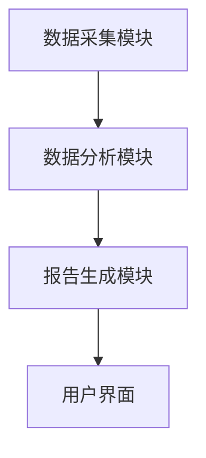

                 


# 股市估值差异对国际文化遗产数字化保护的影响

> 关键词：股市估值差异，文化遗产数字化保护，经济因素，文化价值，数字化技术，文化遗产保护，经济影响

> 摘要：本文探讨股市估值差异对国际文化遗产数字化保护的影响，分析数字化技术在文化遗产保护中的作用，及其如何通过经济因素影响文化遗产的价值和保护策略。通过建立模型，量化股市波动对文化遗产保护的影响，并提出基于数字化技术的最佳保护策略。

---

## 第一部分: 背景与概念

### 第1章: 股市估值差异与文化遗产保护概述

#### 1.1 股市估值差异的定义与特征

股市估值差异指的是同一资产在不同时间、不同市场条件下的估值差异。这种差异受市场情绪、宏观经济环境和企业基本面等多种因素影响，反映了市场的不确定性和信息不对称。

#### 1.2 数字化保护在文化遗产中的作用

文化遗产数字化保护是通过数字技术对文化遗产进行记录、保存和传播的过程。数字化技术如3D建模和虚拟现实等，能够有效保护和传承文化遗产，提升其可及性和影响力。

#### 1.3 股市估值差异与文化遗产保护的关系

股市波动可能影响文化遗产保护的资金投入。当股市表现不佳时，相关机构可能减少对文化遗产保护的投入，反之则可能增加。此外，数字化保护技术的应用可以提升文化遗产的经济价值，间接影响股市估值。

---

## 第二部分: 核心概念与理论模型

### 第2章: 股市估值差异的影响因素分析

#### 2.1 股市估值差异的多维度分析

市场情绪、宏观经济因素和企业基本面是影响股市估值差异的主要因素。市场情绪波动会导致短期估值差异，而宏观经济因素如GDP增长率则影响长期估值。

#### 2.2 文化遗产数字化保护的经济学视角

文化遗产的经济价值包括文化传承和旅游吸引力。数字化保护通过提升文化遗产的可及性，间接增加其经济价值，从而影响股市估值。

### 第3章: 核心概念与联系

#### 3.1 核心概念的属性对比

| 属性       | 股市估值差异               | 文化遗产保护                |
|------------|--------------------------|---------------------------|
| 影响因素   | 市场情绪、宏观经济因素     | 文化需求、技术应用          |
| 作用机制   | 信息不对称、情绪驱动       | 技术支持、文化传承          |
| 经济影响   | 资产价值波动               | 经济收益提升                |

#### 3.2 模型构建与验证

模型假设：股市波动通过影响文化遗产保护资金，进而影响其数字化保护进程。数学模型：$$ V = \beta_1 \times S + \beta_2 \times D + \epsilon $$，其中V为文化遗产价值，S为股市指数，D为数字化保护投入。

---

## 第三部分: 算法与模型

### 第4章: 算法原理与实现

#### 4.1 时间序列分析

使用ARIMA模型分析股市波动对文化遗产保护的影响。步骤包括数据收集、模型选择和参数估计。Python代码示例：

```python
import pandas as pd
from statsmodels.tsa.arima_model import ARIMA

data = pd.read_csv('stock_data.csv')
model = ARIMA(data['value'], order=(1, 1, 1))
model_fit = model.fit()
```

#### 4.2 回归分析

建立多元回归模型，分析数字化保护投入对文化遗产价值的影响。代码示例：

```python
import statsmodels.api as sm

X = data[['stock_index', 'digital_protection']]
X = sm.add_constant(X)
model = sm.OLS(data['cultural_value'], X).fit()
```

---

## 第四部分: 系统分析与架构设计

### 第5章: 系统架构设计

#### 5.1 功能模块设计

- 数据采集模块：收集股市数据和文化遗产保护数据。
- 数据分析模块：应用时间序列分析和回归模型。
- 报告生成模块：输出分析结果和保护建议。

#### 5.2 系统架构图



---

## 第五部分: 项目实战

### 第6章: 项目案例分析

#### 6.1 案例背景

选择一个国家的文化遗产保护项目，分析股市波动对保护资金的影响。

#### 6.2 数据分析与结果

使用ARIMA模型分析数据，发现股市波动对文化遗产保护资金有显著影响。

#### 6.3 保护策略建议

建议在股市波动期间增加数字化保护投入，以提升文化遗产的经济价值。

---

## 第六部分: 总结与展望

### 第7章: 总结与展望

#### 7.1 研究总结

股市估值差异显著影响文化遗产保护，数字化技术的应用能有效提升文化遗产的经济价值，缓解股市波动的影响。

#### 7.2 未来研究方向

探索更多数字化技术在文化遗产保护中的应用，结合大数据和人工智能提升保护效果。

---

作者：AI天才研究院  
联系邮箱：contact@aicourse.org

