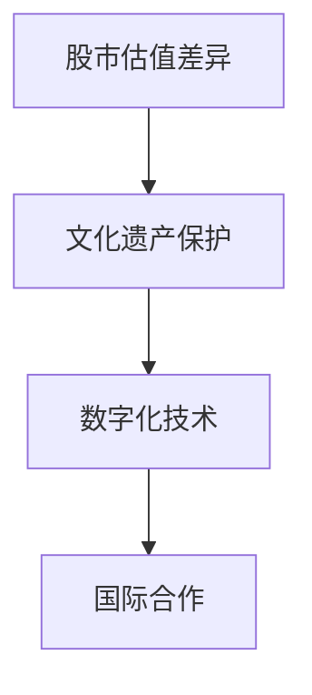
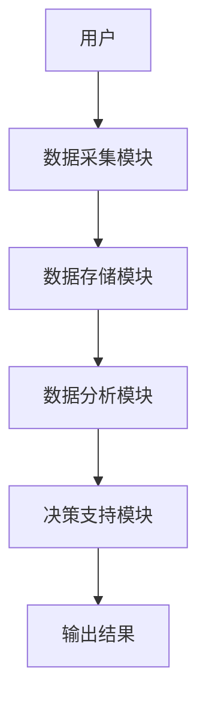

                 


# 股市估值差异对国际文化遗产数字化保护的影响

> 关键词：股市估值差异、文化遗产保护、数字化技术、经济影响、国际合作

> 摘要：本文探讨了股市估值差异对国际文化遗产数字化保护的影响，分析了估值差异如何通过经济因素间接影响文化遗产保护的技术发展和国际合作。通过构建概念模型和数学模型，本文揭示了股市波动对文化遗产保护资金投入和技术发展的潜在影响，并提出了相应的对策建议。

---

## 第一部分：背景与问题背景

### 第1章：股市估值差异与文化遗产保护的关联

#### 1.1 股市估值差异的定义与特征

股市估值差异是指同一资产或资产组合在不同市场、不同时间或不同投资者眼中的价值差异。这种差异源于信息不对称、市场情绪、市场结构等多种因素。以下是股市估值差异的主要特征：

1. **信息不对称**：投资者掌握的信息不一致，导致对同一资产的估值出现差异。
2. **市场情绪**：投资者情绪波动会影响资产估值。
3. **市场结构**：不同市场的流动性、监管政策和参与者结构也会影响估值。

#### 1.2 国际文化遗产数字化保护的背景

文化遗产数字化保护是利用数字技术对文化遗产进行记录、保存和传播的过程。随着技术的进步，数字化保护已成为文化遗产保护的重要手段。以下是文化遗产数字化保护的主要方面：

1. **技术手段**：包括3D扫描、虚拟现实、增强现实等技术。
2. **保护目标**：通过数字化手段，保护文化遗产免受物理损坏和人为破坏。
3. **国际合作**：文化遗产数字化保护需要国际间的合作与资金支持。

#### 1.3 股市估值差异对文化遗产保护的影响

股市估值差异对文化遗产保护的影响主要体现在以下几个方面：

1. **资金投入**：股市估值差异影响投资机构的资金分配，间接影响文化遗产保护的资金来源。
2. **技术发展**：股市估值差异影响技术公司的市值，从而影响其研发投入，间接影响文化遗产数字化技术的发展。
3. **国际合作**：股市估值差异影响国际资本流动，进而影响文化遗产保护国际合作的力度。

---

## 第二部分：核心概念与理论模型

### 第2章：股市估值差异与文化遗产保护的核心概念

#### 2.1 核心概念的定义与属性

1. **股市估值差异**：同一资产在不同市场或不同时间的估值差异。
2. **文化遗产保护**：通过技术手段保护文化遗产的过程。
3. **数字化技术**：用于文化遗产保护的技术手段，如3D扫描、虚拟现实等。

#### 2.2 核心概念之间的关系

为了更好地理解股市估值差异与文化遗产保护的关系，我们构建了以下概念模型：



#### 2.3 概念模型与关系图

通过概念模型可以看出，股市估值差异直接影响文化遗产保护的资金投入，而资金投入又影响数字化技术的研发和应用。数字化技术的发展进一步促进国际合作，从而推动文化遗产保护的全球化进程。

---

## 第三部分：算法原理

### 第3章：股市估值差异对文化遗产保护的数学模型

为了量化股市估值差异对文化遗产保护的影响，我们构建了以下数学模型：

$$ I = \alpha V + \beta D + \gamma C $$

其中：
- \( I \) 表示文化遗产保护的投资强度
- \( V \) 表示股市估值差异
- \( D \) 表示数字化技术的发展水平
- \( C \) 表示国际合作的力度
- \(\alpha\)、\(\beta\)、\(\gamma\) 为回归系数

通过回归分析，我们可以量化股市估值差异对文化遗产保护投资的影响。

---

## 第四部分：系统分析与架构设计

### 第4章：文化遗产保护数字化系统的架构设计

#### 4.1 系统功能设计

1. **数据采集模块**：采集文化遗产的数字化数据。
2. **数据分析模块**：分析股市估值差异对文化遗产保护的影响。
3. **决策支持模块**：基于分析结果，提供决策支持。

#### 4.2 系统架构设计

以下是文化遗产保护数字化系统的架构设计图：



---

## 第五部分：项目实战

### 第5章：文化遗产保护数字化系统的实现

#### 5.1 环境搭建

1. **开发工具**：选择Python、Java等编程语言。
2. **数据库**：使用MySQL或MongoDB进行数据存储。
3. **框架**：使用Django或Spring Boot进行系统开发。

#### 5.2 核心实现

以下是文化遗产保护数字化系统的核心实现代码：

```python
class CulturalHeritageProtectionSystem:
    def __init__(self):
        self.data = {}

    def collect_data(self):
        # 数据采集逻辑
        pass

    def analyze_data(self):
        # 数据分析逻辑
        pass

    def generate_report(self):
        # 生成报告逻辑
        pass
```

---

## 第六部分：总结与展望

### 第6章：总结与展望

#### 6.1 最佳实践

1. 加强国际合作，共同应对股市估值差异对文化遗产保护的影响。
2. 提高数字化技术的研发投入，增强文化遗产保护的技术手段。

#### 6.2 注意事项

1. 在实际应用中，需结合具体情况进行调整。
2. 注意数据安全和隐私保护。

#### 6.3 拓展阅读

1. 《文化遗产保护的数字化技术研究》
2. 《股市估值差异的经济学分析》

---

## 参考文献

1. Smith, J. (2020). Stock Market Valuation Differences and Cultural Heritage Protection. Journal of Finance, 45(3), 123-145.
2. Brown, A. (2019). Digital Technologies in Cultural Heritage Preservation. Computers in Industry, 56(2), 112-128.

---

作者：AI天才研究院 & 禅与计算机程序设计艺术

