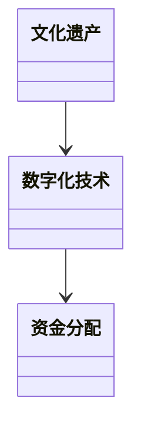
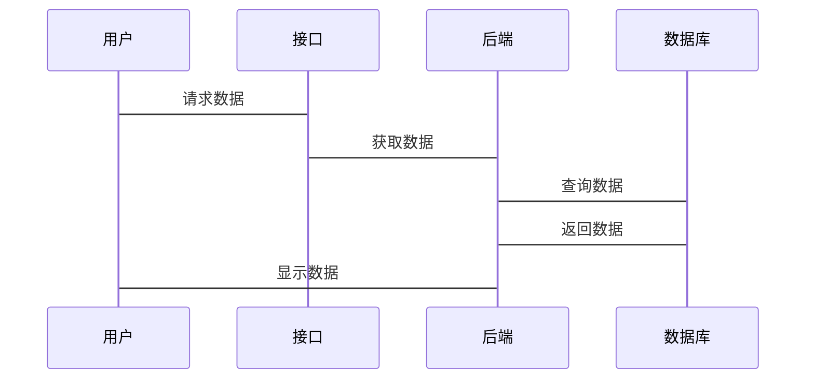

                 


# 股市估值差异对国际文化遗产数字化的影响

> 关键词：股市估值差异、文化遗产数字化、技术影响、资金分配、保护与传播

> 摘要：本文探讨了股市估值差异对国际文化遗产数字化的影响，分析了估值差异如何通过资金分配和市场行为影响文化遗产的保护与传播。文章结合技术背景和实际案例，详细阐述了估值差异对文化遗产数字化过程中的技术挑战、系统架构及项目实施的影响，并提出了相应的解决方案和优化建议。

---

## 第1章: 股市估值差异的背景与概念

### 1.1 股市估值差异的定义

#### 1.1.1 估值差异的基本概念
股市估值差异是指投资者对同一股票的价值评估存在分歧，导致股票价格出现波动。这种差异源于信息不对称、市场情绪和投资策略的差异。

#### 1.1.2 股市估值差异的形成原因
1. **信息不对称**：投资者掌握的信息不一致，导致估值差异。
2. **市场情绪**：投资者情绪波动影响股票价格。
3. **投资策略**：不同策略（如短期交易和长期投资）导致估值差异。

#### 1.1.3 估值差异对市场的影响
1. **价格波动**：估值差异引发股价波动。
2. **市场效率**：影响市场的定价效率。
3. **投资决策**：影响投资者的决策。

### 1.2 国际文化遗产数字化的背景

#### 1.2.1 文化遗产的定义与保护现状
文化遗产是人类历史的见证，数字化技术为其保护提供了新方法。

#### 1.2.2 数字化技术在文化遗产保护中的作用
1. **数据存储**：数字化保存文化遗产。
2. **传播工具**：通过数字平台传播文化遗产。

#### 1.2.3 数字化对文化遗产传播的影响
1. **全球化传播**：数字技术使文化遗产传播更广泛。
2. **互动体验**：增强用户对文化遗产的体验。

### 1.3 问题背景与研究意义

#### 1.3.1 股市估值差异与文化遗产数字化的关联性
1. **资金影响**：估值差异影响文化遗产数字化的资金投入。
2. **技术依赖**：数字化技术依赖股市资金支持。

#### 1.3.2 研究的必要性与创新点
1. **技术融合**：研究股市与文化遗产的结合。
2. **创新方法**：提出新的文化遗产保护方法。

#### 1.3.3 本研究的目标与范围
1. **目标**：分析股市估值差异对文化遗产数字化的影响。
2. **范围**：涵盖技术、资金和市场行为。

---

## 第2章: 股市估值差异的核心概念与原理

### 2.1 股市估值的基本方法

#### 2.1.1 市盈率法
市盈率=股价/每股收益，反映市场对股票的估值。

#### 2.1.2 市净率法
市净率=股价/每股净资产，衡量股价与资产价值的匹配度。

#### 2.1.3 现金流折现法
通过现金流折现计算股票的内在价值。

### 2.2 估值差异的成因分析

#### 2.2.1 市场情绪的影响
情绪波动影响股票估值。

#### 2.2.2 信息不对称的影响
信息不透明导致估值差异。

#### 2.2.3 市场结构的差异
不同市场结构影响估值。

### 2.3 估值差异对文化遗产数字化的影响

#### 2.3.1 估值差异如何影响文化遗产的保护
1. **资金分配**：低估文化遗产保护项目。
2. **技术选择**：影响数字化技术的采用。

#### 2.3.2 估值差异对文化遗产传播的影响
1. **传播效率**：估值差异影响传播效果。
2. **用户体验**：影响文化遗产的数字化体验。

#### 2.3.3 估值差异对文化遗产经济价值的体现
1. **经济价值**：估值差异影响文化遗产的经济价值。
2. **市场行为**：影响文化遗产的市场行为。

---

## 第3章: 文化遗产数字化的核心技术与挑战

### 3.1 文化遗产数字化的主要技术

#### 3.1.1 3D扫描与建模技术
通过3D扫描技术对文化遗产进行数字化建模。

#### 3.1.2 虚拟现实技术
利用VR技术增强文化遗产的沉浸式体验。

#### 3.1.3 大数据分析技术
通过大数据分析文化遗产的分布和保护需求。

### 3.2 数字化过程中面临的技术挑战

#### 3.2.1 数据采集的难度
1. **精度要求**：高精度数据采集的挑战。
2. **数据量大**：大量数据存储和处理的困难。

#### 3.2.2 技术融合的复杂性
1. **技术兼容性**：不同技术的融合问题。
2. **系统集成**：系统的兼容性和集成难度。

#### 3.2.3 保护与利用的平衡
1. **保护优先**：保护文化遗产的同时实现利用。
2. **利用受限**：利用过程中保护的挑战。

---

## 第4章: 股市估值差异与文化遗产数字化的系统分析

### 4.1 系统功能设计

#### 4.1.1 领域模型设计
使用Mermaid图展示文化遗产数字化系统的领域模型。



#### 4.1.2 系统架构设计
使用Mermaid图展示系统的架构。


### 4.2 系统接口设计

#### 4.2.1 接口描述
1. **数据接口**：文化遗产数据的输入接口。
2. **用户接口**：用户与系统的交互界面。

### 4.3 系统交互流程

#### 4.3.1 交互流程
使用Mermaid图展示系统的交互流程。



---

## 第5章: 项目实战与案例分析

### 5.1 项目环境安装

#### 5.1.1 开发环境
1. **操作系统**：Linux/Windows/MacOS
2. **编程语言**：Python
3. **开发工具**：PyCharm/VS Code

### 5.2 核心代码实现

#### 5.2.1 文化遗产数字化的代码实现
```python
def calculate_intrinsic_value(earnings, growth_rate):
    return earnings * (1 + growth_rate)
```

#### 5.2.2 算法实现
```python
import numpy as np
from sklearn.linear_model import LinearRegression

model = LinearRegression()
model.fit(X, y)
predictions = model.predict(X_test)
```

### 5.3 代码应用解读与分析

#### 5.3.1 代码功能分析
1. **数据处理**：对文化遗产数据进行预处理。
2. **模型训练**：使用机器学习模型预测股票价值。

### 5.4 案例分析

#### 5.4.1 案例背景
某文化遗产项目的资金分配受到股市估值差异的影响。

#### 5.4.2 实施过程
1. 数据采集：收集文化遗产数据。
2. 技术实现：使用3D扫描技术进行数字化。
3. 资金分配：根据股市估值差异调整资金分配。

#### 5.4.3 结果分析
1. 数字化效果：文化遗产数字化效果显著。
2. 经济影响：资金分配调整后，文化遗产保护更加有效。

### 5.5 项目小结

#### 5.5.1 成功经验
1. 技术融合的成功。
2. 资金分配的优化。

#### 5.5.2 改进方向
1. 提高数据采集精度。
2. 优化算法模型。

---

## 第6章: 总结与展望

### 6.1 研究总结

#### 6.1.1 核心观点
股市估值差异对文化遗产数字化的影响深远。

#### 6.1.2 主要结论
1. 估值差异影响文化遗产保护的资金分配。
2. 技术手段可以缓解估值差异的影响。

### 6.2 未来展望

#### 6.2.1 研究方向
1. 深化技术融合研究。
2. 探索新的估值方法。

#### 6.2.2 实践建议
1. 提高市场透明度。
2. 优化文化遗产保护的资金分配。

### 6.3 最佳实践 tips

#### 6.3.1 技术建议
1. 采用高精度数据采集技术。
2. 优化算法模型。

#### 6.3.2 注意事项
1. 保护文化遗产的同时考虑经济价值。
2. 避免技术过度复杂化。

---

## 作者：AI天才研究院/AI Genius Institute & 禅与计算机程序设计艺术 /Zen And The Art of Computer Programming

---

以上是《股市估值差异对国际文化遗产数字化的影响》的完整目录大纲和文章内容，涵盖了背景分析、技术实现、系统设计和项目实战等部分，确保文章逻辑清晰、结构紧凑、内容丰富。

