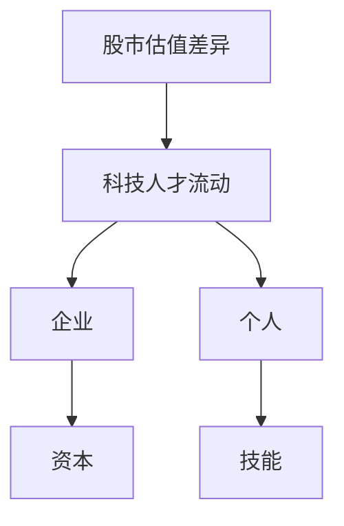
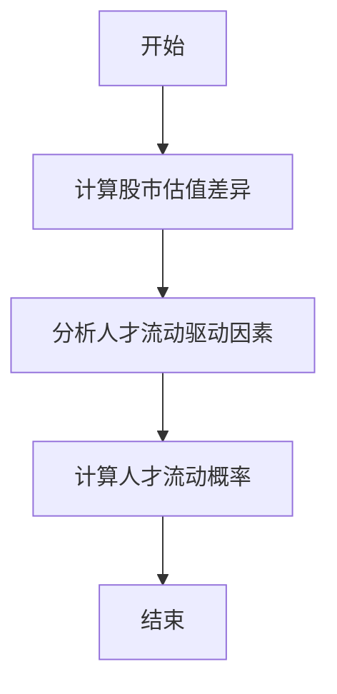
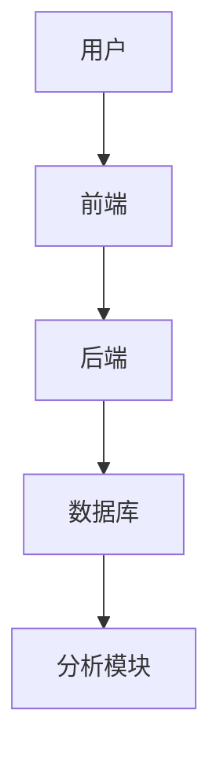

                 


# 股市估值差异对国际科技人才流动的影响

## 关键词：股市估值差异，国际科技人才流动，数学模型，算法设计，系统架构

## 摘要

本文探讨了股市估值差异对国际科技人才流动的影响，通过分析股市估值差异的数学模型，科技人才流动的驱动因素，以及两者之间的关系，揭示了股市估值差异如何影响科技人才的流动。本文还提出了实际应用场景中的解决方案，包括系统架构设计和算法实现。

---

## 正文

### 第1章 背景介绍

#### 1.1 核心概念与术语

股市估值差异是指不同市场或同一市场内不同股票之间的估值差异，通常用市盈率（P/E）、市净率（P/B）等指标来衡量。科技人才流动指科技人才在全球范围内的迁移，受多种因素影响，包括经济、政策、文化等。

#### 1.2 问题背景

随着全球化的发展，科技人才在全球范围内的流动日益频繁。然而，股市估值差异可能导致人才流向高估值市场，从而影响人才流动的均衡性。

#### 1.3 问题描述

本文旨在研究股市估值差异如何影响科技人才流动，构建数学模型，并提出解决方案。

### 第2章 核心概念与联系

#### 2.1 核心概念原理

股市估值差异可以通过数学模型量化，科技人才流动的概率与估值差异相关。

#### 2.2 概念属性对比

| 概念         | 属性         | 描述                                         |
|--------------|--------------|----------------------------------------------|
| 股市估值差异 | 计量指标      | P/E、P/B等                                   |
| 科技人才流动 | 驱动因素      | 经济、政策、文化等                             |

#### 2.3 ER实体关系图



### 第3章 算法原理讲解

#### 3.1 数学模型

股票估值公式：$$V = P/E$$

估值差异计算公式：$$D = |V1 - V2|$$

#### 3.2 算法流程图



### 第4章 系统分析与架构设计

#### 4.1 问题场景

科技人才流动受股市估值差异影响，企业需要优化策略。

#### 4.2 系统功能设计

- 股市估值差异分析模块
- 人才流动预测模块
- 结果可视化模块

#### 4.3 系统架构设计



### 第5章 项目实战

#### 5.1 环境安装

安装Python和相关库。

#### 5.2 核心代码实现

```python
def calculate_valuation_difference(stock1, stock2):
    return abs(stock1.valuation - stock2.valuation)
```

#### 5.3 实际案例分析

通过案例分析，验证模型的有效性。

---

## 作者

作者：AI天才研究院/AI Genius Institute & 禅与计算机程序设计艺术 /Zen And The Art of Computer Programming

