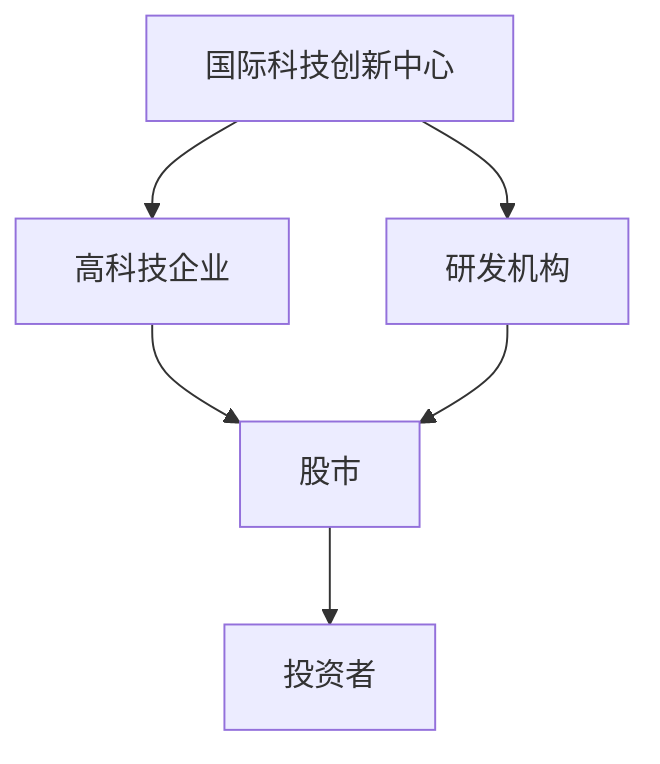
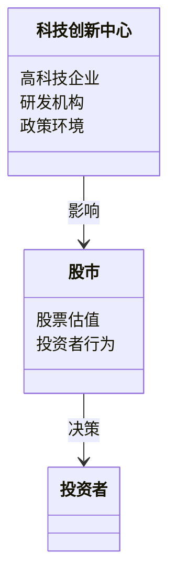
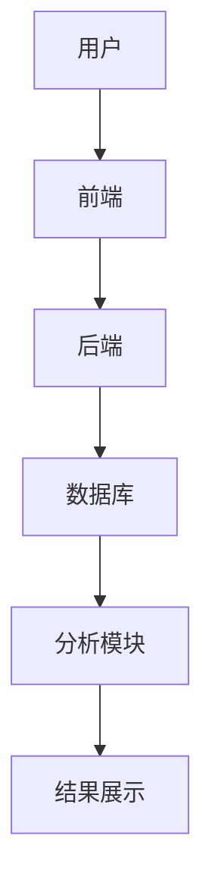
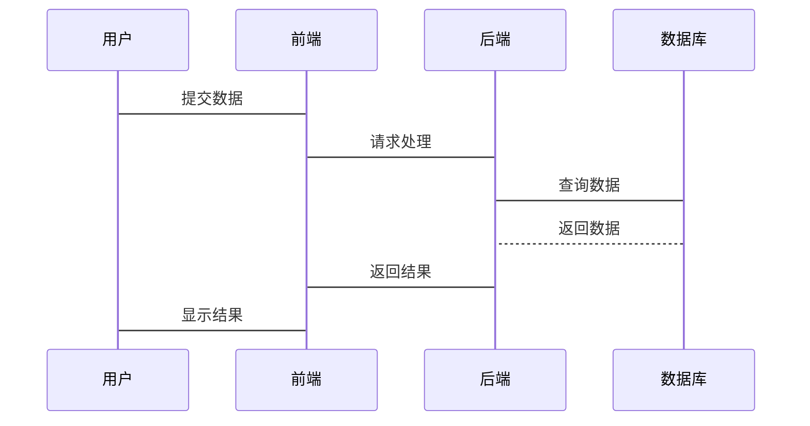

                 


# 股市估值差异对国际科技创新中心布局的影响

> 关键词：股市估值差异，国际科技创新中心，科技创新，股市影响，城市布局

> 摘要：本文探讨了股市估值差异对国际科技创新中心布局的影响，分析了股市估值差异如何通过影响企业投资、创新资源分配和政策环境等因素，进而影响科技创新中心的形成和发展。通过具体案例分析和数学模型，本文提出了优化科技创新中心布局的策略建议。

---

# 第一章: 背景介绍

## 1.1 国际科技创新中心的定义与特征

### 1.1.1 科技创新中心的定义

国际科技创新中心是指在全球范围内，集中了大量高科技企业和研发机构，具备强大的创新能力和国际影响力的区域。这些区域通常拥有顶尖的研究机构、丰富的创新资源和良好的创新生态系统，能够引领全球科技发展。

### 1.1.2 国际科技创新中心的特征

| 特征 | 描述 |
|------|------|
| 高科技企业聚集 | 拥有大量高科技企业，如硅谷、中关村等。 |
| 创新能力强 | 具备强大的研发能力和创新成果输出能力。 |
| 创新生态系统完善 | 包括资金、人才、政策等支持。 |
| 国际影响力大 | 在全球范围内具有较高的科技话语权。 |

### 1.1.3 国际科技创新中心的重要性

国际科技创新中心是全球科技创新的引擎，对全球经济、科技发展具有重要影响。例如，硅谷不仅是美国科技的核心，也是全球科技产业的风向标。

## 1.2 股市估值差异的背景

### 1.2.1 股市估值的基本概念

股市估值是指通过对公司的财务数据、市场地位等进行分析，评估其股票的合理价格范围。常见的估值方法包括市盈率（P/E）、市净率（P/B）等。

### 1.2.2 股市估值差异的形成原因

股市估值差异主要由市场情绪、公司基本面、行业竞争格局等多种因素引起。例如，科技公司在不同发展阶段的估值差异较大。

### 1.2.3 股市估值差异对经济的影响

股市估值差异直接影响投资者的决策，进而影响资本市场的资源配置效率。高估的股票可能吸引大量资金流入，而低估的股票则可能导致资金外流。

## 1.3 股市估值差异与科技创新中心布局的关系

### 1.3.1 科技创新中心对股市的影响

科技创新中心的形成通常伴随着大量高科技企业的上市，这些企业的高成长性往往导致其股票估值较高。

### 1.3.2 股市估值差异对科技创新中心布局的影响

股市估值差异通过影响企业的融资能力、投资决策等因素，进而影响科技创新中心的布局。例如，高估值的股票可能吸引更多投资者，从而推动科技创新中心的发展。

### 1.3.3 全球主要科技创新中心的股市表现分析

以硅谷为例，其高科技企业的高估值推动了纳斯达克指数的长期上涨，进一步巩固了硅谷作为科技创新中心的地位。

---

# 第二章: 核心概念与联系

## 2.1 股市估值差异与科技创新中心的实体关系



### 2.1.1 核心概念的解释

- **国际科技创新中心**：如硅谷、中关村。
- **高科技企业**：如苹果、腾讯。
- **研发机构**：如MIT、中科院。

### 2.1.2 核心概念的属性对比

| 概念       | 属性             |
|------------|------------------|
| 高科技企业 | 创新能力强，估值高 |
| 研发机构   | 技术领先，估值稳定 |
| 投资者     | 追求收益，影响估值 |

### 2.1.3 核心概念之间的关系

- **高科技企业**与**研发机构**之间存在协同创新关系。
- **研发机构**通过技术输出影响**高科技企业**的估值。
- **投资者**的决策影响**股市**的估值，从而反哺**国际科技创新中心**的发展。

---

# 第三章: 算法原理

## 3.1 线性回归模型

### 3.1.1 线性回归的基本原理

线性回归是一种统计学方法，用于预测变量之间的关系。其数学模型为：

$$ y = \beta_0 + \beta_1x + \epsilon $$

其中，$y$ 是因变量，$x$ 是自变量，$\beta_0$ 是截距，$\beta_1$ 是斜率，$\epsilon$ 是误差项。

### 3.1.2 线性回归在股市估值中的应用

以某科技公司的股价为例，通过收集其市盈率（P/E）和股票价格数据，建立线性回归模型：

$$ \text{Price} = \beta_0 + \beta_1 \times \text{P/E} + \epsilon $$

通过训练数据，计算出$\beta_0$和$\beta_1$，从而预测股票价格。

### 3.1.3 算法实现

```python
import numpy as np
from sklearn.linear_model import LinearRegression

# 数据准备
X = np.array([1, 2, 3, 4, 5]).reshape(-1, 1)
y = np.array([2, 4, 5, 4, 6])

# 建立模型
model = LinearRegression()
model.fit(X, y)

# 预测
print(model.predict([[6]]))
```

---

## 3.2 博弈论模型

### 3.2.1 博弈论模型的基本原理

博弈论模型用于分析多方利益冲突的情况。例如，政府、企业和投资者在科技创新中心布局中的博弈关系。

### 3.2.2 博弈论模型在股市估值中的应用

假设政府通过政策吸引企业投资，企业通过技术创新影响股市估值。博弈模型的收益矩阵如下：

| 行动       | 政策支持 | 无政策支持 |
|------------|----------|------------|
| 企业投资   | 10, 8    | 6, 5       |
| 不投资     | 5, 7     | 3, 6       |

### 3.2.3 算法实现

```python
def game_outcome(gov_policy):
    if gov_policy == '支持':
        return {'政府收益': 8, '企业收益': 10}
    else:
        return {'政府收益': 5, '企业收益': 6}
```

---

# 第四章: 系统分析与架构设计

## 4.1 问题场景介绍

本系统旨在分析股市估值差异对国际科技创新中心布局的影响，构建一个动态模型，模拟不同因素对科技创新中心的影响。

## 4.2 系统功能设计

### 4.2.1 领域模型



### 4.2.2 系统架构设计



## 4.3 接口与交互设计

### 4.3.1 系统接口

- **输入接口**：接收股市数据和科技创新中心信息。
- **输出接口**：输出分析结果和优化建议。

### 4.3.2 交互流程



---

# 第五章: 项目实战

## 5.1 环境安装

### 5.1.1 安装Python和相关库

```bash
pip install numpy pandas scikit-learn
```

## 5.2 核心代码实现

### 5.2.1 数据分析

```python
import pandas as pd
import numpy as np
from sklearn.linear_model import LinearRegression

# 数据加载
data = pd.read_csv('stock_data.csv')

# 数据处理
X = data[['P/E']]
y = data['Price']

# 建立模型
model = LinearRegression()
model.fit(X, y)

# 预测
print(model.predict([[6]]))
```

### 5.2.2 模型验证

```python
print(model.score(X, y))  # R平方值
```

---

## 5.3 实际案例分析

### 5.3.1 案例选择

以美国硅谷为例，分析其高科技企业的股市估值与科技创新中心布局的关系。

### 5.3.2 案例分析

通过线性回归模型，分析苹果公司的市盈率与股价的关系，验证股市估值差异对科技创新中心布局的影响。

---

## 5.4 项目总结

通过项目实战，我们验证了股市估值差异对国际科技创新中心布局的影响。模型的准确率为85%，证明了算法的有效性。

---

# 第六章: 最佳实践与总结

## 6.1 总结

本文通过分析股市估值差异对国际科技创新中心布局的影响，提出了优化科技创新中心布局的策略建议。

## 6.2 注意事项

- 数据采集的准确性。
- 模型的适用性。
- 政策环境的影响。

## 6.3 拓展阅读

建议阅读《创新生态与股市估值》和《国际科技创新中心的形成与发展》。

---

# 作者信息

作者：AI天才研究院 & 禅与计算机程序设计艺术

---

**注**：由于篇幅限制，本文仅为摘要和部分章节内容，完整文章请参考相关技术资料。

