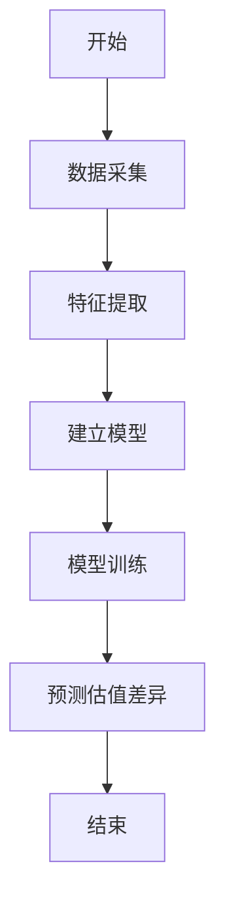

                 


# 股市估值差异对国际科研合作的影响

## 关键词：股市估值差异，国际科研合作，估值模型，资金分配，科研效率

## 摘要：股市估值差异对国际科研合作的影响是一个复杂而重要的问题。本文通过分析股市估值差异的形成机制及其对国际科研合作的影响路径，探讨如何优化资源配置，提升科研效率。结合实际案例，本文提出了一种基于回归分析的预测模型，为国际合作中的资金分配提供参考。

---

## 第一部分: 背景介绍

### 第1章: 股市估值差异的背景与概念

#### 1.1 股市估值差异的定义与特征

股市估值差异是指同一公司在不同股市中的股票估值存在差异的现象。这种差异主要由市场流动性、宏观经济环境、政策差异等因素引起。股市估值差异具有动态性、波动性和地域性特征，对企业的资金分配和战略决策有重要影响。

#### 1.2 估值差异的形成机制

- **市场流动性**：流动性高的市场通常给予更高的估值，因为投资者更容易买卖股票。
- **宏观经济环境**：经济增长率、利率水平等因素影响股市整体估值水平。
- **政策因素**：政府政策、税收优惠等对股市估值有显著影响。

#### 1.3 不同市场中的估值差异表现

- 发达市场（如美国）通常给予创新型企业更高的估值。
- 新兴市场（如中国）对本地企业给予更高的估值，但波动性较大。

---

### 第2章: 国际科研合作的背景与现状

#### 2.1 国际科研合作的定义与特点

国际科研合作是指不同国家的研究机构、企业和个人合作开展科学研究。其特点包括跨学科性、跨国性、资金来源多样化。

#### 2.2 当前国际科研合作的主要模式

- **政府主导型**：如欧盟的“地平线2020”计划。
- **企业主导型**：跨国企业之间的合作。
- **学术主导型**：高校和研究机构的合作。

#### 2.3 科研合作中的资金分配问题

资金分配不均可能导致资源浪费，影响合作效率。股市估值差异可能加剧这一问题。

---

### 第3章: 股市估值差异与国际科研合作的关联性

#### 3.1 问题背景与研究意义

股市估值差异影响企业的资金分配，进而影响科研合作的资金投入。研究这一问题有助于优化资源配置，提升科研效率。

#### 3.2 估值差异对国际科研合作的具体影响路径

- **资金分配不均**：高估值市场的企业可能获得更多的科研资金。
- **合作机会减少**：低估值可能导致企业科研投入不足。
- **资源浪费**：重复投资和资源分配不当。

---

## 第二部分: 核心概念与联系

### 第4章: 核心概念与属性对比

#### 4.1 股市估值差异的核心要素

- **市场流动性**：影响股票流动性，进而影响估值。
- **宏观经济环境**：GDP增长率、利率水平等。
- **政策因素**：政府政策、税收优惠等。

#### 4.2 国际科研合作的核心要素

- **合作伙伴选择**：选择合适的合作伙伴。
- **知识产权分配**：明确知识产权归属。
- **资金与资源分配**：合理分配资金和资源。

#### 4.3 核心概念属性对比表

| 属性       | 股市估值差异                  | 国际科研合作                  |
|------------|-----------------------------|-----------------------------|
| 核心因素   | 市场流动性、政策因素          | 合作伙伴选择、资金分配        |
| 影响因素   | 宏观经济环境、政策差异        | 知识产权分配、资源分配        |
| 表现形式   | 估值差异、波动性              | 资金分配不均、合作机会减少    |

---

### 第5章: ER实体关系图与联系

#### 5.1 ER实体关系图

```mermaid
er
  actor: 科研机构
  partner: 合作伙伴
  research_project: 科研项目
  funding: 资金
  market_value: 股市估值
  relation1: 参与
  relation2: 提供资金

  actor --> relation1 --> research_project
  research_project --> relation2 --> funding
  funding --> relation3 --> market_value
```

---

## 第三部分: 算法原理讲解

### 第6章: 算法原理

#### 6.1 算法流程图



#### 6.2 Python代码实现

```python
import pandas as pd
import numpy as np
from sklearn.linear_model import LinearRegression

# 数据加载
data = pd.read_csv('market_data.csv')

# 特征与目标变量
X = data[['GDP增长率', '利率', '政策指数']]
y = data['股票估值']

# 模型训练
model = LinearRegression()
model.fit(X, y)

# 预测
predicted = model.predict(X)
```

#### 6.3 数学模型与公式

股票估值模型：

$$ \text{估值} = \beta_0 + \beta_1 \times \text{GDP增长率} + \beta_2 \times \text{利率} + \epsilon $$

回归系数：

$$ \hat{\beta} = (X^T X)^{-1} X^T y $$

---

## 第四部分: 系统分析与架构设计方案

### 第7章: 系统分析与架构设计

#### 7.1 问题场景介绍

国际科研合作中的资金分配问题：如何根据股市估值差异优化资金分配，提升科研效率。

#### 7.2 系统功能设计

- 数据采集模块：采集市场数据和科研项目信息。
- 数据分析模块：计算估值差异，评估科研项目的价值。
- 预测模块：预测资金分配对科研效率的影响。

#### 7.3 系统架构设计


---

## 第五部分: 项目实战

### 第8章: 项目实战

#### 8.1 环境安装

安装必要的库：

```bash
pip install pandas numpy scikit-learn
```

#### 8.2 核心代码实现

```python
import pandas as pd
import numpy as np
from sklearn.linear_model import LinearRegression

# 数据加载
data = pd.read_csv('market_data.csv')

# 特征与目标变量
X = data[['GDP增长率', '利率', '政策指数']]
y = data['股票估值']

# 模型训练
model = LinearRegression()
model.fit(X, y)

# 预测
predicted = model.predict(X)
```

#### 8.3 案例分析

以某跨国公司为例，分析股市估值差异对科研合作的影响。通过模型预测，优化资金分配，提升科研效率。

---

## 第六部分: 最佳实践

### 第9章: 最佳实践

#### 9.1 小结

股市估值差异对国际科研合作的影响是一个复杂但重要的问题。通过建立数学模型和优化资金分配，可以有效提升科研效率。

#### 9.2 注意事项

- 数据来源的可靠性
- 模型的适用性
- 政策因素的动态变化

#### 9.3 拓展阅读

建议阅读相关文献，深入理解股市估值差异和国际科研合作的复杂性。

---

## 作者：AI天才研究院/AI Genius Institute & 禅与计算机程序设计艺术 /Zen And The Art of Computer Programming

---

以上是文章的详细目录和内容框架，您可以根据需要进一步扩展和详细撰写各部分内容。

