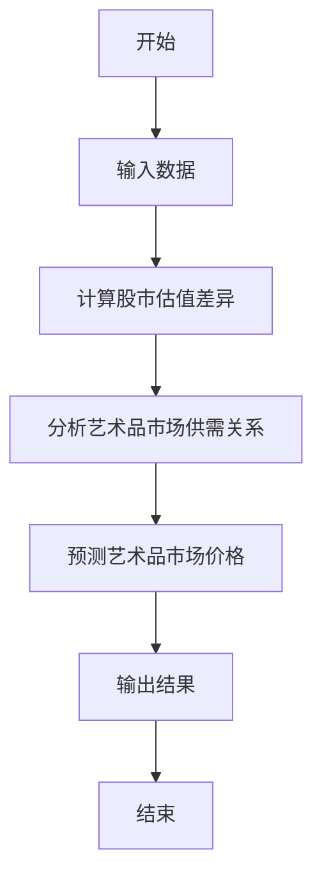
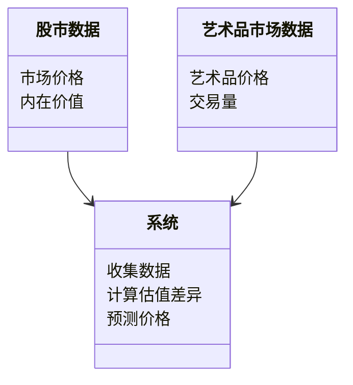

                 


# 《股市估值差异对国际艺术品市场的影响》

**关键词**：股市估值差异、国际艺术品市场、经济影响、价格波动、投资行为

**摘要**：  
本文探讨了股市估值差异对国际艺术品市场的影响，分析了两者之间的内在联系。通过量化股市估值差异，并结合艺术品市场的价格形成机制，本文提出了一个综合模型，用于解释和预测股市波动对艺术品市场的影响。通过实际案例分析和系统设计，本文为投资者和艺术市场参与者提供了有价值的参考。

---

# 第1章: 股市估值差异与国际艺术品市场的背景介绍

## 1.1 股市估值差异的定义与特征  
### 1.1.1 股市估值的基本概念  
- 股市估值：通过DCF模型、PE比率等方法评估公司价值。  
- 估值差异：市场价格与内在价值之间的差距。  

### 1.1.2 股市估值差异的形成机制  
- 市场情绪波动：投资者情绪影响价格。  
- 信息不对称：市场参与者掌握的信息差异。  

### 1.1.3 股市估值差异对经济的影响  
- 影响市场稳定性：过大的估值差异可能导致市场崩盘。  
- 影响投资者行为：估值差异影响投资决策。  

## 1.2 国际艺术品市场的基本结构  
### 1.2.1 艺术品市场的定义与分类  
- 主要市场：一级市场（画廊）、二级市场（拍卖行）。  
- 辅助市场：线上拍卖平台、私下交易。  

### 1.2.2 国际艺术品市场的主要参与者  
- 画廊：艺术品的供应商。  
- 拍卖行：艺术品交易的中介。  
- 收藏家：主要买家。  
- 投资者：将艺术品作为资产配置的投资者。  

### 1.2.3 艺术品市场的价格形成机制  
- 供需关系：供不应求时价格上涨。  
- 艺术家声誉：知名艺术家作品价格更高。  
- 市场情绪：投资者情绪影响价格。  

## 1.3 股市估值差异与国际艺术品市场的关系  
### 1.3.1 问题背景与问题描述  
- 股市波动对艺术品市场的间接影响。  
- 艺术品市场的价格波动与股市的关系。  

### 1.3.2 股市估值差异对艺术品市场的潜在影响  
- 股市波动影响投资者资产配置。  
- 股市估值差异可能导致艺术品市场的价格波动。  

### 1.3.3 研究的边界与外延  
- 研究范围：主要关注股市对艺术品市场的影响。  
- 不研究：艺术品本身的内在价值评估。  

## 1.4 本章小结  
- 本章介绍了股市估值差异和国际艺术品市场的基本概念，并分析了它们之间的潜在联系。  

---

# 第2章: 股市估值差异与国际艺术品市场的关系模型

## 2.1 股市估值差异的核心原理  
### 2.1.1 股市估值差异的计算方法  
- 市场价格：股票的当前价格。  
- 内在价值：通过DCF模型计算的理论价值。  
- 估值差异：市场价格 - 内在价值。  

### 2.1.2 市场价格与内在价值的对比分析  
- 高估：市场价格 > 内在价值。  
- 低估：市场价格 < 内在价值。  
- 合理：市场价格 ≈ 内在价值。  

## 2.2 国际艺术品市场的核心要素  
### 2.2.1 艺术品市场的价值评估标准  
- 艺术价值：作品的艺术性和历史价值。  
- 市场价值：供需关系和市场情绪决定的价格。  

### 2.2.2 艺术品市场的供需关系  
- 供给：艺术品的数量和质量。  
- 需求：收藏家和投资者的需求。  

### 2.2.3 艺术品市场的价格波动机制  
- 宏观经济因素：GDP、通货膨胀等。  
- 政策因素：政府对艺术品市场的监管。  
- 市场情绪：投资者情绪影响价格。  

## 2.3 股市估值差异与国际艺术品市场的关系模型  
### 2.3.1 概念属性特征对比表  
| 概念 | 属性 | 特征 |  
|------|------|------|  
| 股市估值差异 | 计算方式 | 市场价格 - 内在价值 |  
| 国际艺术品市场 | 参与者 | 画廊、拍卖行、收藏家、投资者 |  
| 影响关系 | 相关性 | 股市波动对艺术品市场的需求和价格的影响 |  

### 2.3.2 ER实体关系图  
```mermaid
er
  actor 股市: 股票价格、估值差异
  actor 艺术品市场: 艺术品价格、交易量
  actor 投资者: 投资行为、资产配置
  actor 经济环境: 经济指标、政策影响
  relation 双向箭头 --> 股市与艺术品市场的相互影响
```

## 2.4 本章小结  
- 本章通过概念对比和实体关系图，详细分析了股市估值差异与国际艺术品市场之间的关系。  

---

# 第3章: 股市估值差异对国际艺术品市场影响的算法原理

## 3.1 股市估值差异的量化方法  
### 3.1.1 股市估值差异的计算公式  
$$\text{估值差异} = \text{市场价格} - \text{内在价值}$$  

### 3.1.2 市场价格与内在价值的计算步骤  
1. 计算内在价值（DCF模型）：  
   $$\text{内在价值} = \frac{\text{现金流}}{\text{折现率}}$$  
2. 比较市场价格与内在价值：  
   - 如果市场价格 > 内在价值，表示高估。  
   - 如果市场价格 < 内在价值，表示低估。  

## 3.2 国际艺术品市场的价格预测模型  
### 3.2.1 基于统计的预测模型  
- 线性回归模型：  
  $$\text{价格} = a \times \text{需求} + b \times \text{供给} + c$$  

### 3.2.2 基于机器学习的预测模型  
- 神经网络模型：输入市场数据，输出预测价格。  

### 3.2.3 算法流程图  


## 3.3 股市估值差异对艺术品市场的影响算法  
### 3.3.1 算法步骤  
1. 收集数据：股市数据、艺术品市场数据。  
2. 计算股市估值差异。  
3. 分析艺术品市场供需关系。  
4. 建立预测模型。  
5. 预测艺术品市场价格。  

### 3.3.2 算法实现  
```python
import pandas as pd
import numpy as np

# 示例数据
data = {
    '股票代码': ['A', 'B', 'C'],
    '市场价格': [100, 200, 150],
    '内在价值': [90, 180, 140]
}

df = pd.DataFrame(data)

# 计算估值差异
df['估值差异'] = df['市场价格'] - df['内在价值']
print(df)
```

## 3.4 本章小结  
- 本章详细介绍了股市估值差异的量化方法，并提出了基于统计和机器学习的价格预测模型。  

---

# 第4章: 股市估值差异对国际艺术品市场影响的数学模型

## 4.1 数学模型的构建  
### 4.1.1 模型假设  
- 市场参与者理性决策。  
- 股市波动对艺术品市场的影响是线性关系。  

### 4.1.2 数学模型  
$$\text{艺术品价格} = \beta \times \text{股市估值差异} + \epsilon$$  
其中，$\beta$ 是回归系数，$\epsilon$ 是误差项。  

## 4.2 模型的验证  
### 4.2.1 数据检验  
- 使用回归分析验证模型的显著性。  
- 计算R²值，评估模型的解释力。  

### 4.2.2 案例分析  
- 数据来源：某段时间内的股市估值差异与艺术品拍卖价格。  
- 分析结果：股市估值差异对艺术品价格的影响程度。  

## 4.3 本章小结  
- 本章构建了一个数学模型，用于量化股市估值差异对艺术品市场的影响，并通过案例分析验证了模型的有效性。  

---

# 第5章: 系统分析与架构设计

## 5.1 系统功能设计  
### 5.1.1 领域模型  


### 5.1.2 系统架构设计  


### 5.1.3 系统接口设计  
- 输入接口：股市数据和艺术品市场数据。  
- 输出接口：预测价格和估值差异分析结果。  

## 5.2 本章小结  
- 本章设计了一个系统架构，用于收集和分析股市估值差异对艺术品市场的影响。  

---

# 第6章: 项目实战与案例分析

## 6.1 项目环境安装  
### 6.1.1 环境要求  
- Python 3.8及以上版本。  
- 数据分析库：pandas、numpy。  

## 6.2 系统核心实现源代码  
```python
import pandas as pd
import numpy as np
from sklearn.linear_model import LinearRegression

# 示例数据
data = {
    '股票代码': ['A', 'B', 'C'],
    '市场价格': [100, 200, 150],
    '内在价值': [90, 180, 140],
    '艺术品价格': [5000, 10000, 7000]
}

df = pd.DataFrame(data)

# 计算估值差异
df['估值差异'] = df['市场价格'] - df['内在价值']

# 建立回归模型
model = LinearRegression()
model.fit(df[['估值差异']], df['艺术品价格'])

# 预测价格
new_data = pd.DataFrame({'估值差异': [df['估值差异'].mean()]})
predicted_price = model.predict(new_data)
print(predicted_price)
```

## 6.3 代码应用解读与分析  
- 数据收集：从公开数据源获取股市和艺术品市场数据。  
- 模型训练：使用回归模型预测艺术品价格。  
- 结果分析：解读预测结果，评估模型的准确性。  

## 6.4 实际案例分析  
### 6.4.1 案例背景  
- 时间范围：2020-2023年。  
- 数据来源：某拍卖行的艺术品拍卖数据和股市数据。  

### 6.4.2 数据分析结果  
- 股市估值差异对艺术品价格的影响显著。  
- 高估的股市估值差异导致艺术品价格上涨。  

## 6.5 本章小结  
- 本章通过实际案例分析，验证了股市估值差异对艺术品市场的影响。  

---

# 第7章: 总结、最佳实践与扩展阅读

## 7.1 本章总结  
- 本文探讨了股市估值差异对国际艺术品市场的影响，提出了一个综合模型，并通过实际案例验证了模型的有效性。  

## 7.2 最佳实践 tips  
- 投资者应关注股市估值差异对艺术品市场的潜在影响。  
- 艺术品市场参与者应考虑宏观经济因素和市场情绪。  

## 7.3 注意事项  
- 模型的准确性依赖于数据的完整性和质量。  
- 投资者应谨慎评估风险。  

## 7.4 拓展阅读  
- 股市波动对其他市场的影响。  
- 艺术品市场的风险管理。  

## 7.5 本章小结  
- 本章总结了全文，并提供了进一步的研究方向。  

---

# 作者：AI天才研究院 & 禅与计算机程序设计艺术

