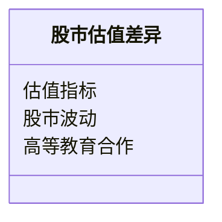

                 


# 股市估值差异对国际高等教育合作的影响

> 关键词：股市估值、国际高等教育合作、金融市场波动、教育政策、国际教育

> 摘要：本文探讨了股市估值差异对国际高等教育合作的影响，分析了股市波动如何通过资金分配和资源分配影响高等教育机构间的合作。结合数学模型和实际案例，本文提出了应对股市估值差异的策略，为高等教育合作提供了新的视角。

---

# 第一章：背景介绍与核心概念

## 1.1 核心概念介绍

### 1.1.1 股市估值的基本概念
股市估值是指对上市公司股票价值的评估，通常基于市盈率（P/E）、市净率（P/B）、市值等指标。股市估值的差异反映了不同市场对企业的价值认知差异，这种差异可能源于经济基本面、市场情绪、政策环境等因素。

### 1.1.2 国际高等教育合作的基本概念
国际高等教育合作是指跨国高校之间在教学、科研、学生交换等方面的深度合作。这种合作有助于资源共享、知识传播和文化交流，是全球化背景下高等教育发展的重要趋势。

## 1.2 问题背景与问题描述

### 1.2.1 股市估值差异的现状
- 不同国家股市的估值差异显著，例如新兴市场与发达市场的估值差异较大。
- 股市波动对高校资金的影响，尤其是在高校通过股市融资的情况下。

### 1.2.2 高等教育合作中的问题
- 高校间的合作资金来源不稳定，股市波动可能影响合作项目的可持续性。
- 股市估值差异可能导致资源分配不均，影响合作的公平性。

## 1.3 问题解决与边界分析

### 1.3.1 股市估值差异对高等教育合作的影响路径
- 通过资金分配影响高校间的合作。
- 影响高校的财政状况，进而影响合作项目的推进。

### 1.3.2 高等教育合作的边界与外延
- 高等教育合作的边界条件包括政策环境、资金支持、文化差异等。
- 高等教育合作的外延领域包括国际学生流动、科研合作等。

---

# 第二章：核心概念与联系

## 2.1 核心概念原理

### 2.1.1 股市估值差异的数学模型
股市估值差异可以用以下公式表示：
$$ V_{i} = \alpha + \beta_{i} \times F + \epsilon_{i} $$
其中，$V_{i}$ 表示第 $i$ 个股市的估值，$F$ 表示共同因素，$\beta_{i}$ 表示第 $i$ 个股市的特异系数，$\epsilon_{i}$ 为误差项。

### 2.1.2 高等教育合作的结构化模型
高等教育合作的结构化模型包括以下几个方面：
- 资金来源：高校间的资金分配受到股市估值的影响。
- 资源共享：高校间的资源共享受到股市波动的影响。
- 合作项目：股市估值差异可能影响合作项目的可持续性。

## 2.2 概念属性特征对比

| 概念 | 属性 | 特征 |
|------|-------|------|
| 股市估值差异 | 驱动因素 | 经济基本面、市场情绪 |
| 高等教育合作 | 主要形式 | 教学合作、科研合作 |

---

# 第三章：股市估值差异的分析与模型构建

## 3.1 股市估值差异的理论模型

### 3.1.1 股市估值差异的形成机制
股市估值差异的形成机制包括经济基本面、市场情绪、政策环境等因素。

### 3.1.2 股市估值差异的动态变化
股市估值差异会随着时间变化，受到市场波动的影响。

## 3.2 股市估值差异的数学模型

### 3.2.1 股市估值差异的公式表示
$$ V_{i} = \alpha + \beta_{i} \times F + \epsilon_{i} $$

### 3.2.2 股市估值差异的影响因素
- 经济因素：GDP增长、通货膨胀等。
- 市场因素：投资者情绪、市场流动性等。

---

# 第四章：算法原理

## 4.1 算法原理

### 4.1.1 模型的基本思想
通过构建数学模型，分析股市估值差异对高等教育合作的影响。

### 4.1.2 模型的数学表达
$$ I_{ij} = \alpha + \beta \times V_{i} + \gamma \times C_{j} + \epsilon $$

### 4.1.3 模型的实现步骤
1. 数据收集：收集股市估值数据和高等教育合作数据。
2. 模型构建：建立数学模型。
3. 模型验证：通过实证分析验证模型的准确性。

## 4.2 案例分析

### 4.2.1 案例背景
分析某国股市波动对高等教育合作的影响。

### 4.2.2 数据分析
使用数学模型分析股市波动对高等教育合作的影响。

---

# 第五章：系统分析与架构设计

## 5.1 系统分析

### 5.1.1 领域模型
使用Mermaid语法绘制领域模型类图。



### 5.1.2 系统架构
使用Mermaid语法绘制系统架构图。

```mermaid
container 股市估值差异 {
    股市指标
    高等教育合作
}
```

---

# 第六章：解决方案与最佳实践

## 6.1 应对策略

### 6.1.1 金融工具的应用
通过金融工具（如期权、期货）来降低股市估值差异对高等教育合作的影响。

### 6.1.2 政策调整
政府可以通过政策调整，稳定股市波动，支持高等教育合作。

## 6.2 最佳实践 Tips

### 6.2.1 注意事项
- 风险管理：高校应注重风险管理，避免因股市波动影响合作。
- 数据分析：高校应加强数据分析能力，及时应对股市波动。

### 6.2.2 拓展阅读
建议读者阅读相关领域的文献，深入了解股市波动与高等教育合作的关系。

---

# 第七章：结论与展望

## 7.1 结论
股市估值差异对国际高等教育合作有重要影响，高校应注重风险管理，加强政策支持。

## 7.2 未来研究方向
未来研究可以进一步探索股市波动对高等教育合作的长期影响，提出更多应对策略。

---

# 参考文献

（此处列出相关文献和参考资源）

---

# 作者信息

作者：AI天才研究院/AI Genius Institute & 禅与计算机程序设计艺术 /Zen And The Art of Computer Programming

