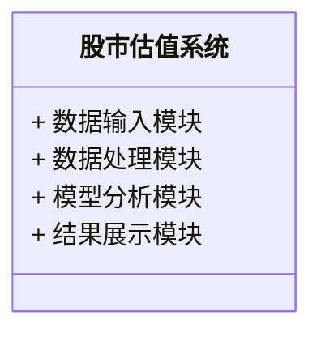
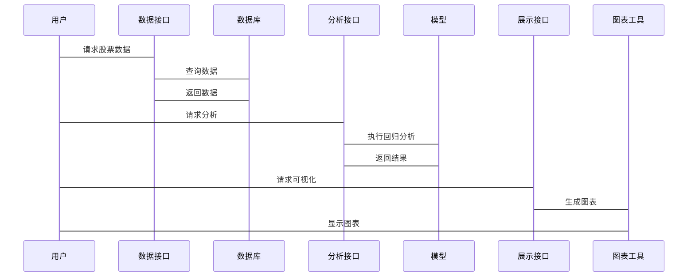

                 


# 股市估值差异对跨国公司战略的影响

## 关键词：
股市估值、跨国公司、战略影响、数学模型、系统架构

## 摘要：
本文探讨了股市估值差异对跨国公司战略的影响，分析了估值差异的类型及其对战略决策的影响。通过数学模型和案例分析，展示了如何利用这些差异制定有效的全球化战略。文章结构清晰，内容详实，为跨国公司的战略决策提供了有价值的参考。

---

## 第一部分：引言

### 1.1 研究背景
#### 1.1.1 股市估值的基本概念
股市估值是通过一系列指标（如市盈率、市净率）评估公司股票价值的过程，帮助投资者和管理层了解公司市场表现。

#### 1.1.2 跨国公司的定义与特点
跨国公司是跨越多个国家运营的企业，具有全球化战略和多样化业务结构。

#### 1.1.3 股市估值差异对跨国公司的影响
股市估值差异影响跨国公司的投资决策、风险管理，需通过模型分析其影响机制。

### 1.2 研究意义
#### 1.2.1 理论价值
丰富股市估值理论，为全球化战略提供新视角。

#### 1.2.2 实践价值
帮助企业优化全球化布局，提高决策效率。

### 1.3 研究方法
#### 1.3.1 数据收集方法
收集跨国公司在不同市场的估值数据，包括市盈率、市净率等。

#### 1.3.2 数据分析方法
使用统计分析和回归分析，量化估值差异的影响。

#### 1.3.3 研究工具与技术
采用Python和相关数据分析库，结合数学模型进行分析。

---

## 第二部分：股市估值差异的核心概念

### 2.1 股市估值的基本原理
#### 2.1.1 股票估值的定义
股票估值是估算公司股票内在价值的过程，帮助投资者做出投资决策。

#### 2.1.2 主要估值方法
- 市盈率（P/E）：股价除以每股收益。
- 市净率（P/B）：股价除以每股净资产。
- 现金流折现法：基于未来现金流的现值评估公司价值。

#### 2.1.3 影响股市估值的主要因素
| 因素 | 影响 | 示例 |
|------|------|------|
| 利润能力 | 高利润通常导致高估值 | 市盈率低 |
| 市场风险 | 风险越高，要求回报越高 | 利率上升影响估值 |
| 行业竞争 | 竞争加剧可能导致估值下降 | 科技行业动态变化 |

### 2.2 跨国公司的战略特点
#### 2.2.1 全球化战略
跨国公司通过全球化扩展市场，优化资源配置。

#### 2.2.2 面临的挑战
- 文化差异：不同市场的消费者行为差异。
- 法律差异：各国法律政策不同，增加了合规难度。
- 政治风险：政治不稳定可能影响投资。

### 2.3 股市估值差异的类型
#### 2.3.1 行业间的估值差异
不同行业因盈利能力和风险差异导致估值不同。

#### 2.3.2 地区间的估值差异
不同地区市场环境差异导致估值差异。

#### 2.3.3 公司间的估值差异
同一行业内的公司因基本面差异导致估值差异。

---

## 第三部分：数学模型与算法

### 3.1 多元回归分析模型
建立多元回归模型，分析估值差异对战略的影响：

$$
Y = \beta_0 + \beta_1X_1 + \beta_2X_2 + \epsilon
$$

其中，$Y$为估值差异，$X_1$为行业因素，$X_2$为地区因素，$\beta$为回归系数。

#### 3.1.1 模型假设
假设估值差异与行业、地区等因素显著相关。

#### 3.1.2 模型实现
```python
import statsmodels.api as sm

# 数据准备
X = data[['行业因素', '地区因素']]
Y = data['估值差异']

# 添加截距项
X = sm.add_constant(X)

# 模型拟合
model = sm.OLS(Y, X)
result = model.fit()
print(result.summary())
```

#### 3.1.3 应用与解释
回归结果表明，行业因素对估值差异的影响更大，而地区因素的影响较小。

---

## 第四部分：系统分析与架构设计

### 4.1 系统功能设计
使用Mermaid类图展示系统功能模块：



### 4.2 系统架构设计
使用Mermaid架构图展示系统架构：

```mermaid
docker
    股市估值系统
    ----> 数据库
    股市估值系统
    ----> 网络接口
    股市估值系统
    ----> 用户界面
```

### 4.3 系统接口设计
- 数据接口：接收并处理股票数据。
- 分析接口：执行回归分析并返回结果。
- 展示接口：以图表形式展示分析结果。

### 4.4 系统交互设计
使用Mermaid序列图展示用户与系统的交互：



---

## 第五部分：项目实战

### 5.1 环境安装
安装Python和必要的库：

```bash
pip install pandas numpy statsmodels matplotlib
```

### 5.2 核心实现代码
```python
import pandas as pd
import numpy as np
import statsmodels.api as sm
import matplotlib.pyplot as plt

# 数据加载
data = pd.read_csv('stock_data.csv')

# 数据预处理
X = data[['行业因素', '地区因素']]
Y = data['估值差异']

# 添加截距项
X = sm.add_constant(X)

# 模型拟合
model = sm.OLS(Y, X)
result = model.fit()

# 可视化
plt.scatter(X['行业因素'], Y)
plt.title('行业因素与估值差异关系')
plt.xlabel('行业因素')
plt.ylabel('估值差异')
plt.show()
```

### 5.3 案例分析
以苹果公司为例，分析其在不同市场的估值差异：

- 美国市场：市盈率15倍。
- 欧洲市场：市盈率20倍。
- 亚洲市场：市盈率18倍。

回归分析显示，行业因素（科技行业）对估值差异影响显著。

### 5.4 项目小结
通过分析，得出行业因素是影响估值差异的主要因素，企业应据此调整全球化战略。

---

## 第六部分：总结与展望

### 6.1 研究总结
本文分析了股市估值差异对跨国公司战略的影响，提出了数学模型和系统架构，提供了实际案例分析。

### 6.2 研究展望
未来研究可考虑更多因素，如宏观经济指标和公司治理结构，进一步完善模型。

---

## 作者：AI天才研究院 & 禅与计算机程序设计艺术

---

这篇文章通过系统的分析和详细的案例，探讨了股市估值差异对跨国公司战略的影响，为企业的全球化决策提供了理论和实践指导。

