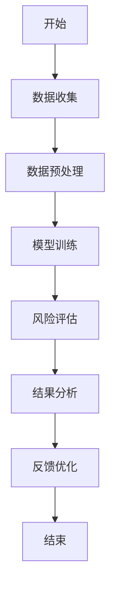

                 


```markdown
# 股市估值高低对企业AI伦理风险管理的影响

## 关键词：股市估值，AI伦理风险管理，企业风险管理，算法原理，系统架构

## 摘要：
本文探讨股市估值的高低对企业AI伦理风险管理的影响，分析高估值和低估值对企业在AI伦理风险管理方面的不同作用。通过介绍AI伦理风险管理的核心概念、算法原理和系统架构，结合实际案例，展示如何在不同估值环境下优化企业AI伦理风险管理。本文还提供了最佳实践和注意事项，帮助企业在不同股市估值环境下有效管理AI伦理风险。

---

## 第4章: AI伦理风险管理的核心概念

### 4.1 AI伦理风险管理的原理

#### 4.1.1 数据驱动的伦理风险识别
AI伦理风险管理依赖于高质量的数据输入，包括企业的运营数据、市场数据、用户反馈等。通过分析这些数据，可以识别潜在的伦理风险，如数据偏见、隐私泄露等。例如，若AI算法在招聘中存在性别偏见，系统会识别并标记这一风险。

#### 4.1.2 模型驱动的伦理风险评估
模型驱动的方法利用统计模型和机器学习算法，对潜在的伦理风险进行量化评估。例如，使用线性回归模型分析算法决策对不同群体的影响，评估其公平性。

#### 4.1.3 结果驱动的伦理风险控制
结果驱动的方法关注AI系统的实际输出，通过监控和反馈机制，实时调整模型参数，以减少伦理风险。例如，当发现AI系统推荐的内容存在偏见，系统会自动调整推荐算法。

### 4.2 AI伦理风险管理的属性特征对比表

| 属性       | 数据驱动 | 模型驱动 | 结果驱动 |
|------------|----------|----------|----------|
| 关注点     | 数据质量 | 模型结构 | 输出结果 |
| 输入       | 原始数据 | 模型参数 | 系统输出 |
| 输出       | 风险识别 | 风险评估 | 风险控制 |
| 优缺点     | 精准识别 | 高效评估 | 灵活调整 |

### 4.3 AI伦理风险管理的ER实体关系图

```mermaid
er
actor: 用户
role: 管理员
model: AI模型
risk: 风险
data: 数据
rule: 规则
```

用户通过数据和规则定义AI模型，AI模型产生风险，管理员根据风险进行管理。

---

## 第5章: AI伦理风险管理的算法原理

### 5.1 AI伦理风险管理算法的概述

#### 5.1.1 算法的基本原理
AI伦理风险管理算法通过收集、分析和评估数据，识别和预测潜在的伦理风险，并提供相应的管理策略。例如，使用监督学习模型预测算法偏见。

#### 5.1.2 算法的输入与输出
- 输入：企业运营数据、用户反馈、市场信息
- 输出：风险评分、风险管理建议

#### 5.1.3 算法的优缺点
优点：高精度、实时性；缺点：依赖高质量数据、计算复杂

### 5.2 AI伦理风险管理算法的数学模型

#### 5.2.1 风险评估模型
$$
\text{风险评分} = \alpha \times \text{数据偏见} + \beta \times \text{隐私泄露} + \gamma \times \text{透明度}
$$

#### 5.2.2 风险控制模型
$$
\text{控制措施} = \delta \times \text{风险评分} + \epsilon \times \text{企业政策}
$$

#### 5.2.3 风险预测模型
$$
\text{预测结果} = \sum_{i=1}^{n} w_i \times x_i
$$

### 5.3 AI伦理风险管理算法的流程图



---

## 第6章: 股市估值与AI伦理风险管理的系统分析

### 6.1 系统功能设计

#### 6.1.1 数据采集模块
负责收集企业的运营数据、市场数据和用户反馈，确保数据的完整性和准确性。

#### 6.1.2 数据分析模块
对收集到的数据进行分析，识别潜在的伦理风险，如数据偏见、隐私泄露等。

#### 6.1.3 风险评估模块
基于数据分析结果，评估企业的AI伦理风险，生成风险评分和管理建议。

#### 6.1.4 风险控制模块
根据风险评估结果，制定和实施相应的风险管理策略，如调整算法参数、优化数据收集方式等。

### 6.2 系统架构设计

#### 6.2.1 分层架构设计
- 数据层：存储和管理数据
- 逻辑层：处理数据并生成风险评估结果
- 展示层：向用户展示风险评估结果和管理建议

#### 6.2.2 模块之间的关系
数据采集模块向数据分析模块提供数据，数据分析模块向风险评估模块提供分析结果，风险评估模块向风险控制模块提供管理建议。

#### 6.2.3 系统的可扩展性
系统设计时考虑了模块化，便于未来扩展和功能增强。

## 第7章: 项目实战与最佳实践

### 7.1 环境安装

#### 7.1.1 安装Python
```bash
python --version
pip install numpy pandas scikit-learn
```

### 7.2 核心实现源代码

#### 7.2.1 数据分析模块
```python
import pandas as pd
from sklearn.metrics import accuracy_score

def analyze_data(data):
    # 数据预处理
    data = data.dropna()
    # 分析数据分布
    print(data.describe())
    return data

# 示例数据
data = pd.DataFrame({'feature': [1, 2, 3, 4, 5]})
analyze_data(data)
```

#### 7.2.2 风险评估模块
```python
import numpy as np

def assess_risk(data):
    # 计算风险评分
    risk_score = np.mean(data) * 0.5
    return risk_score

data = np.array([0.8, 0.9, 0.7, 0.6])
print(assess_risk(data))
```

### 7.3 实际案例分析

#### 7.3.1 案例介绍
某企业使用AI算法进行招聘，发现存在性别偏见。通过AI伦理风险管理算法，识别并纠正了这一问题，提高了企业声誉和员工满意度。

### 7.4 最佳实践

#### 7.4.1 定期风险评估
企业应定期进行AI伦理风险评估，及时发现和处理潜在问题。

#### 7.4.2 建立反馈机制
通过用户反馈和系统监控，持续优化AI系统，减少伦理风险。

---

## 结语

股市估值的高低直接影响企业对AI伦理风险管理的重视程度和投入资源。高估值企业更可能在AI伦理风险管理上投入更多资源，而低估值企业则需通过优化管理策略来平衡成本与风险。通过本文的分析，企业可以更好地理解和应对AI伦理风险管理的挑战，实现可持续发展。

## 作者

作者：AI天才研究院/AI Genius Institute & 禅与计算机程序设计艺术 /Zen And The Art of Computer Programming
```

