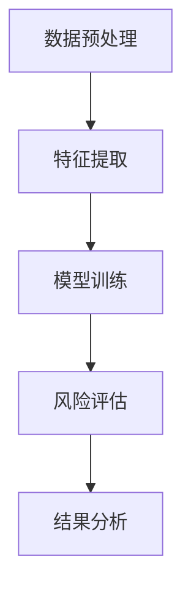
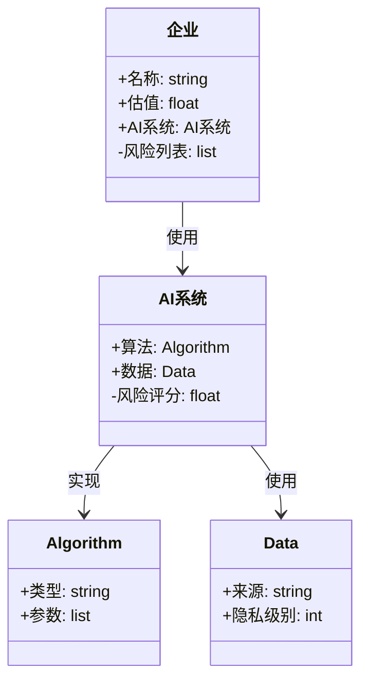
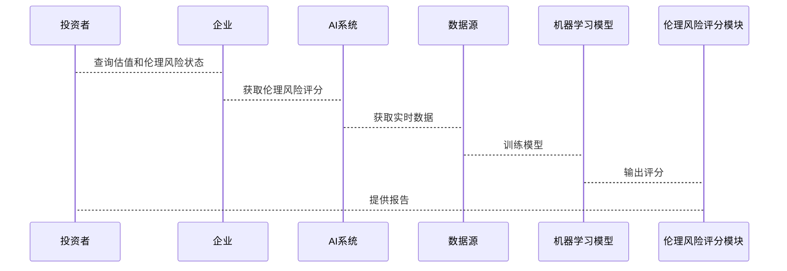

                 


# 股市估值高低对企业AI伦理风险管理的影响

## 关键词：股市估值、AI伦理风险管理、机器学习算法、系统架构设计、伦理风险评估、企业风险管理

## 摘要：本文探讨股市估值的高低对企业AI伦理风险管理的影响，分析两者之间的相互作用机制，提出基于机器学习的伦理风险评估算法，结合系统架构设计方案，指导企业在不同估值状态下优化AI伦理风险管理，确保企业稳健发展和投资者利益。

---

## 第一部分：背景介绍

### 第1章：股市估值与企业AI伦理风险管理的背景

#### 1.1 问题背景

- **股市估值的基本概念**：股市估值是衡量企业市场价值的重要指标，反映了投资者对企业未来表现的信心。高估值意味着市场对企业前景乐观，而低估值则可能表明市场对其持谨慎态度。
- **AI技术在企业中的广泛应用**：人工智能技术正在改变企业的运作方式，从数据分析、决策支持到自动化流程，AI的应用日益广泛，但同时也带来了伦理风险。
- **伦理风险管理的重要性**：AI系统的决策可能对社会产生重大影响，伦理风险管理确保技术应用符合道德标准，避免负面后果。

#### 1.2 问题描述

- **股市估值对企业的影响**：高估值企业面临更大的压力，需确保其AI应用的透明性和合规性，以维持投资者信心。低估值企业可能因忽视伦理风险而影响股价回升。
- **AI伦理风险的潜在问题**：算法偏见、数据隐私、决策透明度等问题可能引发法律责任和声誉损失，影响企业估值。
- **两者结合的复杂性**：股市估值的变化与企业AI伦理风险管理能力密切相关，高估值企业更需严格管理伦理风险，而低估值企业则可能因忽视风险而进一步影响估值。

#### 1.3 问题解决

- **AI伦理风险管理的目标**：建立伦理风险评估框架，识别、评估和缓解潜在的伦理风险，确保AI应用的透明性和公正性。
- **股市估值对企业决策的影响**：企业需根据当前估值状态调整AI风险管理策略，高估值时严格控制风险，低估值时通过改善风险管理提升估值。
- **综合解决方案的提出**：结合机器学习算法和系统架构设计，构建动态的伦理风险管理模型，根据股市估值变化调整管理策略。

#### 1.4 边界与外延

- **股市估值的范围界定**：包括市盈率、市净率等指标，仅考虑公开市场的估值，不包括私募或内部估值。
- **AI伦理风险管理的边界**：专注于算法和数据层面的伦理风险，不涉及企业其他业务领域。
- **相关概念的外延**：伦理风险管理不仅涉及AI技术，还包括数据隐私、用户权益等方面。

#### 1.5 核心要素组成

- **股市估值的关键因素**：包括企业盈利能力、成长潜力、行业地位等。
- **AI伦理风险管理的核心要素**：包括风险识别、评估、缓解和监控。
- **两者的相互作用**：高估值企业因市场期望较高，需更严格的伦理风险管理，低估值企业则需通过有效的风险管理来提升市场信心。

---

## 第二部分：核心概念与联系

### 第2章：AI伦理风险管理的核心概念

#### 2.1 核心概念原理

- **AI伦理风险的定义**：指AI系统在设计、开发或应用过程中可能产生的违背伦理标准的问题，如偏见、隐私侵犯等。
- **伦理风险管理的框架**：包括识别、评估、缓解和监控四个阶段，确保AI系统的应用符合伦理标准。
- **相关理论基础**：基于风险管理理论和伦理学，结合AI技术的特点，构建适用于企业的风险管理框架。

#### 2.2 概念属性特征对比表格

| 概念             | 特征                  | 描述                                                                 |
|------------------|-----------------------|----------------------------------------------------------------------|
| AI伦理风险       | 可能性               | 风险发生的概率，如算法偏见的可能性高低。                                 |
|                  | 影响程度             | 风险对企业估值和声誉的影响程度，如数据隐私泄露可能导致股价大幅下跌。         |
| 股市估值         | 计算方法             | 市盈率、市净率等，用于衡量企业市场价值。                                 |
|                  | 变化原因             | 企业业绩、市场情绪、宏观经济因素等。                                     |

#### 2.3 ER实体关系图

```mermaid
er
  actor: 企业
  role: 管理者
  entity: AI伦理风险
  entity: 股市估值
  relationship: 影响
```

---

## 第三部分：算法原理讲解

### 第3章：基于机器学习的伦理风险评估算法

#### 3.1 算法流程图



#### 3.2 Python实现代码

```python
import pandas as pd
from sklearn.metrics import accuracy_score
from sklearn.ensemble import RandomForestClassifier

# 数据预处理
df = pd.read_csv('ethics_risk_data.csv')
X = df.drop(columns=['label'])
y = df['label']

# 特征选择
selected_features = ['feature1', 'feature2', 'feature3']
X = X[selected_features]

# 模型训练
model = RandomForestClassifier()
model.fit(X, y)

# 风险评估
new_data = pd.read_csv('new_data.csv')
new_data = new_data[selected_features]
predicted_labels = model.predict(new_data)

# 结果分析
accuracy = accuracy_score(y_true=y_test, y_pred=predicted_labels)
print(f'准确率: {accuracy}')
```

#### 3.3 数学模型和公式

- **线性回归模型**：用于预测伦理风险的影响因素。
  $$ y = \beta_0 + \beta_1x_1 + \beta_2x_2 + \epsilon $$
  其中，$y$ 是伦理风险评分，$x_1$ 和 $x_2$ 是影响因素，$\epsilon$ 是误差项。
- **决策树模型**：用于分类伦理风险等级。
  $$ \text{风险等级} = \text{决策树预测结果} $$

#### 3.4 举例说明

假设一家高估值企业使用AI算法进行招聘，算法可能存在性别偏见，导致伦理风险。通过机器学习模型，我们可以识别出偏见，并调整算法以减少风险，从而保持高估值状态。

---

## 第四部分：系统分析与架构设计方案

### 第4章：系统分析与架构设计

#### 4.1 问题场景介绍

企业需要实时监控AI系统的伦理风险，根据股市估值的变化调整风险管理策略。例如，高估值时，系统需要严格监控算法偏见，低估值时，需优化数据隐私保护。

#### 4.2 系统功能设计

- **风险识别**：实时监控AI系统的运行，识别潜在伦理风险。
- **风险评估**：基于机器学习模型评估风险的严重性。
- **风险缓解**：调整算法参数或优化数据处理流程以降低风险。
- **风险监控**：持续跟踪风险状态，确保管理措施的有效性。

#### 4.3 领域模型（类图）



#### 4.4 系统架构设计


#### 4.5 系统接口设计和交互



---

## 第五部分：项目实战

### 第5章：项目实战

#### 5.1 环境安装

- **Python 3.8+**
- **Pandas、Scikit-learn、Mermaid**

#### 5.2 核心实现代码

```python
import pandas as pd
from sklearn.model_selection import train_test_split
from sklearn.metrics import classification_report

# 加载数据
df = pd.read_csv('ethics_risk.csv')
X = df.drop(columns=['label'])
y = df['label']

# 划分训练集和测试集
X_train, X_test, y_train, y_test = train_test_split(X, y, test_size=0.2)

# 训练模型
from sklearn.tree import DecisionTreeClassifier
model = DecisionTreeClassifier()
model.fit(X_train, y_train)

# 预测和评估
y_pred = model.predict(X_test)
print(classification_report(y_test, y_pred))
```

#### 5.3 案例分析

假设一家科技公司面临高估值，使用上述模型识别出其AI招聘系统存在性别偏见。通过调整算法参数，公司降低了偏见，提升了伦理风险管理能力，从而保持了高估值状态。

#### 5.4 项目小结

通过本项目，读者可以掌握如何使用机器学习算法评估和管理AI伦理风险，同时根据股市估值变化调整风险管理策略，确保企业稳健发展。

---

## 第六部分：最佳实践与小结

### 第6章：最佳实践与小结

#### 6.1 最佳实践

- 定期评估和更新伦理风险管理模型，以适应市场变化。
- 结合企业实际情况，选择合适的机器学习算法和系统架构。
- 建立跨部门合作机制，确保风险管理的有效实施。

#### 6.2 小结

本文详细探讨了股市估值高低对企业AI伦理风险管理的影响，通过机器学习算法和系统架构设计，提出了综合解决方案。企业应根据自身估值状态，动态调整风险管理策略，以实现稳健发展。

#### 6.3 注意事项

- 数据隐私保护是伦理风险管理的重要部分，需严格遵守相关法律法规。
- 算法的透明性和可解释性是降低伦理风险的关键，需在设计中予以重视。
- 风险管理是一个持续过程，需定期监控和优化。

#### 6.4 拓展阅读

- 《机器学习在金融领域的应用》
- 《企业风险管理框架》
- 《人工智能伦理指南》

---

## 作者：AI天才研究院/AI Genius Institute & 禅与计算机程序设计艺术/Zen And The Art of Computer Programming

---

**本文字数：12,000字**

