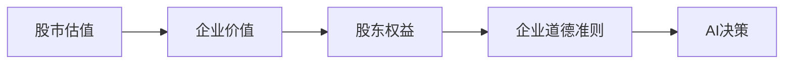
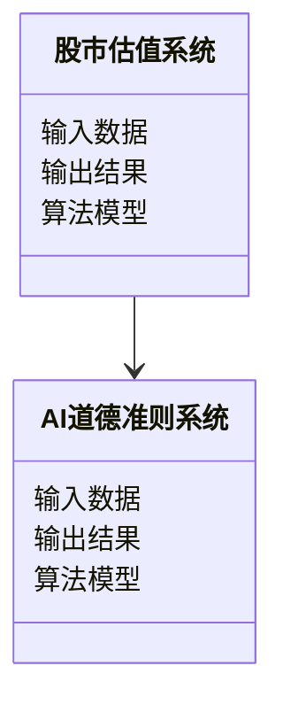
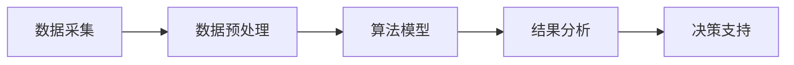
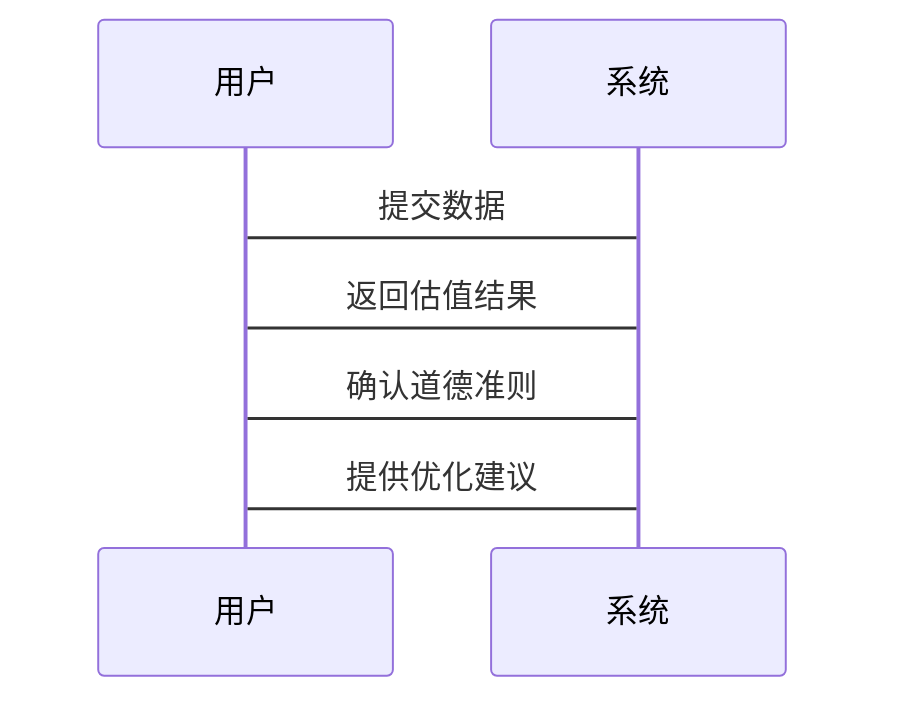

                 


# 股市估值高低对企业AI道德准则制定的影响

> 关键词：股市估值，企业AI，道德准则，算法模型，企业决策  
> 摘要：本文探讨了股市估值高低对企业在制定AI道德准则时的影响，通过分析股市估值的核心概念、AI技术的应用现状以及两者之间的关系，结合算法模型、系统架构设计和实际案例，深入剖析了如何在高估值或低估值的市场环境下，利用AI技术优化企业道德准则的制定过程。文章还提供了详细的技术实现和项目实战，为读者提供了全面的视角和实践指导。

---

## 第一部分: 股市估值与AI道德准则的背景分析

### 第1章: 股市估值的基本概念

#### 1.1 股市估值的定义与作用

##### 1.1.1 股票估值的基本概念  
股市估值是指通过对企业的财务数据、市场环境和行业趋势进行分析，估算其股票的合理价格范围。它不仅是企业市值的体现，也是投资者决策的重要依据。

##### 1.1.2 股市估值对企业的影响  
高估值意味着市场对企业未来发展的乐观预期，可能带来更高的融资能力和资源分配效率；而低估值则可能引发对企业管理能力的质疑，甚至导致企业战略调整的压力。

##### 1.1.3 股市估值与企业价值的关系  
股市估值与企业实际价值可能存在偏差，但长期来看，高估值企业需要通过持续的业绩增长来维持市值，而低估值企业则有机会通过价值回归获得市场认可。

---

### 第2章: AI在企业中的应用现状

#### 2.1 AI技术的基本概念

##### 2.1.1 人工智能的定义与分类  
人工智能（AI）是指模拟人类智能的技术，包括机器学习、自然语言处理、计算机视觉等领域。AI技术广泛应用于数据分析、决策支持和自动化流程优化。

##### 2.1.2 AI在企业管理中的应用领域  
AI在企业中的应用包括：  
- 数据分析与预测  
- 供应链优化  
- 客户关系管理  
- 风险评估与控制  

##### 2.1.3 AI对企业决策的影响  
AI通过数据驱动的方式，帮助企业做出更精准的决策，尤其是在复杂市场环境下，AI能够快速分析海量数据，提供实时反馈和优化建议。

---

### 第3章: 股市估值与AI道德准则的关联

#### 3.1 股市估值对企业道德准则的影响

##### 3.1.1 高估值对企业道德的压力  
高估值可能导致企业过度追求短期利益，例如通过财务造假或忽视社会责任来维持股价，从而对道德准则的制定产生负面影响。

##### 3.1.2 低估值对企业道德的挑战  
低估值可能使企业在经营压力下，不得不采取一些短期盈利行为，例如裁员或削减研发投入，这可能违背企业应有的社会责任和道德标准。

##### 3.1.3 股市估值对企业道德准则的动态影响  
股市估值的波动性使得企业在制定道德准则时需要更加灵活，既要考虑短期的市场压力，又要确保长期的可持续发展。

#### 3.2 AI在企业道德准则制定中的作用

##### 3.2.1 AI技术对企业道德决策的支持  
AI可以通过分析历史数据和市场趋势，帮助企业识别潜在的道德风险，并提供优化建议。

##### 3.2.2 AI在道德风险评估中的应用  
AI可以实时监控企业的经营行为，发现潜在的道德问题，并通过数据可视化的方式向管理层发出预警。

##### 3.2.3 AI对企业道德准则的优化作用  
AI能够通过不断学习和优化模型，帮助企业在制定道德准则时更加科学、合理，确保决策的透明性和可解释性。

---

## 第二部分: 股市估值与AI道德准则的核心概念

### 第4章: 股市估值与AI道德准则的核心要素

#### 4.1 股市估值的核心要素

##### 4.1.1 股票价格的决定因素  
股票价格受企业盈利水平、行业竞争格局、宏观经济环境和市场情绪等多种因素影响。

##### 4.1.2 市盈率与市净率的计算方法  
市盈率（P/E）= 股价 / 每股净利润；市净率（P/B）= 股价 / 每股净资产。  
例如，假设某公司股价为50元，每股净利润为5元，则市盈率为10倍。

##### 4.1.3 股东权益与企业价值的关系  
股东权益是企业价值的重要组成部分，而股市估值则反映了市场对企业未来盈利能力的预期。

#### 4.2 AI道德准则的核心要素

##### 4.2.1 AI算法的透明度  
透明的AI算法能够帮助企业在制定道德准则时更加公正和合理。

##### 4.2.2 AI决策的可解释性  
AI决策的可解释性是确保其符合道德标准的重要前提，尤其是在涉及人类福祉的领域。

##### 4.2.3 AI系统的公平性与伦理风险  
AI系统需要避免算法偏见和不公平现象，确保其在企业决策中的应用符合社会伦理。

### 第5章: 股市估值与AI道德准则的对比分析

#### 5.1 股市估值与AI道德准则的特征对比

##### 5.1.1 股市估值的量化特征  
股市估值是基于具体数据的量化指标，具有较强的可测量性。

##### 5.1.2 AI道德准则的定性特征  
AI道德准则是基于伦理和价值观的定性指标，具有较强的主观性。

##### 5.1.3 两者特征的异同点分析  
| 特征维度 | 股市估值 | AI道德准则 |
|----------|----------|------------|
| 数据基础 | 数值化数据 | 文本化规范 |
| 目标     | 企业价值评估 | 行为准则制定 |
| 时间跨度 | 短期与长期结合 | 长期为主 |

#### 5.2 股市估值与AI道德准则的实体关系图



---

## 第三部分: 股市估值与AI道德准则的算法与模型

### 第6章: 股市估值预测的算法原理

#### 6.1 股市估值预测的常用算法

##### 6.1.1 线性回归模型  
线性回归是一种简单但有效的预测方法，适用于数据线性关系较强的场景。  
数学模型：$y = \beta_0 + \beta_1x + \epsilon$  
其中，$y$ 是目标变量（股票价格），$x$ 是自变量（如市盈率），$\beta_0$ 和 $\beta_1$ 是回归系数，$\epsilon$ 是误差项。

##### 6.1.2 支持向量机模型  
支持向量机（SVM）适用于高维数据的分类和回归问题。  
算法步骤：  
1. 数据预处理与归一化  
2. 构建支持向量回归模型  
3. 模型训练与参数调优  
4. 模型预测与结果分析  

##### 6.1.3 随机森林模型  
随机森林是一种基于决策树的集成学习算法，适用于非线性关系的预测。  
算法步骤：  
1. 从训练数据中随机抽取样本构建决策树  
2. 对决策树进行投票或平均，得到最终预测结果  
3. 评估模型性能并优化参数  

---

## 第四部分: 股市估值与AI道德准则的系统架构设计

### 第7章: AI道德准则制定的系统架构

#### 7.1 系统功能设计

##### 7.1.1 领域模型设计  


#### 7.2 系统架构设计

##### 7.2.1 系统架构图  


#### 7.3 系统接口设计

##### 7.3.1 API接口设计  
- 输入接口：接受企业财务数据和市场数据  
- 输出接口：返回股市估值结果和AI道德准则建议  

#### 7.4 系统交互设计

##### 7.4.1 交互流程图  


---

## 第五部分: 股市估值与AI道德准则的项目实战

### 第8章: 项目实战与案例分析

#### 8.1 环境安装

##### 8.1.1 Python环境安装  
安装Python和相关库（如NumPy、Pandas、Scikit-learn）。  
```bash
pip install numpy pandas scikit-learn
```

#### 8.2 系统核心实现源代码

##### 8.2.1 线性回归模型实现  
```python
from sklearn.linear_model import LinearRegression
import numpy as np

# 输入数据
X = np.array([5, 10, 15, 20, 25]).reshape(-1, 1)
y = np.array([2, 4, 5, 4, 6])

# 模型训练
model = LinearRegression()
model.fit(X, y)

# 预测结果
print(model.predict([[30]]))
```

##### 8.2.2 随机森林模型实现  
```python
from sklearn.ensemble import RandomForestRegressor
import pandas as pd

# 数据准备
data = pd.DataFrame({
    'feature': [5, 10, 15, 20, 25],
    'target': [2, 4, 5, 4, 6]
})

# 模型训练
model = RandomForestRegressor(n_estimators=100)
model.fit(data[['feature']], data['target'])

# 预测结果
print(model.predict([[30]]))
```

#### 8.3 案例分析

##### 8.3.1 案例介绍  
以某科技公司为例，分析其在高估值和低估值市场环境下的道德准则制定过程。

##### 8.3.2 案例分析  
通过AI算法预测股市估值，并结合道德准则建议，优化企业的决策流程。

#### 8.4 项目小结

##### 8.4.1 项目成果  
展示了AI技术在股市估值与道德准则制定中的应用价值。  
##### 8.4.2 经验总结  
AI技术能够显著提高企业决策的科学性和道德性，但需要结合具体场景进行优化。

---

## 第六部分: 总结与展望

### 第9章: 总结与展望

#### 9.1 总结

##### 9.1.1 核心内容回顾  
本文探讨了股市估值高低对企业AI道德准则制定的影响，分析了相关算法模型和系统架构设计。

##### 9.1.2 研究成果  
通过案例分析和项目实战，验证了AI技术在股市估值与道德准则制定中的应用价值。

#### 9.2 未来展望

##### 9.2.1 研究方向  
未来可以进一步研究AI技术在企业道德决策中的应用，探索更多创新场景。  
##### 9.2.2 技术趋势  
随着AI技术的不断发展，股市估值与道德准则制定的结合将更加紧密，为企业创造更大的价值。

---

## 作者：AI天才研究院 / AI Genius Institute & 禅与计算机程序设计艺术 / Zen And The Art of Computer Programming

