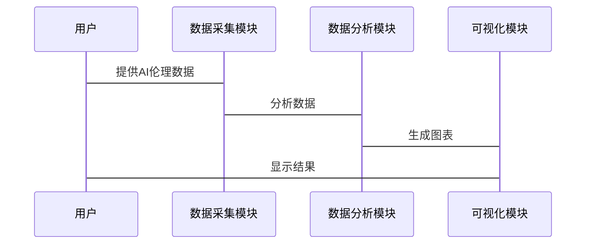

                 


# 股市估值高低对企业人工智能伦理标准的影响

> 关键词：股市估值，人工智能伦理，企业伦理，股票估值，AI伦理标准，企业行为

> 摘要：本文探讨股市估值的高低如何影响企业的人工智能伦理标准。高估值企业倾向于更高的伦理标准，以维护长期价值；低估值企业可能在短期内忽视伦理，以追求短期收益。文章分析了股市估值与AI伦理之间的动态关系，提出了企业应如何在追求利润的同时，平衡伦理责任，以实现可持续发展。

---

# 第1章: 股市估值与人工智能伦理的核心概念

## 1.1 股市估值的基本概念

### 1.1.1 股票估值的定义与方法

股票估值是通过分析企业的财务状况、行业地位、盈利能力等多方面因素，对其股票的内在价值进行评估的过程。常见的股票估值方法包括：

1. **市盈率（P/E）**：市盈率 = 股价 / 每股净利润。衡量投资者愿意为每股净利润支付的价格。
2. **市净率（P/B）**：市净率 = 股价 / 每股净资产。衡量股价与资产价值的关系。
3. **市销率（P/S）**：市销率 = 股价 / 每股收入。衡量股价与收入的关系。
4. **现金流折现法（DCF）**：通过未来现金流的现值来评估企业价值。

### 1.1.2 市盈率、市净率等核心指标解析

以市盈率为例，假设一家企业每股净利润为2元，股票价格为20元，则市盈率为10倍。市盈率反映了市场对企业的盈利能力和成长性的预期。高市盈率意味着市场对其未来增长有信心，低市盈率则可能意味着市场对其前景持怀疑态度。

### 1.1.3 股市估值对企业经营的影响

股市估值直接影响企业的融资能力、资本成本和投资者信心。高估值企业更容易吸引投资者，但同时也面临更高的市场预期和压力。低估值企业可能面临融资困难，但有机会通过低估值实现价值重估。

---

## 1.2 人工智能伦理的基本概念

### 1.2.1 人工智能伦理的定义

人工智能伦理是指在设计、开发和应用人工智能系统时，应遵循的道德准则和行为规范。核心原则包括隐私保护、公平性、透明性、可解释性、责任归属等。

### 1.2.2 人工智能伦理的核心原则

1. **隐私保护**：确保数据收集和使用符合隐私保护法律。
2. **公平性**：避免算法偏见，确保AI系统对所有人都公平。
3. **透明性**：让用户了解AI决策的依据和过程。
4. **可解释性**：AI系统的行为应能够被人类理解和解释。
5. **责任归属**：明确AI系统出现问题时的责任主体。

### 1.2.3 人工智能伦理在企业中的重要性

企业若忽视AI伦理，可能导致用户信任流失、法律风险和品牌声誉受损。例如，若AI系统存在偏见或隐私泄露问题，可能导致用户起诉和监管处罚。

---

## 1.3 股市估值与人工智能伦理的关系

### 1.3.1 企业人工智能伦理对股市估值的影响

高伦理标准的企业通常被视为更可靠和可持续，从而获得更高的估值。例如，科技巨头在AI伦理方面的投入，提升了其品牌形象和市场地位，推动了股价上涨。

### 1.3.2 股市估值对企业人工智能伦理的反向影响

高估值企业面临更高的市场期待，可能在AI伦理方面投入更多资源，以维持高估值。低估值企业可能忽视AI伦理，专注于短期盈利。

### 1.3.3 两者关系的理论框架

企业的人工智能伦理表现与股市估值之间存在动态反馈关系。高估值企业更注重AI伦理，而低估值企业可能在短期内忽视伦理，但长期来看，忽视伦理可能导致估值下降。

---

# 第2章: 股市估值高低对企业人工智能伦理的影响机制

## 2.1 高估值企业的人工智能伦理表现

### 2.1.1 高估值企业的人工智能伦理标准

高估值企业通常设有严格的AI伦理审查机制，确保AI系统符合道德规范。例如，某互联网公司开发AI推荐系统时，确保推荐结果的公平性和透明性，避免算法偏见。

### 2.1.2 高估值企业的人工智能伦理风险

尽管高估值企业重视AI伦理，但仍可能面临技术复杂性和数据隐私等挑战。例如，若AI系统出现错误，可能导致法律责任和品牌损失。

### 2.1.3 高估值企业的人工智能伦理实践

高估值企业通常投入大量资源进行AI伦理培训和研究，例如设立伦理委员会，定期审查AI系统的伦理风险。

---

## 2.2 低估值企业的人工智能伦理表现

### 2.2.1 低估值企业的人工智能伦理标准

低估值企业可能缺乏AI伦理投入，倾向于追求短期收益。例如，某些企业可能忽视数据隐私，滥用用户数据进行营销。

### 2.2.2 低估值企业的人工智能伦理风险

忽视AI伦理可能导致用户信任流失和法律风险。例如，若用户数据泄露，可能导致企业面临诉讼和罚款。

### 2.2.3 低估值企业的人工智能伦理实践

低估值企业可能在AI伦理方面投入较少，但随着市场竞争加剧，部分企业开始意识到AI伦理的重要性，逐渐加强相关投入。

---

## 2.3 股市估值对企业人工智能伦理的动态影响

### 2.3.1 股市估值波动对企业人工智能伦理的影响

股市波动可能导致企业调整AI伦理投入。例如，股市下跌时，企业可能减少AI伦理相关支出，转而专注于短期盈利。

### 2.3.2 企业人工智能伦理对股市估值的反馈机制

企业通过提升AI伦理标准，增强品牌形象和用户信任，从而推动股价上涨。例如，某企业因在AI伦理方面的创新实践，获得投资者认可，股价上涨。

### 2.3.3 两者的长期互动关系

长期来看，高估值企业通过持续提升AI伦理标准，巩固市场地位；低估值企业若忽视AI伦理，可能在竞争中被淘汰。

---

# 第3章: 人工智能伦理标准的制定与执行

## 3.1 人工智能伦理标准的核心要素

### 3.1.1 道德原则

包括隐私保护、公平性、透明性等。

### 3.1.2 法律法规

遵守相关数据保护和隐私法律，如欧盟的GDPR。

### 3.1.3 企业责任

企业应承担AI系统的伦理责任，确保其行为符合社会道德。

---

## 3.2 人工智能伦理标准的制定流程

### 3.2.1 问题识别

识别AI系统可能存在的伦理风险，如偏见、隐私泄露等。

### 3.2.2 标准制定

根据识别的问题，制定相应的伦理准则和操作规范。

### 3.2.3 审查与修订

定期审查伦理标准，根据技术发展和市场变化进行修订。

---

## 3.3 人工智能伦理标准的执行策略

### 3.3.1 员工培训

对员工进行AI伦理培训，确保其理解并遵守相关规范。

### 3.3.2 技术实现

在AI系统设计中嵌入伦理考量，如使用公平性算法。

### 3.3.3 监督与反馈

建立监督机制，定期评估AI系统的伦理表现，并根据反馈进行优化。

---

# 第4章: 股市估值与人工智能伦理的算法分析

## 4.1 股市估值与AI伦理的量化模型

构建一个数学模型，将企业的AI伦理表现与股市估值联系起来。例如，使用线性回归模型预测AI伦理得分对股价的影响。

$$ \text{股价} = \beta_0 + \beta_1 \times \text{AI伦理得分} + \epsilon $$

其中，$\beta_1$表示AI伦理得分对股价的影响程度。

---

## 4.2 AI伦理对股市估值的动态影响

通过时间序列分析，研究AI伦理表现如何影响企业的股市估值。例如，使用ARIMA模型预测股市估值的变化。

---

## 4.3 代码实现

```python
import pandas as pd
import numpy as np
from sklearn.linear_model import LinearRegression

# 假设我们有一个数据集，包含企业的AI伦理得分和股价
data = pd.DataFrame({
    'AI伦理得分': [80, 70, 90, 60, 85],
    '股价': [100, 90, 110, 80, 105]
})

# 使用线性回归模型预测股价
model = LinearRegression()
model.fit(data[['AI伦理得分']], data['股价'])

# 预测股价
predicted_prices = model.predict(data[['AI伦理得分']])
print("预测股价:", predicted_prices)
```

---

# 第5章: 人工智能伦理与股市估值的系统架构设计

## 5.1 系统功能设计

### 5.1.1 数据采集

收集企业的AI伦理表现数据和股市估值数据。

### 5.1.2 数据分析

使用算法模型分析AI伦理表现对股市估值的影响。

### 5.1.3 可视化展示

将分析结果以图表形式展示，帮助投资者和企业管理者理解。

---

## 5.2 系统架构设计

使用Mermaid图展示系统架构：


---

## 5.3 系统交互设计

使用Mermaid序列图展示系统交互过程：



---

# 第6章: 项目实战与案例分析

## 6.1 项目背景

以某科技公司为例，分析其在AI伦理方面的表现及其对股市估值的影响。

---

## 6.2 项目实现

### 6.2.1 数据准备

收集该公司的AI伦理评分和股价数据。

### 6.2.2 数据分析

使用回归模型分析AI伦理评分对股价的影响。

### 6.2.3 结果解读

根据分析结果，提出改进建议。

---

## 6.3 案例分析

通过具体案例，展示AI伦理表现如何影响企业的股市估值。

---

# 第7章: 总结与展望

## 7.1 研究总结

总结全文，强调股市估值与AI伦理之间的相互影响。

## 7.2 未来研究方向

提出未来的研究方向，如AI伦理对不同类型企业的差异化影响。

## 7.3 注意事项

企业在追求高估值的同时，应注重AI伦理，以实现可持续发展。

## 7.4 拓展阅读

推荐相关书籍和论文，供读者深入研究。

---

# 作者：AI天才研究院 & 禅与计算机程序设计艺术

---

通过以上分析，我们可以看到，股市估值的高低直接影响企业的人工智能伦理标准。高估值企业更注重伦理，而低估值企业可能忽视伦理。企业应在追求利润的同时，平衡伦理责任，以实现可持续发展。

