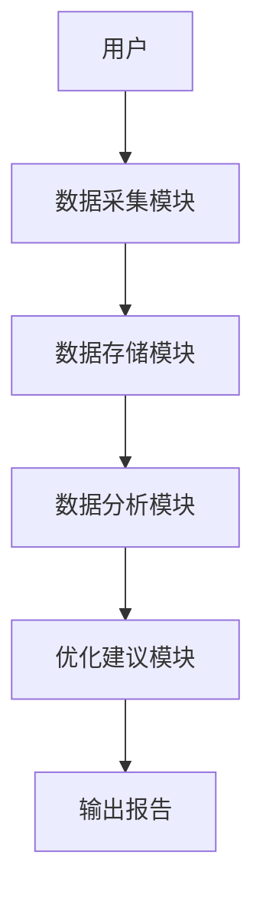

                 


# 股市估值高低对企业人才战略的影响

## 关键词：股市估值，企业人才战略，影响机制，数学模型，系统架构

## 摘要：本文探讨了股市估值高低对企业人才战略的影响，分析了两者之间的相互作用机制，并通过数学模型和系统架构设计，展示了如何将股市估值与人才战略相结合，以优化企业绩效。文章还结合实际案例，展示了如何通过算法和系统设计来实现这一目标。

---

# 第一部分: 股市估值与企业人才战略的背景与核心概念

## 第1章: 股市估值与企业人才战略的背景

### 1.1 股市估值的核心概念
#### 1.1.1 股市估值的基本定义
股市估值是指通过对企业财务状况、市场地位、盈利能力等多方面因素的分析，确定企业股票的市场价格是否合理。常用的估值方法包括市盈率（P/E）、市净率（P/B）、股息率等。

#### 1.1.2 股市估值的主要方法
- **市盈率（P/E）**：股票价格与每股收益的比值。
- **市净率（P/B）**：股票价格与每股净资产的比值。
- **股息率**：每股股息与股票价格的比值。

#### 1.1.3 股市估值对企业管理的影响
股市估值直接影响投资者对企业价值的判断，从而影响企业的融资能力、市场形象和管理决策。

### 1.2 企业人才战略的定义与特点
#### 1.2.1 企业人才战略的内涵
企业人才战略是指企业在吸引、培养、激励和保留人才方面的整体规划和策略。

#### 1.2.2 人才战略的核心要素
- **人才引进**：招聘、猎头等方式。
- **人才培养**：内部培训、导师制度等。
- **人才激励**：薪酬、股权激励、晋升机制等。

#### 1.2.3 人才战略与企业绩效的关系
优秀的人才战略能够提升企业创新能力、执行力和市场竞争力，从而提高企业绩效。

### 1.3 股市估值与企业人才战略的关联性
#### 1.3.1 股市估值对企业人才战略的影响
高估值企业通常有更高的市场关注度和融资能力，能够吸引更多优秀人才；低估值企业则可能在人才引进和激励上面临更大的挑战。

#### 1.3.2 人才战略对股市估值的作用
优秀的人才战略能够提升企业核心竞争力，进而提高企业的市场价值和股价。

#### 1.3.3 两者关系的复杂性与动态性
股市估值与人才战略的关系是动态的，受到市场环境、企业管理层决策等多种因素的影响。

## 第2章: 股市估值高低对企业人才战略的影响机制

### 2.1 股市估值对企业人才战略的直接影响
#### 2.1.1 高估值对企业人才战略的激励作用
高估值企业通常有更多的资源和更高的市场关注度，能够吸引和留住更多优秀人才。

#### 2.1.2 低估值对企业人才战略的制约作用
低估值企业可能在人才引进和激励上面临更大的挑战，难以吸引和留住优秀人才。

#### 2.1.3 股市估值波动对人才战略的短期与长期影响
股市估值的短期波动可能影响企业的短期人才战略调整，而长期波动则会影响企业的长期人才规划。

### 2.2 人才战略对股市估值的反馈机制
#### 2.2.1 优秀人才战略如何提升股市估值
优秀的人才战略能够提升企业的核心竞争力，从而提高企业的市场价值和股价。

#### 2.2.2 人才战略失误对股市估值的负面影响
人才战略失误可能导致企业创新能力下降，进而影响企业的市场价值和股价。

#### 2.2.3 人才战略调整与股市估值的动态平衡
企业需要根据市场变化和自身情况，动态调整人才战略，以实现股市估值与人才战略的动态平衡。

## 第3章: 股市估值与企业人才战略的核心概念对比

### 3.1 核心概念的属性特征对比
| 核心概念 | 定义 | 影响因素 | 目标 | 关系 |
|----------|------|----------|------|------|
| 股市估值 | 股票价格的合理程度 | 财务状况、市场环境、行业竞争 | 提高企业市场价值 | 通过影响企业资源分配间接影响人才战略 |
| 人才战略 | 企业对人才的规划和策略 | 企业绩效、市场环境、政策法规 | 提升企业核心竞争力 | 通过影响企业绩效间接影响股市估值 |

### 3.2 ER实体关系图
```mermaid
er
    企业
    股市估值
    人才战略
    企业 -> 股市估值: 影响
    企业 -> 人才战略: 制定
    股市估值 -> 人才战略: 反馈
```

---

# 第二部分: 股市估值对企业人才战略影响的算法原理

## 第4章: 股市估值与人才战略影响的数学模型

### 4.1 股市估值预测模型
#### 4.1.1 线性回归模型
$$ y = \beta_0 + \beta_1x_1 + \beta_2x_2 + \epsilon $$

其中：
- $y$：股市估值
- $x_1$：企业营业收入
- $x_2$：企业净利润
- $\beta_0$：截距
- $\beta_1$，$\beta_2$：回归系数
- $\epsilon$：误差项

#### 4.1.2 案例分析
假设某企业2022年的营业收入为100亿元，净利润为20亿元，预测其股市估值为：

$$ y = 50 + 0.5 \times 100 + 0.3 \times 20 + 0 = 50 + 50 + 6 = 106 $$

---

## 第5章: 人才战略对股市估值影响的数学模型

### 5.1 人才战略对股市估值的影响模型
$$ y = \alpha_0 + \alpha_1x_1 + \alpha_2x_2 + \alpha_3x_3 + \epsilon $$

其中：
- $y$：股市估值
- $x_1$：员工满意度
- $x_2$：员工留存率
- $x_3$：高管团队稳定性
- $\alpha_0$：截距
- $\alpha_1$，$\alpha_2$，$\alpha_3$：回归系数
- $\epsilon$：误差项

---

# 第三部分: 系统分析与架构设计方案

## 第6章: 股市估值与人才战略影响的系统架构设计

### 6.1 问题场景介绍
本文构建一个系统，用于分析股市估值与人才战略之间的关系，并提供优化建议。

### 6.2 系统功能设计
- 数据采集模块：采集企业财务数据、人才数据和股价数据。
- 数据分析模块：使用回归模型分析股市估值与人才战略的影响。
- 优化建议模块：基于分析结果，提出人才战略优化建议。

### 6.3 系统架构设计


---

# 第四部分: 项目实战

## 第7章: 股市估值与人才战略影响的项目实战

### 7.1 环境安装
- 数据库：MySQL
- 编程语言：Python
- 库：pandas, numpy, scikit-learn

### 7.2 核心代码实现
```python
import pandas as pd
from sklearn.linear_model import LinearRegression

# 数据加载
data = pd.read_csv('data.csv')

# 特征与目标变量
X = data[['revenue', 'net_profit', 'employee_satisfaction', 'retention_rate', 'executive_stability']]
y = data['stock_valuation']

# 模型训练
model = LinearRegression()
model.fit(X, y)

# 预测
predictions = model.predict(X)
print('预测值:', predictions[:5])
print('真实值:', y[:5].values)
```

---

# 第五部分: 总结与展望

## 第8章: 股市估值与企业人才战略的影响总结

### 8.1 本章小结
本文通过理论分析、数学建模和系统设计，探讨了股市估值与企业人才战略之间的相互作用机制，并提出了优化建议。

### 8.2 注意事项
- 数据的准确性和完整性直接影响模型的准确性。
- 人才战略的实施需要结合企业的实际情况。

### 8.3 未来研究方向
- 更多因素对股市估值与人才战略的影响。
- 机器学习在股市估值预测中的应用。

---

# 作者

作者：AI天才研究院/AI Genius Institute & 禅与计算机程序设计艺术 /Zen And The Art of Computer Programming

---

这篇文章通过系统性的分析和具体的案例，深入探讨了股市估值与企业人才战略之间的关系，并提出了相应的优化策略。希望对读者在企业管理和投资决策中提供有价值的参考。

