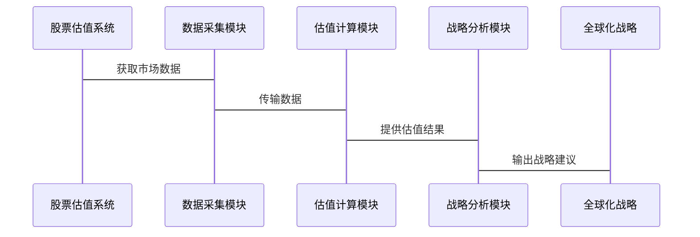

                 


# 股市估值高低对企业全球化战略的影响

> 关键词：股市估值、全球化战略、市盈率、市净率、数学模型

> 摘要：本文探讨股市估值高低如何影响企业的全球化战略。通过分析股市估值的核心概念、数学模型及实际案例，揭示股市估值对企业全球化决策的关键作用。文章内容涵盖背景介绍、核心概念、算法原理、数学模型、系统分析、项目实战及最佳实践，帮助读者全面理解股市估值与全球化战略的内在联系。

---

# 第一部分: 股市估值与全球化战略的背景介绍

## 第1章: 股市估值与全球化战略的背景介绍

### 1.1 股市估值的基本概念

#### 1.1.1 股票估值的定义
股票估值是通过对企业的财务状况、行业地位、盈利能力等多方面分析，确定其股票在市场上的合理价格。常见的估值方法包括市盈率（P/E）、市净率（P/B）和现金流折现法（DCF）等。

#### 1.1.2 市盈率与市净率的计算公式
- 市盈率（P/E）= 股票价格 / 每股收益（EPS）
- 市净率（P/B）= 股票价格 / 每股净资产（BVPS）

#### 1.1.3 股票估值的市场影响
股市估值的高低直接影响投资者对企业的信心，进而影响企业的融资能力、市场扩展能力和技术创新能力。

### 1.2 全球化战略的定义与特点

#### 1.2.1 全球化战略的定义
全球化战略是指企业在全球范围内进行资源分配、市场开拓和运营活动，以实现跨国经营和利润最大化的战略。

#### 1.2.2 全球化战略的核心要素
- 市场进入策略（直接投资、合资合作等）
- 跨国经营的风险管理
- 全球化与本地化战略的平衡

#### 1.2.3 全球化战略与企业发展的关系
全球化战略能够帮助企业拓展市场、优化资源配置，但也面临文化差异、政策风险等挑战。

### 1.3 股市估值与全球化战略的关联性

#### 1.3.1 股市估值对企业扩张的影响
高估值企业通常有更多的资金支持全球化扩张，而低估值企业可能面临资金短缺的风险。

#### 1.3.2 全球化战略对股市估值的反向作用
成功的全球化战略可以提升企业盈利能力，从而提高股市估值。

#### 1.3.3 股市估值与全球化战略的互动关系
股市估值为企业全球化战略提供资金支持，同时全球化战略的实施也会影响股市估值。

---

## 第2章: 股市估值与全球化战略的核心概念

### 2.1 股市估值的核心概念

#### 2.1.1 股票价格的决定因素
- 盈利能力
- 财务状况
- 行业地位
- 宏观经济环境

#### 2.1.2 股票估值的常见方法
- 市盈率法
- 市净率法
- 现金流折现法

#### 2.1.3 股票市场的波动性与估值的关系
股票市场的波动性会影响股市估值的准确性。

### 2.2 全球化战略的核心要素

#### 2.2.1 市场进入策略
- 直接投资
- 合资合作
- 特许经营

#### 2.2.2 跨国经营的风险管理
- 政治风险
- 经济风险
- 市场风险

#### 2.2.3 全球化与本地化战略的平衡
企业需要在全球化与本地化之间找到平衡点。

### 2.3 股市估值与全球化战略的联系

#### 2.3.1 高估值对企业扩张的推动作用
高估值企业通常有更多的资金支持全球化扩张。

#### 2.3.2 低估值对企业收缩的信号作用
低估值可能表明企业需要调整全球化战略。

#### 2.3.3 股市估值对企业全球化战略的动态影响
股市估值的变化会影响企业在全球化战略上的决策。

---

## 第3章: 股市估值与全球化战略的数学模型

### 3.1 股市估值的数学模型

#### 3.1.1 市盈率模型
$$ P = \frac{E}{EPS} $$

#### 3.1.2 市净率模型
$$ P = \frac{B}{BVPS} $$

#### 3.1.3 现金流折现模型
$$ V = \sum_{t=1}^{n} \frac{CF_t}{(1+r)^t} $$

### 3.2 全球化战略的数学模型

#### 3.2.1 市场进入模型
$$ I = C + E $$

#### 3.2.2 风险评估模型
$$ R = \sum_{i=1}^{n} P_i \times I_i $$

#### 3.2.3 战略收益模型
$$ S = \sum_{t=1}^{n} R_t \times V_t $$

---

## 第4章: 股市估值与全球化战略的系统分析

### 4.1 系统分析与架构设计

#### 4.1.1 领域模型类图
```mermaid
classDiagram
    class 股票 {
        - 名称
        - 价格
        - 市盈率
        - 市净率
    }
    class 全球化战略 {
        - 市场进入策略
        - 风险管理
        - 本地化策略
    }
    class 估值模型 {
        - 市盈率计算
        - 市净率计算
        - 现金流折现
    }
    stock -> 估值模型
    globalization -> 市场进入策略
```

#### 4.1.2 系统架构图


#### 4.1.3 系统交互序列图


---

## 第5章: 股市估值与全球化战略的项目实战

### 5.1 环境安装与数据准备

#### 5.1.1 环境安装
- 安装Python
- 安装Pandas和NumPy库

#### 5.1.2 数据准备
- 获取股票数据
- 获取全球化战略相关信息

### 5.2 核心实现代码

#### 5.2.1 估值计算代码
```python
import pandas as pd
import numpy as np

def calculate_pe_ratio(df):
    df['PE Ratio'] = df['Price'] / df['EPS']
    return df

def calculate_pb_ratio(df):
    df['PB Ratio'] = df['Price'] / df['BVPS']
    return df

# 示例数据
data = {
    'Stock': ['A', 'B', 'C'],
    'Price': [100, 80, 120],
    'EPS': [20, 25, 30],
    'BVPS': [50, 40, 60]
}

df = pd.DataFrame(data)
calculate_pe_ratio(df)
calculate_pb_ratio(df)
print(df)
```

#### 5.2.2 战略分析代码
```python
def evaluate_global_strategy(pe_ratio, pb_ratio):
    if pe_ratio < 15 and pb_ratio < 2:
        return "Global Expansion"
    elif pe_ratio > 20 or pb_ratio > 3:
        return "Strategic Retrenchment"
    else:
        return "Local Optimization"

pe = 18
pb = 2.5
strategy = evaluate_global_strategy(pe, pb)
print(strategy)
```

### 5.3 案例分析与解读

#### 5.3.1 案例分析
假设某企业股票的市盈率为18，市净率为2.5。根据上述代码，该企业的全球化战略应为“Local Optimization”。

#### 5.3.2 战略调整建议
- 加强本地化管理
- 优化资源配置
- 提高运营效率

---

## 第6章: 股市估值与全球化战略的最佳实践

### 6.1 关键点总结

#### 6.1.1 股市估值的核心作用
股市估值为企业全球化战略提供资金支持。

#### 6.1.2 全球化战略的动态调整
企业应根据股市估值的变化调整全球化战略。

### 6.2 注意事项

#### 6.2.1 风险控制
全球化战略实施过程中需注意政策风险和市场风险。

#### 6.2.2 数据准确性
确保数据的准确性和完整性。

### 6.3 拓展阅读

#### 6.3.1 推荐书籍
- 《全球化的挑战与机遇》
- 《股票估值与投资策略》

#### 6.3.2 相关博客
- 全球化战略对企业利润的影响
- 股市估值的最新研究进展

---

# 作者：AI天才研究院/AI Genius Institute & 禅与计算机程序设计艺术 /Zen And The Art of Computer Programming

