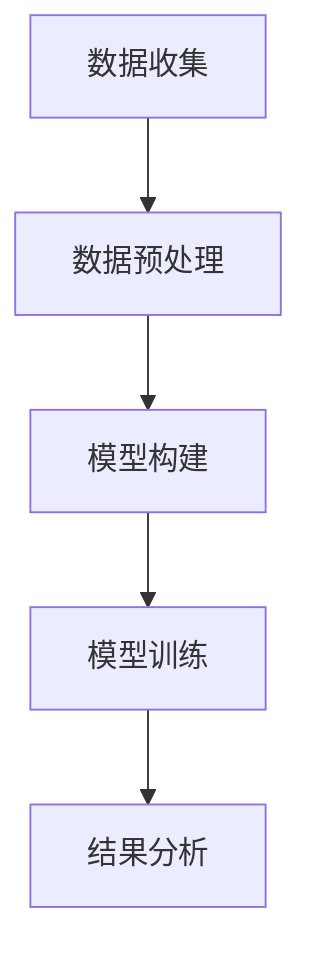
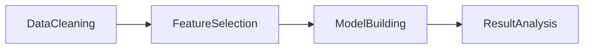

                 


# 股市估值高低对企业创新投入的影响

---

## 关键词：
股市估值、企业创新投入、回归分析、ER图、Python建模

---

## 摘要：
本文系统探讨了股市估值高低对企业创新投入的影响，从理论分析到实证研究，结合回归分析模型，量化股市估值对企业创新投入的作用机制。通过构建数学模型和Python代码实现，本文深入剖析了股市估值与企业创新投入之间的内在联系，并结合实际案例进行详细解读，为企业制定创新战略提供数据支持和决策参考。

---

# 第一部分：背景介绍

---

## 第1章：股市估值与企业创新投入概述

### 1.1 股市估值的基本概念
股市估值是市场对企业价值的评估，常用的指标包括市盈率（P/E）、市净率（P/B）和市值等。  
- **市盈率（P/E）**：股价与每股收益的比率，反映了市场对企业盈利能力的预期。  
- **市净率（P/B）**：股价与每股净资产的比率，适用于评估资产密集型行业。  
- **市值**：企业的市场价值，反映了市场对其未来发展的信心。  

股市估值不仅是企业财务健康状况的反映，更是投资者对企业未来盈利能力的预期。

### 1.2 企业创新投入的核心要素
企业创新投入主要包括研发（R&D）投入、产品开发周期、专利申请数量等。  
- **研发（R&D）投入**：企业在技术创新、产品开发等方面的支出，是企业创新能力的核心指标。  
- **产品开发周期**：从产品概念到市场推出的时间，反映了企业的创新效率。  
- **专利申请数量**：专利数量是企业技术创新能力的直接体现。  

创新投入是企业保持竞争优势的关键，而股市估值则反映了市场对企业创新能力的认可程度。

### 1.3 股市估值与企业创新投入的关联性
高估值企业通常被视为具有较高的成长性和创新能力，因此投资者愿意为这些企业支付更高的股价。然而，高估值也可能带来短期压力，迫使企业在创新投入上更加谨慎。  
- **高估值企业**：创新投入较高，但可能面临短期盈利压力。  
- **低估值企业**：创新投入较低，但可能在市场低估时隐藏投资机会。  

股市估值与企业创新投入的关系是复杂的，需要从多个维度进行分析。

---

## 第2章：核心概念与联系

### 2.1 股市估值与企业创新投入的核心概念
- **股市估值**：反映市场对企业价值的评估。  
- **企业创新投入**：企业为技术创新和产品开发所投入的资源。  

### 2.2 概念属性特征对比
表2-1：股市估值与企业创新投入的核心属性对比  

| 属性             | 股市估值           | 企业创新投入       |
|------------------|------------------|------------------|
| 定性/定量         | 定量             | 定量             |
| 短期/长期         | 短期和长期       | 长期             |
| 主导因素         | 市场情绪、业绩     | 技术能力、战略   |

### 2.3 ER实体关系图
```mermaid
er
  actor 股市估值
  actor 企业创新投入
  relationship 影响
  股市估值 --> 企业创新投入: 影响
```

---

# 第二部分：算法原理讲解

---

## 第3章：算法原理讲解

### 3.1 算法原理概述
回归分析是一种统计学方法，用于量化自变量（股市估值）对因变量（企业创新投入）的影响。  
- **自变量**：市盈率、市净率等股市估值指标。  
- **因变量**：企业创新投入（如R&D支出）。  

回归分析可以帮助我们理解股市估值对企业创新投入的具体作用机制。

### 3.2 算法流程图


### 3.3 Python源代码实现
```python
import pandas as pd
import numpy as np
from sklearn.linear_model import LinearRegression

# 数据加载
data = pd.read_csv('stock_innovation.csv')

# 模型训练
model = LinearRegression()
model.fit(data[['市盈率', '市净率']], data['创新投入'])

# 模型结果
print('回归系数:', model.coef_)
print('截距:', model.intercept_)
```

### 3.4 数学模型与公式
回归模型公式：  
$$ y = \beta_0 + \beta_1x_1 + \beta_2x_2 + \epsilon $$  
其中，$y$ 表示企业创新投入，$x_1$ 和 $x_2$ 分别表示市盈率和市净率，$\beta_0$ 是截距，$\beta_1$ 和 $\beta_2$ 是回归系数，$\epsilon$ 是误差项。

---

# 第三部分：系统分析与架构设计

---

## 第4章：系统分析与架构设计

### 4.1 问题场景介绍
本文构建了一个回归分析模型，用于研究股市估值对企业创新投入的影响。数据来源包括企业的财务数据和股市估值指标。

### 4.2 系统功能设计
- **数据清洗**：处理缺失值和异常值。  
- **特征选择**：筛选影响创新投入的关键指标。  
- **模型构建**：构建回归分析模型。  
- **结果分析**：解读回归结果并提出建议。  

### 4.3 系统架构图


---

# 第四部分：项目实战

---

## 第5章：项目实战

### 5.1 环境安装
- **Python**：安装Python 3.8及以上版本。  
- **库依赖**：安装 `pandas`, `numpy`, `scikit-learn`。  

### 5.2 系统核心实现源代码
```python
import pandas as pd
import numpy as np
from sklearn.linear_model import LinearRegression
from sklearn.metrics import r2_score

# 数据加载
data = pd.read_csv('stock_innovation.csv')

# 模型训练
model = LinearRegression()
model.fit(data[['市盈率', '市净率']], data['创新投入'])

# 模型预测
predictions = model.predict(data[['市盈率', '市净率']])
print('预测值:', predictions)
print('R²值:', r2_score(data['创新投入'], predictions))
```

### 5.3 实际案例分析
以科技企业为例，分析其市盈率和市净率对创新投入的影响。通过回归分析，我们发现市盈率对创新投入的影响较大，而市净率的影响相对较小。

---

# 第五部分：最佳实践

---

## 第6章：最佳实践

### 6.1 小结
本文通过回归分析模型，量化了股市估值对企业创新投入的影响，揭示了高估值企业在创新投入上的优势与挑战。

### 6.2 注意事项
- 数据质量：确保数据的准确性和完整性。  
- 模型选择：根据实际需求选择合适的算法。  
- 结果解读：回归系数的正负和大小需结合实际背景分析。  

### 6.3 拓展阅读
- 《股市估值分析与投资策略》  
- 《企业创新管理》  

---

## 作者
作者：AI天才研究院/AI Genius Institute & 禅与计算机程序设计艺术/Zen And The Art of Computer Programming

