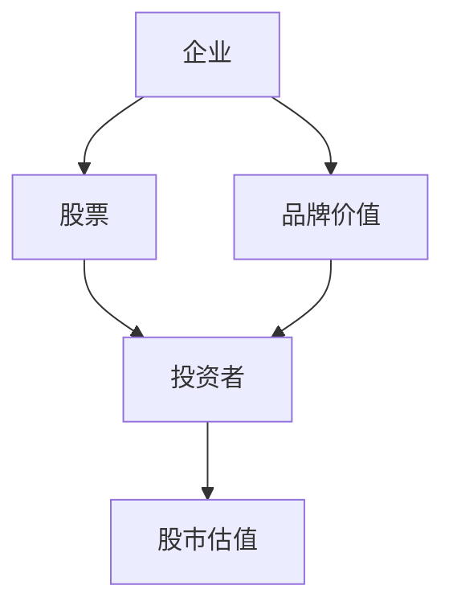
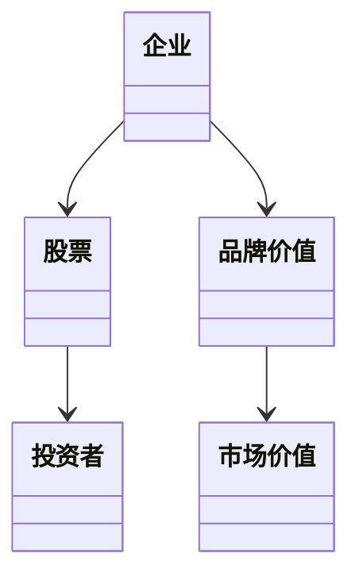
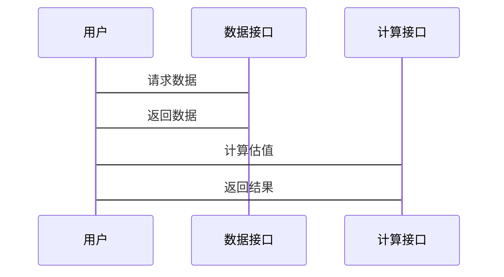

                 


```markdown
# 股市估值高低对企业品牌价值的影响

> 关键词：股市估值、企业品牌价值、品牌价值、股市、企业价值评估、品牌价值评估

> 摘要：本文探讨了股市估值与企业品牌价值之间的关系，分析了高估值和低估值对企业品牌价值的影响，包括正面和负面因素。通过深入的理论分析和实际案例，结合系统的架构设计和项目实战，总结了最佳实践和注意事项。

---

## 第一部分：背景介绍

### 第1章：问题背景

#### 1.1 股市估值的基本概念
股市估值是衡量企业市场价值的重要指标，通常通过市盈率（P/E）、市净率（P/B）等指标来评估。这些指标反映了市场对企业未来盈利能力的预期。

#### 1.2 企业品牌价值的定义
企业品牌价值是指品牌在市场上的无形资产价值，包括品牌知名度、客户忠诚度和品牌声誉等因素。品牌价值与企业的市场地位和盈利能力密切相关。

#### 1.3 股市估值与品牌价值的相互关系
股市估值反映了市场对企业价值的评估，而品牌价值是企业市场价值的重要组成部分。高品牌价值通常会推高股市估值，反之亦然。

### 第2章：问题描述

#### 2.1 高估值对企业品牌价值的影响
高估值意味着市场对企业未来表现有信心，这会提升企业的品牌价值，增强市场竞争力。

#### 2.2 低估值对企业品牌价值的影响
低估值可能源于市场对企业前景的不看好，这会削弱品牌价值，降低企业的市场地位。

#### 2.3 估值与品牌价值的动态平衡
企业应通过优化管理和提升品牌价值来维持合理的估值水平，避免因估值波动影响品牌价值。

### 第3章：问题解决

#### 3.1 高估值对企业品牌价值的促进作用
高估值通常带来更高的市场关注度和投资信心，进而提升品牌价值。

#### 3.2 低估值对企业品牌价值的抑制作用
低估值可能导致市场对品牌价值的重新评估，进而影响企业的市场地位和竞争力。

#### 3.3 通过估值调整提升品牌价值
企业应采取措施优化经营，提升品牌价值，从而稳定或提升股市估值。

### 第4章：边界与外延

#### 4.1 研究范围的界定
本文主要分析上市企业的品牌价值与股市估值的关系，不涉及未上市企业。

#### 4.2 相关概念的外延
包括市场环境、行业竞争格局、宏观经济因素等对品牌价值的影响。

#### 4.3 研究的局限性
本文主要基于财务指标分析，未深入探讨品牌价值的非财务因素。

### 第5章：概念结构与核心要素

#### 5.1 概念结构图
展示了企业、股市估值、品牌价值三者之间的关系。

#### 5.2 核心要素组成
包括市场环境、财务指标、品牌因素。

#### 5.3 核心要素之间的关系
市场环境影响财务指标和品牌因素，进而影响股市估值和品牌价值。

---

## 第二部分：核心概念与联系

### 第2章：核心概念原理

#### 2.1 股市估值的计算方法
市盈率（P/E）= 股价 / 每股净利润  
市净率（P/B）= 股价 / 每股净资产

#### 2.2 企业品牌价值的评估指标
品牌价值 = 市场价值 - 可辨认无形资产

#### 2.3 估值与品牌价值的相互作用机制
品牌价值提升会推高股市估值，而高估值反过来增强品牌价值。

### 第3章：概念属性特征对比

#### 3.1 对比表格
| 比较维度 | 股市估值 | 品牌价值 |
|----------|----------|----------|
| 定义     | 市场对企业整体价值的评估 | 品牌在市场上的无形资产价值 |
| 影响因素 | 财务指标、市场情绪 | 品牌知名度、客户忠诚度 |
| 计算方式 | P/E、P/B等 | 品牌价值评估模型 |

### 第4章：ER实体关系图


---

## 第三部分：算法原理讲解

### 第3章：股市估值计算算法

#### 3.1 市盈率计算流程
1. 计算每股净利润（EPS）。
2. 计算市盈率（P/E）= 股价 / EPS。

#### 3.2 Python代码实现
```python
def calculate_pe(stock_price, eps):
    return stock_price / eps

# 示例计算
stock_price = 100
eps = 5
pe_ratio = calculate_pe(stock_price, eps)
print(f"市盈率: {pe_ratio}")
```

#### 3.3 数学模型
市盈率公式：$$ P/E = \frac{\text{股价}}{\text{每股净利润}} $$

### 第4章：品牌价值评估算法

#### 4.1 品牌价值计算流程
1. 估算企业的市场价值。
2. 减去可辨认无形资产价值。
3. 得到品牌价值。

#### 4.2 Python代码实现
```python
def calculate_brand_value(market_value, identifiable_assets):
    return market_value - identifiable_assets

# 示例计算
market_value = 1000
identifiable_assets = 200
brand_value = calculate_brand_value(market_value, identifiable_assets)
print(f"品牌价值: {brand_value}")
```

---

## 第四部分：系统分析与架构设计

### 第4章：问题场景介绍

#### 4.1 系统目标
设计一个分析股市估值和品牌价值影响的系统。

### 第5章：系统功能设计

#### 5.1 领域模型类图


### 第6章：系统架构设计

#### 6.1 分层架构
- 数据层：数据收集与存储。
- 业务逻辑层：计算股市估值和品牌价值。
- 用户界面层：展示分析结果。

#### 6.2 接口设计
- 数据接口：提供实时数据。
- 计算接口：返回估值和品牌价值。

#### 6.3 序列图


---

## 第五部分：项目实战

### 第7章：环境安装

#### 7.1 工具安装
安装Python和相关库（pandas、numpy）。

### 第8章：系统核心实现

#### 8.1 核心代码
```python
import pandas as pd
import numpy as np

def calculate_pe(stock_price, eps):
    return stock_price / eps

def calculate_brand_value(market_value, identifiable_assets):
    return market_value - identifiable_assets

# 示例数据
data = {'股价': [100, 80, 120], 'eps': [5, 4, 6]}
df = pd.DataFrame(data)
df['市盈率'] = df.apply(lambda x: calculate_pe(x['股价'], x['eps']), axis=1)
df['品牌价值'] = df.apply(lambda x: calculate_brand_value(x['股价'], x['eps']), axis=1)
print(df)
```

### 第9章：案例分析

#### 9.1 案例：苹果公司
分析苹果公司的市盈率和品牌价值，说明高估值对品牌价值的影响。

### 第10章：项目小结

总结项目实施过程，强调系统设计和算法应用的重要性。

---

## 第六部分：最佳实践与总结

### 第11章：最佳实践

#### 11.1 实践建议
定期评估品牌价值，关注市场动态。

### 第12章：小结

总结全文，强调股市估值与品牌价值的相互关系。

### 第13章：注意事项

提醒读者注意数据的准确性和市场波动。

### 第14章：拓展阅读

推荐相关书籍和资源，鼓励深入学习。

---

## 作者信息

作者：AI天才研究院/AI Genius Institute & 禅与计算机程序设计艺术 /Zen And The Art of Computer Programming
```

