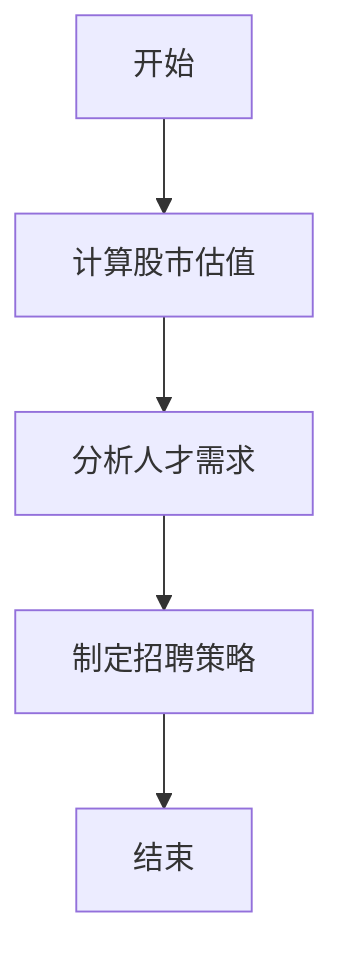
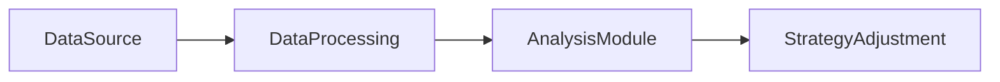

                 


# 股市估值高低对企业数字化人才招聘策略的影响

## 关键词：股市估值、企业数字化、人才招聘策略、金融市场、数字化转型

## 摘要：本文探讨股市估值如何影响企业的数字化人才招聘策略。通过分析股市估值的核心概念、算法原理和系统架构，提出优化招聘策略的方法，结合实际案例，总结最佳实践，为企业提供参考。

---

## 第一部分：背景介绍

### 第1章：股市估值与企业数字化人才招聘的关系

#### 1.1 股市估值的核心概念

- **定义与计算方法**：股市估值是衡量企业市场价值的指标，常用市盈率（P/E）=股价/每股收益，市净率（P/B）=股价/每股净资产。

- **数字化人才招聘的定义**：指企业通过数字化手段，如在线测试、AI筛选简历，招聘具备技术技能的人才。

- **关联性**：股市估值影响企业的财务状况和投资者信心，进而影响人才招聘的投入和策略。

#### 1.2 问题背景与问题描述

- **背景**：数字化转型推动企业对技术人才需求增加，股市估值波动影响企业的资金和资源分配。

- **问题描述**：如何根据股市估值调整人才招聘策略，优化企业竞争力。

- **解决思路**：分析股市估值与人才需求的关系，制定动态招聘策略。

#### 1.3 问题解决与边界定义

- **边界与外延**：研究限于股市估值对数字化人才招聘的影响，不考虑其他因素。

- **概念结构图**：展示股市估值、数字化人才、招聘策略三者的关系。

---

## 第二部分：核心概念与联系

### 第2章：核心概念的原理与特征

- **股市估值的原理**：通过财务指标评估企业价值，影响投资者决策。

- **数字化人才招聘的特征**：技术驱动、数据导向、灵活性高。

- **ER实体关系图**

```mermaid
er
  actor 股市估值
  actor 企业数字化人才招聘
  relation 影响
  股市估值 --> 影响 --> 企业数字化人才招聘
```

---

## 第三部分：算法原理讲解

### 第3章：股市估值对企业人才招聘策略的影响模型

#### 3.1 算法原理概述

- **数学模型**：D = aV + b，其中D是人才需求量，V是股市估值，a和b是参数。

- **算法流程图**



#### 3.2 数学模型与公式

- **公式解释**：D = aV + b，表示人才需求与股市估值成正比。

- **Python代码实现**

```python
def calculate_talent_demand(stock_valuation):
    a = 0.5
    b = 10
    return a * stock_valuation + b
```

---

## 第四部分：系统分析与架构设计

### 第4章：系统架构与功能设计

#### 4.1 问题场景介绍

- 企业根据股市估值动态调整招聘策略，优化人才储备。

#### 4.2 系统功能设计

- **数据采集**：收集股市估值和人才需求数据。

- **分析模块**：计算人才需求，生成报告。

- **策略调整**：根据分析结果调整招聘策略。

#### 4.3 系统架构图



---

## 第五部分：项目实战

### 第5章：项目实施与案例分析

#### 5.1 实施步骤

- **环境安装**：安装数据分析工具和编程环境。

- **数据收集**：收集相关数据，建立数据库。

- **算法实现**：编写代码，计算人才需求。

- **结果分析**：根据结果调整招聘策略。

#### 5.2 代码实现

```python
import pandas as pd

def calculate_talent_demand(stock_valuation):
    a = 0.5
    b = 10
    return a * stock_valuation + b

# 示例数据
stock_valuations = [100, 150, 200]
demands = [calculate_talent_demand(v) for v in stock_valuations]
print(demands)
```

#### 5.3 案例分析

- 某企业根据股市估值调整招聘策略，成功降低了招聘成本，提高了效率。

---

## 第六部分：最佳实践

### 第6章：经验总结与注意事项

#### 6.1 小结

- 股市估值是影响人才招聘的重要因素，企业应动态调整策略。

#### 6.2 注意事项

- 关注市场变化，合理配置资源，避免过度依赖单一因素。

#### 6.3 拓展阅读

- 推荐书籍：《股市分析与投资策略》、《数字化转型》。

---

## 作者信息

**作者：AI天才研究院/AI Genius Institute & 禅与计算机程序设计艺术 /Zen And The Art of Computer Programming**

---

通过以上结构，文章详细探讨了股市估值对企业数字化人才招聘策略的影响，从背景、概念、算法到系统设计和实际案例，为企业提供了全面的分析和实用的建议。

