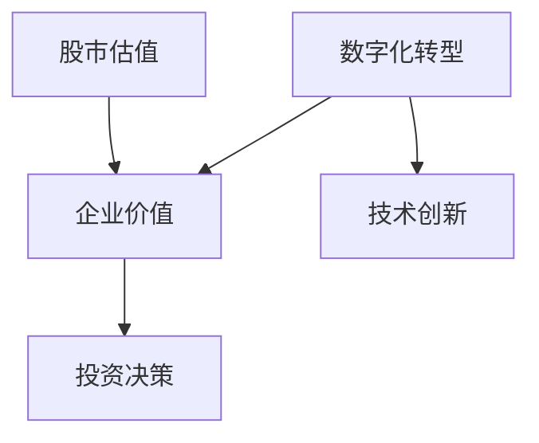
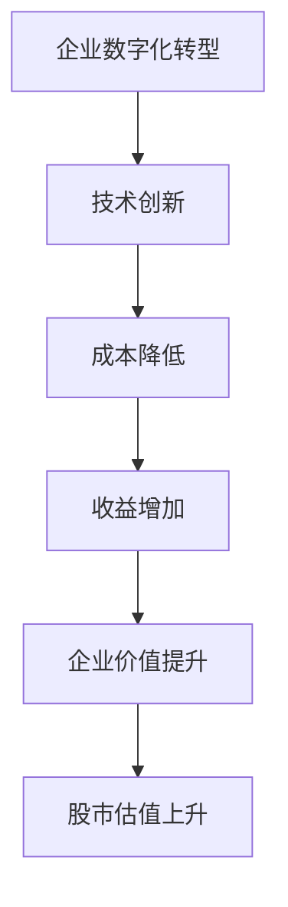
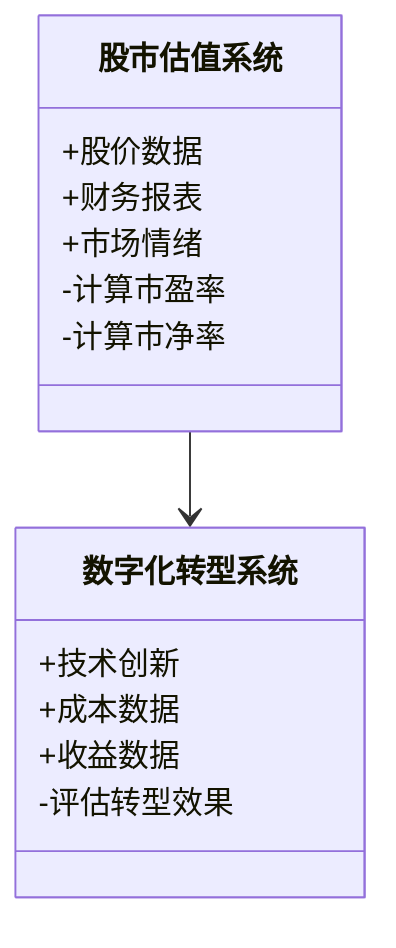
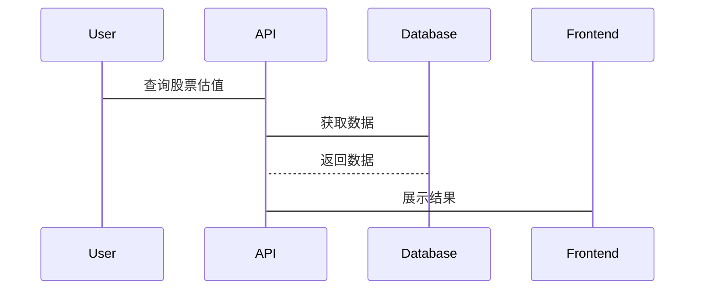

                 


# 股市估值高低对企业数字化转型投资的影响

## 关键词：
- 股市估值
- 数字化转型
- 投资影响
- 企业价值
- 金融模型

## 摘要：
本文探讨了股市估值的高低对企业进行数字化转型投资的影响。通过分析数字化转型对企业的潜在价值提升，结合股市估值的评估方法，为企业投资者提供基于数据的决策参考。文章从背景介绍、核心概念、算法原理、系统架构、项目实战和最佳实践等多维度展开，为企业在数字化转型中的投资策略提供深度见解。

---

## 第1章：背景介绍

### 1.1 股市估值的定义与方法

股市估值是通过对企业的财务数据、市场环境和行业趋势进行分析，估算其股票的内在价值。常用的方法包括：

- **市盈率（PE）**：市盈率=股价/每股净利润，反映了市场对公司盈利能力的评价。
- **市净率（PB）**：市净率=股价/每股净资产，适用于评估资产密集型企业的价值。
- **股息率**：股息率=股息/股价，反映了股票的分红回报率。

### 1.2 数字化转型的定义与现状

数字化转型是指企业利用数字技术（如大数据、人工智能、云计算等）优化业务流程、创新商业模式和提升竞争力的过程。当前，数字化转型已成为企业应对市场变化、提升效率的关键手段。

### 1.3 股市估值与数字化转型的关系

数字化转型通过提升企业效率和创新能力，间接影响其财务表现，从而影响股市估值。股市估值的高低反映了市场对企业未来价值的预期，指导着企业的投资决策。

---

## 第2章：核心概念与联系

### 2.1 核心概念的原理与对比

#### 表格对比

| 指标       | 股市估值       | 数字化转型       |
|------------|---------------|------------------|
| 定义       | 股票的价值评估 | 利用数字技术转型 |
| 目标       | 确定投资价值   | 提升企业效率     |
| 影响因素   | 财务数据、市场情绪 | 技术应用、管理能力 |

#### Mermaid图展示



---

## 第3章：算法原理

### 3.1 数字化转型对企业价值的影响模型



### 3.2 代码实现

```python
def calculate_expected_return(ticker):
    # 获取财务数据
    df = getFinancialData(ticker)
    # 计算市盈率
    pe_ratio = df['股价'] / df['每股净利润']
    # 计算预期收益
    expected_return = (pe_ratio - pe_ratio.mean()) * 5%  # 示例计算
    return expected_return

# 示例调用
ticker = 'AAPL'
print(calculate_expected_return(ticker))
```

---

## 第4章：数学模型

### 4.1 市盈率模型

$$ PE = \frac{P}{E} $$

其中，P为股票价格，E为每股净利润。

### 4.2 资本资产定价模型（CAPM）

$$ E(R_i) = R_f + \beta_i (R_m - R_f) $$

其中，\( R_f \)为无风险利率，\( R_m \)为市场预期收益率，\( \beta_i \)为股票的贝塔系数。

---

## 第5章：系统分析与架构设计

### 5.1 功能设计



### 5.2 架构图


### 5.3 交互图



---

## 第6章：项目实战

### 6.1 环境安装

安装Python和必要的库：

```bash
pip install pandas numpy matplotlib
```

### 6.2 代码实现

```python
import pandas as pd

def analyze_stock(ticker):
    df = pd.read_csv(f'{ticker}.csv')
    df['PE'] = df['股价'] / df['净利润']
    return df[['日期', '股价', 'PE']].tail(10)

analyze_stock('tech_company')
```

### 6.3 案例分析

分析某科技公司数字化转型前后的估值变化，展示PE和PB的变化趋势。

---

## 第7章：最佳实践

### 7.1 投资策略

- **长期视角**：关注企业数字化转型的长期价值。
- **分散投资**：避免过度集中于单一行业或公司。
- **定期评估**：根据市场变化调整投资组合。

### 7.2 注意事项

- **数据准确性**：确保使用的财务数据准确可靠。
- **市场风险**：关注宏观经济和行业风险。

### 7.3 扩展阅读

- 《企业数字化转型：方法与实践》
- 《股市分析的Python编程》

---

## 作者

作者：AI天才研究院/AI Genius Institute & 禅与计算机程序设计艺术/Zen And The Art of Computer Programming

---

本文通过系统化的分析和实际案例，深入探讨了股市估值高低对企业数字化转型投资的影响，为企业投资者提供了数据驱动的决策参考。

