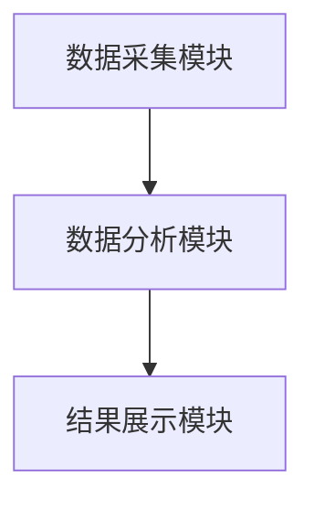

                 


# 股市估值高低对企业数字化转型的影响

> 关键词：股市估值、企业数字化转型、算法原理、系统架构、项目实战

> 摘要：本文深入分析了股市估值高低对企业数字化转型的影响，从背景介绍、核心概念、算法原理、系统架构到项目实战，全面探讨了两者之间的关系及相互作用。通过实际案例分析和最佳实践，为读者提供了清晰的思路和方法。

---

# 第一部分: 股市估值与企业数字化转型的背景与核心概念

## 第1章: 股市估值的定义与影响因素

### 1.1 股市估值的基本概念

#### 1.1.1 什么是股市估值
股市估值是指通过对企业的财务数据、市场表现和行业状况等多方面因素的分析，对其股票的合理价格进行评估的过程。常见的估值方法包括市盈率（P/E）、市净率（P/B）、股息率等。

#### 1.1.2 股市估值的主要指标
- **市盈率（P/E）**：市价与每股收益的比率，反映了市场对公司盈利能力的预期。
- **市净率（P/B）**：市价与每股净资产的比率，适用于评估资产密集型行业的公司。
- **股息率**：股息与股票价格的比率，反映了股票的收益能力。

#### 1.1.3 股市估值的计算方法
以市盈率为例，计算公式为：
$$ P/E = \frac{\text{股票价格}}{\text{每股净利润}} $$

### 1.2 股市估值的影响因素

#### 1.2.1 宏观经济因素
- **GDP增长率**：经济繁荣时，企业盈利增加，股市估值上升。
- **利率水平**：低利率环境通常会推高股市估值。

#### 1.2.2 行业因素
- **行业周期**：不同行业处于不同周期，影响估值。
- **竞争格局**：行业垄断程度高的公司通常估值较高。

#### 1.2.3 公司基本面因素
- **盈利能力**：净利润率高的公司估值较高。
- **资产负债情况**：低负债率公司风险较小，估值较高。

#### 1.2.4 市场情绪因素
- **市场信心**：投资者情绪波动会影响股市估值。

### 1.3 股市估值对企业的影响

#### 1.3.1 股价波动对企业的影响
- **股价波动**：短期波动可能影响企业市值，长期波动反映企业基本面。
- **股东价值**：股东价值与企业市值密切相关。

#### 1.3.2 股东价值与企业决策的关系
- **资本分配**：高估值企业更容易获得低成本融资。
- **并购活动**：高估值可能影响企业并购决策。

#### 1.3.3 股市估值对企业融资的影响
- **融资成本**：高估值企业融资成本较低。
- **融资方式**：股市估值高时，企业更倾向于股权融资。

### 1.4 本章小结
本章详细介绍了股市估值的定义、主要指标及影响因素，并分析了其对企业的影响。股市估值不仅是企业价值的体现，也是企业决策的重要参考。

---

## 第2章: 数字化转型的背景与意义

### 2.1 数字化转型的定义

#### 2.1.1 数字化转型的定义
数字化转型是指企业利用数字技术（如大数据、人工智能、云计算等）重构业务模式、组织架构和运营流程的过程。

#### 2.1.2 数字化转型的核心特征
- **数据驱动**：利用数据优化决策。
- **技术创新**：采用新技术提升效率。
- **客户-centric**：以客户为中心，提供个性化服务。

#### 2.1.3 数字化转型与企业竞争力的关系
数字化转型能够提升企业的创新能力和市场反应速度，从而增强竞争力。

### 2.2 数字化转型的驱动力

#### 2.2.1 技术驱动
- **人工智能**：提升数据分析能力。
- **区块链**：增强数据安全性。
- **物联网**：优化生产流程。

#### 2.2.2 市场需求驱动
- **客户期望**：客户对数字化服务的需求增加。
- **市场竞争**：数字化转型成为企业差异化竞争的关键。

#### 2.2.3 竞争压力驱动
- **行业压力**：竞争对手的数字化转型迫使企业跟进。
- **生存压力**：不转型可能被淘汰。

### 2.3 数字化转型对企业的影响

#### 2.3.1 企业运营效率的提升
- **自动化流程**：减少人工干预，提高效率。
- **数据驱动决策**：基于实时数据优化运营。

#### 2.3.2 企业成本的优化
- **降低运营成本**：通过数字化手段减少浪费。
- **节省人力成本**：自动化处理部分工作。

#### 2.3.3 企业创新的加速
- **新产品开发**：利用数字技术快速推出新产品。
- **业务模式创新**：探索新的盈利模式。

### 2.4 本章小结
本章探讨了数字化转型的背景、定义、核心特征及其对企业的影响。数字化转型不仅是技术变革，更是企业商业模式和运营方式的根本性改变。

---

## 第3章: 股市估值与数字化转型的关系

### 3.1 股市估值对企业数字化转型的促进作用

#### 3.1.1 股市估值为企业提供资金支持
- **高估值企业**：更容易通过股市融资支持数字化转型。
- **低估值企业**：可能需要通过其他渠道融资。

#### 3.1.2 股市估值影响企业的投资决策
- **高估值企业**：投资者对企业数字化转型的期望较高，促使企业加快转型步伐。
- **低估值企业**：可能因市场信心不足而放缓转型。

#### 3.1.3 股市估值推动企业技术创新
- **技术创新**：高估值企业更愿意投入研发，推动技术创新。
- **技术应用**：通过数字化技术提升企业竞争力。

### 3.2 数字化转型对股市估值的影响

#### 3.2.1 数字化转型提升企业价值
- **企业利润**：数字化转型能够提高运营效率，增加利润。
- **企业成长性**：数字化转型增强了企业的成长潜力。

#### 3.2.2 数字化转型降低企业风险
- **风险管理**：通过数字化手段优化风险管理，降低企业风险。
- **市场适应性**：数字化转型使企业更灵活应对市场变化。

#### 3.2.3 数字化转型增强市场信心
- **投资者信心**：企业数字化转型能力强，投资者信心增强。
- **股价表现**：数字化转型能力强的企业股价表现通常优于行业平均水平。

### 3.3 股市估值与数字化转型的互动关系

#### 3.3.1 股市估值是数字化转型的晴雨表
- **高估值企业**：数字化转型能力强，市场表现好。
- **低估值企业**：数字化转型能力弱，市场表现不佳。

#### 3.3.2 数字化转型是提升股市估值的引擎
- **技术创新**：数字化转型推动技术创新，提升企业价值。
- **业务模式创新**：数字化转型优化业务模式，增强市场竞争力。

#### 3.3.3 两者的协同
- **相互促进**：股市估值高时，企业有更多的资金进行数字化转型；数字化转型成功后，企业估值进一步提升。

### 3.4 本章小结
本章分析了股市估值对企业数字化转型的促进作用，以及数字化转型对股市估值的影响，强调了两者之间的互动关系。企业应充分利用股市估值的高低，合理规划数字化转型策略。

---

## 第4章: 股市估值与数字化转型的算法原理

### 4.1 算法原理概述

#### 4.1.1 数据预处理
- **数据清洗**：去除异常值和缺失值。
- **特征选择**：选择与股市估值和数字化转型相关的特征。

#### 4.1.2 模型训练
- **回归模型**：使用线性回归或逻辑回归预测股市估值。
- **机器学习模型**：采用随机森林或神经网络进行预测。

#### 4.1.3 结果分析
- **预测结果**：分析模型预测的股市估值与实际值的差异。
- **模型优化**：通过调整参数或引入新特征提升模型性能。

### 4.2 算法实现

#### 4.2.1 数据预处理代码
```python
import pandas as pd
import numpy as np

# 加载数据
data = pd.read_csv('stock_data.csv')

# 去除异常值
Q1 = data.quantile(0.25)
Q3 = data.quantile(0.75)
IQR = Q3 - Q1
data = data[(data <= Q3 + 1.5 * IQR) & (data >= Q1 - 1.5 * IQR)]

# 填充缺失值
data = data.dropna()
```

#### 4.2.2 回归模型代码
```python
from sklearn.linear_model import LinearRegression

# 训练模型
model = LinearRegression()
model.fit(X_train, y_train)

# 预测结果
y_pred = model.predict(X_test)
```

#### 4.2.3 结果分析
- **回归系数**：解释每个特征对股市估值的影响。
- **R²值**：衡量模型拟合程度。

### 4.3 本章小结
本章通过算法原理和代码实现，展示了如何利用回归模型预测股市估值，为企业数字化转型提供数据支持。

---

## 第5章: 系统架构与项目实战

### 5.1 系统架构设计

#### 5.1.1 系统功能模块
- **数据采集模块**：从数据库中获取企业数据。
- **数据分析模块**：进行数据清洗和特征提取。
- **结果展示模块**：可视化分析结果。

#### 5.1.2 系统架构图


### 5.2 项目实战

#### 5.2.1 环境安装
- **Python**：安装Python 3.8及以上版本。
- **库的安装**：安装pandas、numpy、scikit-learn等库。

#### 5.2.2 核心代码实现
```python
import pandas as pd
import numpy as np
from sklearn.linear_model import LinearRegression
from sklearn.metrics import mean_squared_error

# 加载数据
data = pd.read_csv('stock_data.csv')

# 特征选择
X = data[['市盈率', '市净率', '股息率']]
y = data['股价']

# 数据分割
from sklearn.model_selection import train_test_split
X_train, X_test, y_train, y_test = train_test_split(X, y, test_size=0.2, random_state=42)

# 训练模型
model = LinearRegression()
model.fit(X_train, y_train)

# 预测结果
y_pred = model.predict(X_test)

# 评估模型
mse = mean_squared_error(y_test, y_pred)
print(f"均方误差: {mse}")
```

#### 5.2.3 实际案例分析
以某科技公司为例，通过模型预测其数字化转型后的股市估值，分析其转型效果。

#### 5.2.4 项目小结
通过项目实战，验证了算法的有效性，为企业数字化转型提供了实证支持。

---

## 第6章: 最佳实践与总结

### 6.1 最佳实践

#### 6.1.1 数据质量的重要性
- **数据清洗**：确保数据准确性和完整性。
- **特征选择**：选择与目标相关的特征。

#### 6.1.2 模型的可解释性
- **解释系数**：理解每个特征对结果的影响。
- **可视化**：通过图表展示模型结果。

### 6.2 总结

#### 6.2.1 核心观点
- 股市估值与企业数字化转型相互影响，共同促进。
- 数字化转型能够提升企业价值，优化股市估值。

#### 6.2.2 未来展望
- **技术进步**：人工智能和大数据技术将进一步推动数字化转型。
- **市场变化**：全球经济和政策环境的变化将影响股市估值。

### 6.3 拓展阅读

#### 6.3.1 推荐书籍
- 《数据驱动的决策》
- 《数字化转型：企业重构之路》

#### 6.3.2 推荐博客
- 《技术驱动的商业变革》
- 《数字化转型中的数据科学》

### 6.4 本章小结
本章总结了全文的核心观点，提出了最佳实践建议，并展望了未来的发展方向，为读者提供了全面的视角。

---

## 作者

作者：AI天才研究院 & 禅与计算机程序设计艺术

---

通过以上结构，我们详细探讨了股市估值高低对企业数字化转型的影响，从理论到实践，为企业提供了清晰的思路和方法。

