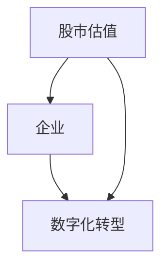

                 

# 股市估值高低对企业数字化转型速度的影响

> 关键词：股市估值、企业数字化转型、资本可得性、激励机制、资源分配

> 摘要：本文探讨了股市估值高低对企业数字化转型速度的影响，通过分析资本可得性、激励机制和资源分配等方面，揭示了股市估值对企业数字化转型的驱动作用。文章结合数学模型和实际案例，提出了企业应对策略，为企业制定数字化转型战略提供了参考。

---

# 第一部分: 背景与核心概念

## 第1章: 背景介绍

### 1.1 问题背景

#### 1.1.1 股市估值的定义与影响
股市估值是衡量企业市场价值的重要指标，通常通过市盈率（P/E）、市净率（P/B）等指标衡量。高估值意味着市场对企业的未来发展充满信心，而低估值则可能表明市场对其前景持怀疑态度。

#### 1.1.2 数字化转型的定义与核心要素
数字化转型是指企业利用数字技术（如大数据、人工智能、云计算等）重构业务模式、流程和文化的过程。核心要素包括技术应用、组织变革、文化转型和数据驱动决策。

#### 1.1.3 问题的提出与研究意义
随着数字经济的快速发展，企业数字化转型已成为提升竞争力的关键。然而，股市估值的高低可能影响企业的转型速度和能力。研究这一关系有助于企业制定更有效的战略。

### 1.2 问题描述

#### 1.2.1 股市估值与企业行为的关系
股市估值影响企业的融资能力、管理层激励和投资者信心，从而影响其战略决策。

#### 1.2.2 数字化转型的驱动因素
技术进步、市场需求和管理层决策是主要驱动因素，而股市估值作为外部因素，也起到重要作用。

#### 1.2.3 问题的边界与外延
研究范围限定于上市公司，排除非上市公司；主要分析高估值和低估值对企业数字化转型的影响，不考虑中估值情况。

### 1.3 问题解决

#### 1.3.1 股市估值对企业决策的影响
高估值企业更容易获得融资，低估值企业可能面临资金短缺，影响转型投入。

#### 1.3.2 数字化转型的实现路径
包括技术选型、组织架构调整、数据治理和文化转型。

#### 1.3.3 问题解决的可行性分析
通过分析高估值和低估值企业的案例，验证股市估值对数字化转型的影响。

## 第2章: 核心概念与联系

### 2.1 核心概念原理

#### 2.1.1 股市估值的核心要素
- 市盈率（P/E）= 股价/每股收益
- 市净率（P/B）= 股价/每股净资产
- 市销率（P/S）= 股价/每股收入

#### 2.1.2 数字化转型的关键驱动因素
- 技术应用：大数据、人工智能、云计算等
- 组织变革：扁平化、敏捷化
- 文化转型：数据驱动、创新驱动

#### 2.1.3 两者的内在联系
股市估值影响企业的融资能力和管理层激励，进而影响其数字化转型的速度和方向。

### 2.2 概念属性特征对比

| 概念         | 属性特征                         |
|--------------|----------------------------------|
| 股市估值     | 市盈率、市净率、市场信心等       |
| 数字化转型   | 技术应用、组织变革、文化转型等   |

### 2.3 ER实体关系图

---

# 第二部分: 影响机制与评估

## 第3章: 影响机制分析

### 3.1 股市估值对资本可得性的影响

#### 3.1.1 高估值企业的融资优势
高估值企业通常更容易获得外部融资，支持数字化转型所需的大量投资。

#### 3.1.2 低估值企业的融资劣势
低估值企业可能面临融资困难，限制其数字化转型的投入。

#### 3.1.3 资本可得性与数字化转型的关系
资本可得性直接影响企业的技术投入和转型速度。

### 3.2 股市估值对企业激励机制的影响

#### 3.2.1 高估值企业的管理层激励
高估值企业通常通过股票期权激励管理层，推动数字化转型。

#### 3.2.2 低估值企业的管理层激励
低估值企业可能通过其他方式激励管理层，如奖金或长期激励。

#### 3.2.3 激励机制对数字化转型的推动作用
有效的激励机制可以提升管理层的积极性，加快数字化转型进程。

### 3.3 股市估值对资源分配的影响

#### 3.3.1 高估值企业的资源分配特点
高估值企业通常有更多的资源用于技术研发和数字化转型。

#### 3.3.2 低估值企业的资源分配特点
低估值企业可能优先分配资源用于短期盈利，而非长期转型。

#### 3.3.3 资源分配对企业数字化转型的影响
资源分配的合理与否直接影响数字化转型的深度和广度。

## 第4章: 影响评估与数学模型

### 4.1 数学模型构建

#### 4.1.1 股市估值与数字化转型速度的定量关系
构建一个数学模型，将股市估值与数字化转型速度相关联。

$$ \text{转型速度} = f(\text{股市估值}, \text{其他因素}) $$

#### 4.1.2 数学模型的建立与假设
假设：
- 高估值企业转型速度更快
- 低估值企业转型速度较慢

#### 4.1.3 模型的验证与优化
通过实际案例数据验证模型，并进行优化。

### 4.2 数学公式与分析

$$ \text{P/E} = \frac{\text{股价}}{\text{每股收益}} $$

$$ \text{P/B} = \frac{\text{股价}}{\text{每股净资产}} $$

通过分析这些指标，评估企业的市场价值和转型潜力。

---

# 第三部分: 应对策略与实现

## 第4章: 应对策略与实现路径

### 4.1 应对策略

#### 4.1.1 高估值企业的应对策略
- 投资于技术创新
- 加强风险管理
- 提升投资者沟通

#### 4.1.2 低估值企业的应对策略
- 优化资源配置
- 寻求外部支持
- 专注核心竞争力

#### 4.1.3 综合应对策略
根据股市估值调整转型策略，平衡短期与长期目标。

## 第4.2 系统架构设计

### 4.2.1 系统功能设计

### 4.2.2 系统架构设计

---

# 第四部分: 案例分析与应用

## 第5章: 案例分析与应用

### 5.1 案例介绍

#### 5.1.1 高估值企业的案例
以某高科技公司为例，分析其高估值如何支持数字化转型。

#### 5.1.2 低估值企业的案例
以某传统制造企业为例，分析其低估值如何影响转型速度。

### 5.2 实际应用

#### 5.2.1 应用场景
根据股市估值调整数字化转型策略。

#### 5.2.2 案例分析与解读
总结案例中的经验教训，提出改进建议。

### 5.3 总结

通过案例分析，验证股市估值对企业数字化转型的影响，提出可行的应对策略。

---

# 第五部分: 结论与展望

## 第6章: 结论与展望

### 6.1 研究总结
股市估值高低直接影响企业的资本可得性、激励机制和资源分配，进而影响数字化转型速度。

### 6.2 未来展望
未来研究可以进一步探讨其他外部因素对数字化转型的影响，以及如何优化模型以适应不同行业和市场环境。

---

# 作者

作者：AI天才研究院/AI Genius Institute & 禅与计算机程序设计艺术 /Zen And The Art of Computer Programming

