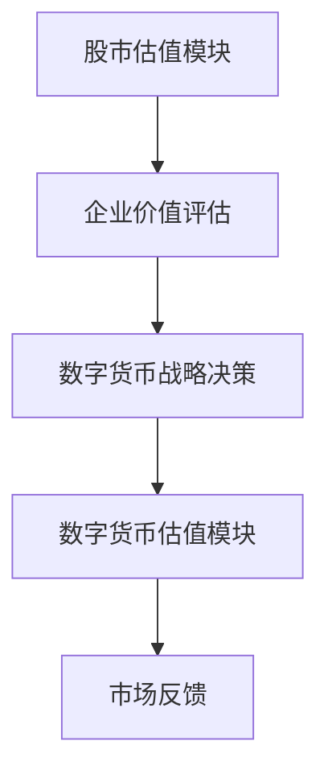

                 


# 股市估值高低对企业数字货币战略的影响

**关键词**：股市估值、企业数字货币战略、数字货币、股市波动、企业价值、战略优化、技术影响

**摘要**：本文探讨了股市估值的高低对企业制定数字货币战略的影响。通过分析股市估值的核心指标、数字货币的分类与特征，以及两者的互动关系，本文构建了股市估值与企业数字货币战略的数学模型，并提出了系统架构设计和实际案例分析。文章还总结了最佳实践和未来研究方向，为企业制定数字货币战略提供了理论支持和实践指导。

---

## 第1章 股市估值与企业数字货币战略的背景

### 1.1 股市估值的基本概念

#### 1.1.1 股市估值的定义与作用
股市估值是通过一系列指标对企业或行业的整体价值进行评估的过程。其作用在于帮助投资者和企业管理者了解企业的市场价值，从而做出更合理的投资决策。

#### 1.1.2 股市估值的核心指标
- 市盈率（P/E）：企业股价与每股收益的比率，反映市场对企业盈利能力的预期。
- 市净率（P/B）：企业股价与每股净资产的比率，适用于评估资产密集型行业。
- EV/EBITDA：企业价值与息税折旧及摊销前利润的比率，衡量企业整体价值。
- 股息率：股息与股价的比率，反映企业分红能力。

#### 1.1.3 股市估值与企业价值的关系
股市估值是企业市场价值的体现，但受市场情绪、宏观经济和行业趋势的影响，可能与企业实际价值存在偏差。

---

### 1.2 企业数字货币战略的定义与特点

#### 1.2.1 数字货币的定义与分类
- 数字货币：基于区块链技术的电子货币，分为法定数字货币（如央行数字货币）和私人数字货币（如比特币、以太坊）。
- 稳定币：与法币或资产挂钩的数字货币，如USDT。

#### 1.2.2 企业数字货币战略的核心目标
- 提升企业支付效率。
- 优化资金管理。
- 投资或发行数字货币以提升市场竞争力。

#### 1.2.3 数字货币对企业战略的影响
- 数字货币技术的应用可能降低企业运营成本。
- 数字货币的波动性可能影响企业的财务稳定性。

---

### 1.3 股市估值与企业数字货币战略的关联性

#### 1.3.1 股市估值对企业战略的影响
- 高估值企业可能面临更高的市场期待，需制定稳健的数字货币战略。
- 低估值企业可能通过数字货币战略提升市场信心。

#### 1.3.2 数字货币对股市估值的潜在影响
- 数字货币的发行可能提升企业的创新形象，推高股价。
- 数字货币的波动可能引发市场对企业的估值调整。

#### 1.3.3 企业数字货币战略与股市估值的互动关系
企业通过数字货币战略影响市场对其未来盈利能力的预期，进而影响股市估值；同时，股市估值的变化也会反过来影响企业数字货币战略的实施。

---

## 第2章 股市估值与企业数字货币战略的核心概念

### 2.1 股市估值的关键指标

#### 2.1.1 市盈率（P/E）
公式：$$ P/E = \frac{\text{股价}}{\text{每股收益}} $$
- 高P/E值可能意味着市场对企业未来盈利的高预期，但也可能隐含较高的投资风险。

#### 2.1.2 市净率（P/B）
公式：$$ P/B = \frac{\text{股价}}{\text{每股净资产}} $$
- 适用于评估资产密集型行业，低P/B值可能意味着企业资产被低估。

#### 2.1.3 EV/EBITDA
公式：$$ EV/EBITDA = \frac{\text{企业价值}}{\text{EBITDA}} $$
- 企业价值 = 市价 + 债务 - 现金及等价物。

#### 2.1.4 股息率
公式：$$ 股息率 = \frac{\text{每股股息}}{\text{股价}} $$
- 高股息率可能吸引注重收益稳定的投资者。

---

### 2.2 数字货币的分类与特征

#### 2.2.1 法定数字货币与私人数字货币
- 法定数字货币：由央行发行，信用风险低。
- 私人数字货币：由私营机构发行，信用风险较高。

#### 2.2.2 加密货币与稳定币
- 加密货币：基于区块链技术，具有去中心化特性。
- 稳定币：与法币或资产挂钩，价格波动小。

---

### 2.3 股市估值与企业数字货币战略的互动机制

#### 2.3.1 企业数字货币战略对股市估值的直接影响
- 企业发行数字货币可能提升市场对其创新能力和未来的盈利能力的预期，推高股价。

#### 2.3.2 股市估值对企业数字货币战略的反馈作用
- 高估值企业可能面临更高的市场期待，需谨慎制定数字货币战略以避免市场失望。

#### 2.3.3 数字货币市场的波动对股市估值的潜在影响
- 数字货币价格的剧烈波动可能引发市场对企业的估值调整。

---

## 第3章 股市估值与企业数字货币战略的数学模型

### 3.1 股市估值的数学模型

#### 3.1.1 市盈率模型
公式：$$ \text{股价} = P/E \times \text{每股收益} $$
- 适用于评估企业的盈利能力。

#### 3.1.2 市净率模型
公式：$$ \text{股价} = P/B \times \text{每股净资产} $$
- 适用于评估资产密集型行业。

---

### 3.2 数字货币价值的数学模型

#### 3.2.1 数字货币的供需模型
公式：$$ \text{价格} = \frac{\text{需求}}{\text{供给}} $$
- 需求受市场情绪、技术进步等因素影响。

#### 3.2.2 加密货币的哈希值与价值关系
公式：$$ \text{哈希值} \propto \text{计算难度} $$
- 哈希值越高，计算难度越大，价格可能越高。

---

## 第4章 股市估值与企业数字货币战略的系统架构设计

### 4.1 系统功能设计

#### 4.1.1 股市估值模块
- 输入：企业财务数据、市场数据。
- 输出：股市估值结果。

#### 4.1.2 数字货币估值模块
- 输入：数字货币市场数据。
- 输出：数字货币估值结果。

---

### 4.2 系统架构设计

#### 4.2.1 系统架构图


---

## 第5章 项目实战

### 5.1 环境安装
- 安装Python和相关库（如Pandas、Matplotlib）。

### 5.2 核心代码实现
```python
import pandas as pd
import matplotlib.pyplot as plt

# 示例数据：企业财务数据
data = {
    '收入': [100, 200, 300],
    '净利润': [20, 30, 40]
}

df = pd.DataFrame(data)
print(df)

# 绘制市盈率曲线
pe = df['收入'] / df['净利润']
plt.plot(pe, label='市盈率')
plt.xlabel('季度')
plt.ylabel('市盈率')
plt.legend()
plt.show()
```

---

## 第6章 总结与展望

### 6.1 总结
本文探讨了股市估值与企业数字货币战略的关系，构建了数学模型，并提出了系统架构设计。企业应根据自身情况制定合理的数字货币战略，以应对市场变化。

### 6.2 展望
未来研究可进一步探讨数字货币技术对企业估值的长期影响，以及如何通过技术手段优化企业数字货币战略。

---

**作者：AI天才研究院/AI Genius Institute & 禅与计算机程序设计艺术 /Zen And The Art of Computer Programming**

