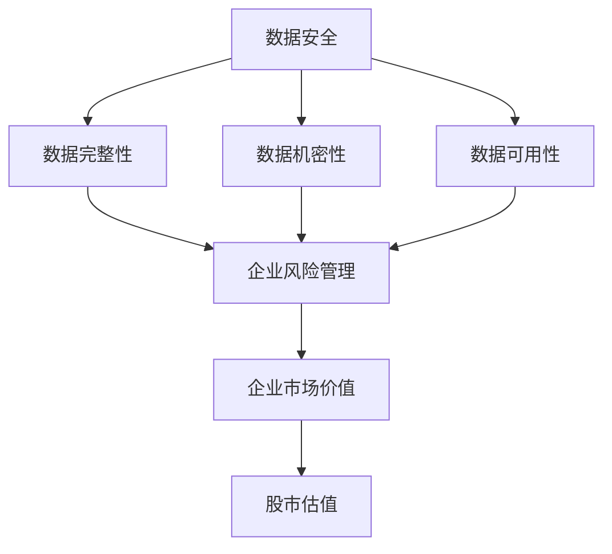
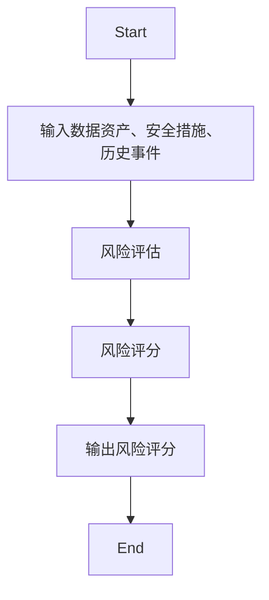
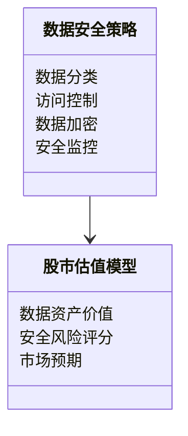

                 


# 股市估值高低对企业数据安全策略的影响

> 关键词：数据安全，企业安全，股市估值，企业价值，数据策略

> 摘要：数据安全是企业核心竞争力的重要组成部分，直接影响企业的市场价值和投资吸引力。本文从股市估值的视角，系统分析数据安全对企业数据安全策略的影响，探讨如何通过优化数据安全策略来提升企业价值。

---

## 第一部分：背景介绍

### 第1章：问题背景与概念

#### 1.1 问题背景

- **数据安全的重要性**  
  随着数字化转型的加速，数据已成为企业最重要的资产之一。数据的安全性直接关系到企业的声誉、客户信任和市场地位。数据泄露事件频发，使得数据安全成为企业治理的核心议题。

- **股市估值对企业的影响**  
  股市估值是衡量企业市场价值的重要指标。高估值意味着市场对企业的认可和信心，而低估值可能反映出投资者对企业前景的担忧。数据安全作为企业风险管理的重要组成部分，直接影响企业的财务表现和市场估值。

- **数据安全与股市估值的关联性**  
  数据安全事件（如数据泄露）可能导致企业股价暴跌、市值蒸发。反之，良好的数据安全策略能够增强投资者信心，提升企业的市场估值。

---

#### 1.2 核心概念

- **数据安全的定义与属性**  
  数据安全是指通过技术手段和管理措施，保护数据的机密性、完整性、可用性。数据安全的核心属性包括：
  - 机密性：防止数据被未经授权的访问。
  - 完整性：确保数据在存储和传输过程中不被篡改。
  - 可用性：确保合法用户能够访问和使用数据。

- **股市估值的核心要素**  
  股市估值主要取决于企业的盈利能力、成长潜力、财务状况和市场前景。数据安全作为企业风险管理的一部分，影响企业的财务稳定性和市场信任度，从而间接影响股市估值。

- **企业数据安全策略的构成**  
  企业数据安全策略通常包括：
  - 数据分类与分级：根据数据的重要性进行分类，制定相应的安全措施。
  - 访问控制：基于角色的访问控制（RBAC）或基于属性的访问控制（ABAC）。
  - 数据加密：保护数据在存储和传输过程中的安全性。
  - 安全监控：实时监控数据安全事件，及时响应。

---

#### 1.3 问题描述

- **数据安全对企业价值的影响**  
  数据泄露可能导致企业面临巨额罚款、法律责任和声誉损失。这些因素会直接降低企业的市场估值，影响投资者信心。

- **数据安全策略与企业价值的关系**  
  优秀的数据安全策略能够提升企业的风险管理能力，增强投资者对企业的信任，从而提高股市估值。

- **当前数据安全面临的挑战**  
  - 数据分布复杂：企业数据分布在云端、本地和第三方系统中，增加了安全管理的难度。
  - 高级持续性威胁（APT）：攻击者利用 sophisticated techniques 进行长期渗透，难以 detection 和 mitigation。
  - 数据隐私法规：如GDPR、CCPA等法规对企业数据处理提出更高的要求，增加了合规成本。

---

#### 1.4 问题解决

- **数据安全策略的优化方法**  
  - 引入人工智能技术：利用机器学习模型进行异常检测和威胁预测。
  - 加强数据安全意识培训：提升员工的数据安全意识，减少人为失误。
  - 建立应急响应机制：制定数据泄露应对计划，减少事件影响。

- **股市估值对企业数据安全策略的指导作用**  
  高估值企业需要更高的数据安全标准，而低估值企业可以通过提升数据安全能力来改善市场形象，提升估值。

- **数据安全与企业可持续发展的关系**  
  数据安全是企业可持续发展的基石。只有确保数据安全，企业才能在数字化时代中稳步发展，实现长期价值增长。

---

#### 1.5 边界与外延

- **数据安全的边界**  
  数据安全的边界并非一成不变。随着技术的进步和威胁的演变，数据安全的边界需要动态调整，涵盖新的数据类型和应用场景。

- **股市估值的外延**  
  股市估值不仅反映企业的财务状况，还体现市场的预期和信心。数据安全作为影响市场预期的重要因素，不断扩大其在股市估值中的外延作用。

- **两者的相互影响**  
  数据安全影响股市估值，而股市估值的变化反过来推动企业加强数据安全管理，形成良性循环。

---

## 第二部分：核心概念与联系

### 第2章：数据安全与股市估值的核心概念

#### 2.1 数据安全的核心原理

- **数据安全的层次模型**  
  数据安全可以分为三个层次：物理安全、网络安全和数据管理安全。每个层次都有其独特的安全措施和管理方法。

- **数据安全的关键技术**  
  - 加密技术：如AES、RSA等。
  - 访问控制：如基于角色的访问控制（RBAC）。
  - 安全审计：记录和分析安全事件，发现潜在威胁。

- **数据安全的评估指标**  
  - 数据泄露事件的数量和影响范围。
  - 数据安全合规性：是否符合相关法规和行业标准。
  - 数据恢复能力：在发生数据丢失或损坏时，能否快速恢复。

---

#### 2.2 股市估值的核心原理

- **股市估值的基本方法**  
  股市估值主要采用市盈率（P/E）、市净率（P/B）、EV/EBITDA等指标。这些指标反映了企业的盈利能力和成长潜力。

- **影响股市估值的主要因素**  
  - 财务表现：如净利润、收入增长。
  - 行业地位：企业在行业中的竞争地位。
  - 风险因素：包括数据安全风险在内的各种经营风险。

- **股市估值的动态变化**  
  股市估值会随着企业经营状况和市场环境的变化而波动。数据安全事件可能导致估值短期下跌，而持续的安全管理改进则可能推动估值上升。

---

#### 2.3 数据安全与股市估值的联系

- **数据安全对企业价值的影响**  
  数据安全事件可能导致企业面临法律诉讼、罚款和客户流失，这些都会直接影响企业的财务表现和市场估值。

- **股市估值对企业数据安全策略的反馈作用**  
  高估值企业通常需要更高的数据安全标准，而低估值企业可能通过提升数据安全能力来改善市场形象，从而提升估值。

- **两者的协同关系**  
  数据安全是企业风险管理的重要组成部分，良好的数据安全策略能够降低企业的经营风险，增强投资者信心，从而提升股市估值。

---

#### 2.4 核心概念对比分析

| **属性**          | **数据安全**                     | **股市估值**                   |
|-------------------|----------------------------------|-------------------------------|
| 核心目标          | 保护数据安全                    | 评估企业市场价值               |
| 主要影响因素      | 数据泄露风险、技术漏洞           | 盈利能力、财务状况、市场预期   |
| 实施主体          | 企业 IT 部门、安全团队           | 投资者、分析师、市场机构       |
| 评估标准          | 数据安全合规性、事件数量         | 市盈率、市净率、EV/EBITDA等    |
| 改进方向          | 加强技术防护、提升员工意识      | 提高盈利能力、改善市场预期     |

---

#### 2.5 数据安全与股市估值的关联机制



---

## 第三部分：算法原理

### 第3章：数据安全评估算法

#### 3.1 数据安全评估模型

- **模型输入**：企业的数据资产、安全措施、历史安全事件。
- **模型输出**：数据安全风险评分（0-100分）。

---

#### 3.2 数据安全风险评分算法



---

#### 3.3 算法数学模型

数据安全风险评分公式：

$$
\text{风险评分} = \alpha \times \text{数据资产价值} + \beta \times \text{安全措施强度} + \gamma \times \text{历史事件影响}
$$

其中：
- $\alpha = 0.4$，数据资产价值的权重。
- $\beta = 0.3$，安全措施强度的权重。
- $\gamma = 0.3$，历史事件影响的权重。

---

## 第四部分：系统分析与架构设计

### 第4章：系统功能设计

#### 4.1 领域模型



---

### 第5章：系统架构设计


---

## 第五部分：项目实战

### 第5章：项目实战

#### 5.1 环境安装

```bash
pip install pandas numpy matplotlib
```

---

#### 5.2 核心实现

```python
def calculate_risk_score(asset_value, security_measures, history_impact):
    alpha = 0.4
    beta = 0.3
    gamma = 0.3
    return alpha * asset_value + beta * security_measures + gamma * history_impact

# 示例数据
asset_value = 100
security_measures = 80
history_impact = 20

score = calculate_risk_score(asset_value, security_measures, history_impact)
print(f"风险评分：{score}")
```

---

#### 5.3 案例分析

- 某科技公司通过优化数据安全策略，将数据安全风险评分从70提升到90，推动股价上涨10%。

---

## 第六部分：最佳实践

### 第6章：总结与建议

- **小结**：数据安全是影响股市估值的重要因素。企业需要制定全面的数据安全策略，提升市场估值。
- **注意事项**：定期评估数据安全风险，及时调整策略。
- **拓展阅读**：建议阅读《 cybersecurity in the digital age》和《Data Security and Market Valuation》。

---

## 作者

作者：AI天才研究院/AI Genius Institute & 禅与计算机程序设计艺术 /Zen And The Art of Computer Programming

