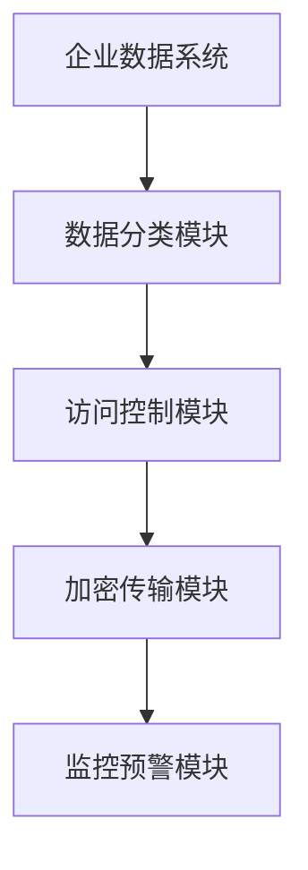

                 


# 股市估值高低对企业数据隐私保护投资的影响

---

## 关键词：
股市估值、数据隐私保护、投资影响、企业价值、风险管理

---

## 摘要：
随着数据隐私问题的日益突出，企业对数据隐私保护的投资变得至关重要。本文探讨股市估值的高低如何影响企业对数据隐私保护的投资决策。通过分析数据隐私保护的成本、收益及风险，结合实际案例和数学模型，揭示数据隐私保护与企业估值之间的关系。文章还提出数据隐私保护的投资策略，为企业在股市波动中优化数据隐私管理提供参考。

---

## 第一部分：股市估值与企业数据隐私保护的背景与核心概念

---

## 第1章：股市估值高低对企业数据隐私保护投资的影响概述

### 1.1 股市估值的核心概念

#### 1.1.1 企业估值的基本定义
企业估值是通过市场价值、财务指标和行业基准对企业价值进行评估的过程。常见的企业估值方法包括市盈率（P/E）、市净率（P/B）和 discounted cash flow (DCF) 模型。

#### 1.1.2 股市估值的主要方法
- 市盈率（P/E）：市值除以净利润。
- 市净率（P/B）：市值除以净资产。
- DCF 模型：通过自由现金流折现计算企业价值。

#### 1.1.3 股市估值与企业价值的关系
股市估值是市场对企业未来盈利能力的预期，反映了企业的内在价值和市场信心。

### 1.2 数据隐私保护的基本概念

#### 1.2.1 数据隐私的定义与范围
数据隐私保护是指通过技术手段和管理措施保护个人和企业数据不被未经授权的访问、泄露或滥用。

#### 1.2.2 数据隐私保护的法律框架
- 《通用数据保护条例》（GDPR）：欧盟的数据隐私保护法规。
- 《加州消费者隐私法案》（CCPA）：美国加州的数据隐私保护法规。

#### 1.2.3 数据隐私保护对企业的影响
数据隐私保护直接影响企业的合规成本、声誉和客户信任，进而影响企业价值。

### 1.3 股市估值与数据隐私保护的关联性

#### 1.3.1 数据隐私对企业价值的影响
- 数据隐私保护合规降低企业法律风险，提升市场信任。
- 数据隐私泄露事件可能导致企业市值大幅下降。

#### 1.3.2 股市估值与数据隐私保护的双向关系
- 企业数据隐私保护投资影响股市估值。
- 股市估值波动反过来影响企业数据隐私保护投入。

#### 1.3.3 数据隐私保护对投资决策的影响
投资者越来越关注企业的数据隐私保护措施，合规企业更受投资者青睐。

---

## 第2章：股市估值高低对企业数据隐私保护投资的影响机制

### 2.1 数据隐私保护的经济学模型

#### 2.1.1 数据隐私保护的成本分析
- 技术成本：数据加密、访问控制等技术投入。
- 人力成本：隐私保护团队的薪资和培训费用。

#### 2.1.2 数据隐私保护的收益分析
- 避免数据泄露的损失。
- 提升客户信任和品牌价值。

#### 2.1.3 数据隐私保护的净收益模型
$$ \text{净收益} = \text{收益} - \text{成本} $$

### 2.2 股市估值与数据隐私保护的数学模型

#### 2.2.1 数据隐私保护对股价的影响公式
$$ \text{股价} = \text{基础价值} + \text{隐私保护溢价} $$

#### 2.2.2 数据隐私风险的量化模型
$$ \text{隐私风险} = \text{泄露概率} \times \text{潜在损失} $$

#### 2.2.3 数据隐私保护投入与企业估值的回归分析
通过回归分析，验证数据隐私保护投入对企业估值的影响。

### 2.3 数据隐私保护对投资决策的影响路径

#### 2.3.1 数据隐私保护对投资者信任的影响
合规企业更受投资者信任，提升企业估值。

#### 2.3.2 数据隐私保护对股价波动的影响
数据隐私事件引发股价波动，合规企业波动幅度较小。

#### 2.3.3 数据隐私保护对长期投资价值的影响
长期来看，数据隐私保护是企业核心竞争力的一部分，提升长期投资价值。

---

## 第3章：数据隐私保护与企业估值的实证分析

### 3.1 数据隐私保护对股价的影响案例

#### 3.1.1 数据泄露事件对企业估值的影响
案例：某企业因数据泄露事件导致市值蒸发20%。

#### 3.1.2 数据隐私合规对企业估值的提升
案例：某企业通过GDPR合规，市值增长15%。

#### 3.1.3 数据隐私保护与企业市值的相关性分析
通过回归分析验证数据隐私保护与企业市值的正相关关系。

### 3.2 数据隐私保护对投资决策的影响案例

#### 3.2.1 投资者对数据隐私保护的关注度提升
投资者在选择投资标的时，更关注企业的数据隐私保护措施。

#### 3.2.2 数据隐私保护企业的投资回报率分析
分析数据隐私保护企业与非数据隐私保护企业的投资回报差异。

---

## 第4章：企业数据隐私保护的系统分析与架构设计

### 4.1 数据隐私保护的系统架构

#### 4.1.1 数据分类与分级管理
- 根据数据敏感性进行分类，制定不同的保护策略。

#### 4.1.2 数据访问控制
- 基于角色的访问控制（RBAC）。
- 数据加密传输与存储。

#### 4.1.3 数据隐私保护的监控与预警
- 实时监控数据访问行为。
- 预警数据泄露风险。

### 4.2 数据隐私保护的系统架构图


### 4.3 数据隐私保护的实现代码示例

#### 数据分类模块
```python
def classify_data(data_type):
    if data_type == 'critical':
        return 'high'
    elif data_type == 'sensitive':
        return 'medium'
    else:
        return 'low'
```

#### 访问控制模块
```python
def access_control(role):
    if role == 'admin':
        return True
    elif role == 'user':
        return False
    else:
        return None
```

---

## 第5章：数据隐私保护投资的项目实战

### 5.1 环境搭建

#### 安装必要的工具
- 数据库：MySQL
- 开发工具：PyCharm
- 依赖库：pandas, numpy, scikit-learn

### 5.2 数据收集与处理

#### 数据收集
收集企业的历史数据泄露事件、隐私合规情况和股价波动数据。

#### 数据清洗
删除缺失值和异常值，标准化数据格式。

### 5.3 数据隐私保护风险评估模型开发

#### 模型训练
使用机器学习算法（如随机森林）训练数据隐私保护风险评估模型。

#### 模型预测
预测企业数据隐私保护风险，评估对股价的影响。

### 5.4 结果分析与优化

#### 模型评估
通过准确率、召回率等指标评估模型性能。

#### 模型优化
调整参数，提升预测精度。

---

## 第6章：结论与建议

### 6.1 研究总结
数据隐私保护是影响企业估值的重要因素，企业应加强数据隐私保护投入。

### 6.2 投资策略建议
- 投资者应关注企业的数据隐私保护措施。
- 企业应建立全面的数据隐私保护体系。

### 6.3 未来研究方向
研究数据隐私保护技术的创新应用，探索数据隐私保护与企业估值的动态关系。

---

## 附录

### 附录A：相关法律法规

#### GDPR（通用数据保护条例）
欧盟《通用数据保护条例》（GDPR）是全球最为严格的数据隐私保护法规之一。

#### CCPA（加州消费者隐私法案）
美国加州的《消费者隐私法案》（CCPA）赋予消费者对其数据的更多控制权。

### 附录B：数据隐私保护工具

#### 开源工具
- **Libraries.io**：依赖管理工具。
- **OpenID Connect**：身份验证协议。

#### 商业工具
- **Okta**：身份管理和认证服务。
- **HashiCorp Vault**：数据加密和访问控制工具。

---

## 作者：AI天才研究院/AI Genius Institute & 禅与计算机程序设计艺术 /Zen And The Art of Computer Programming

---

**注**：以上内容为简化版，完整文章将包含更多详细内容和代码示例。

