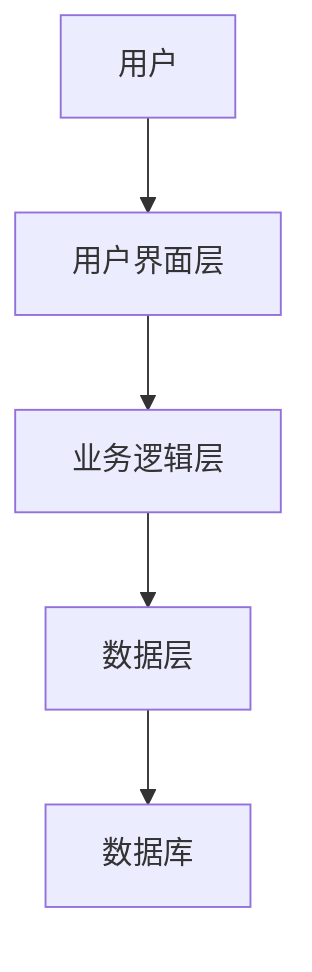

                 


# 股市估值高低对企业研发方向选择的影响

> **关键词**：股市估值、企业研发、研发方向、高估值、低估值、资本市场、研发策略  
> **摘要**：本文探讨了股市估值的高低对企业研发方向选择的影响，通过分析股市估值的基本概念、企业研发方向的分类与选择标准，以及股市估值与研发方向之间的关系，结合经典案例分析和系统架构设计，为企业制定研发战略提供了理论支持和实践指导。文章最后还提出了算法模型和数学公式，用于量化分析，并通过项目实战和最佳实践总结了相关经验。

---

## 第一部分：股市估值的基础知识

### 第1章：股市估值的基本概念

#### 1.1 什么是股市估值

股市估值是通过对企业的财务数据、行业地位、市场前景等因素进行分析，来评估其股票的内在价值和市场价格的过程。常见的估值指标包括市盈率（P/E）、市净率（P/B）、股息率等。

- **市盈率（P/E）**：市盈率 = 股价 / 每股收益。高市盈率意味着市场对公司未来盈利的高预期，而低市盈率可能意味着被低估或市场对其前景悲观。
- **市净率（P/B）**：市净率 = 股价 / 每股净资产。主要用于评估资产密集型企业的价值。

#### 1.2 股市估值的影响因素

股市估值受到多种因素的影响，包括宏观经济环境、行业状况、公司基本面等。

- **经济环境**：整体经济状况、利率水平、通货膨胀率等都会影响股市估值。
- **行业状况**：行业的周期性、竞争程度、政策法规等也会影响估值。
- **公司基本面**：收入、利润、资产负债情况、管理团队等是决定公司估值的核心因素。

#### 1.3 股市估值对企业战略的影响

股市估值不仅反映了市场的价格，也对企业战略决策产生重要影响。高估值和低估值环境下的企业行为存在显著差异。

- **高估值环境**：市场对公司未来增长预期较高，企业可能倾向于通过并购、股权投资等方式进行扩张。
- **低估值环境**：市场对公司前景较为悲观，企业可能更加注重成本控制和内部优化。

---

### 第2章：企业研发方向的选择

#### 2.1 研发方向的分类

企业研发方向可以分为技术驱动型和市场驱动型两类。

- **技术驱动型研发**：以技术创新为核心，注重研发投入，目标是开发新技术或产品。
- **市场驱动型研发**：以市场需求为导向，注重研发成果的商业化，目标是满足客户的具体需求。

#### 2.2 研发方向的选择标准

企业在选择研发方向时，需要综合考虑市场需求、技术可行性、财务可行性等因素。

- **市场需求评估**：通过市场调研和数据分析，确定研发方向是否符合市场需求。
- **技术可行性分析**：评估技术的成熟度、研发难度和所需资源。
- **财务可行性分析**：预测研发项目的投资回报率和风险。

---

## 第二部分：股市估值与研发方向的关系

### 第3章：高估值环境下的研发方向选择

#### 3.1 高估值环境的特点

在高估值环境下，企业的市场关注度较高，投资者对公司的未来增长有较高的期望。这种环境下，企业通常面临更大的压力，需要通过持续的创新来维持高估值。

- **投资者预期较高**：市场对公司未来盈利的高预期可能促使企业加大研发投入，以满足市场对高增长的需求。
- **市场竞争激烈**：高估值往往伴随着行业的高竞争，企业需要在技术研发上不断创新，以保持竞争优势。

#### 3.2 高估值环境下的研发策略

在高估值环境下，企业通常会采取以下研发策略：

- **短期收益导向**：通过快速推出新产品或服务，满足市场需求，短期内提升业绩。
- **技术创新导向**：加大研发投入，开发新技术或产品，提升企业的核心竞争力。

### 第4章：低估值环境下的研发方向选择

#### 4.1 低估值环境的特点

低估值环境下，市场对企业的前景较为悲观，投资者对公司未来增长的预期较低。这种环境下，企业通常会调整研发策略，注重内部优化和成本控制。

- **市场关注度低**：低估值环境下，企业的关注度较低，市场对新产品或技术的反应可能较为冷淡。
- **竞争压力较小**：低估值可能意味着行业竞争压力较小，企业可以更灵活地调整研发方向。

#### 4.2 低估值环境下的研发策略

在低估值环境下，企业通常会采取以下研发策略：

- **长期技术积累**：通过技术研发储备核心竞争力，为未来的市场复苏做准备。
- **成本控制导向**：优化研发流程，降低研发成本，提高效率。

---

## 第三部分：影响机制与案例分析

### 第5章：影响机制分析

#### 5.1 股市估值与研发方向的相互作用

股市估值与研发方向之间存在双向影响。高估值环境可能推动企业加大研发投入，而低估值环境则可能促使企业调整研发方向，注重内部优化。

- **高估值推动技术创新**：高估值环境下，企业为了维持高增长，可能需要投入更多资源进行技术研发。
- **低估值促使内部优化**：低估值环境下，企业可能需要通过技术研发来提升效率，降低成本。

#### 5.2 经典案例分析

以某科技公司为例，分析其在高估值和低估值环境下的研发方向选择。

- **高估值案例**：在高估值环境下，该公司加大了对人工智能技术的研发投入，推出了多款创新产品，短期内提升了业绩，股价表现良好。
- **低估值案例**：在低估值环境下，该公司调整了研发策略，优化了内部流程，降低了研发成本，提升了整体效率。

---

## 第四部分：系统架构与算法模型

### 第6章：系统架构设计

#### 6.1 问题场景介绍

为了量化股市估值与研发方向之间的关系，我们需要构建一个分析系统。该系统将通过数据分析和建模，预测不同估值环境下企业的研发方向选择。

#### 6.2 系统功能设计

系统功能包括数据采集、数据分析、模型预测和结果展示。

- **数据采集**：获取企业的财务数据、市场数据等。
- **数据分析**：使用统计方法分析数据。
- **模型预测**：构建回归模型，预测不同估值环境下的研发方向选择。
- **结果展示**：通过图表展示分析结果。

#### 6.3 系统架构设计

系统架构采用分层设计，包括数据层、业务逻辑层和用户界面层。



### 第7章：算法与数学模型

#### 7.1 算法原理

使用多元线性回归模型，分析股市估值与研发方向选择之间的关系。

- **回归模型**：$$ y = \beta_0 + \beta_1x_1 + \beta_2x_2 + \epsilon $$
  - $y$：研发方向选择（虚拟变量，1表示技术驱动型，0表示市场驱动型）。
  - $x_1$：市盈率。
  - $x_2$：市净率。

#### 7.2 Python代码实现

```python
import pandas as pd
import numpy as np
from sklearn.linear_model import LinearRegression

# 数据准备
data = pd.DataFrame({
    'PE': [15, 20, 10, 25, 18],  # 市盈率
    'PB': [2.5, 3.0, 1.5, 4.0, 2.0],  # 市净率
    '研发方向': [1, 1, 0, 1, 0]  # 1表示技术驱动型，0表示市场驱动型
})

# 模型训练
model = LinearRegression()
model.fit(data[['PE', 'PB']], data['研发方向'])

# 预测
new_data = pd.DataFrame({
    'PE': [17],
    'PB': [2.8]
})
predicted = model.predict(new_data)
print(predicted)
```

---

## 第五部分：项目实战与总结

### 第8章：项目实战

#### 8.1 环境安装

安装所需的Python库，如Pandas、NumPy、Scikit-learn等。

#### 8.2 核心代码实现

实现回归模型，预测不同估值环境下的研发方向选择。

#### 8.3 实际案例分析

分析某企业的实际数据，验证模型的准确性。

### 第9章：总结与展望

#### 9.1 总结

本文通过分析股市估值与研发方向之间的关系，结合案例分析和系统架构设计，为企业制定研发战略提供了理论支持和实践指导。

#### 9.2 展望

未来的研究可以进一步探讨更多因素对研发方向选择的影响，如政策变化、行业趋势等。同时，可以尝试引入机器学习算法，提高模型的预测精度。

---

## 作者：AI天才研究院/AI Genius Institute & 禅与计算机程序设计艺术 /Zen And The Art of Computer Programming

---

以上是《股市估值高低对企业研发方向选择的影响》的技术博客文章的大纲和部分内容。希望对您有所帮助！

