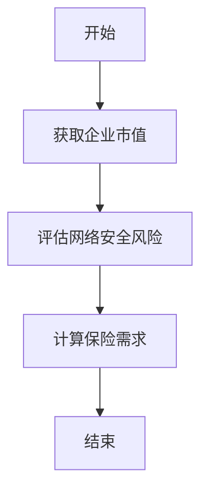
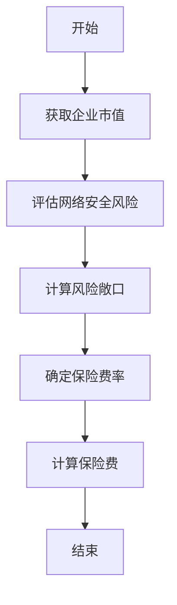

                 


# 文章标题：股市估值高低对企业网络安全保险策略的影响

## 关键词：股市估值、网络安全保险、风险管理、企业价值、精算模型

## 摘要：  
股市估值的高低直接影响企业的市场价值和财务稳定性，而网络安全风险作为企业经营中的重要风险因素，也会影响企业的估值和财务表现。本文通过分析股市估值与网络安全保险之间的关系，探讨企业如何根据股市估值的变化调整网络安全保险策略，以降低风险并优化企业价值。文章结合数学模型、算法原理和实际案例，为企业制定动态网络安全保险策略提供理论支持和实践指导。

---

# 第1章：股市估值与网络安全保险概述

## 1.1 股市估值的基本概念

### 1.1.1 股票估值的核心要素  
股票估值是通过对企业的财务状况、市场地位、行业前景等多方面因素进行分析，确定其股票的合理价格。核心要素包括：  
1. **企业盈利能力**：如净利润率、ROE（净资产收益率）等。  
2. **成长性**：企业的收入增长率、市场份额扩展能力等。  
3. **行业环境**：行业的周期性、竞争格局、政策环境等。  
4. **财务健康状况**：资产负债率、现金流状况等。  

### 1.1.2 股市估值与企业价值的关系  
股票的市场估值是企业价值的体现，高估值意味着市场对企业前景的看好，而低估值则可能反映市场对企业风险的担忧。  

### 1.1.3 股市波动对企业经营的影响  
股市波动会直接影响企业的市值，进而影响企业的融资能力、投资者信心和管理层决策。  

## 1.2 网络安全保险的基本原理

### 1.2.1 网络安全保险的定义与分类  
网络安全保险是一种为企业或个人提供网络安全风险保障的保险产品，主要覆盖因网络攻击、数据泄露等造成的经济损失。根据保障范围，可分为：  
1. **网络安全责任险**：覆盖因网络安全事件对企业造成的第三者损失。  
2. **网络安全损失险**：覆盖因网络安全事件直接造成的经济损失。  

### 1.2.2 网络安全保险的覆盖范围  
包括：数据泄露赔偿、网络勒索赎金、业务中断损失、声誉损失等。  

### 1.2.3 网络安全保险的市场需求  
随着数字化转型的推进，网络安全风险日益增加，企业对网络安全保险的需求也在快速增长。  

## 1.3 股市估值与网络安全保险的关联性

### 1.3.1 股市估值对企业风险管理的影响  
高估值企业通常面临更高的市场期待，可能在网络安全投入上更加谨慎，而低估值企业可能因资金紧张而忽视网络安全风险。  

### 1.3.2 网络安全风险对企业估值的潜在影响  
网络安全事件可能导致企业市值大幅下跌，从而影响股市估值。  

### 1.3.3 企业如何通过网络安全保险应对股市波动  
通过购买网络安全保险，企业可以将部分风险转移给保险公司，从而降低股市波动对企业估值的影响。  

## 1.4 本章小结  
本章介绍了股市估值和网络安全保险的基本概念，并分析了两者之间的关联性，为后续的深入分析奠定了基础。

---

# 第2章：股市估值对企业网络安全风险的影响

## 2.1 股市估值与企业财务风险的关系

### 2.1.1 股票价格波动对企业财务健康的影响  
股市波动可能导致企业市值下降，进而影响企业的融资能力和投资者信心。  

### 2.1.2 股市估值对企业网络安全预算的潜在影响  
高估值企业可能更倾向于投入更多资源应对网络安全风险，而低估值企业可能在预算上更加紧张。  

## 2.2 网络安全风险对企业估值的具体影响

### 2.2.1 网络攻击对企业财务损失的量化分析  
网络安全事件可能导致企业直接或间接损失，包括罚款、赔偿、修复成本等。  

### 2.2.2 网络安全事件对企业市值的短期与长期影响  
短期内，网络安全事件可能导致企业股价下跌；长期来看，可能影响企业的市场信任度和竞争优势。  

## 2.3 股市估值对企业网络安全保险策略的间接影响

### 2.3.1 股市波动如何影响企业对网络安全保险的需求  
股市波动可能促使企业更积极地购买网络安全保险，以降低风险敞口。  

### 2.3.2 网络安全保险在企业风险管理中的角色  
网络安全保险可以作为企业应对股市波动的一种风险管理工具，帮助企业稳定市值。  

## 2.4 本章小结  
本章分析了股市估值如何通过影响企业财务风险和网络安全风险，间接影响企业的网络安全保险策略。

---

# 第3章：网络安全保险的数学模型与算法原理

## 3.1 股市估值与网络安全风险的量化模型

### 3.1.1 股票市值与网络安全风险的关联性分析  
通过统计分析和回归模型，量化股票市值与网络安全风险之间的关系。  

### 3.1.2 网络安全风险的量化公式  
$$ \text{网络安全风险} = \frac{\text{潜在损失}}{\text{防护能力}} $$  

### 3.1.3 算法流程图  


## 3.2 网络安全保险的精算模型

### 3.2.1 精算模型的核心公式  
$$ \text{保险费} = \text{风险敞口} \times \text{保险费率} $$  

### 3.2.2 算法流程图  


---

# 第4章：系统架构与动态调整模型

## 4.1 系统架构设计

### 4.1.1 系统功能设计  
1. 数据采集模块：获取企业市值和网络安全风险数据。  
2. 风险评估模块：量化网络安全风险。  
3. 保险策略模块：动态调整网络安全保险策略。  

### 4.1.2 系统架构图  


---

# 第5章：项目实战与案例分析

## 5.1 项目实战

### 5.1.1 环境配置  
1. 数据来源：企业市值数据和网络安全风险数据。  
2. 工具：Python、数据分析库（如Pandas）、可视化工具（如Matplotlib）。  

### 5.1.2 核心代码实现  
```python
import pandas as pd
import matplotlib.pyplot as plt

# 数据加载
data = pd.read_csv('enterprise.csv')

# 数据分析
correlation = data['市值'].corr(data['网络安全风险'])
print(f"市值与网络安全风险的相关性为：{correlation}")

# 可视化
plt.scatter(data['市值'], data['网络安全风险'])
plt.xlabel('市值')
plt.ylabel('网络安全风险')
plt.title('市值与网络安全风险的关系')
plt.show()
```

### 5.1.3 案例分析  
以某科技公司为例，分析其在不同市值情况下如何调整网络安全保险策略。  

---

# 第6章：总结与展望

## 6.1 本章总结  
本文分析了股市估值与网络安全保险的关系，提出了基于数学模型和算法的动态调整策略，并通过案例分析验证了模型的有效性。  

## 6.2 未来展望  
未来研究可以进一步结合人工智能技术，优化网络安全保险的精算模型，实现更精准的风险评估和保费定价。  

---

# 作者：AI天才研究院/AI Genius Institute & 禅与计算机程序设计艺术 /Zen And The Art of Computer Programming

