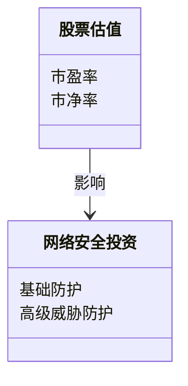

                 


# 股市估值高低对企业网络安全投资的影响

> 关键词：股市估值，网络安全投资，企业风险管理，股票价格波动，网络安全预算

> 摘要：本文探讨了股市估值与企业网络安全投资之间的关系，分析了股市估值如何影响企业的网络安全投资决策。通过量化分析和实际案例，本文提出了影响企业网络安全投资的关键因素，并为企业优化网络安全投资策略提供了建议。

---

## 第1章：背景与概述

### 1.1 股市估值的基本概念

股市估值是投资者评估企业价值的重要手段，常用的指标包括市盈率（P/E）、市净率（P/B）、市销率（P/S）和股息率等。这些指标反映了市场对企业未来盈利能力的预期和风险偏好。例如，市盈率=$\frac{\text{股价}}{\text{每股净利润}}$，用于衡量市场对企业盈利能力的估值。

### 1.2 企业网络安全投资的现状

企业网络安全投资涉及技术、人员和培训等多个方面。随着网络安全威胁的增加，企业需要投入更多的资源来保护数据资产。例如，一项调查显示，2022年全球企业在网络安全上的支出超过1500亿美元，预计未来几年将持续增长。

### 1.3 股市估值与网络安全投资的关系

股市估值反映了市场对企业整体价值的评估，而网络安全投资是企业风险管理的重要组成部分。当企业面临网络安全风险时，其股价可能会波动，进而影响企业的安全预算。例如，发生重大数据泄露事件后，股价下跌可能导致企业减少其他领域的支出，但必须优先保障网络安全投资。

### 1.4 研究意义

研究股市估值与网络安全投资的关系，有助于企业更好地制定投资策略，降低风险，同时也能帮助投资者更全面地评估企业的价值。

---

## 第2章：核心概念与联系

### 2.1 股市估值的核心模型

#### 2.1.1 常见股票估值模型

- **市盈率模型**：通过比较企业的市盈率与行业平均水平，评估其股价是否合理。
- **现金流折现模型（DCF）**：通过预测企业未来现金流，计算其内在价值。
- **市净率模型**：适用于资产密集型企业，计算股价与每股净资产的比率。

#### 2.1.2 股票估值对网络安全投资的影响

市场对企业网络安全的预期会影响股价，进而影响企业的预算分配。例如，投资者认为高网络安全投入的企业风险较低，可能会给予更高的估值。

### 2.2 网络安全投资的核心要素

#### 2.2.1 网络安全投资的驱动因素

- **合规要求**：企业需遵守数据保护法规，如GDPR，这增加了安全投入。
- **数据价值**：拥有重要数据的企业需加大安全投入。
- **企业规模**：大型企业通常有更高的安全预算。

#### 2.2.2 网络安全投资的层次

- **基础防护**：如防火墙和病毒检测。
- **高级威胁防护**：如入侵检测系统和安全监控。
- **员工培训**：提高安全意识，减少人为错误。

### 2.3 股市估值与网络安全投资的关联性分析

#### 2.3.1 股票估值对企业安全投入的影响

当企业股价较高时，可能有更多预算用于安全，因为投资者要求更高的风险管理。反之，股价低的企业可能在安全投入上更为谨慎。

#### 2.3.2 安全投入对股价的影响

有效的安全投入可以降低企业的风险敞口，提升投资者信心，从而提高股价。例如，一家成功防御网络攻击的企业可能获得更高的估值。

### 2.4 核心概念对比分析

#### 2.4.1 股票估值与网络安全投资的属性对比

| 属性 | 股票估值 | 网络安全投资 |
|------|----------|----------------|
| 计量方式 | 相对估值法、绝对估值法 | 成本法、收益法 |
| 时间维度 | 短期波动、长期趋势 | 一次性投入、持续性支出 |
| 影响因素 | 财务指标、市场情绪 | 技术风险、合规要求 |

---

## 第3章：算法原理与数学模型

### 3.1 股市估值与网络安全投资的量化分析

#### 3.1.1 影响模型的建立

我们可以建立一个简单的线性回归模型，将企业的网络安全投入（E）与股票估值（V）相关联。模型为：

$$E = k \times V + b$$

其中，$k$ 是回归系数，$b$ 是截距。通过统计分析，我们可以确定$k$的值，从而量化股市估值对安全投入的影响。

#### 3.1.2 数据分析与验证

通过收集企业的网络安全投入和对应的股票估值数据，我们可以使用回归分析来验证模型的有效性。例如，使用R²值来衡量模型的拟合优度。

#### 3.1.3 实例分析

假设某企业网络安全投入与股票估值呈正相关，回归分析显示$k=0.05$，$b=10$。则当股票估值为100时，安全投入为$0.05 \times 100 + 10 = 15$。

---

## 第4章：系统分析与架构设计

### 4.1 系统功能设计

#### 4.1.1 领域模型

使用Mermaid绘制领域模型：



#### 4.1.2 系统架构设计

使用Mermaid绘制系统架构图：

```mermaid
container 网络安全投资系统 {
    class 股票估值模块 {
        市场数据接口
        估值计算
    }
    class 投资决策模块 {
        预算分配
        风险评估
    }
}
```

---

## 第5章：项目实战

### 5.1 案例分析

#### 5.1.1 环境安装

安装必要的工具和数据集，如Python、Pandas、Scikit-learn等。

#### 5.1.2 数据收集与处理

收集企业的股票估值和网络安全投入数据，清洗和预处理。

#### 5.1.3 模型实现

编写Python代码，使用回归分析建立模型：

```python
import pandas as pd
import numpy as np
from sklearn.linear_model import LinearRegression

# 假设data是包含股票估值和网络安全投入的数据框
data = pd.DataFrame({
    'V': [100, 120, 90, 110],
    'E': [15, 18, 12, 14]
})

model = LinearRegression()
model.fit(data[['V']], data['E'])

print('回归系数k:', model.coef_[0])
print('截距b:', model.intercept_)
```

#### 5.1.4 模型验证

计算R²值，评估模型的拟合优度。

#### 5.1.5 结果分析

解释模型结果，为企业优化安全投资策略提供建议。

---

## 第6章：总结与展望

### 6.1 研究总结

本文分析了股市估值与网络安全投资的关系，提出了量化模型，并通过案例验证了模型的有效性。

### 6.2 未来展望

未来的研究可以探索动态模型，考虑更多影响因素，如行业竞争和宏观经济指标。同时，可以开发基于机器学习的安全投资预测工具。

### 6.3 最佳实践 Tips

- 定期评估网络安全投资与股票估值的关系。
- 根据市场变化调整安全预算。
- 结合企业自身情况优化投资策略。

---

## 作者

作者：AI天才研究院/AI Genius Institute & 禅与计算机程序设计艺术 /Zen And The Art of Computer Programming

---

通过以上分析，我们详细探讨了股市估值如何影响企业网络安全投资，为企业制定优化策略提供了理论依据和实践指导。

