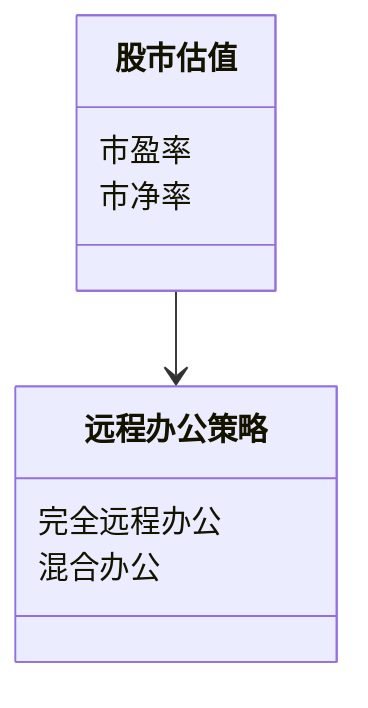
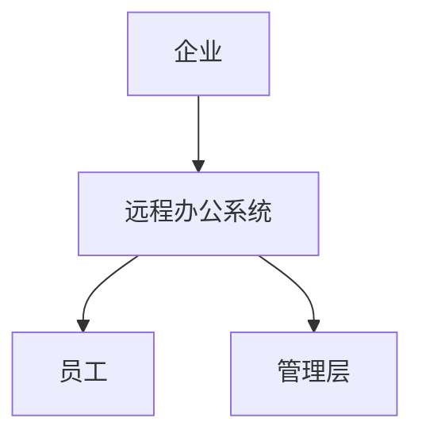

                 


# 股市估值高低对企业远程办公策略的影响

## 关键词：股市估值、企业远程办公策略、影响、数学模型、案例分析

## 摘要：  
本文探讨了股市估值的高低如何影响企业远程办公策略。通过分析股市估值的核心指标和远程办公模式的分类，结合数学模型和实际案例，揭示了股市估值波动对企业远程办公策略的调整和优化的影响，为企业在不同市场环境下制定有效的远程办公策略提供了理论依据和实践指导。

---

## 第一部分：背景介绍

### 第1章：股市估值与远程办公策略的背景

#### 1.1 股市估值的基本概念  
股市估值是衡量企业价值的重要工具，常见的指标包括市盈率（P/E）和市净率（P/B）。市盈率反映了企业的盈利能力，而市净率则衡量了资产的性价比。  

#### 1.2 远程办公的兴起与发展  
远程办公是指员工无需到办公室，通过网络技术完成工作任务的模式。近年来，随着技术的进步和企业对灵活性需求的增加，远程办公逐渐普及。  

#### 1.3 股市估值与远程办公策略的关联性  
股市估值的变化直接影响企业的市场价值和投资者信心，而远程办公策略则影响企业的运营成本和效率。两者的关联性主要体现在企业如何通过调整远程办公策略来应对股市估值的变化。

---

## 第二部分：核心概念与联系

### 第2章：股市估值的核心概念与分析  

#### 2.1 股市估值的计算方法  
- **市盈率（P/E）**：公式为市盈率 = 股价 / 每股收益（EPS）。  
- **市净率（P/B）**：公式为市净率 = 股价 / 每股净资产（BPS）。  

#### 2.2 远程办公模式的分类与影响  
- **完全远程办公**：所有员工都在家中或其他地点工作，优点是降低运营成本，缺点是管理难度增加。  
- **混合办公**：部分员工远程办公，部分在办公室工作，兼顾灵活性和团队协作。  

### 第3章：股市估值与远程办公策略的关联分析  

#### 3.1 股市估值波动对企业决策的影响  
股市估值的波动可能导致企业调整成本结构。例如，当股市估值下降时，企业可能通过优化远程办公技术来降低运营成本。  

#### 3.2 远程办公策略对股市估值的反向影响  
远程办公可以提高员工效率，降低企业成本，从而提升企业的盈利能力，进而提高股市估值。  

---

## 第三部分：算法原理与数学模型

### 第4章：股市估值与远程办公策略的量化分析  

#### 4.1 股市估值变化的预测模型  
使用回归分析模型预测股市估值的变化。  
公式：  
$$ \hat{y} = a + bx $$  
其中，$y$ 是预测的股市估值，$x$ 是远程办公策略的实施程度，$a$ 和 $b$ 是回归系数。  

#### 4.2 远程办公效率的评估模型  
使用KPI评估远程办公效率，公式：  
$$ \text{效率指数} = \frac{\text{完成任务数量}}{\text{时间}} $$  

### 第5章：数学模型与公式解析  

#### 5.1 股市估值与远程办公成本的数学模型  
$$ \text{总成本} = \text{固定成本} + (\text{远程办公比例} \times \text{可变成本}) $$  

#### 5.2 股市估值与远程办公效率的回归分析  
$$ \text{回归方程} = a + b \times \text{远程办公比例} $$  

---

## 第四部分：系统分析与架构设计

### 第6章：系统分析与架构设计  

#### 6.1 问题场景介绍  
企业面临股市估值波动，需调整远程办公策略以优化成本和效率。  

#### 6.2 领域模型类图  


#### 6.3 系统架构设计  


---

## 第五部分：项目实战

### 第7章：项目实战  

#### 7.1 环境安装  
需要安装数据分析工具（如Python、Pandas、Matplotlib）和远程办公软件（如Zoom、Slack）。  

#### 7.2 核心实现代码  
```python
import pandas as pd
import matplotlib.pyplot as plt

# 示例数据
data = {
    '远程办公比例': [0.2, 0.3, 0.4, 0.5, 0.6],
    '股市估值': [80, 85, 90, 95, 100]
}
df = pd.DataFrame(data)

# 绘制散点图
plt.scatter(df['远程办公比例'], df['股市估值'])
plt.xlabel('远程办公比例')
plt.ylabel('股市估值')
plt.title('远程办公比例与股市估值关系')
plt.show()
```

#### 7.3 案例分析  
以某科技公司为例，分析其在股市估值下降时如何调整远程办公策略，降低运营成本并提高效率。  

---

## 第六部分：总结与展望

### 第8章：总结与展望  

#### 8.1 最佳实践 tips  
- 定期评估远程办公策略的效果。  
- 根据股市估值变化动态调整策略。  

#### 8.2 项目小结  
本文通过理论分析和案例研究，揭示了股市估值与远程办公策略的相互影响，为企业制定灵活的远程办公策略提供了参考。  

#### 8.3 注意事项  
- 数据分析需结合具体行业特点。  
- 需考虑员工满意度对效率的影响。  

#### 8.4 拓展阅读  
建议阅读相关文献，深入研究远程办公对组织文化的长期影响。  

---

## 作者：  
AI天才研究院/AI Genius Institute & 禅与计算机程序设计艺术 /Zen And The Art of Computer Programming

