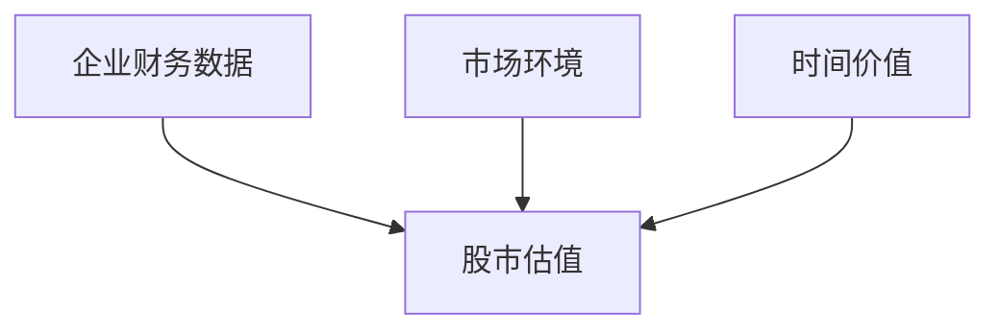
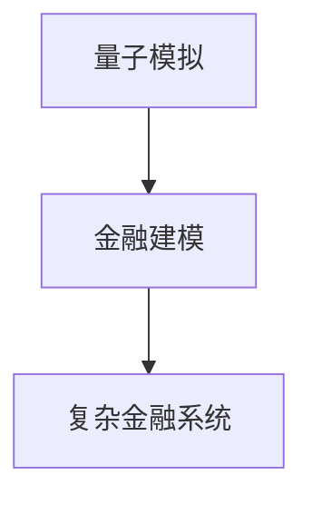
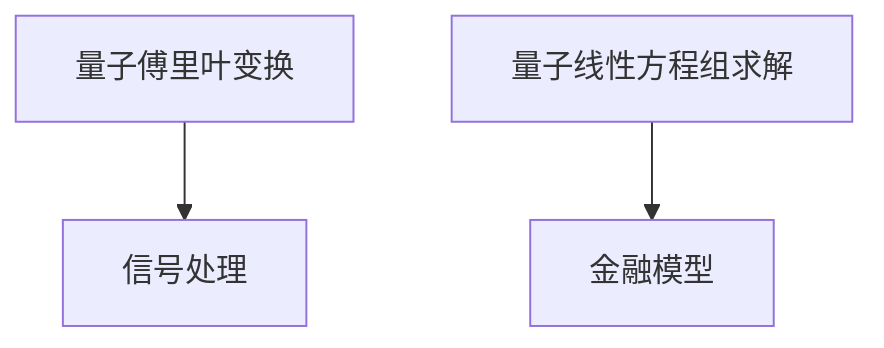
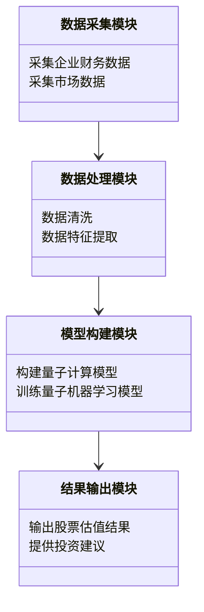
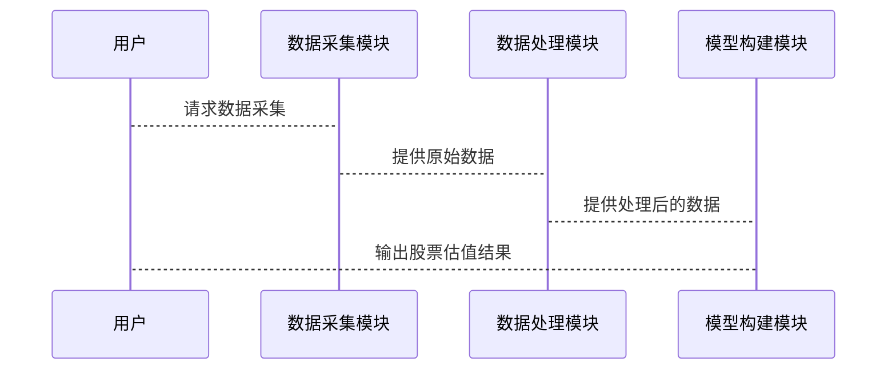

                 


```markdown
# 股市估值高低对企业量子计算投资策略的影响

> 关键词：股市估值，量子计算，投资策略，企业投资，量子金融

> 摘要：本文探讨了股市估值的高低对企业量子计算投资策略的影响。通过分析量子计算在金融建模、投资决策和风险评估中的应用，结合数学模型和实际案例，详细阐述了量子计算如何优化企业投资策略。文章从背景介绍、算法原理、系统架构设计到项目实战，全面解析了量子计算在股市估值中的潜力与挑战。

---

# 第1章: 股市估值与量子计算的背景介绍

## 1.1 股市估值的基本概念

### 1.1.1 股市估值的定义与核心要素

股市估值是指通过对企业财务数据、市场环境和行业趋势等多方面因素进行分析，估算企业股票的内在价值。核心要素包括：

- **企业财务数据**：收入、利润、资产、负债等。
- **市场环境**：宏观经济指标、行业竞争状况。
- **时间价值**：现金流的时间价值与贴现率。



### 1.1.2 股市估值的主要方法

主要方法包括：

- **相对估值法**：市盈率、市净率等。
- **绝对估值法**：DCF（Discounted Cash Flow）模型。
- **指数估值法**：基于市场指数的估值方法。

### 1.1.3 股市估值与企业价值的关系

股市估值是企业价值的体现，但受市场情绪和市场效率的影响，可能存在溢价或折价。

---

## 1.2 量子计算的基本概念

### 1.2.1 量子计算的定义与原理

量子计算利用量子叠加和量子纠缠的特性，通过量子位（qubit）进行并行计算，具有处理复杂问题的能力。

### 1.2.2 量子计算的核心技术与挑战

核心技术包括量子门、量子电路和量子算法。主要挑战是量子 decoherence 和误差控制。

### 1.2.3 量子计算在金融领域的应用潜力

量子计算在金融建模、投资组合优化和风险管理中的潜力巨大。

---

## 1.3 股市估值与量子计算的关联性

### 1.3.1 股市估值的复杂性与不确定性

股市估值受多因素影响，传统方法难以捕捉所有变量。

### 1.3.2 量子计算在处理复杂金融问题中的优势

量子计算可以处理多维问题，适合复杂金融模型的求解。

### 1.3.3 量子计算对股市估值的潜在影响

通过量子算法优化估值模型，提高计算效率和准确性。

---

# 第2章: 量子计算在金融投资中的核心应用

## 2.1 量子计算在投资策略中的应用

### 2.1.1 量子模拟在金融建模中的应用

量子模拟可以高效求解复杂金融系统的动态。



### 2.1.2 量子机器学习在投资决策中的应用

量子机器学习可以提高金融数据的分类和预测能力。

### 2.1.3 量子计算在风险评估中的优势

量子计算可以更准确地评估投资组合的风险。

---

## 2.2 量子计算在股票估值中的具体实现

### 2.2.1 量子算法在股票估值中的应用

- **量子傅里叶变换**：用于信号处理和模式识别。
- **量子线性方程组求解**：用于求解复杂金融模型。



### 2.2.2 量子计算在市场预测中的潜力

通过量子计算提高市场预测的准确性和效率。

### 2.2.3 量子计算在投资组合优化中的应用

量子计算可以优化投资组合，降低风险。

---

## 2.3 量子计算与传统金融模型的对比分析

### 2.3.1 传统金融模型的局限性

- 处理高维问题能力有限。
- 计算复杂度高。

### 2.3.2 量子计算模型的优势与创新

- 处理复杂问题能力强。
- 计算效率高。

### 2.3.3 量子计算与传统金融模型的结合点

通过量子计算优化传统金融模型，提高估值精度。

---

# 第3章: 股市估值与量子计算的数学模型分析

## 3.1 股市估值的数学模型

### 3.1.1 股票估值的基本公式

$$ V = \frac{CF}{r} $$

其中，\( V \) 为股票价值，\( CF \) 为未来现金流，\( r \) 为贴现率。

### 3.1.2 股票估值的多因素模型

$$ V = \alpha + \beta_1 X_1 + \beta_2 X_2 + \ldots + \beta_n X_n $$

### 3.1.3 股票估值的动态调整模型

$$ V_{t+1} = V_t + \Delta V_t $$

---

## 3.2 量子计算中的核心算法

### 3.2.1 量子傅里叶变换

量子傅里叶变换用于信号处理和模式识别，其数学表达式为：

$$ QFT: |x\rangle \rightarrow \frac{1}{\sqrt{2^n}} \sum_{y=0}^{2^n-1} e^{2\pi i xy/2^n} |y\rangle $$

### 3.2.2 量子线性方程组求解

量子线性方程组求解算法用于解决 \( A|x\rangle = |b\rangle \) 问题，复杂度为 \( O(n) \)。

### 3.2.3 量子模拟算法

量子模拟算法用于模拟量子系统，其数学模型包括哈密顿量和量子态的演化。

---

## 3.3 股市估值与量子计算的结合模型

### 3.3.1 量子计算在股票估值中的数学框架

通过量子计算优化传统估值模型，提高计算效率。

### 3.3.2 量子算法在股票估值中的应用实例

利用量子算法求解复杂金融模型，优化投资决策。

### 3.3.3 股票估值的量子计算优化模型

结合量子计算和传统金融模型，构建高效的估值系统。

---

# 第4章: 量子计算投资策略的系统架构设计

## 4.1 系统功能设计

### 4.1.1 数据采集模块

- 采集企业财务数据和市场数据。
- 数据格式：结构化和非结构化数据。

### 4.1.2 数据处理模块

- 数据清洗和预处理。
- 数据特征提取。

### 4.1.3 模型构建模块

- 构建量子计算模型。
- 训练量子机器学习模型。

### 4.1.4 结果输出模块

- 输出股票估值结果。
- 提供投资建议。

---

## 4.2 系统架构设计

### 4.2.1 领域模型设计



---

## 4.3 系统接口设计

- 数据接口：与数据源对接。
- 模型接口：与量子计算平台对接。
- 用户接口：提供用户交互界面。

---

## 4.4 系统交互设计



---

# 第5章: 项目实战

## 5.1 环境安装

- 安装量子计算开发工具：Qiskit、Cirq。
- 安装数据处理工具：Pandas、NumPy。

## 5.2 系统核心实现源代码

### 5.2.1 量子计算模型实现

```python
from qiskit import QuantumCircuit, execute, Aer

def quantum_model(n_qubits):
    qc = QuantumCircuit(n_qubits)
    qc.h(range(n_qubits))  # 应用哈达玛门
    qc.measure_all()
    return qc
```

### 5.2.2 数据处理实现

```python
import pandas as pd

def process_data(data):
    df = pd.DataFrame(data)
    df['normalized'] = (df - df.min()) / (df.max() - df.min())
    return df
```

## 5.3 代码应用解读与分析

- 量子模型实现：构建量子电路，应用于股票估值。
- 数据处理实现：对数据进行标准化处理，便于模型输入。

## 5.4 实际案例分析

通过具体案例分析，展示量子计算在股市估值中的应用效果。

---

# 第6章: 总结与展望

## 6.1 量子计算在股市估值中的潜力

量子计算可以提高股市估值的准确性和效率。

## 6.2 当前挑战与未来方向

- 技术挑战：量子计算的硬件限制。
- 数据挑战：金融数据的质量和多样性。

## 6.3 未来研究方向

- 优化量子算法。
- 提升量子计算的稳定性。

---

# 作者：AI天才研究院/AI Genius Institute & 禅与计算机程序设计艺术 /Zen And The Art of Computer Programming
```

