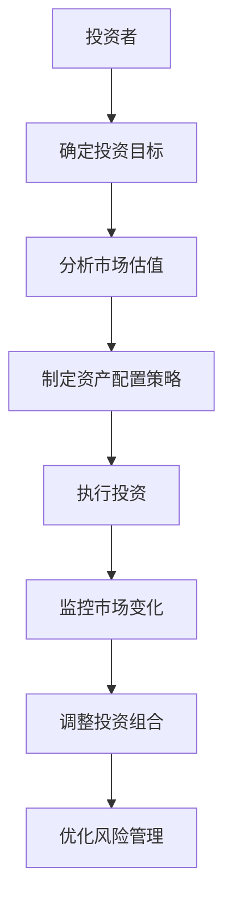
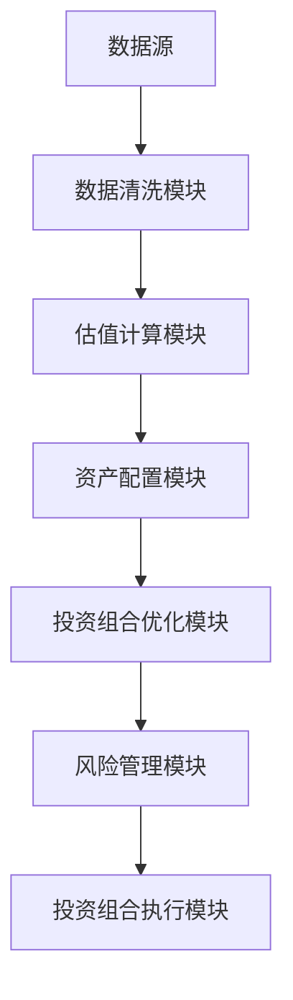

                 


# 股市估值高低对国际投资组合配置的影响

> 关键词：股市估值、投资组合配置、资产配置、市场估值、投资策略

> 摘要：本文深入探讨股市估值高低对国际投资组合配置的影响，分析了估值指标对投资决策的关键作用，提出了基于估值的资产配置优化策略，结合实际案例展示了如何在不同市场环境下调整投资组合以实现风险与收益的最优平衡。

---

## 第1章: 股市估值的基本概念与影响因素

### 1.1 股市估值的定义与核心要素

#### 1.1.1 股市估值的基本定义
股市估值是通过对股票市场价格与公司基本面数据的分析，评估市场整体或个股的价值高低。它反映了市场参与者对资产未来收益的预期，是投资决策的重要依据。

#### 1.1.2 核心要素：市盈率、市净率、股息率
- **市盈率（P/E）**：衡量股价与每股收益的比率，用于评估股票的估值水平。
- **市净率（P/B）**：股价与每股净资产的比率，适用于评估资产密集型行业的公司。
- **股息率（Dividend Yield）**：股息与股价的比率，反映股票的分红能力。

#### 1.1.3 估值与市场情绪的关系
市场情绪影响股市估值，当市场乐观时，估值可能偏高；当市场悲观时，估值可能偏低。

### 1.2 股市估值的影响因素

#### 1.2.1 宏观经济因素：GDP、利率、通货膨胀
- **GDP增长**：影响企业的盈利能力和扩张能力。
- **利率水平**：低利率环境可能推高股市估值，反之则可能压低估值。
- **通货膨胀**：高通胀可能导致企业成本上升，影响盈利能力。

#### 1.2.2 行业因素：行业周期与竞争格局
- **行业周期**：不同行业处于不同生命周期阶段，影响其估值水平。
- **竞争格局**：行业内的竞争程度影响公司的盈利能力，进而影响估值。

#### 1.2.3 公司基本面：盈利能力、财务状况
- **盈利能力**：高盈利公司通常具有较高的估值。
- **财务状况**：健康的财务状况（如低负债率）通常支持较高的估值。

---

## 第2章: 国际投资组合配置的概述

### 2.1 投资组合配置的基本概念

#### 2.1.1 投资组合的定义与目标
投资组合是将资金分配到不同资产或市场以分散风险并实现收益最大化。

#### 2.1.2 资产配置的核心原则
- **分散化**：通过投资不同资产或市场降低风险。
- **风险与收益平衡**：根据风险承受能力调整资产配置。

#### 2.1.3 国际化配置的优势与挑战
- **优势**：通过国际化配置降低市场风险，捕捉全球经济增长机会。
- **挑战**：不同市场的流动性、政策风险和汇率波动增加复杂性。

### 2.2 国际投资组合的构成要素

#### 2.2.1 不同市场的风险与收益特征
- **发达市场**：波动较小，但增长潜力有限。
- **新兴市场**：波动较大，但增长潜力较高。

#### 2.2.2 跨市场资产的相关性分析
- **低相关性**：不同市场间的资产相关性较低，有助于分散风险。
- **高相关性**：同一经济周期下的市场相关性较高，风险分散效果有限。

#### 2.2.3 货币与汇率对投资组合的影响
- **汇率波动**：汇率波动直接影响以本币计价的投资组合价值。
- **货币风险**：不同货币的波动可能增加投资组合的不确定性。

---

## 第3章: 股市估值与投资组合配置的联系

### 3.1 估值高低对投资组合风险的影响

#### 3.1.1 高估市场的风险特征
- **高估市场**：资产价格高于合理估值，风险较高，可能导致投资组合波动较大。
- **高估市场的表现**：在高估市场中，投资组合可能面临回调压力。

#### 3.1.2 低估市场的收益潜力
- **低估市场**：资产价格低于合理估值，具有较高的潜在收益。
- **低估市场的表现**：在低估市场中，投资组合可能实现超额收益。

#### 3.1.3 估值与资产价格波动的关系
- **估值偏离度**：估值偏离度越大，资产价格波动的可能性越高。

### 3.2 估值周期与投资策略的调整

#### 3.2.1 估值周期的识别方法
- **历史估值比较**：通过历史数据判断当前估值是否处于高估或低估。
- **多指标分析**：结合市盈率、市净率等指标综合判断。

#### 3.2.2 不同估值阶段的投资策略
- **高估阶段**：减少高估值资产配置，增加现金或低估值资产配置。
- **低估阶段**：增加高潜力低估值资产配置。

#### 3.2.3 估值波动对投资组合再平衡的影响
- **再平衡策略**：定期根据估值变化调整投资组合，保持风险收益的平衡。

---

## 第4章: 股市估值与投资组合配置的核心概念与联系

### 4.1 股市估值的核心概念

#### 4.1.1 估值的多维度分析
- **相对估值**：与行业或市场平均水平的比较。
- **绝对估值**：基于现金流折现等方法的独立评估。

#### 4.1.2 相对估值与绝对估值的对比
| 对比维度 | 相对估值 | 绝对估值 |
|----------|----------|----------|
| 适用场景 | 市场比较   | 独立评估   |
| 精度     | 较低      | 较高      |
| 方法     | 市盈率、市净率 | 现金流折现法 |

#### 4.1.3 市场情绪对估值的影响
市场情绪影响投资者对资产的定价，进而影响股市估值。

### 4.2 投资组合配置的核心要素

#### 4.2.1 资产分配的逻辑框架
- **资产类别**：股票、债券、现金等。
- **地域分布**：发达市场与新兴市场。

#### 4.2.2 风险与收益的平衡点
- **风险承受能力**：根据投资者的风险偏好调整资产配置。
- **预期收益**：根据市场估值和资产特性设定收益目标。

#### 4.2.3 跨市场配置的优化策略
- **分散化**：通过配置不同市场的资产降低整体风险。
- **估值导向**：优先配置低估市场的资产。

---

## 第5章: 股市估值与投资组合配置的实体关系图

### 5.1 核心概念的ER实体关系图
```mermaid
er
  actor 投资者
  actor 市场监管机构
  actor 经济环境
  actor 公司基本面
  actor 市场情绪
  actor 资产配置策略
  actor 估值指标
  actor 投资组合表现
  actor 风险管理
  actor 再平衡策略
  actor 汇率波动
```

### 5.2 投资组合配置的流程图


---

## 第6章: 投资组合配置的数学模型与算法

### 6.1 股市估值与投资组合优化模型

#### 6.1.1 均值-方差优化模型
$$\text{目标：} \min_w \sigma^2(w)$$
$$\text{约束：} \sum_i w_i = 1, w_i \geq 0$$
其中，$\sigma^2(w)$为投资组合的波动率，$w_i$为各资产的权重。

#### 6.1.2 基于估值的资产权重调整
根据市场估值调整各资产的权重，优先配置低估市场资产。

### 6.2 算法实现

#### 6.2.1 代码实现
```python
import numpy as np

def calculate_efficient_frontier(returns, cov_matrix, num_portfolios=100):
    # 使用 scipy.optimize 进行优化
    from scipy.optimize import minimize

    n = len(returns)
    returns = np.array(returns)
    cov_matrix = np.array(cov_matrix)

    # 定义优化目标函数
    def objective(w):
        return (w.T @ cov_matrix @ w)[0, 0]

    # 约束条件
    constraints = [{'type': 'eq', 'fun': lambda w: np.sum(w) - 1},
                   {'type': 'ineq', 'fun': lambda w: w[i] >= 0} for i in range(n)]

    # 初始化权重
    w0 = np.array([1.0 / n] * n)

    # 计算有效前沿
    weights = []
    for _ in range(num_portfolios):
        res = minimize(objective, w0, constraints=constraints)
        weights.append(res.x)
        w0 = res.x

    return weights
```

#### 6.2.2 实例分析
假设我们有三个市场，A、B、C，其收益率分别为8%、10%、6%，协方差矩阵如图所示。通过计算，我们发现低估市场的权重应适当增加。

---

## 第7章: 投资组合管理系统架构设计

### 7.1 系统功能设计

#### 7.1.1 数据获取模块
- 从数据库获取市场数据，包括股价、财务指标等。

#### 7.1.2 估值计算模块
- 计算市盈率、市净率等估值指标。

#### 7.1.3 资产配置模块
- 根据估值指标优化投资组合。

### 7.2 系统架构图


---

## 第8章: 项目实战与案例分析

### 8.1 环境安装与数据获取

#### 8.1.1 环境安装
安装Python和相关库，如numpy、pandas、scipy等。

#### 8.1.2 数据获取
从Yahoo Finance获取市场数据，清洗后用于分析。

### 8.2 核心代码实现

#### 8.2.1 估值计算
```python
import pandas as pd

def calculate_valuation_ratios(price, earnings, book_value):
    pe = price / earnings
    pb = price / book_value
    return pe, pb
```

#### 8.2.2 资产配置优化
```python
def optimize_portfolio(pe, pb, target_pe, target_pb):
    # 基于目标估值调整权重
    weights = {}
    weights['Market A'] = (1 / (pe['A'] / target_pe + pb['A'] / target_pb))
    weights['Market B'] = (1 / (pe['B'] / target_pe + pb['B'] / target_pb))
    weights['Market C'] = (1 / (pe['C'] / target_pe + pb['C'] / target_pb))
    return weights
```

### 8.3 实际案例分析

#### 8.3.1 案例背景
假设2023年市场中，美国股市市盈率偏高，而新兴市场市盈率较低。

#### 8.3.2 分析与调整
根据估值模型，增加新兴市场的配置权重，降低发达市场的配置比例。

#### 8.3.3 结果解读
通过调整，投资组合的风险降低，预期收益提高。

---

## 第9章: 总结与最佳实践

### 9.1 总结

#### 9.1.1 核心观点
股市估值高低对国际投资组合配置具有重要影响，应根据估值水平动态调整资产配置。

#### 9.1.2 研究结论
- 低估市场具有较高的配置价值。
- 高估市场需谨慎，避免过度配置。

### 9.2 最佳实践

#### 9.2.1 投资策略
- 定期评估市场估值，动态调整配置。
- 优先配置具有估值优势的资产。

#### 9.2.2 风险管理
- 设定止损点，控制回撤风险。
- 保持适当的现金储备，应对市场波动。

#### 9.2.3 持续学习
- 关注全球经济和市场动态。
- 定期回顾和优化投资策略。

---

## 作者：AI天才研究院/AI Genius Institute & 禅与计算机程序设计艺术 /Zen And The Art of Computer Programming

---

以上是《股市估值高低对国际投资组合配置的影响》的完整目录大纲和详细内容，涵盖了从基础概念到实际应用的各个层面，适合投资者、金融从业者以及对投资组合管理感兴趣的技术人员阅读。

