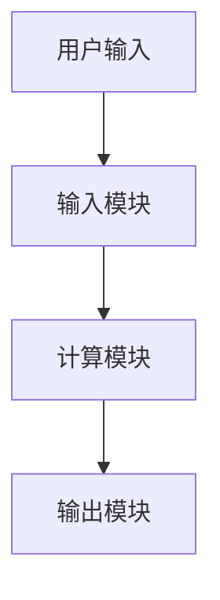
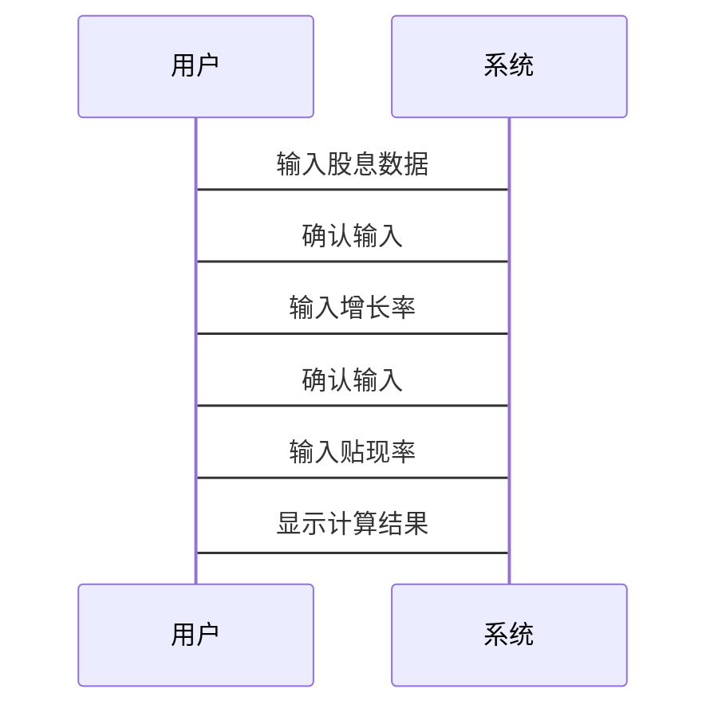

                 


# 股息贴现模型：估值的另一种思路

> 关键词：股息贴现模型, 股票估值, 股息率, 投资分析, 贴现率

> 摘要：股息贴现模型（Dividend Discount Model, DDM）是一种用于评估股票内在价值的重要方法，通过将未来股息的现值贴现，计算出股票的合理价格。本文将从基础概念、数学原理、算法实现、系统架构设计、实际案例分析等多方面深入探讨股息贴现模型的奥秘，为投资者提供一种全新的估值思路。

---

## 引言

在股票投资领域，估值是决定投资决策的关键因素之一。传统的估值方法如市盈率、市净率等虽然广泛应用，但它们往往难以全面反映公司的内在价值。股息贴现模型（Dividend Discount Model, DDM）作为一种基于股息的估值方法，为投资者提供了一种新的视角。本文将系统地介绍股息贴现模型的背景、原理、实现方法及其在实际投资中的应用。

---

## 第1章: 股息贴现模型的背景与概念

### 1.1 股息贴现模型的定义与核心概念

股息贴现模型（DDM）是一种通过将公司未来派发的股息进行贴现，以评估股票当前合理价格的估值方法。其核心假设是：股票的内在价值等于未来所有股息的现值之和。

#### 1.1.1 股息贴现模型的基本定义
- **股息**：公司分配给股东的利润部分，通常以每股形式表示。
- **贴现**：将未来现金流按一定贴现率折算到当前的价值。
- **内在价值**：股票基于其基本面因素（如盈利能力、成长性等）所反映的理论上的合理价格。

#### 1.1.2 股息贴现模型的核心要素
- **股息增长率（g）**：股息年增长率，通常基于历史股息增长率或公司盈利预期。
- **贴现率（r）**：反映投资机会成本的利率，通常选取无风险利率或市场平均收益率。
- **股息永续增长假设**：模型假设公司股息将永远以固定比率增长。

#### 1.1.3 股息贴现模型与传统估值方法的区别
- DDM基于股息现金流的贴现，而市盈率、市净率等方法基于相对估值。
- DDM适用于高分红、低增长的公司，而其他方法更适用于高增长、高市盈率的公司。

### 1.2 股息贴现模型的发展历程

#### 1.2.1 股息贴现模型的历史演变
- **早期阶段**：20世纪初，股息贴现模型的雏形出现，主要用于评估铁路公司股票。
- **成熟阶段**：20世纪50年代，戈登（Gordon）提出股息贴现模型的数学公式，奠定了模型的理论基础。
- **现代阶段**：随着金融学的发展，DDM逐渐融入多阶段模型，更加贴近实际市场情况。

#### 1.2.2 股息贴现模型在投资实践中的应用
- 投资者通过DDM评估股票的内在价值，判断其是否被高估或低估。
- 机构投资者利用DDM进行组合管理和风险控制。

### 1.3 股息贴现模型的适用场景与局限性

#### 1.3.1 股息贴现模型的适用条件
- 公司具有稳定的股息支付历史。
- 公司股息增长率可预测。
- 公司属于低增长、高分红行业。

#### 1.3.2 股息贴现模型的局限性分析
- **假设过于严格**：股息永续增长的假设在现实中难以成立。
- **参数敏感性高**：模型结果对贴现率和股息增长率的假设高度敏感。
- **适用范围有限**：主要适用于成熟行业中的低增长公司。

---

## 第2章: 股息贴现模型的数学原理

### 2.1 股息贴现模型的数学公式推导

#### 2.1.1 单阶段股息贴现模型公式
$$ V = \frac{D_1}{r - g} $$
其中：
- \( V \)：股票的内在价值
- \( D_1 \)：第一期股息
- \( r \)：贴现率
- \( g \)：股息增长率

#### 2.1.2 多阶段股息贴现模型公式
$$ V = \frac{D_1}{(r - g_1)} + \frac{D_2}{(r - g_2)} + \cdots + \frac{D_n}{(r - g_n)} + \frac{P_n}{(r - g_n)} $$
其中：
- \( D_1, D_2, \ldots, D_n \)：各期股息
- \( P_n \)：第n期后的终值
- \( g_1, g_2, \ldots, g_n \)：各期股息增长率

#### 2.1.3 永续增长股息贴现模型公式
$$ V = \frac{D_1}{r - g} $$
假设股息以恒定速率 \( g \) 永续增长。

### 2.2 股息贴现模型的核心假设

#### 2.2.1 永续增长假设
模型假设股息将永远以固定速率增长，这在现实中难以成立，但在理论上简化了计算。

#### 2.2.2 稳定的股息支付率假设
模型假设公司股息支付率保持不变，这在实际中可能因公司盈利状况变化而调整。

### 2.3 股息贴现模型的参数选择与敏感性分析

#### 2.3.1 贴现率 \( r \) 的确定
贴现率通常选取无风险利率加一个风险溢价，或市场平均收益率。

#### 2.3.2 永续增长率 \( g \) 的估计
增长率为历史股息增长率或基于公司盈利预期的预测值。

#### 2.3.3 股息增长率的敏感性分析
通过改变 \( g \) 和 \( r \) 的值，分析对股票价值的影响。

---

## 第3章: 股息贴现模型的算法实现

### 3.1 股息贴现模型的算法流程

#### 3.1.1 确定股息增长率
- 收集公司历史股息数据，计算历史增长率。
- 结合行业前景和公司盈利预期，预测未来股息增长率。

#### 3.1.2 确定贴现率
- 选取无风险利率作为基准。
- 加上风险溢价，确定合理的贴现率。

#### 3.1.3 计算内在价值
- 根据公式 \( V = \frac{D_1}{r - g} \)，计算股票的内在价值。

### 3.2 股息贴现模型的代码实现

#### 3.2.1 Python代码实现

```python
def dividend_discount_model(D1, r, g):
    V = D1 / (r - g)
    return V

# 示例计算
D1 = 2.5  # 第一年股息
r = 0.10  # 贴现率
g = 0.05  # 股息增长率

V = dividend_discount_model(D1, r, g)
print(f"股票内在价值：{V:.2f}")
```

#### 3.2.2 代码实现的步骤解析
1. **输入参数**：第一年股息 \( D1 \)，贴现率 \( r \)，股息增长率 \( g \)。
2. **计算内在价值**：使用公式 \( V = D1 / (r - g) \)。
3. **输出结果**：打印股票的内在价值。

### 3.3 股息贴现模型的案例分析

#### 3.3.1 案例背景介绍
假设某公司当前股价为 $50，预计第一年股息为 $2.5，股息年增长率为 5%，贴现率为 10%。

#### 3.3.2 数据收集与处理
- 历史股息数据：$2.0（上一年度）
- 预测股息增长率：5%
- 贴现率：10%

#### 3.3.3 模型应用与结果分析
计算得出股票的内在价值为 $50，与当前股价相符，表明股价合理。

---

## 第4章: 股息贴现模型的系统架构与设计

### 4.1 系统功能设计

#### 4.1.1 股息贴现模型的输入模块
- 接收用户输入的股息数据、增长率和贴现率。

#### 4.1.2 股息贴现模型的计算模块
- 执行股息贴现模型的公式计算，得出股票的内在价值。

#### 4.1.3 股息贴现模型的输出模块
- 显示计算结果，供用户参考。

### 4.2 系统架构设计

#### 4.2.1 系统架构图


#### 4.2.2 模块之间的交互关系
- 用户输入数据传递至输入模块。
- 输入模块将数据传递至计算模块。
- 计算模块处理后将结果传递至输出模块。

### 4.3 系统接口设计

#### 4.3.1 系统接口设计
- 输入接口：接受股息数据、增长率和贴现率。
- 输出接口：显示计算结果。

#### 4.3.2 系统交互设计


---

## 第5章: 股息贴现模型的拓展与优化

### 5.1 股息贴现模型的改进方法

#### 5.1.1 线性增长模型
- 适用于股息增长率逐步递减的情况。
- 计算更为复杂，但结果更贴近实际。

#### 5.1.2 分段贴现模型
- 将股息分为多个阶段，每个阶段采用不同的增长率。
- 更符合公司实际的股息增长情况。

### 5.2 股息贴现模型与其他估值方法的对比

#### 5.2.1 股息贴现模型与现金流贴现模型（DCF）的对比
- DDM基于股息现金流，DCF基于自由现金流。
- DCF模型更适用于高增长公司，而DDM更适用于成熟公司。

#### 5.2.2 股息贴现模型与市盈率模型的对比
- DDM基于股息，市盈率基于盈利。
- DDM适用于分红稳定的公司，市盈率适用于高增长公司。

### 5.3 股息贴现模型的局限性与改进方向

#### 5.3.1 模型假设过于严格
- 解决方法：引入更灵活的增长假设。

#### 5.3.2 参数敏感性高
- 解决方法：使用蒙特卡洛模拟评估参数变化的影响。

---

## 结论

股息贴现模型作为一种经典的估值方法，为投资者提供了全新的视角。通过本文的深入探讨，读者可以更好地理解DDM的原理、实现方法及其在实际中的应用。尽管DDM存在一定的局限性，但通过不断的优化和拓展，它仍将在股票估值领域发挥重要作用。

---

## 附录

### 附录A: 股息贴现模型的数学公式汇总
- 单阶段模型：\( V = \frac{D_1}{r - g} \)
- 多阶段模型：\( V = \frac{D_1}{(r - g_1)} + \frac{D_2}{(r - g_2)} + \cdots + \frac{D_n}{(r - g_n)} + \frac{P_n}{(r - g_n)} \)

### 附录B: Python代码实现的详细注释
```python
def dividend_discount_model(D1, r, g):
    # 计算股票的内在价值
    V = D1 / (r - g)
    return V

# 示例计算
D1 = 2.5  # 第一年股息
r = 0.10  # 贴现率
g = 0.05  # 股息增长率

# 调用函数计算内在价值
V = dividend_discount_model(D1, r, g)
print(f"股票内在价值：{V:.2f}")
```

---

## 作者

作者：AI天才研究院/AI Genius Institute  
联系方式：[联系作者](#)  
邮箱：[contact@ai-genius.org](mailto:contact@ai-genius.org)  

--- 

本文为原创内容，转载请注明出处。

