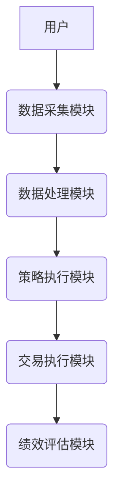

                 


# 股指期货：大规模资产配置的对冲工具

**关键词**：股指期货、资产配置、对冲工具、风险管理、数学模型

**摘要**：本文详细探讨了股指期货作为大规模资产配置的对冲工具的核心作用，从基本概念、定价模型、套利机会、资产配置策略、风险管理到系统性风险应对，结合实际案例分析和数学模型，深入剖析了股指期货在金融投资中的应用价值和潜在风险。文章内容涵盖从理论到实践的全链条，旨在为投资者和金融从业者提供全面的参考和指导。

---

# 第1章: 股指期货的基本概念与市场机制

## 1.1 股指期货的基本概念

### 1.1.1 股指期货的定义

股指期货（Stock Index Futures）是一种金融衍生品，以股票指数为标的资产，约定在未来某一特定时间以预定价格买卖该指数。其本质是通过标准化合约，将未来市场波动的风险转移到愿意承担风险的市场参与者手中。

### 1.1.2 股指期货的市场机制

股指期货的市场机制包括以下几个关键环节：

1. **交易机制**：交易者可以在期货交易所通过公开竞价或电子撮合系统进行买卖操作。
2. **结算机制**：采用每日无负债结算制度，确保交易的公平性和流动性。
3. **交割机制**：股指期货通常采用现金交割，而非实物交割。

### 1.1.3 股指期货与股票市场的关系

股指期货与股票市场密切相关，主要体现在以下几个方面：

1. **价格关联性**：股指期货的价格受现货市场价格波动的影响，同时反过来也会影响现货市场的交易行为。
2. **流动性对冲**：股指期货为投资者提供了在现货市场之外的流动性，降低了现货市场的交易成本。
3. **风险管理工具**：投资者可以通过股指期货对冲股票市场的系统性风险。

## 1.2 股指期货的对冲原理

### 1.2.1 对冲的基本概念

对冲是指通过建立相反的头寸，来抵消原有投资组合中的风险。在股指期货中，对冲的核心在于利用期货市场的杠杆效应，降低投资组合的整体波动性。

### 1.2.2 股指期货的对冲策略

常见的股指期货对冲策略包括：

1. **完全对冲**：将投资组合的贝塔值（β）调整为零，以消除市场风险。
2. **部分对冲**：根据市场判断，适度调整对冲比例，保留部分市场风险敞口。
3. **动态对冲**：根据市场波动情况，实时调整对冲头寸，以应对短期市场波动。

### 1.2.3 对冲在资产配置中的作用

对冲策略在资产配置中的作用主要体现在以下几个方面：

1. **降低投资组合的波动性**：通过对冲系统性风险，减少投资组合的回撤幅度。
2. **提高收益稳定性**：在市场下跌时，对冲头寸能够抵消部分损失，确保收益的稳定性。
3. **增强风险调整后收益**：通过优化对冲比例，提高单位风险下的收益水平。

## 1.3 股指期货的市场参与主体

### 1.3.1 投资者与机构投资者

投资者通过股指期货可以实现对市场风险的对冲，机构投资者则可以通过股指期货进行套利、 hedging 或投机交易。

### 1.3.2 交易所与监管机构

交易所负责提供交易、结算和交割服务，监管机构则负责制定和执行市场规则，确保市场的公平和透明。

### 1.3.3 市场流动性与交易活跃度

市场的流动性直接影响股指期货的价格波动性和交易成本。高流动性的市场通常具有更窄的买卖价差和更高的成交效率。

## 1.4 本章小结

本章介绍了股指期货的基本概念、市场机制和对冲原理，强调了股指期货在资产配置中的重要性。通过对市场参与主体和市场流动性的分析，为后续章节的深入讨论奠定了基础。

---

# 第2章: 股指期货的定价与套利模型

## 2.1 股指期货的定价原理

### 2.1.1 股指期货的价格决定因素

股指期货的价格主要由以下几个因素决定：

1. **现货价格**：股指期货的价格与现货指数密切相关。
2. **持有成本**：包括资金成本、仓储成本和交易成本。
3. **市场预期**：市场参与者对未来价格走势的预期会影响期货价格。

### 2.1.2 市场无套利条件下的定价公式

在无套利的情况下，股指期货的理论价格（F）可以表示为：

$$ F = S_0 \times (1 + r \times T) $$

其中，\( S_0 \) 是现货价格，\( r \) 是无风险利率，\( T \) 是时间跨度。

### 2.1.3 市场摩擦与实际定价模型

由于市场存在摩擦（如交易成本、税收等），实际定价模型需要考虑这些因素的影响。常用的模型包括：

1. **包含交易成本的定价模型**：  
   $$ F = S_0 \times (1 + r \times T) - C $$  
   其中，\( C \) 是交易成本。

2. **包含流动性溢价的定价模型**：  
   $$ F = S_0 \times (1 + r \times T) + L $$  
   其中，\( L \) 是流动性溢价。

## 2.2 股指期货的套利机会分析

### 2.2.1 套利的基本原理

套利是指利用市场价差进行无风险或低风险的利润获取。在股指期货市场中，套利机会主要来自于现货与期货价格的偏离。

### 2.2.2 常见的套利策略

1. **跨期套利**：利用不同到期日的期货合约价格差异进行套利。
2. **跨市场套利**：利用同一指数在不同市场的价格差异进行套利。
3. **统计套利**：基于统计学方法寻找短期价格波动的套利机会。

### 2.2.3 套利的数学模型与公式

统计套利的一种常见模型是均值回归模型，假设价格偏离均值时会回归。其数学表达式为：

$$ P_t = \mu + \alpha \times (P_{t-1} - \mu) + \epsilon_t $$

其中，\( \mu \) 是均值，\( \alpha \) 是回归系数，\( \epsilon_t \) 是误差项。

## 2.3 本章小结

本章通过分析股指期货的定价原理和套利机会，揭示了市场中套利行为对价格形成的影响。同时，介绍了几种常见的套利策略和数学模型，为后续章节的策略分析提供了理论基础。

---

# 第3章: 股指期货在资产配置中的应用

## 3.1 资产配置的基本概念

### 3.1.1 资产配置的定义与目标

资产配置是指将资金分配到不同资产类别（如股票、债券、商品、房地产等）以实现投资目标的过程。其目标通常是最大化收益、最小化风险或实现特定的投资目标。

### 3.1.2 资产配置的常见策略

常见的资产配置策略包括：

1. **恒定比例策略**：保持各类资产的比例不变。
2. **动态平衡策略**：根据市场环境变化调整资产比例。
3. **风险管理策略**：根据风险承受能力调整资产配置。

### 3.1.3 资产配置的风险与收益平衡

资产配置的核心是找到收益与风险的最佳平衡点。通常，风险较高的资产（如股票）具有较高的预期收益，而风险较低的资产（如债券）则具有较低的预期收益。

## 3.2 股指期货在资产配置中的作用

### 3.2.1 降低投资组合风险

通过使用股指期货对冲市场风险，可以降低投资组合的整体波动性。

### 3.2.2 提高投资组合收益

在市场上涨时，股指期货可以作为杠杆工具放大收益；在市场下跌时，股指期货可以作为保护工具锁定收益。

### 3.2.3 资产配置中的对冲策略

在资产配置中，对冲策略可以通过以下方式实现：

1. **完全对冲**：将投资组合的贝塔值调整为零。
2. **部分对冲**：根据市场环境调整对冲比例。

## 3.3 股指期货的资产配置模型

### 3.3.1 均值-方差优化模型

均值-方差优化模型是一种经典的资产配置模型，旨在在给定风险水平下最大化收益。其数学表达式为：

$$ \text{Minimize } \sigma^2 \text{ subject to } E(r) \geq \text{目标收益} $$

其中，\( \sigma^2 \) 是收益的方差，\( E(r) \) 是收益的期望值。

### 3.3.2 风险平价策略

风险平价策略是将投资组合的风险在不同资产类别之间平均分配。其核心思想是通过调整资产配置比例，使得每种资产对组合风险的贡献相等。

### 3.3.3 动态再平衡策略

动态再平衡策略根据市场变化和投资目标调整资产配置比例，以维持投资组合的风险收益特性。

## 3.4 本章小结

本章通过分析股指期货在资产配置中的作用，介绍了几种常用的资产配置模型。通过这些模型，投资者可以更好地利用股指期货进行风险管理和收益优化。

---

# 第4章: 股指期货的风险管理与控制

## 4.1 风险管理的基本概念

### 4.1.1 风险的定义与分类

风险是指投资收益的不确定性，通常可以分为系统性风险和非系统性风险。

### 4.1.2 风险管理的目标与方法

风险管理的目标是通过识别、评估和控制风险，将风险控制在可接受的范围内。常用方法包括分散化、对冲和保险。

### 4.1.3 风险与收益的平衡

在风险管理中，核心是找到风险与收益的最佳平衡点，确保在可接受风险水平下的最大收益。

## 4.2 股指期货的风险来源

### 4.2.1 市场风险

市场风险是指由于市场价格波动导致的投资损失。

### 4.2.2 流动性风险

流动性风险是指由于缺乏交易对手而导致的无法平仓的风险。

### 4.2.3 操作风险

操作风险是指由于操作失误或系统故障导致的损失。

## 4.3 股指期货的风险管理策略

### 4.3.1 仓位控制

通过合理控制仓位比例，避免过度杠杆化。

### 4.3.2 止损策略

设定止损点，当价格触及止损点时立即平仓，以限制潜在损失。

### 4.3.3 风险对冲模型

通过建立对冲头寸，降低投资组合的整体风险敞口。

## 4.4 本章小结

本章分析了股指期货的主要风险来源，并介绍了几种有效的风险管理策略，帮助投资者在实际操作中控制风险，实现稳健投资。

---

# 第5章: 股指期货的系统性风险与危机应对

## 5.1 系统性风险的基本概念

### 5.1.1 系统性风险的定义

系统性风险是指影响整个市场的风险，如经济衰退、金融危机等。

### 5.1.2 系统性风险的特征

系统性风险通常具有广泛性、不可分散性和高度传染性。

### 5.1.3 系统性风险的来源

系统性风险的主要来源包括：

1. **宏观经济因素**：如经济政策、利率变化等。
2. **金融市场因素**：如流动性危机、市场恐慌等。
3. **外部冲击**：如自然灾害、地缘政治冲突等。

## 5.2 股指期货在系统性风险中的表现

### 5.2.1 系统性风险下的股指期货价格波动

在系统性风险发生时，股指期货价格通常会大幅波动，投资者需要特别关注价格走势和交易量变化。

### 5.2.2 系统性风险下的套利机会

系统性风险往往会导致现货与期货价格的偏离，为套利者提供机会。

### 5.2.3 系统性风险下的对冲策略

在系统性风险下，投资者可以通过增加对冲头寸、降低杠杆比例等方式进行风险控制。

## 5.3 危机事件中的股指期货应对策略

### 5.3.1 危机事件的定义与分类

危机事件通常指那些可能导致市场崩溃或严重波动的极端事件，如2008年全球金融危机。

### 5.3.2 危机事件中的股指期货表现

在危机事件中，股指期货通常会经历大幅波动，投资者需要根据市场情况及时调整策略。

### 5.3.3 危机事件中的风险管理

危机事件中，投资者需要特别注意流动性风险和市场风险，及时采取止损措施。

## 5.4 本章小结

本章通过分析系统性风险和危机事件中的股指期货表现，为投资者提供了应对系统性风险的策略和方法。

---

# 第6章: 股指期货的系统架构设计与实战案例

## 6.1 系统设计背景

### 6.1.1 系统需求分析

本系统的目的是帮助投资者利用股指期货进行资产配置和风险管理。

### 6.1.2 系统功能设计

系统功能包括数据采集、价格分析、风险评估、交易执行和绩效评估。

## 6.2 系统架构设计

### 6.2.1 系统架构图



### 6.2.2 数据流设计

系统数据流包括数据输入、数据处理、策略执行和交易执行。

## 6.3 系统核心实现

### 6.3.1 环境安装

需要安装的环境包括Python、Pandas、Matplotlib和交易API。

### 6.3.2 核心算法实现

核心算法包括价格预测、风险评估和交易策略。

### 6.3.3 代码实现

以下是核心代码示例：

```python
import pandas as pd
import numpy as np

# 数据加载
data = pd.read_csv('index.csv')

# 数据预处理
data['return'] = data['close'].pct_change()

# 策略实现
def strategy(data):
    # 简单的均值回归策略
    mu = data['return'].mean()
    std = data['return'].std()
    z_score = (data['return'] - mu) / std
    signal = z_score.rolling(20).mean()
    return signal

# 策略回测
signal = strategy(data)
positions = np.sign(signal)
returns = positions.shift(1) * data['return']
cumulative_return = (1 + returns).cumprod()
print(cumulative_return)
```

## 6.4 实战案例分析

### 6.4.1 系统性能测试

测试系统在历史数据上的表现，包括回测收益、最大回撤和 Sharpe 比率。

### 6.4.2 系统优化与调整

根据回测结果优化策略参数，调整交易频率和头寸大小。

### 6.4.3 系统小结

本系统通过实际案例展示了股指期货在资产配置中的应用，验证了理论模型的可行性。

## 6.5 本章小结

本章通过系统架构设计和实战案例分析，验证了股指期货在实际投资中的应用价值。同时，为投资者提供了具体的实现方法和优化建议。

---

# 第7章: 总结与展望

## 7.1 本章总结

### 7.1.1 核心观点回顾

本文从股指期货的基本概念出发，分析了其在资产配置、风险管理和系统性风险应对中的作用。

### 7.1.2 主要结论

股指期货是有效的对冲工具，但其使用需要结合市场环境和投资目标，合理控制风险。

## 7.2 未来展望

### 7.2.1 新的市场环境与挑战

随着市场的不断发展，新的市场环境和挑战将不断出现，投资者需要不断优化策略。

### 7.2.2 新的对冲工具与策略

未来可能会出现新的对冲工具和策略，投资者需要保持关注，及时调整。

### 7.2.3 技术进步与数据分析

技术进步将为股指期货的分析和交易提供新的工具和方法，投资者需要不断提升技术能力。

## 7.3 本章小结

本章总结了全文的核心观点，并展望了未来的发展趋势，为投资者提供了长期的投资指导。

---

# 作者：AI天才研究院/AI Genius Institute & 禅与计算机程序设计艺术/Zen And The Art of Computer Programming

