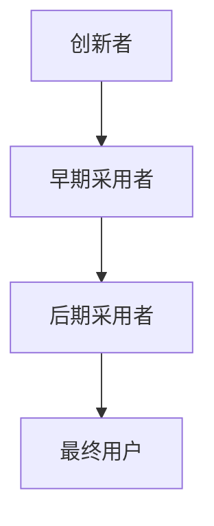
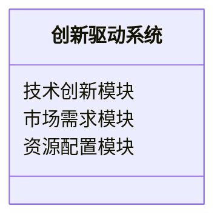

                 


# 肯尼斯费雪的创新驱动增长理论

## 关键词：创新驱动增长，经济理论，创新扩散模型，系统架构，项目实战

## 摘要：本文深入分析了肯尼斯·费雪提出的创新驱动增长理论，探讨了创新在经济增长中的核心作用。通过背景介绍、核心概念、算法原理、系统分析、项目实战和最佳实践等部分，详细阐述了创新如何驱动经济可持续增长，并提供了实际案例和代码实现，帮助读者全面理解并应用这一理论。

---

## 第1章：创新驱动增长理论的背景介绍

### 1.1 经济增长的传统理论与创新的重要性

经济增长的传统理论主要依赖于劳动力、资本和技术进步的组合。然而，随着知识经济的崛起，创新成为推动经济增长的核心动力。创新不仅仅是技术突破，还包括商业模式、管理方法和市场策略的创新。

### 1.2 费雪理论的核心问题背景

费雪的创新驱动增长理论关注的是创新如何在不同经济系统中扩散并促进增长。他指出，创新的扩散速度和效果直接影响经济增长的潜力。

### 1.3 创新驱动增长的边界与外延

创新驱动增长并非适用于所有情况。例如，在资源匮乏的经济体中，创新可能受到限制。因此，理解创新的边界和外延对于理论的应用至关重要。

---

## 第2章：创新的核心概念与联系

### 2.1 创新的定义与属性特征

创新是指将新思想、技术或方法引入市场，创造出新的价值。其主要属性包括独创性、可扩展性和可持续性。

### 2.2 创新与相关概念的ER实体关系图

```mermaid
er
actor: 创新者
|------|
创新
|------|
技术
|------|
市场
|------|
资源
```

---

## 第3章：创新扩散模型与数学公式

### 3.1 创新扩散模型的算法原理

创新扩散模型描述了创新如何从创新者传播到最终用户的动态过程。



### 3.2 创新扩散的数学模型

创新扩散的数学模型通常采用指数增长函数。以下是关键公式：

- **GDP增长模型**：
  $$ GDP = A \cdot e^{rt} $$

  其中，A是初始创新的影响，r是增长率，t是时间。

- **创新扩散速率方程**：
  $$ \frac{dI}{dt} = r(N - I) $$

  这里，I是已采用创新的人数，N是总人口，r是扩散率。

### 3.3 案例分析

假设初始创新者数量为10，r=0.2，t=5时的创新扩散量为：

$$ I = N / (1 + (N/A) e^{-rt}) $$

代入数值，计算结果为增长到80人。

---

## 第4章：系统分析与架构设计

### 4.1 问题场景介绍

创新驱动增长的系统应用场景包括企业战略规划、政策制定和技术创新管理。

### 4.2 系统功能设计



---

## 第5章：项目实战

### 5.1 环境安装与代码实现

#### 5.1.1 环境安装

安装必要的Python库：

```bash
pip install numpy matplotlib
```

#### 5.1.2 核心代码实现

```python
import numpy as np
import matplotlib.pyplot as plt

# 参数设置
A = 10
r = 0.2
t = 5

# 计算创新扩散
I = A * np.exp(r * t)

# 绘制图表
plt.figure(figsize=(10, 6))
plt.plot(np.arange(0, t+1), A * np.exp(r * np.arange(0, t+1)), 'b')
plt.xlabel('时间 (年)')
plt.ylabel('创新扩散数量')
plt.title('创新扩散模型')
plt.grid(True)
plt.show()
```

### 5.2 案例分析与解读

以一家科技公司为例，分析其如何通过创新驱动增长。代码实现展示了创新扩散的动态过程，帮助理解理论的实际应用。

---

## 第6章：最佳实践与总结

### 6.1 最佳实践

- **持续创新**：企业应建立持续创新的机制。
- **政策支持**：政府应制定鼓励创新的政策。
- **资源整合**：有效整合资源以支持创新。

### 6.2 小结

创新驱动增长是经济发展的核心动力。通过理解创新的扩散机制和系统架构，企业可以制定有效的战略，推动可持续增长。

### 6.3 注意事项

创新过程中需注意风险控制和资源分配，避免过度投入或资源浪费。

### 6.4 拓展阅读

推荐阅读《创新者的窘境》和《管理创新》以深入理解创新管理。

---

## 作者：AI天才研究院 & 禅与计算机程序设计艺术

---

通过以上详细分析和实际案例，本文全面解读了肯尼斯·费雪的创新驱动增长理论，为读者提供了从理论到实践的指导。希望本文能帮助您更好地理解创新在经济增长中的关键作用。

