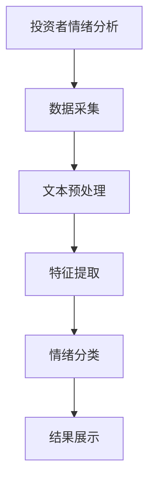

                 


# 自然语言处理在投资者情绪分析中的应用

> 关键词：投资者情绪分析，自然语言处理，文本挖掘，情感计算，深度学习

> 摘要：本文深入探讨了自然语言处理（NLP）在投资者情绪分析中的应用，从背景概念、算法原理、系统架构到项目实战，全面解析了投资者情绪分析的核心技术和实现方法。通过分析投资者情绪的文本数据，利用NLP技术提取情感特征，并结合机器学习和深度学习模型进行情绪分类，本文为投资者提供了一种高效的情绪分析解决方案。文章还结合实际案例，详细介绍了系统的实现过程和优化策略，为读者提供了从理论到实践的完整指南。

---

## 第一部分: 自然语言处理在投资者情绪分析中的应用概述

### 第1章: 投资者情绪分析的背景与概念

#### 1.1 投资者情绪分析的定义
投资者情绪分析是通过对金融市场中的文本数据进行分析，识别投资者在特定时间点上的情感倾向（如乐观、悲观、中立等）的过程。其核心目标是量化市场情绪，帮助投资者、金融分析师和机构做出更明智的决策。

##### 1.1.1 投资者情绪分析的定义与范围
投资者情绪分析主要关注与金融市场相关的文本数据，包括新闻、社交媒体评论、分析师报告等。其范围涵盖股票、债券、基金等多种金融资产。

##### 1.1.2 投资者情绪分析的核心要素
投资者情绪分析的核心要素包括：
1. **文本数据**：金融市场相关的文本，如新闻标题、社交媒体帖子等。
2. **情感特征**：从文本中提取的情感特征，如关键词、情感强度等。
3. **情感分类**：将文本分为积极、消极或中立三类。
4. **时间序列**：分析情绪随时间的变化趋势。

##### 1.1.3 投资者情绪分析的边界与外延
投资者情绪分析的边界包括仅关注与金融市场相关的文本，而外延则包括与情绪分析相关的技术，如文本挖掘、自然语言处理和机器学习。

#### 1.2 自然语言处理的基本概念
自然语言处理（NLP）是计算机科学、人工智能和语言学的交叉领域，旨在使计算机能够理解和处理人类语言。

##### 1.2.1 自然语言处理的定义与目标
NLP的目标是让计算机能够理解、生成和处理人类语言。其核心目标包括文本分类、信息提取、机器翻译等。

##### 1.2.2 自然语言处理的核心技术
NLP的核心技术包括：
1. **分词**：将文本分割成词语或短语。
2. **词性标注**：识别词语的词性（如名词、动词）。
3. **句法分析**：分析句子的语法结构。
4. **语义分析**：理解文本的语义含义。

##### 1.2.3 自然语言处理与投资者情绪分析的结合
投资者情绪分析的核心是提取文本中的情感特征，NLP提供了实现这一目标的技术手段。

#### 1.3 投资者情绪分析的理论基础
##### 1.3.1 情绪分类的基本原理
情绪分类是将文本分为积极、消极或中立的过程。其基本原理包括特征提取和分类器训练。

##### 1.3.2 情感计算的定义与应用
情感计算是通过计算机技术分析和模拟人类情感的过程，其在投资者情绪分析中的应用包括情感强度计算和情感分类。

##### 1.3.3 文本挖掘在投资者情绪分析中的作用
文本挖掘从大规模文本数据中提取有用信息，帮助投资者识别市场情绪的变化趋势。

---

### 第2章: 投资者情绪分析的核心概念与联系

#### 2.1 投资者情绪分析的核心概念
##### 2.1.1 情绪分类的特征提取
特征提取是情绪分类的关键步骤，包括关键词提取和情感强度计算。

##### 2.1.2 文本情感的量化方法
文本情感的量化方法包括情感得分计算和情感分布分析。

##### 2.1.3 投资者情绪分析的指标体系
投资者情绪分析的指标体系包括情感强度、情感变化率和情感一致性等指标。

#### 2.2 核心概念的原理与联系
##### 2.2.1 投资者情绪分析的流程图


##### 2.2.2 情绪分类与文本挖掘的实体关系图
```mermaid
entity Investor_Mood_Analysis {
  id: string
  text: string
  sentiment: string
  timestamp: datetime
}
```

---

### 第3章: 自然语言处理算法原理与数学模型

#### 3.1 文本预处理算法
##### 3.1.1 分词算法
分词是将文本分割成词语的过程，常用算法包括基于规则的分词和统计模型。

##### 3.1.2 停用词过滤
停用词过滤是去除对情感分析无用的词语，如“的”、“是”等。

##### 3.1.3 词干提取与词形还原
词干提取和词形还原是将词语转换为其基本形式的过程。

#### 3.2 特征提取算法
##### 3.2.1 TF-IDF特征提取
TF-IDF是一种基于词频和反向文档频率的特征提取方法。

##### 3.2.2 Word2Vec词向量表示
Word2Vec通过上下文关系生成词向量，常用于情感分析任务。

##### 3.2.3 BERT embeddings的应用
BERT是一种预训练语言模型，其嵌入表示在情感分析中表现出色。

#### 3.3 情绪分类算法
##### 3.3.1 朴素贝叶斯分类器
朴素贝叶斯分类器是一种基于概率论的分类算法，常用于文本分类任务。

##### 3.3.2 支持向量机（SVM）
SVM是一种基于几何的分类算法，适用于高维特征空间。

##### 3.3.3 随机森林与深度学习模型
随机森林和深度学习模型（如LSTM、Transformer）在复杂任务中表现优异。

---

### 第4章: 投资者情绪分析的系统架构与设计

#### 4.1 系统分析与需求定义
##### 4.1.1 问题场景介绍
投资者情绪分析的场景包括新闻分析、社交媒体监控等。

##### 4.1.2 项目目标与范围
项目目标是开发一个高效的情绪分析系统，范围包括数据采集、预处理和分类。

##### 4.1.3 系统功能需求
系统功能需求包括数据采集、文本预处理、特征提取、情绪分类和结果展示。

#### 4.2 系统架构设计
##### 4.2.1 系统模块划分
系统模块包括数据采集模块、文本预处理模块、特征提取模块、情绪分类模块和结果展示模块。

##### 4.2.2 系统架构图


##### 4.2.3 接口设计与交互流程
系统接口设计包括数据输入接口、模型训练接口和结果输出接口。

#### 4.3 系统实现与优化
##### 4.3.1 系统实现的代码框架
系统实现包括数据采集、预处理、特征提取和情绪分类的代码框架。

##### 4.3.2 系统优化策略
系统优化策略包括特征选择和模型调优。

##### 4.3.3 系统测试与验证
系统测试包括单元测试和集成测试，验证系统的准确性和稳定性。

---

### 第5章: 项目实战与案例分析

#### 5.1 项目环境与工具安装
##### 5.1.1 环境搭建
项目环境搭建包括Python版本和相关库的安装。

##### 5.1.2 工具安装与配置
安装和配置NLP相关工具，如spaCy、NLTK和BERT。

#### 5.2 核心代码实现
##### 5.2.1 数据清洗与预处理
数据清洗包括去除停用词和处理特殊字符。

##### 5.2.2 特征提取与模型训练
特征提取使用TF-IDF或BERT embeddings，模型训练使用SVM或深度学习模型。

##### 5.2.3 情绪分类与结果展示
情绪分类结果通过图表展示，分析市场情绪变化趋势。

#### 5.3 实例分析与结果解读
##### 5.3.1 数据采集与预处理
通过API或爬虫采集新闻数据，并进行预处理。

##### 5.3.2 情绪分类与可视化
使用训练好的模型进行情绪分类，并通过时间序列图展示情绪变化趋势。

##### 5.3.3 案例分析与解读
分析具体案例，解释情绪变化对市场的影响。

---

## 第六章: 总结与展望

### 6.1 最佳实践 tips
1. 数据质量是情绪分析的关键，需重视数据清洗和特征提取。
2. 结合领域知识优化模型，提升分类准确率。

### 6.2 小结
投资者情绪分析是NLP与金融领域的结合，通过提取情感特征和深度学习模型的应用，为投资者提供高效的情绪分析工具。

### 6.3 注意事项
1. 数据隐私问题需重视。
2. 模型泛化能力需加强。

### 6.4 拓展阅读
推荐阅读相关领域的最新研究论文和书籍，持续关注NLP和深度学习的发展。

---

作者：AI天才研究院/AI Genius Institute & 禅与计算机程序设计艺术 /Zen And The Art of Computer Programming

