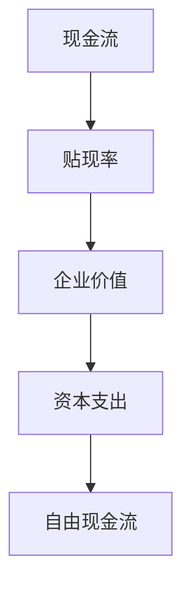
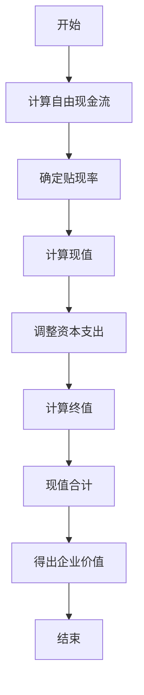
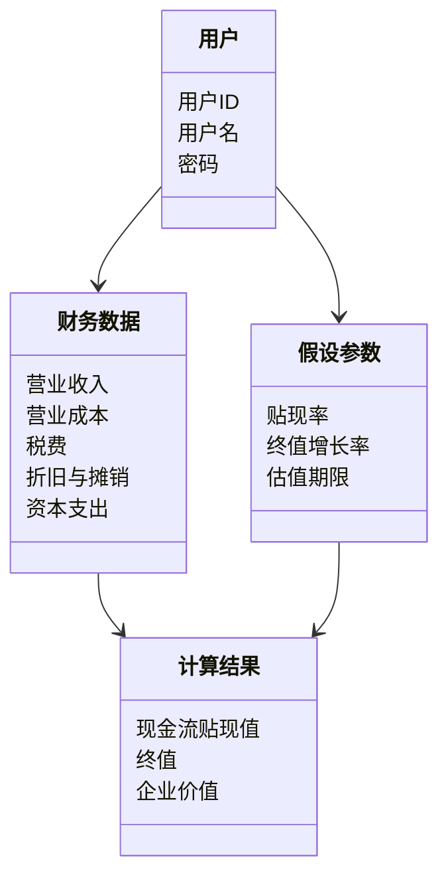
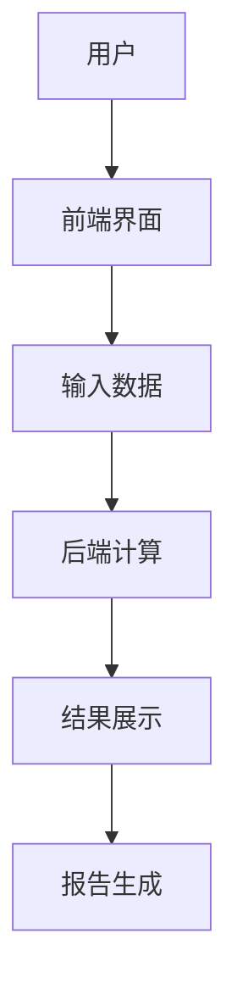
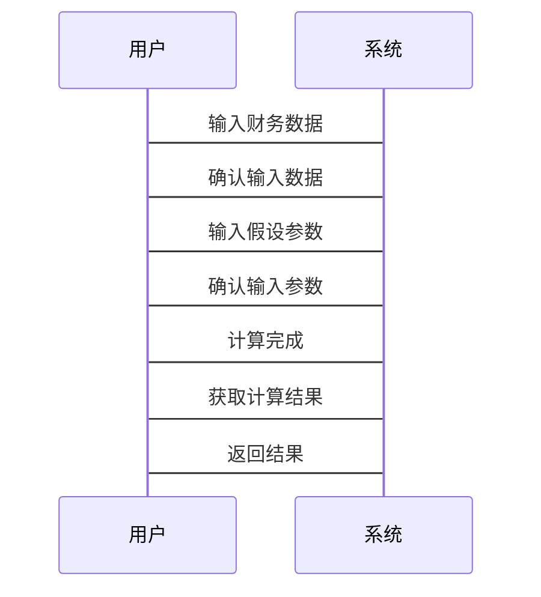

                 


# 自由现金流贴现：考虑资本支出的估值模型

> 关键词：自由现金流贴现，资本支出，企业估值，贴现率，财务模型

> 摘要：本文深入探讨了自由现金流贴现模型在考虑资本支出情况下的估值方法，从模型的基本原理到实际应用进行了系统性分析。通过详细阐述模型的构建过程、关键概念的解释、算法原理的数学推导以及实际案例的分析，本文旨在帮助读者理解如何利用自由现金流贴现模型进行企业估值，并在实际操作中掌握模型的应用技巧。

---

## 第一部分: 自由现金流贴现模型的背景与基础

### 第1章: 自由现金流贴现模型概述

#### 1.1 自由现金流贴现的核心概念

##### 1.1.1 自由现金流的基本定义
自由现金流（Free Cash Flow，简称FCF）是指企业在扣除所有必要的支出后，剩余可用于偿还债务、回报股东或投资于其他项目之前的现金流。它是企业财务健康状况的重要指标，也是估值模型的核心输入。

$$ \text{FCF} = \text{营业收入} - \text{营业成本} - \text{税费} - \text{折旧与摊销} - \text{资本支出} $$

##### 1.1.2 贴现的概念与作用
贴现是指将未来的现金流按一定的贴现率折算到当前时点的现值。贴现的核心作用是反映资金的时间价值，即将未来的资金价值调整到当前的价值。

##### 1.1.3 资本支出在模型中的重要性
资本支出（Capital Expenditure，简称CapEx）是企业在维持或扩大生产能力方面的投资，包括购置新设备、厂房建设和技术升级等。在自由现金流模型中，资本支出直接影响企业的现金流，需要在计算中被扣除。

#### 1.2 自由现金流贴现模型的发展历程

##### 1.2.1 模型的起源与演变
自由现金流贴现模型的起源可以追溯到20世纪70年代，随着现代财务理论的发展，模型逐渐从简单的股利贴现模型（DDM）扩展到更复杂的全权益贴现模型和加权平均资本成本（WACC）贴现模型。

##### 1.2.2 不同行业中的应用差异
不同行业由于商业模式和资本需求的差异，自由现金流贴现模型的应用也有所不同。例如，制造业可能需要考虑更多的资本支出，而服务业则更关注运营现金流。

##### 1.2.3 当前模型的主要流派与争议
目前，自由现金流贴现模型主要有WACC模型和股权资本成本模型两种流派。不同流派在贴现率的选择和现金流的计算上存在争议，但总体框架基本一致。

#### 1.3 自由现金流贴现模型的应用现状

##### 1.3.1 在企业估值中的广泛应用
自由现金流贴现模型因其科学性和实用性，被广泛应用于企业估值、并购评估和投资决策等领域。

##### 1.3.2 在投资决策中的实际案例
以某科技公司为例，通过计算其未来五年的自由现金流并贴现，可以得出该公司的企业价值，并与当前市场价进行对比，评估其投资价值。

##### 1.3.3 模型的局限性与改进方向
自由现金流贴现模型的局限性主要体现在假设条件的严格性和数据的敏感性上。未来的研究可以进一步探讨如何在模型中引入更多的动态因素，如经济周期和行业波动。

#### 1.4 模型的边界与外延

##### 1.4.1 模型适用的行业范围
模型适用于那些具有稳定现金流和可预测资本支出的行业，如制造业、能源行业和科技行业。

##### 1.4.2 数据质量对模型的影响
模型的结果高度依赖于输入数据的准确性。高质量的财务数据和合理的假设是模型准确性的保障。

##### 1.4.3 模型与其它估值方法的结合
自由现金流贴现模型可以与相对估值法（如PE、PB等指标）结合使用，以提高估值的准确性和可靠性。

### 第2章: 自由现金流贴现模型的核心概念与联系

#### 2.1 核心概念原理

##### 2.1.1 现金流的时间价值
现金流的时间价值是指资金随着时间的推移而产生的价值变化。未来现金流的现值可以通过贴现率计算得出。

##### 2.1.2 贴现率的确定方法
贴现率通常采用加权平均资本成本（WACC）或股权资本成本，具体选择取决于模型的应用场景和企业的资本结构。

##### 2.1.3 资本支出的计算与调整
资本支出需要根据企业的投资计划和财务状况进行合理预测，并在自由现金流的计算中予以扣除。

#### 2.2 概念属性特征对比表格

| 概念       | 定义与属性                          | 示例                        |
|------------|------------------------------------|-----------------------------|
| 自由现金流 | 企业经营活动中产生的现金流净额    | FCFF = 营业收入 - 营业成本 - 税费 - 折旧与摊销 - 资本支出 |
| 贴现率      | 反映资金时间价值的利率             | WACC（加权平均资本成本）   |
| 资本支出    | 企业为维持或扩大生产而进行的投资   | CapEx = 新设备购置 + 扩建支出 |

#### 2.3 ER实体关系图架构



### 第3章: 自由现金流贴现模型的算法原理

#### 3.1 算法原理流程图



#### 3.2 数学模型与公式

##### 3.2.1 自由现金流计算公式
$$ \text{FCF}_t = \text{营业收入}_t - \text{营业成本}_t - \text{税费}_t - \text{折旧与摊销}_t - \text{资本支出}_t $$

##### 3.2.2 贴现率计算公式
$$ \text{WACC} = \left( \frac{D}{V} \times r_d \times (1 - t) \right) + \left( \frac{E}{V} \times r_e \right) $$

##### 3.2.3 现金流贴现公式
$$ \text{PV} = \sum_{t=1}^{n} \frac{\text{FCF}_t}{(1 + r)^t} + \frac{\text{TV}}{(1 + r)^n} $$

##### 3.2.4 终值计算公式
$$ \text{TV} = \text{FCF}_{n+1} \times \left( \frac{1}{r} - \frac{1}{r + g} \right) $$

#### 3.3 实际案例分析

##### 3.3.1 案例背景
假设某公司未来五年的自由现金流分别为100万、120万、150万、180万和200万，贴现率为8%，终值增长率为2.5%。

##### 3.3.2 计算过程
1. 计算未来现金流的现值：
   $$ \text{PV}_1 = \frac{100}{1.08} = 92.59 $$
   $$ \text{PV}_2 = \frac{120}{1.08^2} = 100.83 $$
   $$ \text{PV}_3 = \frac{150}{1.08^3} = 122.97 $$
   $$ \text{PV}_4 = \frac{180}{1.08^4} = 134.21 $$
   $$ \text{PV}_5 = \frac{200}{1.08^5} = 143.55 $$

2. 计算终值：
   $$ \text{TV} = 200 \times \left( \frac{1}{0.08} - \frac{1}{0.08 + 0.025} \right) = 200 \times (12.5 - 11.5385) = 200 \times 0.9615 = 192.30 $$

3. 计算终值的现值：
   $$ \text{PV}_{\text{TV}} = \frac{192.30}{1.08^5} = 122.03 $$

4. 计算总现值：
   $$ \text{Total PV} = 92.59 + 100.83 + 122.97 + 134.21 + 143.55 + 122.03 = 715.18 $$

##### 3.3.3 结论
该公司的企业价值为715.18万元。

---

## 第二部分: 系统分析与架构设计

### 第4章: 系统分析与架构设计方案

#### 4.1 问题场景介绍
为了帮助企业进行准确的估值，我们设计了一个基于自由现金流贴现模型的估值系统，该系统能够自动计算企业的自由现金流、贴现率和终值，并生成详细的估值报告。

#### 4.2 项目介绍
本项目旨在开发一个用户友好的估值系统，支持用户输入财务数据和假设参数，自动生成自由现金流贴现模型的计算结果。

#### 4.3 系统功能设计

##### 4.3.1 领域模型mermaid类图



#### 4.4 系统架构设计mermaid架构图



#### 4.5 系统接口设计
系统接口设计包括数据输入接口、参数设置接口和结果输出接口，具体如下：

1. 数据输入接口：
   - 输入财务数据（营业收入、营业成本等）
   - 输入假设参数（贴现率、终值增长率等）

2. 计算接口：
   - 自动计算自由现金流
   - 自动计算贴现值和终值
   - 生成企业价值

3. 输出接口：
   - 显示计算结果
   - 生成估值报告

#### 4.6 系统交互mermaid序列图



---

## 第三部分: 项目实战

### 第5章: 项目实战

#### 5.1 环境安装

##### 5.1.1 系统要求
- 操作系统：Windows/Mac/Linux
- 内存：4GB及以上
- 处理器：Intel/AMD多核处理器

##### 5.1.2 安装步骤
1. 安装Python 3.8及以上版本
2. 安装Jupyter Notebook
3. 安装相关库（如pandas、numpy、matplotlib）

#### 5.2 系统核心实现源代码

##### 5.2.1 数据输入部分

```python
import pandas as pd

# 输入财务数据
revenue = [1000, 1100, 1200, 1300, 1400]  # 单位：万元
cost_of_goods_sold = [600, 660, 720, 780, 840]
taxes = [100, 110, 120, 130, 140]
depreciation_amortization = [50, 60, 70, 80, 90]
capital_expenditure = [80, 90, 100, 110, 120]
```

##### 5.2.2 计算自由现金流

```python
free_cash_flow = [revenue[i] - cost_of_goods_sold[i] - taxes[i] - depreciation_amortization[i] - capital_expenditure[i] for i in range(5)]
print("自由现金流：", free_cash_flow)
```

##### 5.2.3 确定贴现率

```python
wacc = 0.08  # 假设加权平均资本成本为8%
```

##### 5.2.4 计算现值和终值

```python
discount_factor = [1 / (1 + wacc)**i for i in range(1, 6)]
present_value = [free_cash_flow[i] * discount_factor[i] for i in range(5)]
terminal_value = free_cash_flow[4] * (1 + 0.025) / (wacc - 0.025)
present_value_tv = terminal_value / (1 + wacc)**5
```

##### 5.2.5 计算企业价值

```python
enterprise_value = sum(present_value) + present_value_tv
print("企业价值：", enterprise_value)
```

#### 5.3 代码应用解读与分析

##### 5.3.1 环境与工具
- 使用Python和相关库（pandas、numpy、matplotlib）进行数据处理和可视化。

##### 5.3.2 代码实现
通过上述代码，我们可以计算出企业的自由现金流、现值和终值，最终得到企业价值。

##### 5.3.3 实际案例分析
以某制造公司为例，输入其未来五年的财务数据，计算其企业价值，并与市场价进行对比，评估其投资价值。

#### 5.4 项目小结
通过本项目，我们掌握了自由现金流贴现模型的实现方法，并能够将其应用到实际的企业估值中。

---

## 第四部分: 最佳实践与总结

### 第6章: 最佳实践

#### 6.1 小结
自由现金流贴现模型是一种强大的企业估值工具，但在实际应用中需要注意数据的准确性和假设的合理性。

#### 6.2 注意事项
- 确保输入数据的准确性和合理性
- 合理选择贴现率和终值增长率
- 定期更新模型参数以反映市场变化

#### 6.3 拓展阅读
- 股利贴现模型（DDM）
- 加权平均资本成本（WACC）的计算方法
- 行业趋势分析与估值模型的结合

---

## 作者

作者：AI天才研究院/AI Genius Institute & 禅与计算机程序设计艺术 /Zen And The Art of Computer Programming

