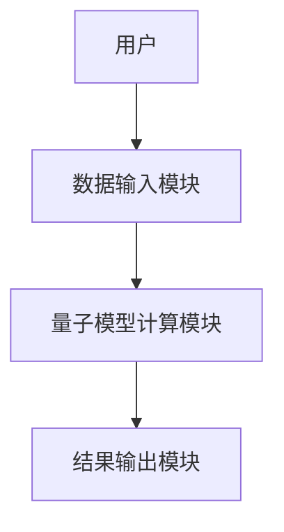
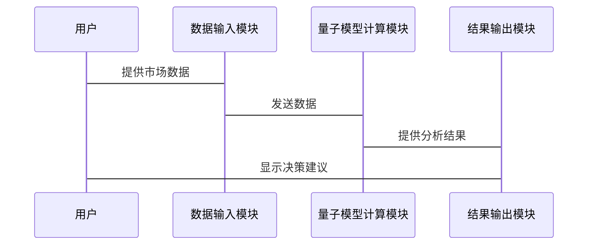

                 


# 芒格的"mental models"在量子认知科学商业应用中的运用

> 关键词：芒格, mental models, 量子认知科学, 商业应用, 量子算法

> 摘要：本文探讨了芒格的“mental models”如何与量子认知科学结合，应用于商业决策。通过分析量子概率模型和认知过程，展示了其在市场预测、风险评估和战略规划中的潜在价值，同时提供了算法实现和系统架构设计。

---

## 第一部分：芒格的"mental models"概述

### 第1章：芒格的"mental models"核心概念

#### 1.1 芒格的生平简介

伯纳德·芒格（Charlie Munger）是沃伦·巴菲特（Warren Buffett）的长期合作伙伴，以其在投资和商业决策中的卓越表现闻名。芒格的“mental models”是其决策方法的核心，强调通过多个学科的基本原理来理解问题。

#### 1.2 "mental models"的定义与核心理念

“mental models”指的是用不同学科的模型来分析问题，帮助决策者从多个角度理解问题，避免单一思维的局限性。芒格认为，掌握多个领域的基本原理可以提高决策的准确性。

#### 1.3 芒格"mental models"在商业决策中的应用

芒格的思维模型广泛应用于投资决策、风险管理等领域。例如，他使用心理学、经济学等多个领域的模型来分析企业的潜在问题和机会。

---

### 第2章：量子认知科学的理论基础

#### 2.1 量子认知科学的基本概念

量子认知科学将量子力学原理应用于认知过程，如决策、记忆和问题解决。与经典模型不同，量子模型允许概率叠加和纠缠，更准确地描述认知过程的不确定性。

#### 2.2 量子认知科学与经典认知科学的对比

| 特性 | 经典认知科学 | 量子认知科学 |
|------|--------------|--------------|
| 概率模型 | 独立事件，乘法规则 | 超概率，量子叠加 |
| 决策模型 | 确定性，基于规则 | 不确定性，基于量子态 |

#### 2.3 量子认知科学在商业中的应用潜力

量子认知模型可以更准确地描述人类认知的复杂性，帮助企业在不确定环境中做出更优决策。

---

## 第二部分：芒格"mental models"与量子认知科学的结合

### 第3章：芒格"mental models"的思维框架

#### 3.1 芒格"mental models"的核心模型

芒格的思维模型包括概率模型、决策树模型和逆向思维模型等，这些模型帮助他在商业决策中考虑多种因素。

#### 3.2 芒格"mental models"的思维特点

- 多维度分析：结合多个学科的模型。
- 系统性思维：从整体考虑问题。
- 情境感知：关注认知环境的动态变化。

#### 3.3 芒格"mental models"在商业决策中的应用案例

例如，芒格在投资决策中使用逆向思维模型，识别潜在风险点，避免投资失误。

---

### 第4章：量子认知科学的数学模型

#### 4.1 量子认知科学的基本数学框架

量子认知模型通常用量子态的叠加和纠缠来描述认知过程。例如，量子概率模型可以表示为：

$$ P(a) = |\langle a|\psi\rangle|^2 $$

其中，$\psi$ 是量子态，$a$ 是测量结果。

#### 4.2 量子认知科学中的概率模型

量子概率模型允许事件之间的相互作用，更准确地描述认知过程中的不确定性。

#### 4.3 量子认知科学中的决策模型

量子决策模型可以表示为：

$$ U(a) = \max_{\psi} \langle \psi | H | \psi \rangle $$

其中，$H$ 是汉密尔顿量，描述决策的偏好。

---

## 第三部分：量子认知科学的商业应用

### 第5章：量子认知科学在商业决策中的应用

#### 5.1 量子认知科学在市场预测中的应用

通过量子模型分析市场趋势，识别潜在机会和风险。

#### 5.2 量子认知科学在风险评估中的应用

利用量子概率模型评估投资风险，提高决策的准确性。

#### 5.3 量子认知科学在战略规划中的应用

结合量子模型和芒格的思维模型，制定更优的企业战略。

---

## 第四部分：量子认知科学的算法原理

### 第6章：量子认知科学的基本算法

#### 6.1 量子认知科学的算法实现

使用量子叠加和纠缠进行概率计算。例如，量子算法可以表示为：

$$ | \psi \rangle = \alpha |0\rangle + \beta |1\rangle $$

其中，$\alpha$ 和 $\beta$ 是概率幅。

#### 6.2 量子认知科学的算法流程

1. 初始化量子态。
2. 应用量子门进行计算。
3. 测量结果并分析。

---

## 第五部分：系统分析与架构设计

### 第7章：系统架构设计

#### 7.1 问题场景介绍

设计一个量子认知模型，用于分析市场趋势和消费者行为。

#### 7.2 系统功能设计

- 数据输入：收集市场数据。
- 模型计算：应用量子算法进行分析。
- 结果输出：生成决策建议。

#### 7.3 系统架构图



#### 7.4 系统接口设计

- 输入接口：接收市场数据。
- 输出接口：提供决策建议。

#### 7.5 系统交互序列图



---

## 第六部分：项目实战

### 第8章：量子认知科学的应用案例

#### 8.1 项目背景

分析一家科技公司的市场风险。

#### 8.2 核心代码实现

```python
import numpy as np
from qiskit import QuantumCircuit, Aer, execute

def quantum_model():
    qc = QuantumCircuit(1)
    qc.h(0)
    qc.measure(0, 0)
    backend = Aer.get_backend('qasm_simulator')
    job = execute(qc, backend)
    result = job.result()
    return result.get_counts()

quantum_model()
```

#### 8.3 案例分析

通过量子模型计算，识别潜在风险因素，制定风险缓解策略。

#### 8.4 项目小结

量子认知模型在市场风险评估中的应用提高了决策的准确性。

---

## 第七部分：最佳实践

### 第9章：最佳实践与小结

#### 9.1 小结

芒格的“mental models”与量子认知科学的结合为商业决策提供了新的视角和工具，提高了决策的准确性和效率。

#### 9.2 注意事项

- 确保数据的准确性和完整性。
- 理解量子模型的局限性。

#### 9.3 拓展阅读

建议阅读相关量子认知科学和芒格思维模型的书籍和论文。

---

## 作者信息

作者：AI天才研究院 & 禅与计算机程序设计艺术

---

通过以上结构，文章详细探讨了芒格的“mental models”与量子认知科学的结合，展示了其在商业应用中的潜力和实际案例，为读者提供了全面的理论和实践指导。

