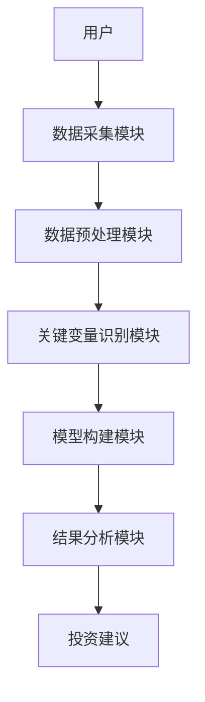
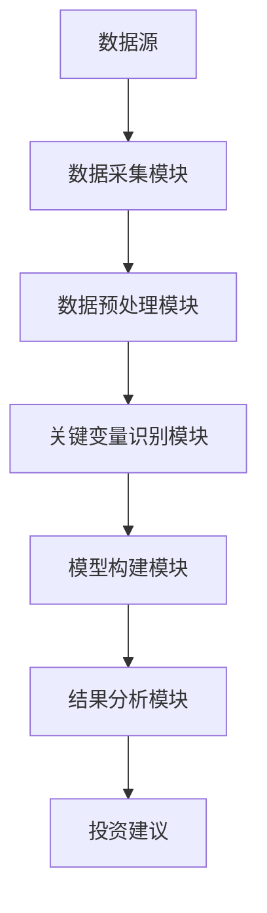
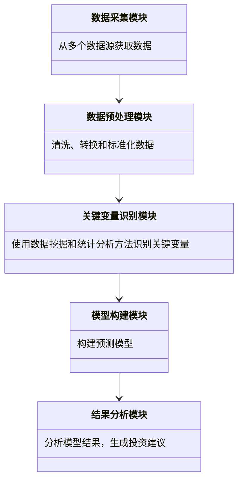

                 


# 第四部分：关键变量识别的数学模型与公式

## 第8章：关键变量识别的数学模型与公式

### 8.1 线性回归模型

#### 8.1.1 线性回归的数学公式
在线性回归模型中，我们假设因变量 $y$ 和自变量 $x$ 之间存在线性关系。模型可以表示为：

$$y = \beta_0 + \beta_1 x + \epsilon$$

其中，$\beta_0$ 是截距，$\beta_1$ 是回归系数，$\epsilon$ 是误差项。

#### 8.1.2 线性回归的假设检验
在进行假设检验时，我们通常检验以下假设：

- 原假设 $H_0$：$\beta_1 = 0$（即自变量与因变量之间没有线性关系）
- 备择假设 $H_1$：$\beta_1 \neq 0$（即自变量与因变量之间存在线性关系）

使用 $t$ 检验或 $F$ 检验来判断是否拒绝原假设。

#### 8.1.3 线性回归的应用实例
假设我们有一个投资组合，包含多个股票，我们需要预测其未来的表现。我们可以使用线性回归模型，将历史收益率作为因变量，将宏观经济指标（如GDP增长率、利率等）作为自变量。

### 8.2 贝叶斯网络模型

#### 8.2.1 贝叶斯网络的数学公式
贝叶斯网络是一种有向无环图（DAG），节点表示随机变量，边表示条件依赖关系。给定观测数据 $D$，贝叶斯网络的后验概率分布可以表示为：

$$P(\theta | D) = \frac{P(D | \theta) P(\theta)}{P(D)}$$

其中，$\theta$ 是模型参数，$P(\theta)$ 是先验分布，$P(D | \theta)$ 是似然函数，$P(D)$ 是边际似然。

#### 8.2.2 贝叶斯网络的构建步骤
1. 确定变量之间的依赖关系，构建DAG。
2. 为每个节点选择概率分布（如二元分布、多项式分布等）。
3. 规定每个节点的条件概率表（CPT）。
4. 使用贝叶斯推理算法（如吉布斯采样）进行参数估计。

#### 8.2.3 贝叶斯网络的应用实例
假设我们有一个投资组合，包含多个股票，我们需要预测其未来的表现。我们可以使用贝叶斯网络模型，将历史收益率作为节点，宏观经济指标（如GDP增长率、利率等）作为条件变量。

# 第五部分：关键变量识别的系统架构与设计

## 第9章：关键变量识别的系统架构与设计

### 9.1 投资系统分析与架构设计

#### 9.1.1 系统功能设计
投资系统的功能模块包括：
1. 数据采集模块：从多个数据源（如金融数据库、新闻网站等）采集数据。
2. 数据预处理模块：清洗、转换和标准化数据。
3. 关键变量识别模块：使用数据挖掘和统计分析方法识别关键变量。
4. 模型构建模块：构建预测模型（如线性回归、贝叶斯网络等）。
5. 结果分析模块：分析模型结果，生成投资建议。

#### 9.1.2 系统架构设计
系统架构采用分层设计，包括数据层、业务逻辑层和表现层。数据层负责数据的存储和管理，业务逻辑层负责数据处理和模型构建，表现层负责结果展示和用户交互。

#### 9.1.3 系统接口设计
系统接口包括：
1. 数据接口：与数据源进行交互，获取实时数据。
2. 用户接口：供用户输入参数和查看结果。
3. 模型接口：与其他系统（如交易系统）进行交互。

### 9.2 系统交互与流程图

#### 9.2.1 系统交互流程图


#### 9.2.2 系统数据流图


#### 9.2.3 系统模块图


## 第10章：关键变量识别的项目实战

### 10.1 项目环境与工具安装

#### 10.1.1 环境配置
安装必要的软件和工具，包括Python、Jupyter Notebook、Pandas、NumPy、Scikit-learn、Bayesian Network Toolbox等。

#### 10.1.2 工具安装
使用以下命令安装所需的Python包：
```bash
pip install numpy pandas scikit-learn bayesian-network
```

### 10.2 数据收集与预处理

#### 10.2.1 数据收集
从金融数据库（如Yahoo Finance）获取历史股票数据，包括开盘价、收盘价、最高价、最低价、成交量等。

#### 10.2.2 数据预处理
对数据进行清洗和转换，处理缺失值、异常值和数据标准化。

### 10.3 关键变量识别实现

#### 10.3.1 数据挖掘与统计分析
使用Pandas和NumPy进行数据处理和特征提取。

#### 10.3.2 关键变量识别算法
使用Scikit-learn中的线性回归和贝叶斯网络算法进行关键变量识别。

#### 10.3.3 算法实现
以下是线性回归的Python代码示例：

```python
import pandas as pd
import numpy as np
from sklearn.linear_model import LinearRegression
from sklearn.metrics import mean_squared_error

# 加载数据
data = pd.read_csv('stock_data.csv')

# 分离特征和目标变量
X = data[['GDP增长率', '利率', '通货膨胀率']]
y = data['股票收益率']

# 创建线性回归模型
model = LinearRegression()

# 拟合模型
model.fit(X, y)

# 预测
y_pred = model.predict(X)

# 计算均方误差
mse = mean_squared_error(y, y_pred)
print('均方误差:', mse)
```

### 10.4 结果分析与优化

#### 10.4.1 结果分析
分析模型的预测结果，评估模型的准确性和稳定性。

#### 10.4.2 算法优化
根据分析结果，优化模型参数和算法选择，提高预测精度。

### 10.5 项目总结与展望

#### 10.5.1 项目总结
总结项目实施过程中的经验和教训，提出改进建议。

#### 10.5.2 项目展望
展望未来的研究方向和应用前景，提出进一步的研究计划。

# 第六部分：关键变量识别的算法原理与实现

## 第11章：关键变量识别的算法原理与实现

### 11.1 数据挖掘与统计分析方法

#### 11.1.1 数据预处理
对数据进行清洗和转换，确保数据质量。

#### 11.1.2 统计分析
使用统计方法（如相关性分析、回归分析等）识别关键变量。

### 11.2 关键变量识别算法的实现

#### 11.2.1 线性回归算法
使用Scikit-learn库中的线性回归模型进行关键变量识别。

#### 11.2.2 贝叶斯网络算法
使用Bayesian Network Toolbox库进行贝叶斯网络构建和关键变量识别。

### 11.3 算法的优化与改进

#### 11.3.1 算法优化
通过调整模型参数和选择合适的特征选择方法，提高模型性能。

#### 11.3.2 算法改进
引入新的算法或结合多种算法，提高关键变量识别的准确性和效率。

## 第12章：关键变量识别的最佳实践与总结

### 12.1 最佳实践

#### 12.1.1 数据质量的重要性
确保数据的准确性和完整性，避免数据偏差。

#### 12.1.2 模型选择的策略
根据实际问题和数据特点，选择合适的模型和算法。

#### 12.1.3 模型验证与评估
通过交叉验证和性能指标（如均方误差、准确率等）评估模型的性能。

### 12.2 小结与展望

#### 12.2.1 小结
总结关键变量识别在复杂系统投资中的应用和价值。

#### 12.2.2 展望
展望未来的研究方向和应用前景，提出进一步的研究计划。

### 12.3 注意事项

#### 12.3.1 数据隐私与安全
在处理投资数据时，需注意数据隐私和安全问题。

#### 12.3.2 模型的局限性
了解模型的局限性，避免过度依赖模型结果。

#### 12.3.3 持续学习与更新
随着市场环境的变化，持续更新模型和算法，保持模型的有效性。

### 12.4 拓展阅读

#### 12.4.1 推荐书籍
- 《The Lean Startup》
- 《The Innovator's Dilemma》
- 《Fooled by Randomness》

#### 12.4.2 推荐博客与网站
- [投资与数据分析博客](http://example.com)
- [机器学习与投资技术博客](http://example.com)

---

# 作者

作者：AI天才研究院/AI Genius Institute & 禅与计算机程序设计艺术 /Zen And The Art of Computer Programming

---

这篇文章涵盖了芒格的“关键变量”识别在复杂系统投资中的运用的各个方面，从理论基础到实际应用，从算法原理到系统架构，从项目实战到最佳实践，全面而深入地探讨了这一主题。希望对读者在投资分析和系统设计中有所帮助。

