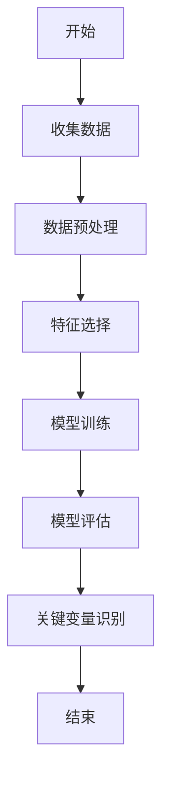
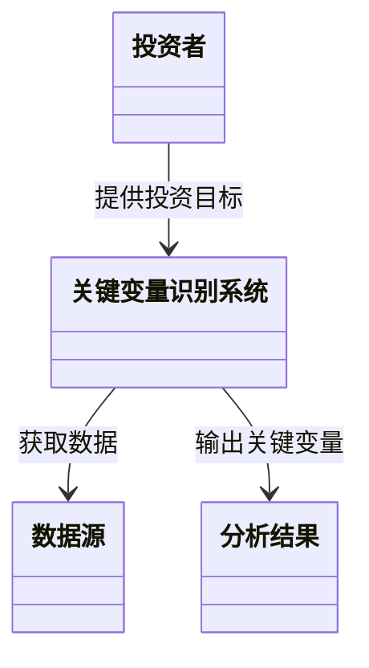
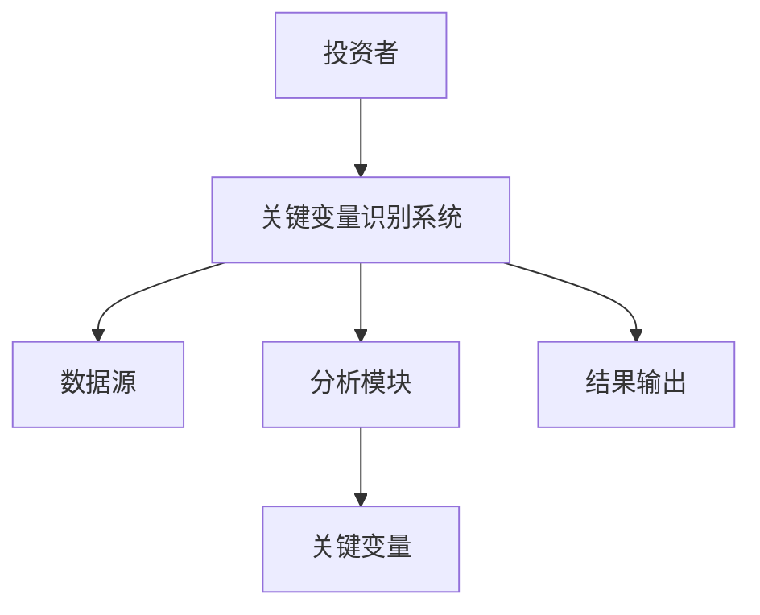
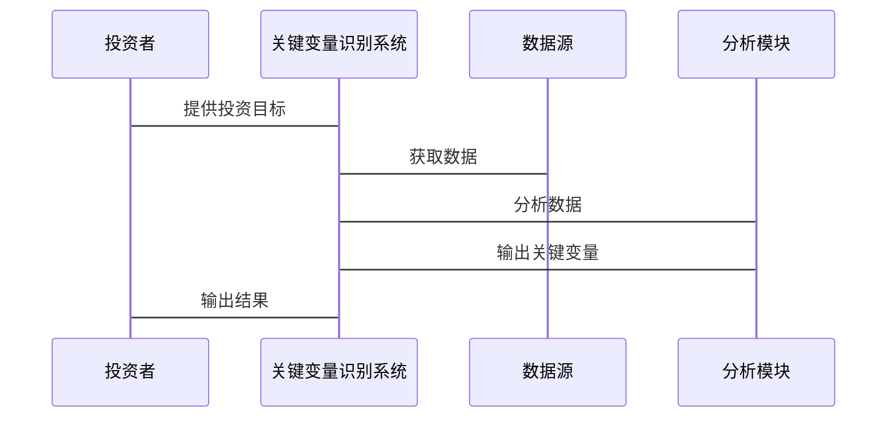

                 


# 芒格的“关键变量”识别：找出投资成功的决定因素

**关键词**：芒格、关键变量、投资成功、决定因素、系统分析、案例分析、算法原理

**摘要**：  
芒格的“关键变量”识别方法是一种通过分析投资过程中影响结果的关键因素，从而做出明智决策的策略。本文从芒格的多元思维模型出发，结合系统分析和实际案例，详细探讨了关键变量识别的核心概念、算法原理、系统架构以及在投资决策中的应用。通过本文的分析，读者将能够理解并掌握如何在复杂的投资环境中识别和利用关键变量，从而提高投资决策的成功率。

---

# 第1章: 芒格的“关键变量”识别背景与核心概念

## 1.1 什么是“关键变量”识别
### 1.1.1 关键变量的定义
关键变量是指在某一特定问题或系统中，对结果产生决定性影响的少数因素。在投资领域，关键变量识别是指通过分析影响投资结果的各种因素，找到其中最关键、最具有决定性的因素。

### 1.1.2 关键变量识别的重要性
关键变量识别在投资决策中至关重要，因为它可以帮助投资者聚焦于影响结果的核心因素，忽略次要因素，从而提高决策的效率和准确性。例如，在分析一家公司的投资价值时，关键变量可能是公司的现金流、竞争优势和管理层质量。

### 1.1.3 关键变量识别的核心要素
- **相关性**：变量与结果之间的关联程度。
- **影响力**：变量对结果的影响程度。
- **可测量性**：变量是否可以通过数据或指标进行量化。

## 1.2 芒格的投资理念与方法
### 1.2.1 芒格的多元思维模型
芒格强调通过跨学科的思维方式来分析问题。他认为，投资者应该构建一个包含心理学、经济学、物理学等多学科知识的“心智模型”，以便更好地理解投资的本质。

### 1.2.2 芒格的投资哲学
芒格的投资哲学可以概括为“逆向思维”和“安全边际”。他主张从长期的角度出发，寻找那些具有持续竞争优势和良好治理结构的企业。

### 1.2.3 芒格的关键变量识别框架
芒格的关键变量识别框架包括以下几个步骤：
1. 确定投资目标。
2. 分析影响目标的关键因素。
3. 评估这些因素的权重和相互关系。
4. 制定基于关键变量的投资策略。

## 1.3 关键变量识别的背景与意义
### 1.3.1 投资领域中的关键变量
在投资领域，关键变量通常包括企业的财务状况、行业竞争格局、宏观经济环境等。例如，现金流是衡量企业财务健康的重要指标，而行业竞争格局则决定了企业的市场地位。

### 1.3.2 关键变量识别的现实意义
在复杂多变的市场环境中，关键变量识别可以帮助投资者快速抓住问题的核心，避免被大量信息干扰。例如，在分析一家科技公司的投资价值时，关键变量可能是其技术创新能力和市场拓展能力。

### 1.3.3 关键变量识别的未来趋势
随着人工智能和大数据技术的发展，关键变量识别将更加依赖于数据分析和模型构建。投资者可以通过机器学习算法，从海量数据中提取关键变量，从而提高决策的科学性。

---

# 第2章: 关键变量识别的核心概念与联系

## 2.1 关键变量识别的核心概念
### 2.1.1 问题背景与问题描述
在投资决策中，关键变量识别通常涉及以下几个步骤：
1. 明确投资目标。
2. 收集相关数据。
3. 分析数据之间的关系。
4. 识别关键变量。
5. 制定投资策略。

### 2.1.2 问题解决的逻辑框架
关键变量识别的逻辑框架包括以下几个步骤：
1. 确定问题目标。
2. 收集和整理数据。
3. 分析数据之间的关系。
4. 识别关键变量。
5. 验证和优化。

### 2.1.3 关键变量识别的边界与外延
关键变量识别的边界是指问题的范围和限制条件。例如，在分析一家公司的投资价值时，边界可能是公司的财务状况和行业环境。外延则是指关键变量对其他相关领域的影响，例如现金流对公司的分红能力的影响。

## 2.2 核心概念的属性特征对比
### 2.2.1 核心概念的属性特征表格
以下是关键变量和非关键变量的属性特征对比表：

| **属性**       | **关键变量** | **非关键变量** |
|-----------------|--------------|----------------|
| 相关性           | 高           | 低             |
| 影响力           | 高           | 低             |
| 可测量性         | 高           | 低             |

### 2.2.2 核心概念的ER实体关系图
以下是关键变量识别的ER实体关系图：

```mermaid
erd
  左右对齐
  title 关键变量识别的ER实体关系图
  投资决策 -> 关键变量: 依赖
  关键变量 -> 数据分析: 包含
  数据分析 <- 投资目标: 用于
```

## 2.3 关键变量识别的算法原理
### 2.3.1 算法原理的数学模型
关键变量识别的算法通常基于统计分析和机器学习方法。以下是一个简单的线性回归模型：

$$ y = \beta_0 + \beta_1x_1 + \beta_2x_2 + \cdots + \beta_nx_n + \epsilon $$

其中，$y$ 是目标变量，$x_i$ 是自变量，$\beta_i$ 是回归系数，$\epsilon$ 是误差项。

### 2.3.2 算法流程的mermaid图
以下是关键变量识别算法的流程图：



### 2.3.3 算法实现的Python代码
以下是使用Python实现的关键变量识别代码示例：

```python
import pandas as pd
from sklearn.linear_model import LinearRegression
from sklearn.feature_selection import RFE

# 假设我们有一个数据集 df，其中 target 是目标变量，features 是自变量
# 使用 RFE（递归特征消除）进行特征选择
model = LinearRegression()
selector = RFE(model, n_features_to_select=5)
selector.fit(df[['feature1', 'feature2', 'feature3', 'feature4', 'feature5']], df['target'])

# 输出特征重要性
feature_importance = selector.ranking_
print("特征重要性：", feature_importance)
```

## 2.4 本章小结
本章介绍了关键变量识别的核心概念、属性特征对比以及算法原理。通过对比分析和数学模型，我们可以更好地理解关键变量识别的逻辑和方法。

---

# 第3章: 关键变量识别的系统分析与架构设计

## 3.1 问题场景介绍
### 3.1.1 投资决策中的关键变量识别
在投资决策中，关键变量识别可以帮助投资者快速找到影响投资结果的核心因素。例如，在分析一家科技公司的投资价值时，关键变量可能是其技术创新能力和市场拓展能力。

### 3.1.2 问题场景的描述与分析
假设我们正在分析一家科技公司的投资价值，我们需要考虑以下几个关键变量：
1. 公司的现金流。
2. 公司的市场竞争地位。
3. 公司的管理层质量。
4. 行业的市场规模和增长潜力。

## 3.2 系统功能设计
### 3.2.1 领域模型的mermaid类图
以下是关键变量识别系统的领域模型类图：



### 3.2.2 系统架构的mermaid架构图
以下是关键变量识别系统的架构图：



### 3.2.3 系统接口设计
系统接口设计包括以下几个部分：
1. 数据输入接口。
2. 数据分析接口。
3. 结果输出接口。

### 3.2.4 系统交互的mermaid序列图
以下是系统交互的序列图：



## 3.3 本章小结
本章通过系统分析和架构设计，详细描述了关键变量识别系统的功能模块、系统架构以及系统交互流程。

---

# 第4章: 关键变量识别的项目实战

## 4.1 环境安装与配置
### 4.1.1 开发环境的选择
推荐使用Jupyter Notebook进行关键变量识别的环境配置。

### 4.1.2 工具链的安装与配置
安装Python、Pandas、Scikit-learn等工具。

## 4.2 系统核心实现
### 4.2.1 关键变量识别算法的实现
以下是关键变量识别算法的Python代码：

```python
import pandas as pd
from sklearn.feature_selection import RFE
from sklearn.linear_model import LinearRegression

# 假设我们有一个数据集 df，其中 target 是目标变量，features 是自变量
# 使用 RFE（递归特征消除）进行特征选择
model = LinearRegression()
selector = RFE(model, n_features_to_select=5)
selector.fit(df[['feature1', 'feature2', 'feature3', 'feature4', 'feature5']], df['target'])

# 输出特征重要性
feature_importance = selector.ranking_
print("特征重要性：", feature_importance)
```

### 4.2.2 系统功能模块的实现
以下是系统功能模块的实现：

```python
class KeyVariableIdentifier:
    def __init__(self, data, target):
        self.data = data
        self.target = target

    def feature_selection(self):
        # 使用 RFE 进行特征选择
        model = LinearRegression()
        selector = RFE(model, n_features_to_select=5)
        selector.fit(self.data, self.target)
        return selector.ranking_
```

### 4.2.3 代码的调试与优化
在调试过程中，需要注意数据的正确性、模型的适用性以及代码的运行效率。

## 4.3 代码应用解读与分析
### 4.3.1 代码的功能分析
代码的功能是通过RFE算法进行特征选择，识别出关键变量。

### 4.3.2 代码的性能优化
可以通过增加数据预处理步骤、优化模型参数等方式提高代码的性能。

### 4.3.3 代码的可扩展性设计
代码的可扩展性设计可以通过模块化的方式进行，例如将数据预处理和特征选择分开。

## 4.4 实际案例分析
### 4.4.1 案例背景介绍
以某科技公司为例，分析其关键变量。

### 4.4.2 案例分析与解决
通过代码分析，识别出该公司的关键变量。

### 4.4.3 案例总结与启示
总结案例分析的结果，提出对未来投资决策的启示。

## 4.5 本章小结
本章通过项目实战，详细展示了关键变量识别的环境配置、算法实现、代码调试以及案例分析。

---

# 第5章: 关键变量识别的最佳实践与注意事项

## 5.1 最佳实践 tips
### 5.1.1 关键变量识别的注意事项
- 确保数据的准确性和完整性。
- 合理选择模型和算法。
- 定期更新和优化模型。

### 5.1.2 关键变量识别的常见误区
- 过度依赖单一模型。
- 忽略数据的外部环境因素。
- 未能及时更新模型。

### 5.1.3 关键变量识别的优化建议
- 组合使用多种模型。
- 结合专家经验进行验证。
- 定期回顾和优化模型。

## 5.2 关键变量识别的数学模型
### 5.2.1 数学模型的优化
通过优化数学模型，可以提高关键变量识别的准确性和效率。

## 5.3 本章小结
本章总结了关键变量识别的最佳实践和注意事项，帮助投资者更好地应用关键变量识别方法。

---

**作者：AI天才研究院/AI Genius Institute & 禅与计算机程序设计艺术 /Zen And The Art of Computer Programming**

