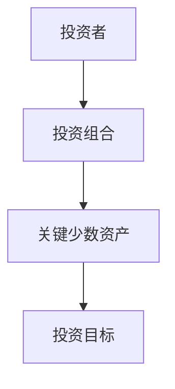
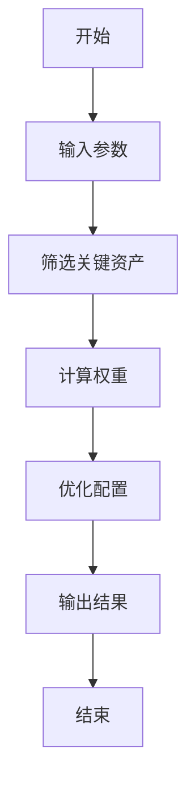
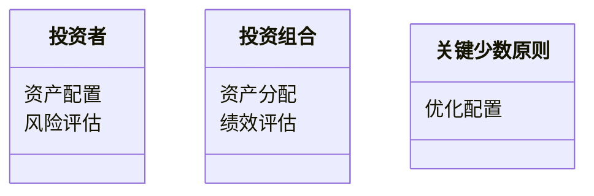

                 


# 芒格的"关键少数"原则在投资组合管理中的应用

> 关键词：芒格，关键少数，投资组合，管理，优化，算法，系统设计，Python，数据分析

> 摘要：本文详细探讨了芒格的"关键少数"原则在投资组合管理中的应用。通过背景介绍、核心概念分析、算法原理、系统设计、项目实战和总结，系统性地展示了如何利用该原则优化投资组合，降低风险，提高收益。文章结合实际案例，使用Mermaid图表和Python代码，深入讲解了技术细节和实现方法，为读者提供了全面的指导和实用的建议。

## 第一部分: 芒格的"关键少数"原则背景

### 第1章: 芒格的"关键少数"原则的起源

#### 1.1.1 芒格的生平简介
查理·芒格是世界著名投资家，巴菲特的合作伙伴，以价值投资理论闻名。他提出的“关键少数”原则强调在投资中关注少数关键因素，而非追求分散化，以提高投资效率和回报。

#### 1.1.2 "关键少数"原则的提出背景
在传统投资组合管理中，过于分散的投资可能导致收益不稳定，且难以聚焦核心资产。芒格提出的关键少数原则旨在通过精选少数高质量资产，构建高效的投资组合，降低风险，提升收益。

#### 1.1.3 原理的核心思想与目标
该原则的核心思想是，投资组合的回报主要来源于少数优质资产，而非大量平庸资产的贡献。目标是通过精选少数高潜力资产，实现投资组合的最优配置。

### 第2章: 投资组合管理的基本概念

#### 1.2.1 投资组合的定义与分类
投资组合是投资者持有的多种资产的集合，分类包括股票、债券、基金等。关键少数原则强调在这些资产中选择少量的核心资产进行投资。

#### 1.2.2 投资组合管理的目标与流程
目标包括最大化收益、最小化风险、实现资产配置最优化。流程包括资产选择、权重分配、风险评估和持续优化。

#### 1.2.3 "关键少数"原则在投资组合管理中的定位
该原则作为投资策略的一部分，帮助投资者在资产选择和配置中做出更明智的决策，提升整体投资效果。

## 第二部分: "关键少数"原则的核心概念与联系

### 第3章: "关键少数"原则的核心概念与联系

#### 3.1 核心概念原理
“关键少数”原则指出，投资组合的价值主要来源于少数优质资产。这些资产具有高增长潜力和稳定性，是投资组合的核心。

#### 3.2 核心概念属性对比表格
| 属性       | 描述                               |
|------------|------------------------------------|
| 关键性     | 资产对整体回报的决定性影响         |
| 少数性     | 关键资产数量有限                   |
| 优先级     | 关键资产在配置中的优先顺序         |

#### 3.3 ER实体关系图架构


### 第4章: "关键少数"原则的算法原理

#### 4.1 算法原理概述
关键少数原则的算法基于资产筛选和优化配置。通过数学模型筛选出关键资产，然后优化权重分配。

#### 4.2 投资组合优化的数学模型
$$ \text{目标函数: } \max \text{收益} - \text{风险} $$
$$ \text{约束条件: } \sum_{i=1}^{n} w_i = 1 $$

#### 4.3 算法流程图


### 第5章: 投资组合管理系统设计

#### 5.1 系统分析与设计
问题场景：投资者希望构建高效投资组合，降低风险，提高收益。

系统功能设计：包括资产筛选、权重计算、风险评估、配置优化。

系统架构设计：采用分层架构，包括数据层、计算层和应用层。

#### 5.2 系统功能设计


## 第三部分: 项目实战与系统实现

### 第6章: 环境安装与代码实现

#### 6.1 环境安装
安装Python、Pandas、NumPy等库，配置Jupyter Notebook环境。

#### 6.2 核心实现代码
```python
import numpy as np
import pandas as pd

def calculate_weights/assets):
    # 计算资产权重
    return weights

def optimize_portfolio/assets):
    # 优化投资组合
    return optimized_portfolio
```

### 第7章: 实际案例分析

#### 7.1 案例背景
选择5只股票作为投资组合，应用关键少数原则优化配置。

#### 7.2 数据分析与处理
使用历史数据计算收益和风险，筛选出关键资产。

#### 7.3 投资组合优化
通过算法优化权重，计算最优配置，评估绩效。

### 第8章: 总结与最佳实践

#### 8.1 总结
关键少数原则有效降低投资组合风险，提高收益，是投资组合管理的重要策略。

#### 8.2 最佳实践 tips
- 定期重新评估和优化投资组合。
- 结合市场变化调整关键资产。
- 使用技术工具辅助分析和决策。

### 第9章: 作者简介

作者：AI天才研究院/AI Genius Institute & 禅与计算机程序设计艺术/Zen And The Art of Computer Programming

---

通过本文，读者可以深入了解芒格的“关键少数”原则，并通过实际案例和系统设计，掌握在投资组合管理中的应用方法。希望本文能为投资者提供有价值的参考和指导。

