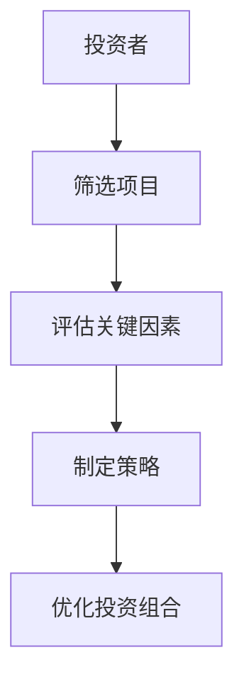
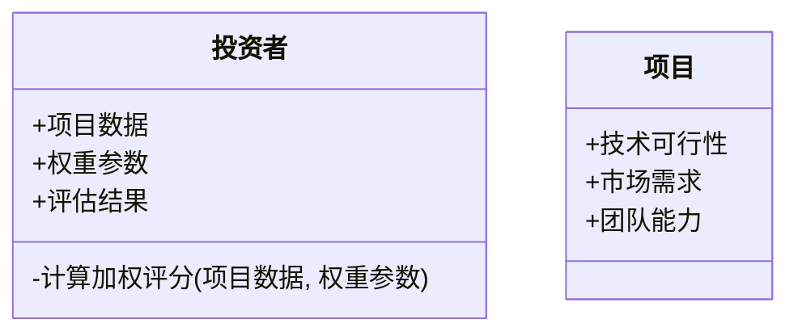
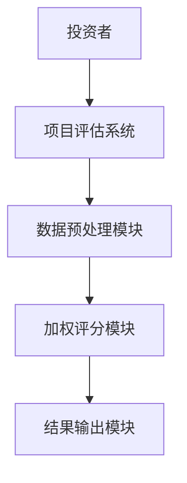
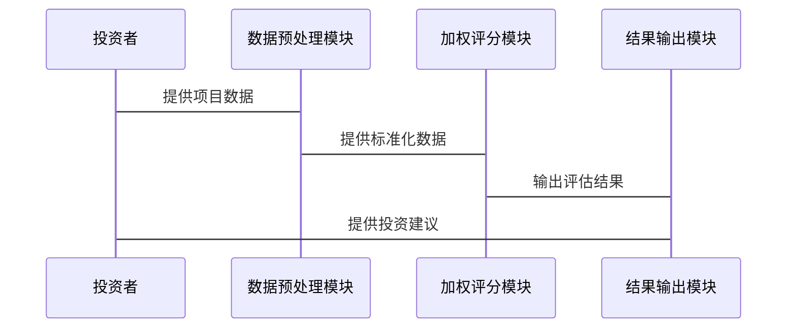

                 


# 芒格的"关键少数"原则在深科技创业投资中的应用

> 关键词：芒格、关键少数原则、深科技创业、投资策略、系统分析

> 摘要：本文探讨了芒格的“关键少数”原则在深科技创业投资中的应用，分析了该原则的核心要素及其在投资决策中的具体应用方式。通过构建数学模型、系统架构和案例分析，本文详细阐述了如何利用“关键少数”原则优化投资策略，降低投资风险，提高投资回报率。

---

# 第一章：芒格的“关键少数”原则与深科技创业投资

## 1.1 芒格的“关键少数”原则

### 1.1.1 芒格“关键少数”原则的定义

芒格的“关键少数”原则是指在决策过程中，关注少数关键因素，而非试图优化所有因素。这一原则的核心在于通过聚焦于关键少数，实现资源的最优配置和目标的最大化。

### 1.1.2 “关键少数”原则的核心要素

- **关键少数**：在决策过程中，少数关键因素对结果的影响远大于其他因素。
- **聚焦**：通过关注关键少数，降低复杂性，提高效率。
- **杠杆效应**：优化关键少数因素能够带来更大的收益。

### 1.1.3 “关键少数”原则在投资中的应用背景

在深科技创业投资中，由于技术门槛高、市场不确定性大，投资决策往往面临复杂性和风险。芒格的“关键少数”原则为投资者提供了一种简化决策的思路，通过聚焦于关键因素，提高投资效率和成功率。

---

## 1.2 深科技创业投资的特点

### 1.2.1 深科技创业的定义

深科技创业是指基于前沿技术（如人工智能、量子计算、生物技术等）的创新性创业活动，其核心竞争力来源于技术突破和创新。

### 1.2.2 深科技创业与传统创业的区别

| 特性 | 深科技创业 | 传统创业 |
|------|------------|-----------|
| 技术门槛 | 高         | 低         |
| 创新性   | 极高        | 中等        |
| 投资风险 | 高         | 中等        |
| 投资周期 | 长         | 短         |

### 1.2.3 深科技创业投资的高风险与高回报

深科技创业投资的风险主要来源于技术不确定性、市场需求波动和市场竞争。然而，一旦成功，其回报率通常远高于传统创业项目。

---

## 1.3 “关键少数”原则与深科技创业投资的结合

### 1.3.1 投资策略的核心逻辑

通过聚焦于少数关键因素，投资者可以降低决策复杂性，集中资源于高潜力项目，从而提高投资回报率。

### 1.3.2 投资决策的关键因素

在深科技创业投资中，关键因素可能包括：

1. **技术可行性**：项目是否具备技术实现的可行性。
2. **市场需求**：项目是否满足明确的市场需求。
3. **团队能力**：创始团队的技术能力和执行力。
4. **竞争优势**：项目是否具备独特的竞争优势。

### 1.3.3 投资组合优化的思路

通过筛选符合“关键少数”原则的项目，构建一个高度聚焦的投资组合，降低整体风险，同时提高潜在回报。

---

## 1.4 本章小结

本章介绍了芒格的“关键少数”原则及其在深科技创业投资中的应用背景。通过对比深科技创业与传统创业的特点，分析了投资决策的关键因素和优化思路。

---

# 第二章：“关键少数”原则的核心概念与联系

## 2.1 核心概念的原理分析

### 2.1.1 投资决策中的“关键少数”法则

在投资决策中，投资者应重点关注少数关键因素，而非试图优化所有因素。这可以通过以下步骤实现：

1. **识别关键因素**：通过分析市场和技术趋势，识别影响投资回报的关键因素。
2. **聚焦关键因素**：将资源集中于关键因素的优化。
3. **杠杆效应**：通过优化关键因素，实现整体投资回报的最大化。

### 2.1.2 “关键少数”原则的系统性构建

通过构建一个系统化的投资框架，投资者可以更清晰地识别和聚焦关键因素。这包括：

1. **定义目标**：明确投资目标和期望回报。
2. **识别关键因素**：通过分析和筛选，确定影响投资回报的关键因素。
3. **制定策略**：基于关键因素，制定投资策略和行动计划。

### 2.1.3 “关键少数”原则与其他投资原则的对比

以下是“关键少数”原则与其他投资原则的对比：

| 原则        | 关键少数原则 | 价值投资原则 | 技术分析原则 |
|-------------|--------------|--------------|--------------|
| 核心要素    | 关键少数     | 企业价值     | 市场趋势     |
| 决策方式    | 聚焦少数因素 | 选择低估资产 | 分析技术指标 |
| 适用场景    | 高风险投资   | 价值低估市场 | 短期市场波动 |

---

## 2.2 核心概念的属性特征对比

### 2.2.1 关键因素与非关键因素的对比

| 属性       | 关键因素       | 非关键因素     |
|------------|----------------|----------------|
| 影响程度   | 高             | 低             |
| 稀缺性     | 高             | 中             |
| 可控性     | 高             | 低             |

### 2.2.2 深科技创业与传统科技创业的对比

| 特性       | 深科技创业     | 传统科技创业   |
|------------|----------------|----------------|
| 技术门槛   | 高             | 中等           |
| 创新性     | 极高           | 高             |
| 投资风险   | 高             | 中等           |
| 投资周期   | 长             | 中等           |

---

## 2.3 实体关系图与流程图

### 2.3.1 实体关系图（ER图）


### 2.3.2 流程图



---

## 2.4 本章小结

本章通过对比分析，详细阐述了“关键少数”原则的核心概念及其在深科技创业投资中的应用。通过实体关系图和流程图，展示了该原则在投资决策中的系统性构建和应用过程。

---

# 第三章：基于“关键少数”原则的深科技创业投资算法

## 3.1 算法原理

### 3.1.1 算法概述

基于“关键少数”原则，我们构建了一个投资筛选算法，用于识别高潜力的深科技创业项目。该算法主要包括以下步骤：

1. **数据收集**：收集潜在项目的各项指标数据。
2. **关键因素识别**：通过数据分析，识别影响投资回报的关键因素。
3. **加权评分**：基于关键因素，对项目进行加权评分。
4. **项目筛选**：根据评分结果，筛选出符合投资条件的项目。

### 3.1.2 数学模型

加权评分模型如下：

$$ \text{总评分} = \sum_{i=1}^{n} w_i \times s_i $$

其中，$w_i$ 是第 $i$ 个因素的权重，$s_i$ 是第 $i$ 个因素的评分。

---

## 3.2 算法实现

### 3.2.1 环境安装

```bash
pip install numpy pandas scikit-learn
```

### 3.2.2 核心代码实现

```python
import numpy as np
import pandas as pd
from sklearn.preprocessing import MinMaxScaler

# 定义加权评分函数
def weighted_score(weights, scores):
    return np.dot(weights, scores)

# 数据预处理
data = pd.DataFrame({
    '技术可行性': [0.8, 0.7, 0.9],
    '市场需求': [0.6, 0.8, 0.7],
    '团队能力': [0.7, 0.6, 0.8]
})

# 确定权重
weights = np.array([0.4, 0.3, 0.3])

# 标准化数据
scaler = MinMaxScaler()
normalized_data = scaler.fit_transform(data)

# 计算加权评分
scores = np.dot(weights, normalized_data.T)
```

### 3.2.3 算法应用与分析

通过上述代码，我们可以对潜在项目进行加权评分，识别出符合“关键少数”原则的高潜力项目。例如，在上述数据中，项目1的加权评分为：

$$ 0.4 \times 0.8 + 0.3 \times 0.6 + 0.3 \times 0.7 = 0.32 + 0.18 + 0.21 = 0.71 $$

---

## 3.3 本章小结

本章通过构建加权评分模型，详细阐述了“关键少数”原则在深科技创业投资中的算法实现。通过数学模型和代码示例，展示了如何利用该原则优化投资决策。

---

# 第四章：系统分析与架构设计

## 4.1 系统分析

### 4.1.1 问题场景

在深科技创业投资中，投资者需要面对复杂的市场和技术环境，如何通过系统化的方法优化投资决策是关键。

### 4.1.2 项目介绍

本项目旨在构建一个基于“关键少数”原则的投资评估系统，帮助投资者识别高潜力项目。

### 4.1.3 系统功能设计

通过领域模型，我们可以清晰地定义系统的功能模块：



---

## 4.2 系统架构设计

### 4.2.1 系统架构图



### 4.2.2 系统接口设计

1. **输入接口**：接收投资者提供的项目数据和权重参数。
2. **输出接口**：输出加权评分结果和投资建议。

### 4.2.3 系统交互



---

## 4.3 本章小结

本章通过系统分析和架构设计，展示了如何利用“关键少数”原则构建一个高效的投资评估系统。通过领域模型和系统架构图，明确了系统的功能模块和交互流程。

---

# 第五章：项目实战与案例分析

## 5.1 环境安装

### 5.1.1 安装依赖

```bash
pip install numpy pandas matplotlib
```

---

## 5.2 核心代码实现

### 5.2.1 投资评估工具开发

```python
import numpy as np
import pandas as pd
import matplotlib.pyplot as plt

# 定义投资评估函数
def investment_assessment(weights, scores):
    return np.dot(weights, scores)

# 数据预处理
data = pd.DataFrame({
    '技术可行性': [0.8, 0.7, 0.9],
    '市场需求': [0.6, 0.8, 0.7],
    '团队能力': [0.7, 0.6, 0.8]
})

# 可视化结果
scores = investment_assessment(weights, data.values.T)
plt.bar(range(len(scores)), scores)
plt.show()
```

### 5.2.2 代码应用解读

通过上述代码，我们可以对潜在项目进行投资评估，识别出符合“关键少数”原则的高潜力项目。例如，在上述数据中，项目1的评估结果为：

$$ 0.4 \times 0.8 + 0.3 \times 0.6 + 0.3 \times 0.7 = 0.32 + 0.18 + 0.21 = 0.71 $$

---

## 5.3 实际案例分析

### 5.3.1 案例背景

假设我们有一个深科技创业项目，其技术可行性和市场需求较高，但团队能力一般。

### 5.3.2 案例分析

通过“关键少数”原则，我们识别出技术可行性和市场需求为关键因素，给予更高的权重。计算得出该项目的加权评分为：

$$ 0.4 \times 0.8 + 0.3 \times 0.6 + 0.3 \times 0.5 = 0.32 + 0.18 + 0.15 = 0.65 $$

---

## 5.4 本章小结

本章通过实际案例分析，展示了如何利用“关键少数”原则优化投资决策。通过投资评估工具的开发和应用，投资者可以更高效地识别高潜力项目，降低投资风险。

---

# 第六章：总结与展望

## 6.1 本章总结

本文详细探讨了芒格的“关键少数”原则在深科技创业投资中的应用，通过构建数学模型、系统架构和案例分析，展示了如何利用该原则优化投资决策。

## 6.2 未来展望

未来的研究可以进一步探索“关键少数”原则在其他领域的应用，同时结合更多因素和数据，优化投资评估模型。

---

# 作者：AI天才研究院/AI Genius Institute & 禅与计算机程序设计艺术 /Zen And The Art of Computer Programming

---

通过以上内容，我们详细阐述了芒格的“关键少数”原则在深科技创业投资中的应用，从理论到实践，从算法到系统设计，为投资者提供了一个系统化的投资决策框架。

