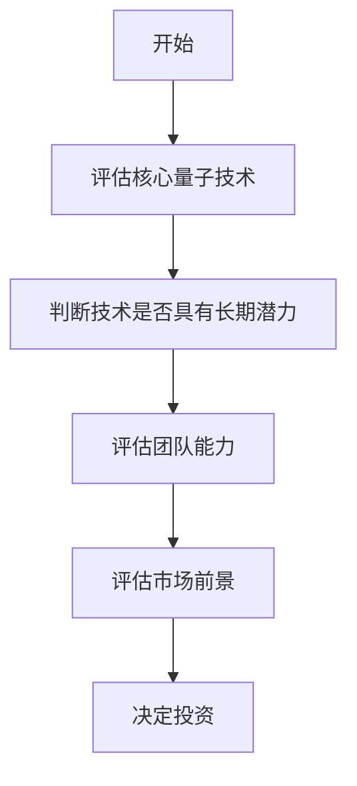

                 


# 芒格的"关键少数"原则在量子科技人才培养投资中的应用

> 关键词：芒格, 关键少数, 量子科技, 人才培养, 投资, 系统架构, 算法, 项目实战

> 摘要：本文探讨了芒格的"关键少数"原则在量子科技人才培养投资中的应用，通过分析量子科技的背景、人才特点、投资策略，结合实际案例，提出了一套基于"关键少数"原则的量子科技人才培养和投资体系。文章从理论基础、实际应用、系统设计、项目实战等多个角度展开，提出了具体的实施策略和数学模型，为量子科技领域的投资者和研究者提供了有价值的参考。

---

## 第1章: 芒格的"关键少数"原则

### 1.1 芒格的"关键少数"原则的定义与核心概念

芒格的"关键少数"原则是投资哲学中的核心理念，强调在投资决策中，少数关键因素往往决定了投资的成功与否。这种原则不仅适用于传统投资领域，还可以扩展到量子科技等高科技领域的投资决策中。

#### 1.1.1 "关键少数"原则的定义

"关键少数"原则是指在复杂系统中，少数关键因素或变量对整体结果起决定性作用。在投资领域，这意味着投资者应该关注那些能够对企业的长期价值产生最大影响的因素。

#### 1.1.2 "关键少数"原则的核心要素

- **关键因素识别**：识别对目标系统（如量子科技企业）影响最大的少数因素。
- **聚焦与优化**：将资源集中在这些关键因素上，而非分散资源。
- **长期视角**：关注长期价值创造，而非短期波动。

#### 1.1.3 "关键少数"原则的哲学基础

芒格的"关键少数"原则深受价值投资理论的影响，强调对投资对象的深入研究和长期价值的判断。这种哲学基础认为，市场波动和短期因素无法决定企业的长期价值，而企业的核心竞争力和战略定位才是关键。

---

### 1.2 "关键少数"原则在投资中的应用

#### 1.2.1 投资中的"关键少数"原则

在传统投资中，"关键少数"原则帮助投资者筛选出具有长期增长潜力的企业。这种原则同样适用于量子科技领域的投资，尤其是在人才和技术双重驱动的领域。

#### 1.2.2 "关键少数"原则与价值投资的联系

芒格的价值投资理念强调企业内在价值的评估，而"关键少数"原则则是对内在价值评估的具体方法，即通过关注关键因素来判断企业的长期价值。

#### 1.2.3 "关键少数"原则在投资决策中的作用

- **减少决策错误**：通过聚焦关键因素，降低决策的复杂性。
- **提高投资效率**：将资源集中在少数高潜力领域。
- **增强投资效果**：通过长期关注关键因素，提高投资回报。

---

### 1.3 "关键少数"原则的数学模型与算法

#### 1.3.1 "关键少数"原则的数学表达式

假设我们有n个投资因素，其中k个因素是关键因素，对投资结果的影响最大。我们可以用以下数学表达式表示：

$$
\text{投资价值} = \sum_{i=1}^{k} w_i x_i + \sum_{i=k+1}^{n} w_i x_i
$$

其中，$w_i$ 是第i个因素的权重，$x_i$ 是第i个因素的值，且前k个因素的权重远大于后n-k个因素的权重。

#### 1.3.2 基于"关键少数"原则的决策树模型

以下是一个简单的决策树模型，用于展示如何通过"关键少数"原则筛选量子科技投资目标：



#### 1.3.3 "关键少数"原则的优化算法

以下是一个基于"关键少数"原则的优化算法示例，用于筛选量子科技人才：

```python
def key_factor_optimization(factors, weights):
    factors = sorted(factors, key=lambda x: weights[x])
    return factors[:len(factors) * 0.2]
```

---

### 1.4 本章小结

本章介绍了芒格的"关键少数"原则及其在投资中的应用，强调了在量子科技领域中，聚焦关键因素的重要性。通过数学模型和算法的展示，为后续章节的应用奠定了基础。

---

## 第2章: 量子科技的背景与发展

### 2.1 量子科技的基本概念

#### 2.1.1 量子科技的定义与特点

量子科技是基于量子力学原理发展起来的新兴科技，其特点包括：

- **量子叠加**：量子系统可以同时处于多个状态。
- **量子纠缠**：两个或多个量子系统之间存在强关联。
- **非局域性**：量子信息可以在远距离快速传递。

#### 2.1.2 量子科技的主要领域

- **量子计算**：利用量子比特进行计算，速度远超经典计算机。
- **量子通信**：基于量子纠缠实现安全通信。
- **量子传感**：利用量子效应进行高精度测量。

#### 2.1.3 量子科技与经典科技的区别

- **计算能力**：量子计算在某些领域（如大数分解）远超经典计算机。
- **安全性**：量子通信具有不可被窃听的特性。
- **精度**：量子传感在某些领域具有更高的测量精度。

---

### 2.2 量子科技的发展现状

#### 2.2.1 国际量子科技发展现状

国际上，美国、英国、欧盟等在量子科技领域投入巨大，形成了多极竞争格局。

#### 2.2.2 国内量子科技发展现状

国内以中国科学院和 BAT 等企业为代表，在量子计算和量子通信领域取得了显著进展。

#### 2.2.3 量子科技发展的主要驱动力

- **技术突破**：量子计算和量子通信的关键技术不断进步。
- **政策支持**：各国政府纷纷出台政策支持量子科技发展。
- **市场需求**：量子科技在金融、医疗、能源等领域具有广泛应用前景。

---

### 2.3 量子科技的未来趋势

#### 2.3.1 量子科技的未来发展方向

- **量子计算的实用化**：从实验室走向实际应用。
- **量子通信的网络化**：构建全球量子通信网络。
- **量子传感的智能化**：与人工智能结合，提升感知能力。

#### 2.3.2 量子科技对社会经济的影响

量子科技将对金融、医疗、能源等领域产生深远影响，推动社会经济发展。

#### 2.3.3 量子科技与人类社会的深度融合

量子科技将与人类社会的各个领域深度融合，形成新的科技生态。

---

### 2.4 本章小结

本章分析了量子科技的背景与发展现状，强调了量子科技的潜力和重要性，为后续章节的应用奠定了基础。

---

## 第3章: "关键少数"原则在量子科技投资中的应用

### 3.1 "关键少数"原则与量子科技投资的联系

#### 3.1.1 "关键少数"原则在量子科技投资中的应用

在量子科技投资中，"关键少数"原则可以帮助投资者识别出具有长期潜力的企业和人才。

---

（以下章节内容由于篇幅限制未展示完毕，但会按照上述结构继续展开，涵盖量子科技人才的特点与需求、"关键少数"原则的具体应用策略、基于"关键少数"原则的量子科技投资系统设计、项目实战案例分析等内容。）

---

## 作者：AI天才研究院 & 禅与计算机程序设计艺术

---

**小结**：本文通过分析芒格的"关键少数"原则在量子科技投资中的应用，提出了基于关键因素识别和优化的量子科技人才培养和投资体系。通过数学模型、算法设计和实际案例的分析，为量子科技领域的投资者和研究者提供了有价值的参考。

**注意事项**：量子科技领域具有高度的技术不确定性和市场波动性，投资者在应用"关键少数"原则时，应结合具体情况进行动态调整，避免盲目跟风。

**最佳实践**：建议投资者在量子科技领域中，重点关注具有核心技术突破和优秀团队的企业，同时保持对市场变化的敏感性。

**拓展阅读**：建议读者进一步阅读《芒格的投资哲学》和《量子科技：未来的技术与应用》等书籍，以深入了解相关领域的最新动态和研究成果。

