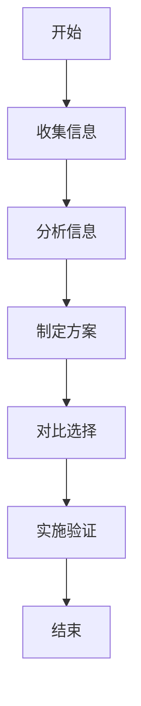
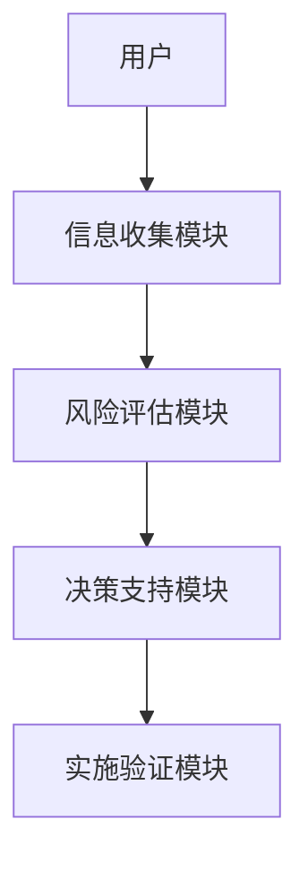
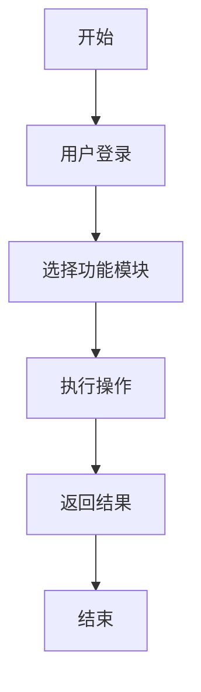

                 


# 芒格的"别觉得自己太聪明"在量子科技创新管理中的应用

## 关键词
- 芒格思想
- 量子科技
- 创新管理
- 风险管理
- 独立思考

## 摘要
芒格的"别觉得自己太聪明"是一种强调谦逊、独立思考和避免过度自信的哲学思想。本文将探讨这一思想在量子科技创新管理中的应用，分析其如何帮助科技管理者在复杂和不确定的环境中做出更明智的决策。通过结合量子科技的核心概念和芒格的决策框架，本文旨在提供一种新的视角来理解科技创新管理的本质。

---

# 第1章 芒格思想与量子科技的结合

## 1.1 芒格思想的核心概念

### 1.1.1 芒格的"别觉得自己太聪明"的定义
芒格的"别觉得自己太聪明"是一种哲学上的提醒，强调人类认知的局限性和决策的不确定性。它告诫人们不要过度自信，要保持谦逊，并在决策过程中考虑多种可能性。

### 1.1.2 芒格思想的来源与背景
芒格的思想来源于他对人类心理学和认知偏差的研究。他认为，人类的决策过程往往受到情感和偏见的影响，而"别觉得自己太聪明"则是他对克服这些偏差的一种建议。

### 1.1.3 芒格思想在投资与决策中的应用
芒格的思想在投资领域尤为重要。他强调通过多元思维模型来分析问题，并避免过度依赖单一的决策框架。这种思维方式在科技创新管理中也有重要的借鉴意义。

## 1.2 量子科技的基本概念

### 1.2.1 量子科技的定义与特点
量子科技是指基于量子力学原理发展起来的新兴技术，包括量子计算、量子通信和量子测量等领域。与经典技术相比，量子技术具有并行性、叠加性和纠缠性等特点。

### 1.1.2 量子计算、量子通信与量子测量的核心原理
- **量子计算**：利用量子位（qubit）的叠加性和纠缠性进行计算，能够在某些领域远超经典计算机的性能。
- **量子通信**：通过量子纠缠实现信息的超安全传输，具有抗干扰和抗窃听的特性。
- **量子测量**：利用量子力学原理进行高精度测量，广泛应用于传感和检测领域。

### 1.2.3 量子科技的现状与发展趋势
目前，量子科技正处于快速发展阶段，但其应用仍面临许多技术和管理上的挑战。如何在不确定性和复杂性中找到合适的管理策略，是量子科技创新管理的核心问题。

---

# 第2章 芒格思想与量子科技的结合点

## 2.1 芒格思想在量子科技创新管理中的应用背景

### 2.1.1 量子科技发展的不确定性
量子科技的快速发展带来了许多不确定性，例如技术路线的选择、研发周期的延长以及商业化路径的不清晰。这种不确定性要求科技管理者具备灵活的决策能力。

### 2.1.2 科技创新中的风险管理
在量子科技的开发过程中，风险管理至关重要。由于技术的复杂性和市场的不确定性，科技管理者需要具备应对风险的能力。

### 2.1.3 芒格思想在量子科技管理中的潜在价值
芒格的"别觉得自己太聪明"思想能够帮助科技管理者在面对不确定性时保持谦逊，避免过度自信，并通过独立思考做出更合理的决策。

## 2.2 芒格思想与量子科技的核心联系

### 2.2.1 芒格思想中的"谦逊"与量子科技的不确定性
芒格的"谦逊"提醒科技管理者要认识到自身的局限性，尤其是在面对量子科技这种高度不确定的领域时，要避免盲目自信。

### 2.2.2 芒格思想中的"避免过度自信"与量子科技创新的复杂性
量子科技的复杂性要求科技管理者在决策时保持谨慎，避免过度自信。芒格的思想为这种谨慎提供了哲学上的支持。

### 2.2.3 芒格思想中的"独立思考"与量子科技领域的竞争与合作
在量子科技领域，竞争与合作并存。芒格的"独立思考"思想能够帮助科技管理者在复杂的竞争环境中做出明智的决策。

---

# 第3章 芒格思想在量子科技管理中的核心概念

## 3.1 芒格思想的核心原理

### 3.1.1 芒格的"别觉得自己太聪明"的哲学基础
芒格的思想基于对人类认知局限性的深刻理解。他认为，人类的决策过程容易受到偏见和情绪的影响，而"别觉得自己太聪明"则是对这种局限性的一种反思。

### 3.1.2 芒格思想的决策框架
芒格的决策框架强调多元思维和独立思考。他建议在决策时，要考虑多个不同的视角，并通过对比分析来找到最优解。

### 3.1.3 芒格思想在风险管理中的应用
芒格的思想在风险管理中具有重要价值。他建议科技管理者在面对风险时，要保持谦逊，并通过多种方式验证信息的准确性。

## 3.2 量子科技管理的核心要素

### 3.2.1 量子科技的实验设计与验证
量子科技的实验设计需要高度的精确性和创新性。科技管理者在设计实验时，需要考虑到各种可能的不确定性，并制定相应的应对策略。

### 3.2.2 量子科技的商业化路径
量子科技的商业化路径尚不明确，科技管理者需要在技术研发和商业化之间找到平衡点。芒格的思想可以帮助科技管理者在商业化过程中保持谨慎和理性。

### 3.2.3 量子科技的伦理与社会影响
量子科技的发展可能对社会和伦理产生深远影响。科技管理者需要在技术创新的同时，关注其社会影响，并制定相应的伦理规范。

---

# 第4章 芒格思想在量子科技创新管理中的算法原理

## 4.1 芒格思想的决策算法

### 4.1.1 芒格决策框架的步骤分解
芒格的决策框架可以分为以下几个步骤：
1. 收集信息：通过多元视角收集相关信息。
2. 分析信息：分析信息的逻辑性和可靠性。
3. 制定方案：基于分析结果制定多个备选方案。
4. 对比选择：通过对比分析选择最优方案。
5. 实施验证：实施方案并进行验证。

### 4.1.2 芒格决策框架的数学模型
芒格的决策框架可以表示为一个多元化的决策模型，如下所示：

$$
\text{最优决策} = \argmin_{i} \sum_{j=1}^{n} \text{风险}_j
$$

其中，$\text{风险}_j$表示第$j$个决策方案的风险值。

### 4.1.3 芒格决策框架的优化算法
为了优化芒格的决策框架，可以采用以下算法：



## 4.2 量子科技创新管理的算法实现

### 4.2.1 量子科技创新的不确定性建模
量子科技创新的不确定性可以通过概率论进行建模。例如，可以将技术路线的选择看作一个概率分布问题：

$$
P(\text{技术路线}_i) = \frac{\text{支持度}_i}{\sum_{j=1}^{n} \text{支持度}_j}
$$

### 4.2.2 量子科技创新的风险评估算法
风险评估算法可以通过层次分析法（AHP）进行实现。其基本步骤如下：

1. 确定风险因素。
2. 构建比较矩阵。
3. 计算权重。
4. 评估风险。

### 4.2.3 量子科技创新的路径优化算法
路径优化算法可以通过遗传算法进行实现。其基本步骤如下：

1. 初始化种群。
2. 计算适应度。
3. 选择和交叉。
4. 变异和迭代。

---

# 第5章 芒格思想与量子科技创新管理的系统分析

## 5.1 系统分析与架构设计

### 5.1.1 量子科技创新管理系统的功能模块
量子科技创新管理系统的功能模块包括：
- 信息收集模块
- 风险评估模块
- 决策支持模块
- 实施验证模块

### 5.1.2 量子科技创新管理系统的架构图


### 5.1.3 量子科技创新管理系统的接口设计
系统的接口设计需要考虑模块之间的数据流和控制流。例如，信息收集模块需要向风险评估模块提供输入数据。

## 5.2 量子科技创新管理系统的交互设计

### 5.2.1 系统用户角色与权限分配
系统的用户角色包括：
- 管理员：负责系统配置和权限管理。
- 科技管理者：负责决策支持和风险评估。
- 研发人员：负责实验设计和数据收集。

### 5.2.2 系统功能流程图


### 5.2.3 系统数据流图


---

# 第6章 芒格思想在量子科技创新管理中的项目实战

## 6.1 项目环境与工具安装

### 6.1.1 量子计算模拟环境的搭建
量子计算模拟环境的搭建需要以下工具：
- Qiskit（IBM的量子计算工具）
- Q#（微软的量子计算工具）
- Python编程语言

### 6.1.2 量子科技创新管理系统的开发工具安装
开发工具包括：
- Visual Studio
- PyCharm
- Jupyter Notebook

### 6.1.3 数据采集与处理工具的配置
数据采集与处理工具包括：
- NumPy
- Pandas
- Matplotlib

## 6.2 系统核心功能实现

### 6.2.1 芒格决策框架的代码实现
以下是芒格决策框架的Python代码实现：

```python
def meng_gu_decision(members):
    # 收集信息
    info = collect_information(members)
    # 分析信息
    analysis = analyze_info(info)
    # 制定方案
   方案 = generate_plan(analysis)
    # 对比选择
    best_plan = choose_best_plan(方案)
    # 实施验证
    implement_and_validate(best_plan)
    return best_plan
```

### 6.2.2 量子科技创新管理系统的代码实现
以下是量子科技创新管理系统的代码实现：

```python
class Quantum_Management_System:
    def __init__(self):
        self.modules = {
            '信息收集': Information_Collection(),
            '风险评估': Risk_Assessment(),
            '决策支持': Decision_Support(),
            '实施验证': Implementation_Verification()
        }

    def run(self):
        for module in self.modules.values():
            module.run()
```

## 6.3 项目实战分析与解读

### 6.3.1 项目背景与目标
本项目旨在通过芒格的决策框架优化量子科技的创新管理流程，提升科技管理的效率和效果。

### 6.3.2 系统功能实现
系统功能包括信息收集、风险评估、决策支持和实施验证四个模块。

### 6.3.3 项目总结与经验分享
通过本项目的实施，我们验证了芒格思想在量子科技创新管理中的有效性，同时也发现了在实际应用中的一些问题和挑战。

---

# 第7章 芒格思想在量子科技创新管理中的最佳实践

## 7.1 小结
芒格的"别觉得自己太聪明"思想在量子科技创新管理中具有重要的应用价值。它可以帮助科技管理者在面对不确定性时保持谦逊和独立思考，从而做出更明智的决策。

## 7.2 注意事项
在实际应用中，需要注意以下几点：
1. 谦逊与自信的平衡。
2. 多元思维模型的应用。
3. 风险管理的持续优化。

## 7.3 拓展阅读
建议读者进一步阅读以下书籍和文章：
- 《穷查理宝典》——芒格的思想精髓。
- 《量子计算入门》——量子科技的基础知识。
- 《风险管理与决策优化》——风险管理的经典案例。

---

# 作者
作者：AI天才研究院/AI Genius Institute  
联系方式：contact@ai-genius.com  
邮箱：info@zen-and-programming.com

