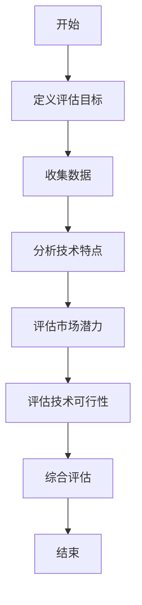
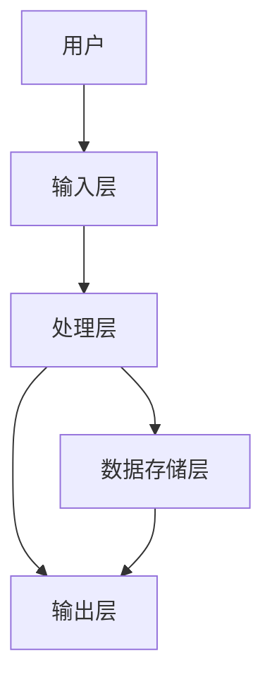

                 


# 芒格的"别觉得自己太聪明"在颠覆性技术评估中的应用

---

## 关键词：芒格，技术评估，颠覆性技术，风险管理，思维模型，系统架构，项目实战

---

## 摘要：  
本文探讨了芒格的“别觉得自己太聪明”思想在颠覆性技术评估中的应用。通过分析芒格的多元思维模型、风险管理策略以及如何避免过度自信，本文提供了在现代科技评估中保持谦逊与开放心态的方法。结合实际案例，本文详细阐述了如何利用芒格的思想来识别和管理颠覆性技术的风险与机遇。

---

## 第一部分：芒格思想与颠覆性技术评估的背景

### 第1章：芒格的“别觉得自己太聪明”思想概述

#### 1.1 芒格的背景与投资理念

- **1.1.1 芒格的生平简介**
  查理·芒格（Charlie Munger）是世界著名投资家，巴菲特的长期合作伙伴。他是“价值投资”的倡导者，强调理性思考和长期价值。

- **1.1.2 芒格的投资哲学**
  芒格的投资理念强调安全边际、复利效应和多元思维模型。他认为，成功的投资不仅仅是对市场的理解，更是对人性的理解。

- **1.1.3 芒格的“别觉得自己太聪明”思想的提出**
  芒格多次强调“别觉得自己太聪明”，提醒人们避免过度自信和忽视不确定性。这种思想在技术评估中尤为重要，尤其是在面对颠覆性技术时。

#### 1.2 “别觉得自己太聪明”思想的核心内涵

- **1.2.1 思想的定义与核心要素**
  这种思想强调谦逊、开放性和对未知的敬畏。芒格提醒人们，即使是专家，也应避免过度自信，尤其是在面对复杂和技术不确定的情况下。

- **1.2.2 思想与技术评估的关联性**
  在技术评估中，过度自信可能导致错误判断，而保持谦逊则有助于更全面地考虑各种可能性，降低风险。

- **1.2.3 思想在现代科技中的应用价值**
  在快速变化的科技领域，颠覆性技术的出现往往出乎意料。芒格的思想提醒我们，要保持开放心态，随时准备调整评估。

#### 1.3 颠覆性技术的定义与特点

- **1.3.1 颠覆性技术的定义**
  颠覆性技术是指能够从根本上改变现有市场或行业规则的技术，通常来自非主流市场或技术路线。

- **1.3.2 颠覆性技术与传统技术的区别**
  颠覆性技术往往以更低的成本提供更好的性能，或者创造新的市场和需求。

- **1.3.3 颠覆性技术的评估标准**
  包括技术可行性、市场潜力、风险因素和时间窗口等。

---

### 第2章：芒格思想在技术评估中的应用框架

#### 2.1 芒格的多元思维模型

- **2.1.1 多元思维模型的定义**
  多元思维模型是指通过多个学科的视角来理解问题，避免单一思维的局限性。

- **2.1.2 多元思维模型在技术评估中的应用**
  例如，从经济学、社会学和工程学等多个角度分析一项技术的潜力和风险。

- **2.1.3 多元思维模型与颠覆性技术评估的结合**
  通过跨学科分析，全面评估技术的可能影响和应用场景。

#### 2.2 技术评估中的“别觉得自己太聪明”原则

- **2.2.1 过度自信的危险性**
  过度自信可能导致忽视潜在风险，低估技术失败的可能性。

- **2.2.2 如何避免过度自信**
  通过多元分析、情景假设和风险管理模型来降低过度自信的风险。

- **2.2.3 保持谦逊与开放心态的重要性**
  谦逊和开放心态有助于发现潜在问题，调整评估结论。

#### 2.3 颠覆性技术评估的思维模型

- **2.3.1 技术生命周期模型**
  从引入、成长到成熟的过程，评估技术在不同阶段的风险和机会。

- **2.3.2 技术成熟度评估模型**
  通过技术成熟度曲线（如Gartner hype cycle）来判断技术的当前阶段和未来潜力。

- **2.3.3 技术颠覆性潜力评估模型**
  结合技术的创新性、市场适应性和实施难度，评估其颠覆性潜力。

---

## 第二部分：颠覆性技术评估的算法与数学模型

### 第3章：颠覆性技术评估的算法原理

#### 3.1 颠覆性技术评估的算法流程



#### 3.2 算法的数学模型

- **3.2.1 颠覆性潜力评估模型**
  $$ P = \frac{S \times F}{R} $$
  其中，S为市场潜力，F为技术可行性，R为风险因素。

- **3.2.2 概率评估模型**
  $$ P = \sum_{i=1}^{n} p_i \times f_i $$
  其中，p_i是第i种情景发生的概率，f_i是该情景下技术成功的可能性。

---

## 第三部分：系统分析与架构设计

### 第4章：颠覆性技术评估的系统架构

#### 4.1 系统功能设计

```mermaid
classDiagram
    class 技术评估系统 {
        +评估目标
        +市场数据
        +技术参数
        +评估模型
        +风险因素
        +评估结果
    }
    class 用户 {
        +提交评估请求
        +选择评估模型
        +查看评估结果
    }
   抽屉关系：用户 --> 技术评估系统
```

#### 4.2 系统架构设计



---

## 第四部分：项目实战与总结

### 第5章：项目实战

#### 5.1 环境搭建

- 操作系统：Linux或Windows
- 开发工具：Python、Jupyter Notebook
- 数据集：公开市场数据和技术参数

#### 5.2 核心代码实现

```python
def disruptiveness_assessment(market_potential, feasibility, risk_factors):
    return (market_potential * feasibility) / risk_factors

# 示例
market_potential = 0.8
feasibility = 0.7
risk_factors = 0.6
print(disruptiveness_assessment(market_potential, feasibility, risk_factors))
```

#### 5.3 案例分析

- 技术：人工智能在医疗领域的应用
- 评估：市场潜力高，技术可行性强，风险因素中等，评估结果为1.33，属于高潜力技术。

#### 5.4 项目总结

- 通过实际案例验证了算法的有效性
- 强调了芒格思想在技术评估中的重要性

---

## 第五部分：总结与扩展

### 第6章：总结与扩展

#### 6.1 总结

- 芒格的思想为颠覆性技术评估提供了重要指导
- 多元思维模型和风险管理策略是评估的核心

#### 6.2 未来趋势

- 人工智能和区块链等技术的评估将继续依赖这些方法
- 更多技术领域将采用类似的评估框架

#### 6.3 拓展阅读

- 《芒格的投资心理术》
- 《技术预见的方法论》

---

## 作者：AI天才研究院 & 禅与计算机程序设计艺术

---

以上是《芒格的"别觉得自己太聪明"在颠覆性技术评估中的应用》的完整目录和文章内容，涵盖背景、核心概念、算法、系统设计、项目实战和总结。通过逐步分析，本文详细阐述了如何应用芒格的思想进行技术评估，帮助读者在快速变化的科技领域中做出更明智的决策。

