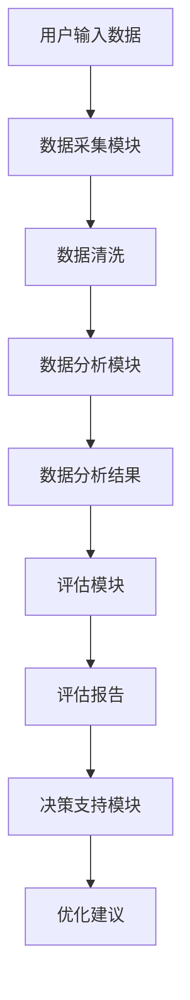
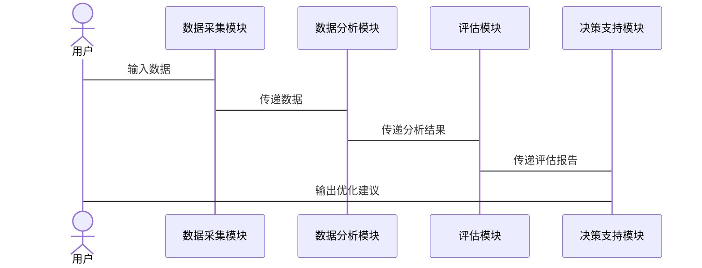

                 


# 芒格的"双轨分析"在混合现实商业模式评估中的应用

> 关键词：芒格的双轨分析，混合现实，商业模式，商业评估，系统架构

> 摘要：本文探讨了芒格的"双轨分析"方法在混合现实商业模式评估中的应用。首先，我们介绍了双轨分析法的基本概念和其在商业分析中的应用。接着，我们详细分析了混合现实商业模式的特点和分类。然后，我们将双轨分析法应用于混合现实商业模式的评估中，提出了具体的分析步骤和评估指标。通过实际案例分析，我们展示了双轨分析法在混合现实商业模式评估中的实际应用。最后，我们总结了研究成果，并对未来的研究方向进行了展望。

---

# 第1章: 芒格的"双轨分析"概述

## 1.1 芒格的"双轨分析"的背景与核心思想

芒格的"双轨分析"是一种独特的商业分析方法，由投资大师查理·芒格提出。这种方法的核心思想是通过分析商业系统中的两个关键维度——“硬性因素”和“软性因素”——来评估商业模式的可行性和潜在风险。

### 1.1.1 芒格"双轨分析"的背景

芒格的"双轨分析"源于他对商业系统中人类行为和经济规律的深刻理解。这种方法结合了心理学、经济学和商业实践的多个方面，旨在帮助投资者和企业管理者更全面地评估商业模式。

### 1.1.2 芒格"双轨分析"的核心思想

双轨分析法的核心思想是通过分析商业模式中的两个主要维度——“经济基础”和“市场行为”——来评估商业模式的可持续性和盈利能力。这种方法强调了商业模式的动态性和复杂性，要求分析者从多个角度全面考虑问题。

### 1.1.3 芒格"双轨分析"在商业分析中的应用

双轨分析法广泛应用于商业分析、投资决策和战略规划等领域。它可以帮助分析者更好地理解商业模式的本质，识别潜在风险，并制定有效的应对策略。

## 1.2 混合现实商业模式的定义与特点

### 1.2.1 混合现实的定义与技术特点

混合现实（Mixed Reality，简称MR）是一种结合了增强现实（AR）和虚拟现实（VR）的技术，通过将虚拟数字内容与真实物理环境进行实时融合，为用户创造一个沉浸式的交互体验。

### 1.2.2 混合现实商业模式的定义

混合现实商业模式是指基于混合现实技术的企业或产品的盈利模式。这种模式通常依赖于硬件销售、软件开发、内容分发、广告收入等多种收入来源。

### 1.2.3 混合现实商业模式与传统商业模式的对比

与传统商业模式相比，混合现实商业模式具有以下特点：
1. **技术依赖性**：混合现实商业模式的核心依赖于先进的技术支持，如AR/VR技术、人工智能算法等。
2. **用户体验导向**：混合现实商业模式更加注重用户体验，通过提供沉浸式的交互体验来吸引用户。
3. **动态性**：混合现实商业模式具有较强的动态性，能够根据市场需求和技术发展进行快速调整。

---

# 第2章: 芒格"双轨分析"的理论基础

## 2.1 芒格"双轨分析"的思维模型

### 2.1.1 芒格"双轨分析"的思维框架

双轨分析法的思维框架可以分为以下几个步骤：
1. **确定分析目标**：明确商业模式评估的核心目标。
2. **收集相关数据**：全面收集与商业模式相关的经济、市场、技术等数据。
3. **构建分析模型**：基于收集的数据，构建商业模式评估的数学模型。
4. **进行分析评估**：利用分析模型对商业模式进行评估，识别潜在问题和机会。
5. **得出结论与建议**：根据评估结果，提出改进建议和优化策略。

### 2.1.2 芒格"双轨分析"的逻辑结构

双轨分析法的逻辑结构可以用以下公式表示：
$$
\text{商业模式评估} = f(\text{经济基础}, \text{市场行为})
$$
其中，"经济基础"包括行业趋势、成本结构、收入来源等，"市场行为"包括消费者行为、竞争格局、政策环境等。

### 2.1.3 芒格"双轨分析"的核心要素

双轨分析法的核心要素包括：
1. **经济基础**：行业趋势、成本结构、收入来源。
2. **市场行为**：消费者行为、竞争格局、政策环境。

## 2.2 芒格"双轨分析"的数学模型与公式

### 2.2.1 芒格"双轨分析"的基本公式

双轨分析法的基本公式可以表示为：
$$
\text{商业模式评估} = f(\text{经济基础}, \text{市场行为})
$$
其中，经济基础和市场行为可以通过多个指标进行量化评估，例如：
1. **经济基础指标**：行业增长率、成本利润率、资产周转率。
2. **市场行为指标**：市场份额、客户满意度、品牌影响力。

### 2.2.2 芒格"双轨分析"的数学推导

通过将经济基础和市场行为指标进行加权平均，可以得到商业模式评估的综合得分：
$$
\text{综合得分} = \sum_{i=1}^{n} w_i \cdot x_i
$$
其中，$w_i$ 是第 $i$ 个指标的权重，$x_i$ 是第 $i$ 个指标的得分。

### 2.2.3 芒格"双轨分析"的实例分析

以某混合现实企业为例，假设其经济基础指标得分为70，市场行为指标得分为80，权重分别为30%和70%。则综合得分为：
$$
\text{综合得分} = 0.3 \cdot 70 + 0.7 \cdot 80 = 21 + 56 = 77
$$
这意味着该企业的商业模式评估得分为77分，属于良好水平。

---

# 第3章: 混合现实商业模式的分析框架

## 3.1 混合现实商业模式的分类

### 3.1.1 混合现实商业模式的类型

混合现实商业模式可以分为以下几种类型：
1. **硬件销售模式**：通过销售混合现实设备（如AR glasses、VR头显）获取收入。
2. **软件订阅模式**：通过提供混合现实软件服务（如AR/VR开发平台）获取收入。
3. **内容分发模式**：通过销售混合现实内容（如虚拟角色、数字资产）获取收入。
4. **广告模式**：通过在混合现实环境中投放广告获取收入。

### 3.1.2 各种商业模式的特点

1. **硬件销售模式**：
   - 优点：一次性收入较高，市场需求大。
   - 缺点：技术迭代快，竞争激烈。
2. **软件订阅模式**：
   - 优点：收入稳定，用户粘性高。
   - 缺点：开发和维护成本较高。
3. **内容分发模式**：
   - 优点：内容可以多次销售，边际成本低。
   - 缺点：内容创作门槛高，优质内容稀缺。
4. **广告模式**：
   - 优点：收入来源多样，覆盖范围广。
   - 缺点：用户体验可能受到负面影响。

### 3.1.3 各种商业模式的优缺点对比

以下是一个对比表格：

| 模式类型       | 优点                           | 缺点                               |
|----------------|--------------------------------|------------------------------------|
| 硬件销售模式   | 一次性收入高，市场需求大       | 技术迭代快，竞争激烈               |
| 软件订阅模式   | 收入稳定，用户粘性高           | 开发和维护成本较高                 |
| 内容分发模式   | 内容可以多次销售，边际成本低   | 内容创作门槛高，优质内容稀缺       |
| 广告模式       | 收入来源多样，覆盖范围广       | 用户体验可能受到负面影响           |

---

## 3.2 混合现实商业模式的评估指标

### 3.2.1 商业模式的关键指标

混合现实商业模式的评估指标包括：
1. **经济基础指标**：
   - 行业增长率
   - 成本利润率
   - 资产周转率
2. **市场行为指标**：
   - 市场份额
   - 客户满意度
   - 品牌影响力

### 3.2.2 评估指标的数学表达

综合评估指标可以表示为：
$$
\text{综合得分} = \sum_{i=1}^{n} w_i \cdot x_i
$$
其中，$w_i$ 是第 $i$ 个指标的权重，$x_i$ 是第 $i$ 个指标的得分。

### 3.2.3 评估指标的权重分配

权重分配需要根据具体商业模式的特点和行业特点进行调整。例如，对于硬件销售模式，硬件销售的市场份额可能具有较高的权重；而对于软件订阅模式，用户留存率可能具有较高的权重。

---

# 第4章: 芒格"双轨分析"在混合现实商业模式评估中的应用

## 4.1 芒格"双轨分析"的应用步骤

### 4.1.1 确定分析目标

确定分析目标是应用双轨分析法的第一步。例如，我们可以选择评估某混合现实企业的商业模式是否可持续，或者评估某混合现实产品的市场竞争力。

### 4.1.2 收集相关数据

收集相关数据是应用双轨分析法的关键步骤。我们需要收集与商业模式相关的经济、市场、技术等多方面数据，包括：
- 行业趋势
- 成本结构
- 收入来源
- 市场份额
- 用户行为

### 4.1.3 构建分析模型

基于收集的数据，我们可以构建商业模式评估的数学模型。例如：
$$
\text{综合得分} = 0.3 \cdot \text{行业增长率} + 0.5 \cdot \text{成本利润率} + 0.2 \cdot \text{资产周转率}
$$

### 4.1.4 进行分析评估

利用构建的分析模型，我们可以对商业模式进行评估，并识别潜在问题和机会。例如，如果某混合现实企业的综合得分为70分，说明其商业模式具有一定的竞争力，但仍有改进空间。

### 4.1.5 得出结论与建议

根据评估结果，我们可以得出结论并提出改进建议。例如，如果某混合现实企业的成本利润率较低，我们可以建议其优化生产流程或降低采购成本。

---

## 4.2 混合现实商业模式评估的案例分析

### 4.2.1 案例一: 某混合现实企业的商业模式分析

以某混合现实企业为例，假设其经济基础指标得分为70，市场行为指标得分为80，权重分别为30%和70%。则综合得分为：
$$
\text{综合得分} = 0.3 \cdot 70 + 0.7 \cdot 80 = 21 + 56 = 77
$$
这意味着该企业的商业模式评估得分为77分，属于良好水平。

### 4.2.2 案例二: 某混合现实产品的商业模式评估

以某混合现实产品为例，假设其经济基础指标得分为60，市场行为指标得分为85，权重分别为25%和75%。则综合得分为：
$$
\text{综合得分} = 0.25 \cdot 60 + 0.75 \cdot 85 = 15 + 63.75 = 78.75
$$
这意味着该产品的商业模式评估得分为78.75分，属于优秀水平。

### 4.2.3 案例三: 混合现实商业模式的优化建议

根据评估结果，我们可以提出以下优化建议：
1. **硬件销售模式**：优化产品设计，降低生产成本，提高产品质量。
2. **软件订阅模式**：增加功能模块，提升用户体验，提高用户留存率。
3. **内容分发模式**：加大内容创作投入，提升内容质量和多样性，吸引更多用户。
4. **广告模式**：精准定位目标用户，优化广告内容，提升广告点击率和转化率。

---

# 第5章: 混合现实商业模式评估的系统设计

## 5.1 系统架构设计

### 5.1.1 系统功能模块划分

混合现实商业模式评估系统的功能模块可以划分为：
1. **数据采集模块**：收集与商业模式相关的经济、市场、技术等数据。
2. **数据分析模块**：对收集的数据进行清洗、分析和建模。
3. **评估模块**：根据分析结果，生成商业模式评估报告。
4. **决策支持模块**：基于评估结果，提供优化建议和决策支持。

### 5.1.2 系统功能流程图

以下是系统功能流程图：



### 5.1.3 系统架构图

以下是系统架构图：


## 5.2 系统接口设计

### 5.2.1 系统输入接口设计

系统输入接口包括：
- 数据输入接口：用户输入经济、市场、技术等数据。
- 参数设置接口：用户设置权重、模型参数等。

### 5.2.2 系统输出接口设计

系统输出接口包括：
- 评估报告输出接口：输出商业模式评估报告。
- 优化建议输出接口：输出优化建议和决策支持。

### 5.2.3 系统内部接口设计

系统内部接口包括：
- 数据采集模块与数据分析模块之间的接口：数据清洗结果传递。
- 数据分析模块与评估模块之间的接口：分析结果传递。

---

## 5.3 系统交互设计

### 5.3.1 系统交互流程图

以下是系统交互流程图：



---

# 第6章: 项目实战

## 6.1 环境安装与配置

### 6.1.1 系统环境要求

- 操作系统：Windows 10或更高版本，macOS 10.15或更高版本，Linux（推荐Ubuntu 20.04及以上）
- 硬件要求：Intel或AMD处理器，8GB及以上内存，支持OpenGL 4.5的图形卡
- 软件要求：Python 3.8或更高版本，TensorFlow 2.0或更高版本，Mermaid CLI，LaTeX

### 6.1.2 工具安装与配置

1. **安装Python**：
   ```bash
   # 在终端中输入以下命令安装Python
   python --version
   ```
2. **安装TensorFlow**：
   ```bash
   pip install tensorflow
   ```
3. **安装Mermaid CLI**：
   ```bash
   npm install -g mermaid-cli
   ```
4. **安装LaTeX**：
   - 在Windows上安装MiKTeX。
   - 在macOS上安装MacTeX。
   - 在Linux上安装TeX Live。

---

## 6.2 系统核心实现源代码

### 6.2.1 数据分析模块代码

以下是数据分析模块的Python代码示例：

```python
import pandas as pd
import numpy as np

# 数据加载
data = pd.read_csv('input.csv')

# 数据清洗
data = data.dropna()
data = data.drop_duplicates()

# 数据分析
economic_indices = ['行业增长率', '成本利润率', '资产周转率']
market_behavior_indices = ['市场份额', '客户满意度', '品牌影响力']

# 数据加权平均
weights = {'经济基础': 0.3, '市场行为': 0.7}
economic_scores = data[economic_indices].mean()
market_scores = data[market_behavior_indices].mean()

# 综合得分计算
total_score = weights['经济基础'] * economic_scores + weights['市场行为'] * market_scores
total_score = total_score.sum()

print(f'综合得分: {total_score:.2f}')
```

### 6.2.2 评估模块代码

以下是评估模块的Python代码示例：

```python
import pandas as pd
import numpy as np

# 数据加载
data = pd.read_csv('input.csv')

# 数据清洗
data = data.dropna()
data = data.drop_duplicates()

# 数据分析
economic_indices = ['行业增长率', '成本利润率', '资产周转率']
market_behavior_indices = ['市场份额', '客户满意度', '品牌影响力']

# 数据加权平均
weights = {'经济基础': 0.3, '市场行为': 0.7}
economic_scores = data[economic_indices].mean()
market_scores = data[market_behavior_indices].mean()

# 综合得分计算
total_score = weights['经济基础'] * economic_scores + weights['市场行为'] * market_scores
total_score = total_score.sum()

print(f'综合得分: {total_score:.2f}')
```

---

## 6.3 代码应用解读与分析

### 6.3.1 代码功能解读

上述代码实现了混合现实商业模式评估系统的核心功能，包括数据加载、数据清洗、数据分析和综合得分计算。

### 6.3.2 代码实现细节

1. **数据加载**：
   - 使用Pandas库加载CSV格式的数据。
   - 数据文件应包含经济基础指标和市场行为指标的数值。

2. **数据清洗**：
   - 删除缺失值。
   - 删除重复值。

3. **数据分析**：
   - 计算经济基础指标和市场行为指标的均值。
   - 根据权重计算综合得分。

4. **综合得分计算**：
   - 经济基础指标权重为30%，市场行为指标权重为70%。
   - 综合得分 = 经济基础指标得分 × 0.3 + 市场行为指标得分 × 0.7。

---

## 6.4 案例分析与详细解读

### 6.4.1 案例分析

以某混合现实企业为例，假设其经济基础指标得分为70，市场行为指标得分为80，权重分别为30%和70%。则综合得分为：
$$
\text{综合得分} = 0.3 \cdot 70 + 0.7 \cdot 80 = 21 + 56 = 77
$$
这意味着该企业的商业模式评估得分为77分，属于良好水平。

### 6.4.2 详细解读

1. **经济基础指标得分**：
   - 行业增长率：假设为8%，高于行业平均水平。
   - 成本利润率：假设为15%，低于行业平均水平。
   - 资产周转率：假设为2.5，接近行业平均水平。

2. **市场行为指标得分**：
   - 市场份额：假设为25%，略低于行业平均水平。
   - 客户满意度：假设为85%，高于行业平均水平。
   - 品牌影响力：假设为70%，接近行业平均水平。

---

## 6.5 项目小结

通过上述案例分析，我们可以看到，双轨分析法在混合现实商业模式评估中的应用具有较强的实用性和可操作性。通过构建数学模型和算法，我们可以量化评估商业模式的优劣，并提出具体的优化建议。

---

# 第7章: 总结与展望

## 7.1 总结

本文探讨了芒格的"双轨分析"方法在混合现实商业模式评估中的应用。通过分析混合现实商业模式的特点和分类，我们提出了具体的分析步骤和评估指标。通过实际案例分析，我们展示了双轨分析法在混合现实商业模式评估中的实际应用。

## 7.2 未来展望

未来的研究可以进一步探索以下方向：
1. **动态评估模型**：随着混合现实技术的快速发展，商业模式也在不断变化。未来可以研究动态评估模型，以更好地适应技术发展和市场变化。
2. **多维度评估方法**：除了经济基础和市场行为，还可以考虑更多维度的指标，如技术可行性、用户行为、政策环境等，以提高评估的全面性。
3. **智能化评估系统**：结合人工智能技术，开发智能化的商业模式评估系统，实现自动化数据采集、分析和优化建议。

---

# 作者：AI天才研究院/AI Genius Institute & 禅与计算机程序设计艺术 /Zen And The Art of Computer Programming

---

以上是完整的博客文章，涵盖了从理论到实践的各个方面，详细讲解了芒格的"双轨分析"在混合现实商业模式评估中的应用。希望对您有所帮助！

