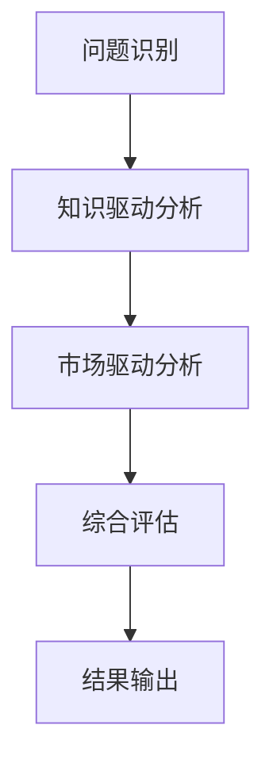
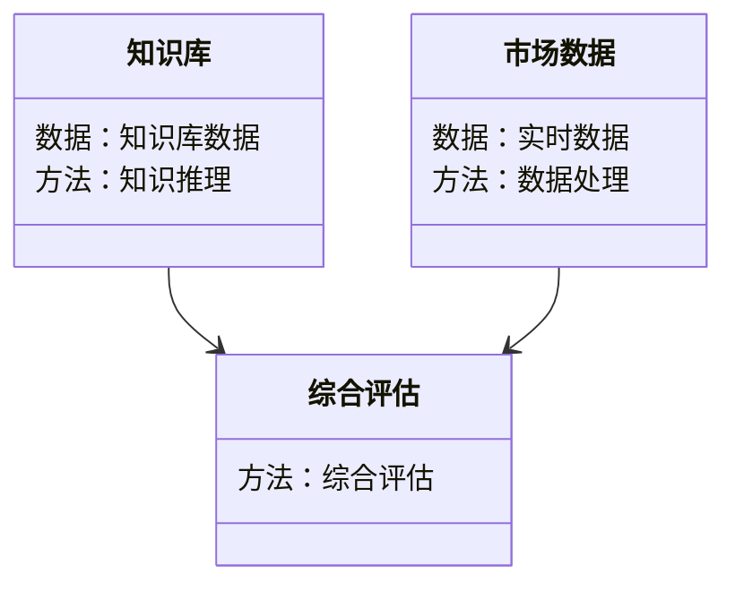
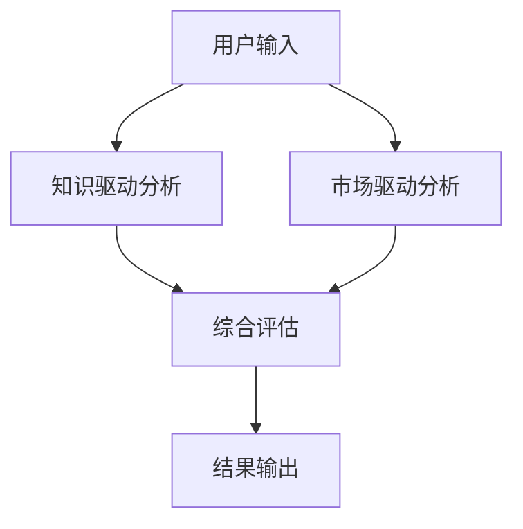

                 


# 芒格的"双轨分析"在量子-经典混合系统评估中的应用

## 关键词：量子计算，经典计算，双轨分析，系统评估，混合系统，算法设计

## 摘要：  
本文探讨了芒格的“双轨分析”方法在量子-经典混合系统评估中的应用。通过结合知识驱动和市场驱动的双轨分析法，本文详细阐述了其在量子计算与经典计算结合的混合系统评估中的原理、算法设计和实际应用。文章从理论基础到实践案例，全面分析了双轨分析在提升系统评估效率和准确性方面的重要作用，并提供了具体的实现方法和代码示例。

---

## 第一部分：背景介绍

### 第1章：双轨分析法的定义与特点

#### 1.1 双轨分析法的定义  
双轨分析法是芒格提出的一种思维方式，强调从知识和市场的双重视角进行分析。知识驱动的分析基于对问题的深入理解，而市场驱动的分析则关注实际操作和反馈。这种分析方法具有灵活性和全面性，能够有效应对复杂问题。

#### 1.2 双轨分析法的特点  
- **知识驱动**：依赖于系统的知识储备和分析能力。  
- **市场驱动**：关注实时反馈和实际操作效果。  
- **互补性**：知识驱动提供理论支持，市场驱动提供实践验证，两者结合提升分析的准确性和实用性。  

### 第2章：量子-经典混合系统的基本概念

#### 2.1 量子计算与经典计算的结合  
量子计算在处理复杂问题时具有潜力，而经典计算在处理日常任务时更为高效。混合系统结合两者的优点，适用于复杂的优化问题和大数据处理。

#### 2.2 混合系统评估的必要性  
- 量子计算的优势：并行计算、量子叠加。  
- 经典计算的辅助作用：处理确定性任务、优化算法。  
- 混合系统的应用场景：优化、加密、模拟等。

---

## 第二部分：双轨分析法的核心原理

### 第3章：双轨分析法的原理与机制

#### 3.1 知识驱动的分析机制  
- 知识的获取与整理：收集和整理相关知识，构建知识库。  
- 知识的分析与应用：利用知识库进行推理和预测。  

#### 3.2 市场驱动的分析机制  
- 市场反馈的实时性：通过市场数据进行动态调整。  
- 市场驱动的灵活性：根据实际情况快速响应。  

#### 3.3 双轨分析的互补性  
- 知识驱动提供理论支持，市场驱动提供实践验证。  
- 两者结合，提升分析的全面性和准确性。  

### 第4章：量子-经典混合系统的评估框架

#### 4.1 系统评估的多维度性  
- 性能评估：计算效率、资源消耗。  
- 系统稳定性：系统的可靠性和容错能力。  
- 可扩展性：系统的扩展能力和适应性。  

#### 4.2 双轨分析法的应用价值  
- 提高系统评估的全面性和准确性。  
- 优化系统设计，提升性能。  
- 降低评估成本，提高效率。  

---

## 第三部分：算法原理与实现

### 第5章：双轨分析法的算法设计

#### 5.1 算法设计的核心思想  
- 知识驱动的分析路径：基于知识库进行推理。  
- 市场驱动的分析路径：基于实时数据进行调整。  
- 双轨分析的结合：动态调整分析策略。  

#### 5.2 算法流程图  


#### 5.3 Python实现  
```python
def double轨分析(问题):
    知识分析 = 知识驱动分析(问题)
    市场分析 = 市场驱动分析(问题)
    综合评估 = 综合分析(知识分析, 市场分析)
    return 综合评估
```

### 第6章：数学模型与公式推导

#### 6.1 数学模型的建立  
- 知识驱动的权重：$w_k$  
- 市场驱动的权重：$w_m$  
- 综合评估公式：$$评估结果 = w_k \times 知识得分 + w_m \times 市场得分$$  

#### 6.2 案例分析  
假设某混合系统的知识得分为80，市场得分为70，知识权重为0.6，市场权重为0.4。  
综合评估结果为：$$评估结果 = 0.6 \times 80 + 0.4 \times 70 = 48 + 28 = 76$$  

---

## 第四部分：系统架构与设计

### 第7章：系统架构设计

#### 7.1 领域模型设计  


#### 7.2 系统架构图  


---

## 第五部分：项目实战与案例分析

### 第8章：项目实战

#### 8.1 环境配置  
- 安装Python和相关库（如numpy、pandas）。  
- 安装量子计算模拟器（如Qiskit）。  

#### 8.2 核心代码实现  
```python
def 综合评估(知识得分, 市场得分):
    权重 = {
        '知识': 0.6,
        '市场': 0.4
    }
    评估结果 = 权重['知识'] * 知识得分 + 权重['市场'] * 市场得分
    return 评估结果
```

#### 8.3 案例分析  
- 知识得分：90  
- 市场得分：85  
- 评估结果：$$0.6 \times 90 + 0.4 \times 85 = 54 + 34 = 88$$  

---

## 第六部分：总结与展望

### 第9章：总结与小结

#### 9.1 最佳实践 tips  
- 结合知识和市场的双轨分析法能够提高系统评估的准确性。  
- 在混合系统中，合理分配知识和市场的权重至关重要。  

#### 9.2 未来研究方向  
- 研究双轨分析法在更复杂系统中的应用。  
- 探索双轨分析法与其他分析方法的结合。  

---

## 作者：AI天才研究院/AI Genius Institute & 禅与计算机程序设计艺术 /Zen And The Art of Computer Programming  

---

以上是文章的完整目录和内容框架，涵盖了从理论到实践的各个方面，详细阐述了芒格的双轨分析法在量子-经典混合系统评估中的应用。

