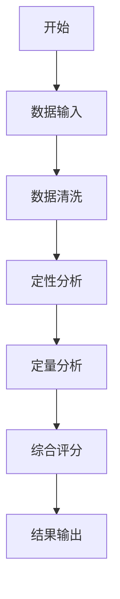
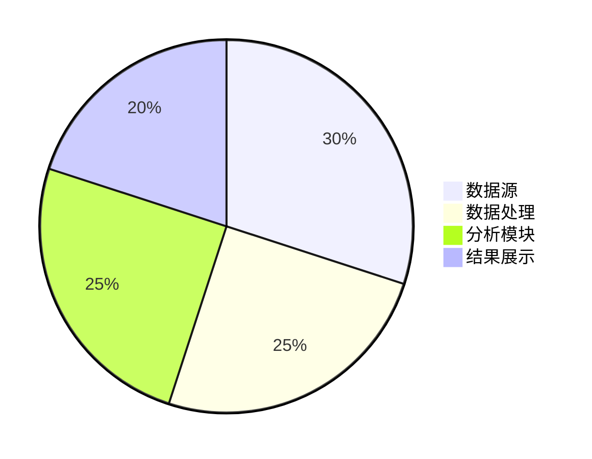

                 

# 芒格的"双轨分析"：结合定性和定量的投资方法

> 关键词：芒格，双轨分析，定性分析，定量分析，投资方法，系统架构

> 摘要：本文深入探讨了芒格的双轨分析法，结合定性和定量分析的投资方法，详细分析了其数学模型、系统架构设计及实际应用案例。文章从芒格的投资理念出发，逐步分析双轨分析的核心思想，并通过具体实例展示了其在投资决策中的应用。

---

## 第1章：芒格的投资理念与双轨分析

### 1.1 芒格的投资哲学

#### 1.1.1 芒格的“多元思维模型”

芒格认为，投资者需要构建一个多元思维模型，将各个学科的核心思想联系起来，形成一个完整的知识框架。这种思维方式帮助他避免了单一视角的局限性，从而在投资决策中做出更明智的选择。

#### 1.1.2 投资的四项标准

芒格提出了投资的四项标准：
1. ** understandable**：公司业务简单易懂。
2. ** durable**：公司具备长期竞争优势。
3. ** profitable**：公司具备持续盈利能力。
4. ** reasonable price**：价格合理，安全边际充足。

#### 1.1.3 芒格的成功投资案例

以巴菲特收购喜诗糖果为例，芒格通过分析公司的竞争优势、管理层素质以及财务状况，成功判断出这是一家值得长期投资的企业。

### 1.2 双轨分析法的定义与核心思想

#### 1.2.1 双轨分析法的起源

双轨分析法由芒格提出，是一种结合定性分析和定量分析的投资方法。它通过定性分析确定投资标的的内在价值，再通过定量分析验证其投资价值。

#### 1.2.2 双轨分析法的核心要素

1. **定性分析**：关注公司的基本面、管理层素质和行业地位。
2. **定量分析**：关注财务指标、估值指标和现金流分析。

#### 1.2.3 双轨分析法与传统投资方法的区别

传统投资方法往往过于依赖定量分析或定性分析，而双轨分析法则将两者有机结合，既注重基本面分析，又注重估值分析。

### 1.3 双轨分析法的适用场景

#### 1.3.1 个股投资中的应用

通过双轨分析法，投资者可以更全面地评估一只股票的投资价值。

#### 1.3.2 资产配置中的应用

双轨分析法可以帮助投资者在资产配置中找到最优的组合。

#### 1.3.3 行业分析中的应用

通过对行业的定性分析和定量分析，投资者可以更好地把握行业的投资机会。

---

## 第2章：定性分析与定量分析的结合

### 2.1 定性分析的核心要素

#### 2.1.1 企业基本面分析

关注公司的盈利能力、成长性和财务健康状况。

#### 2.1.2 管理层分析

分析公司管理层的素质、经验和决策能力。

#### 2.1.3 行业地位分析

评估公司在行业中的竞争地位和市场影响力。

### 2.2 定量分析的核心要素

#### 2.2.1 财务指标分析

包括市盈率（P/E）、市净率（P/B）、股息率等指标。

#### 2.2.2 估值指标

如内在价值计算、DCF模型等。

#### 2.2.3 现金流分析

评估公司的现金流健康状况和未来现金流预测。

### 2.3 定性与定量分析的结合方法

#### 2.3.1 从定性到定量的转换

通过定性分析确定公司的内在价值，再通过定量分析验证其估值是否合理。

#### 2.3.2 双轨分析法的数学模型

双轨分析法的综合评分公式：

$$
\text{综合评分} = \alpha \times \text{定性评分} + (1 - \alpha) \times \text{定量评分}
$$

其中，$\alpha$ 是定性分析的权重，通常在0.4到0.6之间。

#### 2.3.3 实例分析：双轨分析在某行业中的应用

以科技行业为例，分析某家科技公司的定性与定量指标。

---

## 第3章：双轨分析法的数学模型与算法

### 3.1 双轨分析法的数学模型

#### 3.1.1 定性分析的权重分配

$$
\text{定性权重} = \frac{\text{定性分析的总权重}}{\text{总权重}}
$$

#### 3.1.2 定量分析的指标计算

$$
\text{定量评分} = \sum_{i=1}^{n} w_i \times x_i
$$

其中，$w_i$ 是第$i$个定量指标的权重，$x_i$ 是该指标的得分。

#### 3.1.3 综合评分模型

$$
\text{综合评分} = \alpha \times Q + (1 - \alpha) \times S
$$

其中，$Q$ 是定性评分，$S$ 是定量评分，$\alpha$ 是定性分析的权重。

### 3.2 双轨分析法的算法实现

#### 3.2.1 数据预处理

- 数据清洗：去除异常值和缺失值。
- 数据标准化：将定性和定量指标进行标准化处理。

#### 3.2.2 定性与定量指标的标准化

$$
z_i = \frac{x_i - \mu}{\sigma}
$$

其中，$\mu$ 是均值，$\sigma$ 是标准差。

#### 3.2.3 综合评分计算

根据公式：

$$
\text{综合评分} = \alpha \times Q + (1 - \alpha) \times S
$$

计算每家公司的综合评分。

### 3.3 算法流程图

---

## 第4章：双轨分析法的系统架构设计

### 4.1 系统功能设计

#### 4.1.1 数据采集模块

负责从数据库或外部接口获取相关数据。

#### 4.1.2 数据处理模块

对数据进行清洗、标准化和预处理。

#### 4.1.3 分析模块

包括定性分析和定量分析两个子模块。

#### 4.1.4 结果展示模块

将分析结果以图表或报告形式展示出来。

### 4.2 系统架构图

### 4.3 系统接口设计

#### 4.3.1 数据接口

定义数据输入和输出的格式。

#### 4.3.2 用户界面

设计友好的用户界面，方便用户输入和查看结果。

#### 4.3.3 输出接口

定义结果输出的格式，如JSON或XML。

---

## 第5章：双轨分析法的项目实战

### 5.1 项目背景

以某科技公司为例，分析其投资价值。

### 5.2 项目实现

#### 5.2.1 数据采集

收集公司的财务数据、行业数据等。

#### 5.2.2 数据处理

对数据进行清洗和标准化。

#### 5.2.3 分析模块

1. 定性分析：评估公司基本面、管理层和行业地位。
2. 定量分析：计算财务指标、估值指标和现金流分析。

#### 5.2.4 结果展示

生成综合评分报告和投资建议。

### 5.3 实例分析

通过具体数据计算，展示双轨分析法的应用过程。

---

## 总结

芒格的双轨分析法是一种结合定性和定量分析的投资方法，通过综合评分模型和数学算法，帮助投资者做出更明智的投资决策。本文详细介绍了双轨分析法的核心思想、数学模型和系统架构设计，并通过实例展示了其在实际投资中的应用。

---

**作者：AI天才研究院/AI Genius Institute & 禅与计算机程序设计艺术 /Zen And The Art of Computer Programming**

