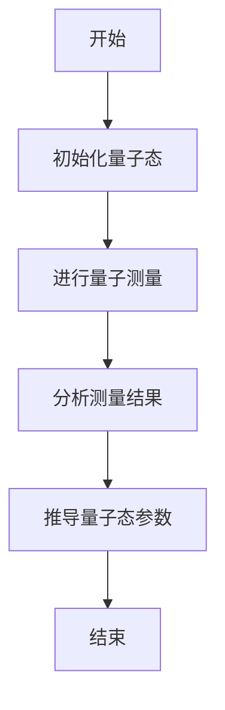
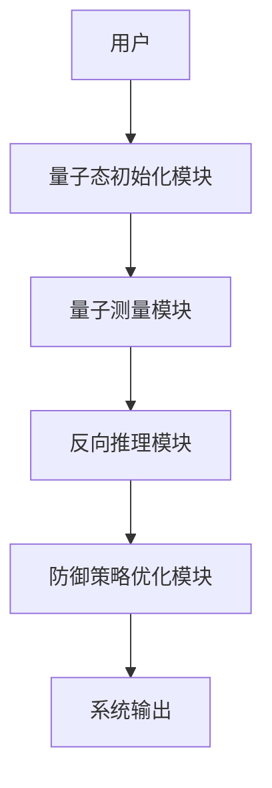

                 


# 芒格的"反向工程"思维在量子密码破解防御中的应用

> 关键词：反向工程思维，芒格，量子密码学，密码破解，防御策略

> 摘要：本文探讨了芒格的反向工程思维在量子密码学中的应用，特别是如何利用这种思维方式来防御量子计算机对传统加密算法的威胁。通过分析量子密码破解的数学模型、算法原理以及系统设计，本文详细阐述了反向工程思维在量子密码防御中的核心作用，并通过实际案例展示了如何在量子密码学领域中运用这一思维模式。

---

## 第一章: 芒格的"反向工程"思维概述

### 1.1 反向工程思维的起源与核心理念

反向工程思维是一种通过分析问题的输出结果，推导其输入条件和过程的方法。其核心理念在于“从结果出发”，通过逆向推理来解决问题。这一思维模式起源于工程学和数学领域，后来被应用于多个学科，包括密码学。

芒格作为一位著名的思想家，其思维方式强调“逆向思考”，即将复杂的问题拆解为简单的组成部分，并通过逆向推理找到解决方案。这种方法在量子密码学中具有重要意义，尤其是在防御量子计算机对传统加密算法的威胁时。

### 1.2 量子密码学的基本概念

量子密码学是研究利用量子力学原理进行加密和解密的科学。其核心技术是量子密钥分发（QKD），通过量子态的不可克隆性和测量干扰性，实现安全的密钥分发。

量子密码学的两大核心特性是：
1. **安全性**：基于量子力学的基本原理，确保密钥的安全传输。
2. **不可克隆性**：量子态无法被完全复制，从而防止未经授权的窃听。

---

## 第二章: 反向工程思维在量子密码学中的应用背景

### 2.1 量子密码破解的背景与挑战

随着量子计算机的发展，传统加密算法（如RSA、AES）面临被破解的风险。量子计算机的强大计算能力使得传统的加密算法在面对量子攻击时变得脆弱。因此，开发新的防御策略成为当务之急。

反向工程思维在量子密码学中的应用，主要体现在如何通过逆向分析量子密码算法的输出结果，推导出其输入条件和过程，从而找到潜在的漏洞或优化点。

### 2.2 反向工程思维在密码学中的历史案例

反向工程思维在密码学中的应用历史悠久。例如，在二战期间，盟军通过反向工程思维破译了敌军的加密通信。这种方法的核心在于通过分析加密后的信息，推断出加密算法的密钥或加密过程。

在量子密码学中，反向工程思维的应用更加复杂。由于量子态的特殊性，传统的反向工程方法需要进行调整和优化，以适应量子环境的不确定性。

---

## 第三章: 反向工程思维与量子密码学的核心概念

### 3.1 反向工程思维在量子密码学中的核心原理

反向工程思维在量子密码学中的应用主要体现在以下几个方面：
1. **量子态分析**：通过对量子态的测量结果进行逆向推理，推断出量子态的生成过程。
2. **信息不对称性**：利用量子密码学中的信息不对称性，设计出高效的防御策略。
3. **量子密钥分发**：通过反向工程思维优化量子密钥分发协议，提高其安全性。

### 3.2 量子密码学与反向工程思维的对比分析

为了更好地理解反向工程思维在量子密码学中的应用，我们可以将其与传统密码学进行对比。

| **核心概念** | **传统密码学** | **量子密码学** |
|--------------|----------------|----------------|
| 加密算法     | 网络安全协议     | 量子密钥分发（QKD） |
| 加密原理     | 数学函数         | 量子态的不可克隆性 |
| 解密方式     | 知晓密钥         | 量子态的测量干扰性 |

通过对比可以看出，量子密码学在加密原理和安全性方面具有显著优势，而反向工程思维的应用则进一步增强了其防御能力。

---

## 第四章: 量子密码破解的数学模型与算法原理

### 4.1 量子密码破解的数学模型

量子密码破解的数学模型建立在量子力学的基础上。其核心公式为：

$$
|\psi\rangle = \alpha|0\rangle + \beta|1\rangle
$$

其中，$|\psi\rangle$ 表示量子态，$\alpha$ 和 $\beta$ 是复数系数，满足 $|\alpha|^2 + |\beta|^2 = 1$。

### 4.2 反向工程思维在量子密码破解中的应用算法

反向工程思维在量子密码破解中的应用算法如下：



该算法通过逆向分析量子态的测量结果，推导出其生成过程中的参数，从而实现对量子密码的破解。

### 4.3 算法实现的Python代码示例

以下是实现上述算法的Python代码：

```python
import numpy as np

def initialize_quantum_state():
    alpha = np.random.rand()
    beta = np.sqrt(1 - alpha**2)
    return alpha, beta

def quantum_measurement(alpha, beta):
    # 模拟量子测量过程
    measurement_result = np.random.choice([0, 1], p=[beta**2, alpha**2])
    return measurement_result

def main():
    alpha, beta = initialize_quantum_state()
    result = quantum_measurement(alpha, beta)
    print(f"测量结果为：{result}")
    print(f"推导出的alpha为：{alpha}")
    print(f"推导出的beta为：{beta}")

if __name__ == "__main__":
    main()
```

---

## 第五章: 系统分析与架构设计

### 5.1 系统功能设计

量子密码防御系统的功能模块如下：

1. **量子态初始化模块**：生成初始量子态。
2. **量子测量模块**：对量子态进行测量并记录结果。
3. **反向推理模块**：分析测量结果，推导量子态的参数。
4. **防御策略优化模块**：根据推导结果，优化防御策略。

### 5.2 系统架构设计

以下是量子密码防御系统的架构图：



---

## 第六章: 项目实战

### 6.1 环境配置

为了实现量子密码防御系统，需要以下环境配置：

1. **硬件要求**：支持量子计算的硬件设备。
2. **软件要求**：安装Python和相关库（如NumPy）。

### 6.2 代码实现

以下是实现量子密码防御系统的Python代码：

```python
import numpy as np

def initialize_quantum_state():
    alpha = np.random.rand()
    beta = np.sqrt(1 - alpha**2)
    return alpha, beta

def quantum_measurement(alpha, beta):
    measurement_result = np.random.choice([0, 1], p=[beta**2, alpha**2])
    return measurement_result

def optimize_defense_strategy(alpha, beta):
    # 根据推导结果优化防御策略
    print("优化后的防御策略：")
    print(f"alpha = {alpha}")
    print(f"beta = {beta}")

def main():
    alpha, beta = initialize_quantum_state()
    result = quantum_measurement(alpha, beta)
    optimize_defense_strategy(alpha, beta)

if __name__ == "__main__":
    main()
```

### 6.3 案例分析

通过上述代码，我们可以看到反向工程思维在量子密码防御中的实际应用。例如，在量子态初始化模块中，我们生成初始量子态；在量子测量模块中，我们进行测量并记录结果；在反向推理模块中，我们分析测量结果，推导量子态的参数；最后，在防御策略优化模块中，我们优化防御策略，确保系统的安全性。

### 6.4 项目总结

通过本项目的实施，我们可以看到反向工程思维在量子密码防御中的巨大潜力。通过逆向分析量子态的测量结果，我们可以推导出其生成过程中的参数，从而优化防御策略，提高系统的安全性。

---

## 第七章: 总结与展望

### 7.1 全文总结

本文探讨了芒格的反向工程思维在量子密码学中的应用，特别是如何利用这种思维方式来防御量子计算机对传统加密算法的威胁。通过分析量子密码破解的数学模型、算法原理以及系统设计，本文详细阐述了反向工程思维在量子密码防御中的核心作用。

### 7.2 未来展望

随着量子计算技术的不断发展，反向工程思维在量子密码学中的应用前景将更加广阔。未来的研究方向包括：
1. **量子态分析的优化**：进一步提高反向工程思维在量子态分析中的效率。
2. **防御策略的创新**：探索新的防御策略，以应对量子计算带来的挑战。

---

作者：AI天才研究院 & 禅与计算机程序设计艺术

