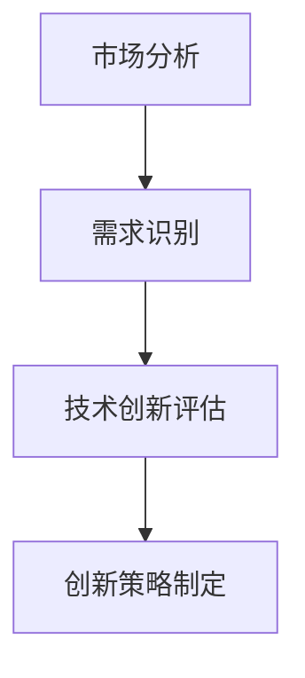

                 

# 芒格的"反向工程"思维在颠覆性创新分析中的应用

## 关键词：反向工程思维，颠覆性创新，芒格思维模型，创新分析，商业策略

## 摘要：  
本文深入探讨了芒格的反向工程思维在颠覆性创新分析中的应用。通过结合芒格的思维模型，文章详细分析了颠覆性创新的本质、模式和实现路径，并通过具体案例展示了如何利用反向工程思维来识别和评估创新机会。文章还提供了数学模型和系统架构设计，帮助读者更好地理解和应用这一创新方法。

---

## 第1章：芒格的反向工程思维与颠覆性创新概述

### 1.1 芒格的反向工程思维的定义与核心理念

反向工程思维是一种从结果出发，逆向推导原因的思维方式。它强调通过分析目标或结果，来理解其背后的逻辑、动机和路径。芒格的反向工程思维在商业决策中尤为突出，他通过分析企业的成功或失败，推导出其背后的商业模式、战略选择和竞争优势。

**核心理念**：  
1. **从结果出发**：通过分析结果，推导出实现该结果的关键因素和路径。  
2. **多维度分析**：结合技术、市场、用户需求等多个维度，全面理解创新的本质。  
3. **简化复杂问题**：通过逆向思维，将复杂问题分解为可管理的部分。

---

### 1.2 颠覆性创新的基本概念

颠覆性创新是指通过引入新技术、新商业模式或新的用户需求，彻底改变行业现状的创新行为。与延续性创新不同，颠覆性创新往往打破现有市场规则，创造新的市场价值。

**核心特征**：  
1. **技术驱动**：颠覆性创新通常依赖于技术突破。  
2. **商业模式创新**：通过改变商业模式，创造新的市场机会。  
3. **用户需求驱动**：从用户需求出发，重新定义产品或服务。  

**实现路径**：  
1. **技术突破**：通过技术创新实现产品升级。  
2. **商业模式创新**：通过新的商业模式重新定义行业规则。  
3. **用户需求重塑**：通过深度理解用户需求，重新设计产品或服务。  

---

## 第2章：反向工程思维的原理与方法

### 2.1 反向工程思维的原理

反向工程思维的核心在于通过分析目标（结果），推导出其实现的路径和关键因素。这种思维方式在创新分析中尤为重要，因为它可以帮助我们识别颠覆性创新的关键要素。

**步骤**：  
1. **确定目标**：明确需要分析的创新目标或结果。  
2. **分解目标**：将目标分解为关键因素，例如技术、市场、用户需求等。  
3. **推导路径**：从关键因素出发，推导出实现目标的路径。  
4. **验证路径**：通过实际案例或数据验证路径的可行性。  

---

### 2.2 颠覆性创新的分析框架

颠覆性创新的分析框架需要从技术、市场和用户需求三个维度进行综合分析。

**分析框架**：  
1. **技术分析**：评估技术的先进性和可行性。  
2. **市场分析**：评估市场的潜力和竞争格局。  
3. **用户需求分析**：评估用户需求的深度和广度。  

**数学模型**：  
颠覆性创新的潜力可以通过以下公式评估：

$$ \text{创新潜力} = \frac{\text{技术创新度} + \text{市场潜力} + \text{用户需求满足度}}{3} $$  

---

## 第3章：典型颠覆性创新案例分析

### 3.1 苹果公司的创新分析

**案例背景**：  
苹果公司通过技术创新和用户体验优化，彻底改变了智能手机行业。

**分析步骤**：  
1. **目标识别**：苹果的目标是通过技术创新和用户体验优化，成为行业领导者。  
2. **关键因素分解**：技术创新（如触摸屏技术）、用户体验设计（如iOS系统）、品牌价值。  
3. **路径推导**：通过技术突破和用户体验优化，苹果成功实现了颠覆性创新。  

**结论**：  
苹果的案例表明，反向工程思维能够有效识别和实现颠覆性创新。

---

## 第4章：反向工程思维在颠覆性创新中的实践

### 4.1 创新机会识别

**步骤**：  
1. **识别市场空白**：通过分析市场，找到未被满足的需求。  
2. **评估技术创新潜力**：通过技术可行性分析，评估创新的潜力。  
3. **制定创新策略**：结合市场和技术创新，制定创新策略。  

**系统架构设计**：  
以下是创新机会识别的系统架构图：

---

### 4.2 创新实施与风险管理

**步骤**：  
1. **制定实施计划**：明确创新的实现路径和时间表。  
2. **风险管理**：通过风险评估和应对策略，降低创新失败的风险。  

**数学模型**：  
创新风险可以通过以下公式评估：

$$ \text{创新风险} = \frac{\text{技术风险} + \text{市场风险} + \text{用户接受度风险}}{3} $$  

---

## 作者信息

**作者：AI天才研究院/AI Genius Institute & 禅与计算机程序设计艺术 /Zen And The Art of Computer Programming**

---

通过以上分析，芒格的反向工程思维为颠覆性创新的分析提供了新的视角和方法。结合实际案例和数学模型，我们可以更好地理解和应用这一思维方式，为企业的创新战略提供有力支持。

