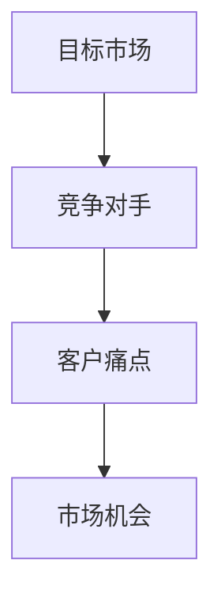
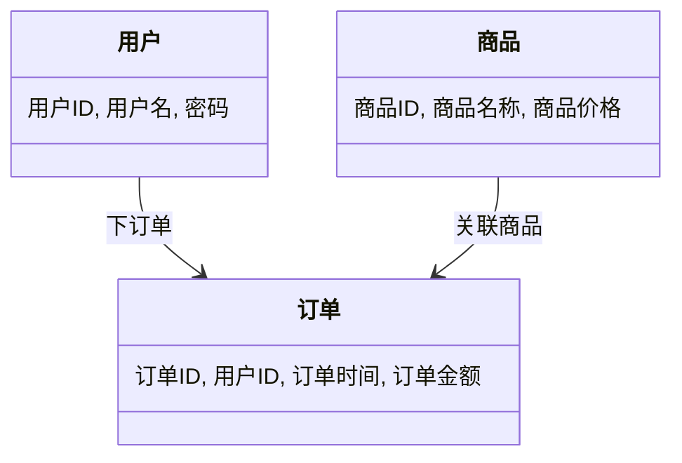
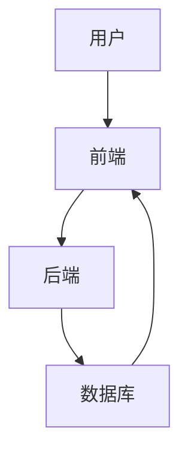

                 


# 芒格的"反向工程"思维在颠覆性商业模式分析中的应用

> 关键词：反向工程思维，芒格，颠覆性商业模式，商业模式分析，商业创新，系统架构设计

> 摘要：本文通过详细分析芒格的"反向工程"思维，结合颠覆性商业模式的特征和分析方法，探讨如何将反向工程思维应用于商业模式创新和系统架构设计。文章从理论基础、分析方法、系统架构、项目实战等多方面展开，结合具体案例和代码实现，全面解析反向工程思维在商业模式分析中的应用。

---

## # 第1章: 引言

### 1.1 反向工程思维的背景与重要性

反向工程思维是一种从结果推导原因的思维方式，其核心在于通过分析问题的输出，逆向推导出输入和过程。在商业领域，这种思维模式可以帮助我们更好地理解商业模式的本质，发现潜在的创新机会。

### 1.2 颠覆性商业模式的定义与特征

颠覆性商业模式是指通过创新的商业逻辑和技术手段，打破传统行业格局，创造新的市场价值的商业模式。其主要特征包括：低成本、高效率、差异化、客户体验优化等。

---

## # 第2章: 反向工程思维的核心概念与方法论

### 2.1 反向工程思维的核心概念

#### 2.1.1 分析结果与解决方案的关系

反向工程思维强调从结果出发，推导出实现该结果的必要条件。例如，通过分析市场成功的产品，我们可以反向推导出其成功的关键因素。

#### 2.1.2 问题场景的定义

在商业分析中，问题场景通常包括目标市场、竞争对手、客户痛点等关键因素。例如：



---

## # 第3章: 颠覆性商业模式的分析框架

### 3.1 颠覆性商业模式的分析方法

#### 3.1.1 五力模型

五力模型（波特五力分析）用于分析行业竞争环境，包括潜在进入者、替代品威胁、供应商议价能力、买家议价能力和现有竞争者之间的竞争。

#### 3.1.2 价值链分析

价值链分析帮助企业识别价值创造的关键环节，优化资源配置。

---

## # 第4章: 系统分析与架构设计

### 4.1 系统分析的步骤

#### 4.1.1 问题场景介绍

假设我们正在分析一家互联网公司的商业模式，目标是通过反向工程思维优化其系统架构。

#### 4.1.2 系统功能设计

基于问题场景，设计系统的功能模块，例如：



#### 4.1.3 系统架构设计

根据功能设计，设计系统的架构，例如：



---

## # 第5章: 项目实战

### 5.1 环境安装与配置

假设我们需要开发一个电商平台，首先需要安装以下环境：

- Python 3.8+
- Django框架
- PostgreSQL数据库

### 5.2 核心代码实现

以下是电商平台的核心代码示例：

```python
from django.db import models

class User(models.Model):
    username = models.CharField(max_length=50)
    password = models.CharField(max_length=50)
    email = models.EmailField()

class Product(models.Model):
    name = models.CharField(max_length=100)
    price = models.DecimalField(max_digits=10, decimal_places=2)
    stock = models.IntegerField()

class Order(models.Model):
    user = models.ForeignKey(User, on_delete=models.CASCADE)
    product = models.ForeignKey(Product, on_delete=models.CASCADE)
    order_time = models.DateTimeField(auto_now_add=True)
    total_price = models.DecimalField(max_digits=10, decimal_places=2)
```

### 5.3 案例分析与解读

通过分析电商平台的实际案例，我们可以反向推导出其成功的商业模式，例如通过大数据分析优化客户体验。

---

## # 第6章: 总结与展望

### 6.1 总结

本文通过详细分析芒格的反向工程思维，结合颠覆性商业模式的特征和分析方法，探讨了如何将反向工程思维应用于商业模式创新和系统架构设计。我们从理论基础、分析方法、系统架构、项目实战等多方面展开，结合具体案例和代码实现，全面解析反向工程思维在商业模式分析中的应用。

### 6.2 展望

未来，随着人工智能和大数据技术的不断发展，反向工程思维在商业模式分析中的应用将更加广泛和深入。我们期待更多的创新和突破。

---

**作者：AI天才研究院/AI Genius Institute & 禅与计算机程序设计艺术 /Zen And The Art of Computer Programming**

