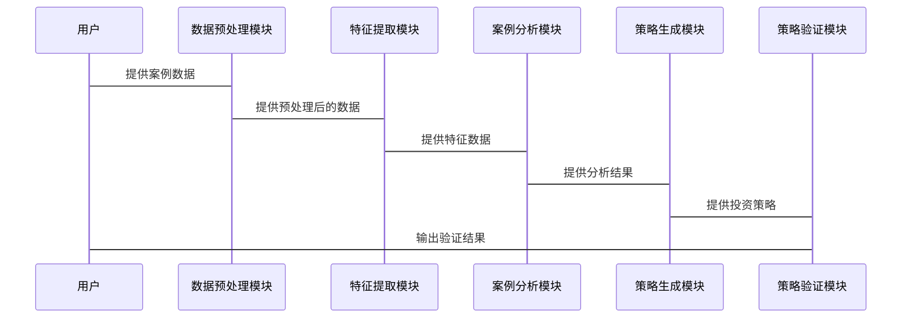

                 


# 芒格的"反向工程"思维：从成功案例中学习投资

## 关键词：反向工程思维、芒格、投资策略、成功案例分析、风险管理

## 摘要：芒格的反向工程思维是一种以结果为导向的投资分析方法，通过研究成功案例的特征，推导出成功的必要条件和策略。本文详细阐述了反向工程思维的原理、流程、数学模型和系统架构，并通过实际案例分析和项目实战，展示了如何将反向工程思维应用于投资决策中。最后，本文总结了最佳实践和注意事项，为投资者提供了有价值的参考。

---

## 第一部分：芒格的"反向工程"思维概述

### 第1章：芒格的背景与投资理念

#### 1.1 芒格的生平与成就

1. **芝加格大学教育背景**  
   芒格在芝加哥大学获得了经济学学士学位，这为他后来的投资理念奠定了坚实的理论基础。

2. **芒格的职业历程**  
   芒格的职业生涯始于法律行业，后转向投资领域，逐步发展出独特的价值投资理念。

3. **芒格的投资哲学与成就**  
   芒格强调安全边际和长期投资，其投资理念深刻影响了巴菲特等投资者。

---

### 第2章：反向工程思维的定义与特点

#### 2.1 反向工程思维的定义

1. **反向工程思维的起源与概念**  
   反向工程思维是一种通过分析结果来推导原因的思维方式，常用于工程、科学和投资等领域。

2. **反向工程在投资中的应用**  
   在投资中，反向工程思维通过研究成功或失败的案例，提炼出成功的必要条件和策略。

---

#### 2.2 反向工程思维的核心特征

1. **以终为始的思维方式**  
   反向工程思维从结果出发，逆向推导原因。

2. **逆向推理的逻辑框架**  
   通过分析成功案例的特征，总结出成功的共同要素。

3. **从结果推导原因的分析方法**  
   通过案例分析，识别出导致结果的关键因素。

---

### 第3章：芒格的反向工程思维与传统投资方法的对比

#### 3.1 传统投资方法的特点

1. **基于市场趋势的分析**  
   传统投资方法依赖于市场趋势和技术分析。

2. **技术分析与基本面分析**  
   传统方法注重短期市场波动和财务指标分析。

3. **以预测未来为主的决策模式**  
   传统投资方法依赖对未来市场的预测。

---

#### 3.2 芒格反向工程思维的特点

1. **以结果为导向的分析方式**  
   反向工程思维从结果出发，分析成功的原因。

2. **从失败案例中学习的成功经验**  
   通过分析失败案例，识别出潜在的风险因素。

3. **强调安全边际与风险控制**  
   反向工程思维注重投资的安全性和风险控制。

---

#### 3.3 对比分析表格

| 特征                | 传统投资方法                   | 反向工程思维               |
|---------------------|-------------------------------|---------------------------|
| 分析方式            | 以预测未来为主                 | 以结果为导向               |
| 分析重点            | 市场趋势和技术指标             | 成功案例的特征和原因       |
| 风险控制            | 依赖市场预测和短期波动         | 强调安全边际和长期因素     |

---

## 第二部分：反向工程思维的核心原理与数学模型

### 第4章：反向工程思维的原理与流程

#### 4.1 反向工程思维的基本原理

1. **从结果推导原因的逻辑框架**  
   反向工程思维通过分析成功案例的结果，推导出成功的原因。

2. **通过案例分析提取成功要素**  
   分析成功案例的特征，总结出成功的共同要素。

3. **从成功案例中总结投资策略**  
   根据分析结果，提炼出可应用于其他投资决策的成功策略。

---

#### 4.2 反向工程思维的流程

1. **确定研究目标**  
   选择一个成功或失败的案例作为研究对象。

2. **收集相关数据**  
   全面收集与案例相关的所有信息，包括财务数据、市场表现、管理层决策等。

3. **分析案例特征**  
   对收集到的数据进行深入分析，识别出导致结果的关键因素。

4. **提炼投资策略**  
   根据分析结果，总结出可应用于其他投资决策的成功要素。

5. **验证与优化**  
   将提炼出的策略应用到其他案例中进行验证，不断优化和完善投资策略。

---

### 第5章：反向工程思维的数学模型与公式

#### 5.1 投资决策的数学模型

1. **投资收益的计算公式**  
   投资收益可以通过以下公式计算：
   \[
   \text{投资收益} = \text{最终价值} - \text{初始价值}
   \]

2. **风险评估的数学模型**  
   风险评估可以通过标准差或波动率来衡量：
   \[
   \text{风险} = \text{标准差}(\text{收益率})
   \]

3. **安全边际的计算方法**  
   安全边际可以通过以下公式计算：
   \[
   \text{安全边际} = \text{内在价值} - \text{市场价格}
   \]

---

#### 5.2 反向工程思维中的概率分析

1. **成功概率的计算公式**  
   成功概率可以通过历史数据和案例分析来估算。

2. **投资组合的优化模型**  
   马科维茨的有效前沿理论可以帮助投资者构建最优投资组合。

3. **风险调整后的期望收益公式**  
   风险调整后的期望收益可以通过以下公式计算：
   \[
   \text{风险调整后收益} = \text{预期收益} - \text{风险溢价}
   \]

---

### 第6章：反向工程思维的算法

#### 6.1 反向工程思维的算法原理

1. **案例分析与模式识别**  
   通过统计分析或机器学习方法，识别成功案例中的共同特征。

2. **特征提取与策略生成**  
   根据识别出的特征，生成投资策略。

3. **策略验证与优化**  
   将策略应用于其他案例，验证其有效性和适用性。

---

#### 6.2 反向工程思维的算法实现

以下是一个简单的Python实现，用于分析企业的财务指标，识别成功案例的特征：

```python
import pandas as pd
from sklearn.tree import DecisionTreeClassifier
from sklearn.tree import plot_tree
import matplotlib.pyplot as plt

# 加载案例数据
data = pd.read_csv('case_study.csv')

# 特征提取
features = ['净利润率', 'ROE', '收入增长率', '流动比率']
target = '成功标志'

# 数据预处理
data_processed = data[features + [target]]
data_processed = data_processed.dropna()

# 模型训练
model = DecisionTreeClassifier()
model.fit(data_processed[features], data_processed[target])

# 可视化决策树
plt.figure(figsize=(20,10))
plot_tree(model, filled=True, feature_names=features)
plt.show()
```

---

### 第7章：系统分析与架构设计

#### 7.1 问题场景介绍

假设我们正在分析一个投资决策支持系统，该系统基于反向工程思维，帮助投资者识别成功案例的特征，并生成相应的投资策略。

---

#### 7.2 系统功能设计

以下是系统的主要功能模块：

1. **数据收集模块**  
   收集企业财务数据、市场数据、新闻资讯等。

2. **特征提取模块**  
   从数据中提取关键特征，例如财务指标、市场地位等。

3. **案例分析模块**  
   对成功和失败案例进行分析，识别关键特征。

4. **策略生成模块**  
   基于分析结果，生成投资策略。

5. **策略验证模块**  
   将策略应用于其他案例，验证其有效性和适用性。

---

#### 7.3 系统架构设计

以下是系统的架构设计：


---

#### 7.4 系统接口设计

以下是系统的主要接口：

1. **输入接口**  
   接收案例数据和投资目标。

2. **输出接口**  
   输出投资策略和验证结果。

3. **数据接口**  
   与数据源进行交互，获取所需数据。

---

#### 7.5 系统交互流程图

以下是系统的交互流程图：



---

## 第三部分：项目实战

### 第8章：项目实战

#### 8.1 环境安装

需要安装以下Python库：

1. `pandas`
2. `scikit-learn`
3. `matplotlib`

安装命令：
```bash
pip install pandas scikit-learn matplotlib
```

---

#### 8.2 核心代码实现

以下是项目的核心代码：

```python
import pandas as pd
from sklearn.tree import DecisionTreeClassifier
from sklearn.tree import plot_tree
import matplotlib.pyplot as plt

# 加载案例数据
data = pd.read_csv('case_study.csv')

# 特征提取
features = ['净利润率', 'ROE', '收入增长率', '流动比率']
target = '成功标志'

# 数据预处理
data_processed = data[features + [target]]
data_processed = data_processed.dropna()

# 模型训练
model = DecisionTreeClassifier()
model.fit(data_processed[features], data_processed[target])

# 可视化决策树
plt.figure(figsize=(20,10))
plot_tree(model, filled=True, feature_names=features)
plt.show()
```

---

#### 8.3 案例分析

以可口可乐公司为例，分析其成功案例的特征：

1. **净利润率**  
   高且稳定。

2. **ROE**  
   高，表明公司资本使用效率高。

3. **收入增长率**  
   稳定增长。

4. **流动比率**  
   健康，表明公司短期偿债能力强。

---

## 第四部分：最佳实践

### 第9章：最佳实践

#### 9.1 小结

反向工程思维是一种有效的投资分析方法，通过研究成功案例的特征，投资者可以提炼出成功的必要条件，并制定相应的投资策略。

---

#### 9.2 注意事项

1. **数据质量**  
   确保数据的准确性和完整性。

2. **模型选择**  
   根据具体情况选择合适的分析模型。

3. **持续优化**  
   定期验证和优化投资策略。

---

#### 9.3 拓展阅读

1. 《巴菲特的雪茄烟butt理论》  
2. 《价值投资入门》  
3. 《投资的数学分析》

---

## 结语

通过芒格的反向工程思维，投资者可以系统地分析成功案例的特征，提炼出成功的必要条件和策略。这种思维方式不仅能够帮助投资者避免常见的投资错误，还能提高投资决策的科学性和严谨性。希望本文能够为投资者提供有价值的参考和启发。

作者：AI天才研究院/AI Genius Institute & 禅与计算机程序设计艺术 /Zen And The Art of Computer Programming

